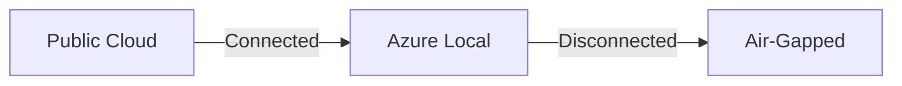

# Contributing to Azure Hybrid Continuum CookBook

Thank you for your interest in contributing to the Azure Hybrid Continuum CookBook! This project aims to be the definitive guide for hybrid and sovereign cloud architectures on Microsoft Azure.

## How to Contribute

### Reporting Issues

- Use [GitHub Issues](https://github.com/EmeaAppGbb/AzureHybridContinuumCookBook/issues) to report errors, suggest improvements, or request new content.
- When reporting a documentation issue, please include:
  - The page/section where the issue exists
  - What is incorrect or missing
  - Links to official Azure documentation that supports the correction

### Suggesting New Content

Open an issue with the `enhancement` label describing:
- The topic or scenario you'd like covered
- Why it's relevant to the Azure Hybrid Continuum
- Any official Azure documentation references

### Submitting Changes

1. **Fork** the repository
2. **Create a branch** from `main` (`git checkout -b docs/your-topic`)
3. **Write your content** following the guidelines below
4. **Submit a Pull Request** with a clear description of your changes

## Content Guidelines

### Grounding Requirement

All content **must** be grounded in official Microsoft documentation. Every technical claim should be traceable to one of these sources:

| Source | URL |
|--------|-----|
| Microsoft Learn | https://learn.microsoft.com/ |
| Azure Architecture Center | https://learn.microsoft.com/en-us/azure/architecture/ |
| Azure Local Documentation | https://learn.microsoft.com/en-us/azure/azure-local/ |
| Sovereign Landing Zone | https://learn.microsoft.com/en-gb/azure/azure-sovereign-clouds/public/overview-sovereign-landing-zone |
| Cloud Adoption Framework | https://learn.microsoft.com/en-us/azure/cloud-adoption-framework/ |
| Azure Well-Architected Framework | https://learn.microsoft.com/en-us/azure/well-architected/ |

### Writing Style

- **Clear and concise** — write for practitioners, not academics
- **Action-oriented** — prefer "do this" over "one could consider doing"
- **Structured** — use headings, tables, and lists to aid scanning
- **Linked** — reference official docs with inline links, don't duplicate their content

### Markdown Standards

- Use ATX-style headings (`#`, `##`, `###`)
- One sentence per line (for cleaner diffs)
- Use fenced code blocks with language identifiers (` ```bicep `, ` ```powershell `, etc.)
- Tables should have aligned columns for readability

### Diagrams

We use **Mermaid** for architecture and flow diagrams. Guidelines:

- Place diagrams inline in Markdown using ` ```mermaid ` code blocks
- Keep diagrams focused — one concept per diagram
- Use consistent node naming (PascalCase for services, kebab-case for labels)
- Shared SVG assets go in `docs/diagrams/`

Example:



## Review Process

All contributions go through a structured review:

1. **Technical Writer Review** — clarity, structure, and style
2. **Architecture Review** — technical accuracy, patterns, and diagram quality
3. **Grounding Validation** — every claim verified against official Azure docs
4. **Human Approval** — a maintainer reviews and approves before merge

## Code of Conduct

Be respectful, constructive, and inclusive. We follow the [Microsoft Open Source Code of Conduct](https://opensource.microsoft.com/codeofconduct/).

## Questions?

Open a [Discussion](https://github.com/EmeaAppGbb/AzureHybridContinuumCookBook/discussions) or reach out via Issues.

---

*Thank you for helping make Azure hybrid architecture accessible to everyone.*
