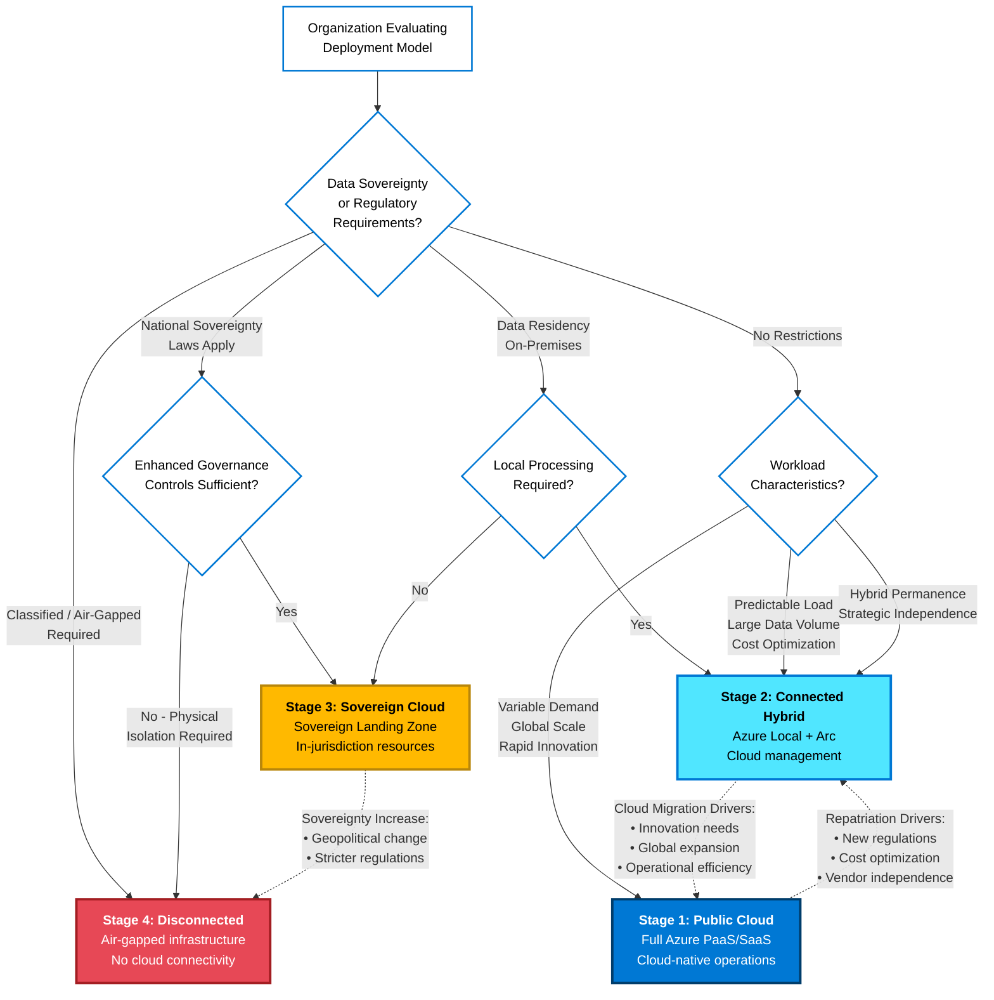

# The Hybrid Continuum

## What Is the Azure Hybrid Continuum?

The **Azure Hybrid Continuum** is a conceptual framework for understanding the spectrum of deployment models available to organizations using Microsoft Azure technologies. Rather than viewing infrastructure choices as a binary decision between "cloud" and "on-premises," the continuum recognizes that modern enterprises operate across a range of deployment models, each with different characteristics, trade-offs, and use cases.

At one end of the continuum is the **fully cloud-native** model: workloads running entirely in Azure public cloud regions, leveraging the complete breadth of Azure platform-as-a-service (PaaS) and software-as-a-service (SaaS) offerings. At the other end is the **fully disconnected** model: infrastructure operating in complete isolation with no connectivity to Azure or external networks, such as air-gapped military installations or classified research facilities.

Between these extremes lies a spectrum of **hybrid deployment models** that blend on-premises infrastructure with Azure services in various configurations. These models provide different balances of:

- **Connectivity:** Ranging from continuous high-bandwidth Azure connectivity to intermittent connectivity to complete isolation
- **Management integration:** From Azure-native management to hybrid management to fully independent operations
- **Service availability:** The subset of Azure services available in each deployment model
- **Compliance posture:** Data residency guarantees, sovereignty controls, and regulatory compliance capabilities
- **Operational complexity:** Trade-offs between cloud operational simplicity and on-premises control
- **Cost structure:** Shifting balances between consumption-based cloud pricing and capital expenditure for on-premises infrastructure

The continuum is **not unidirectional**. Organizations may move workloads in either direction — migrating from on-premises to cloud, repatriating from cloud to on-premises, or implementing hybrid architectures that span multiple stages simultaneously. Workloads may also move between stages over time as requirements evolve.

Understanding where on the continuum your workloads operate — and designing them to support movement between stages — is foundational to building resilient, compliant, and operationally efficient hybrid architectures.

## The Four Stages of the Continuum

The Azure Hybrid Continuum consists of four primary deployment stages. While real-world architectures may blend characteristics from multiple stages, this framework provides a structured way to understand the options available and the trade-offs inherent in each.

```mermaid
graph LR
    subgraph Stage1["<b>Stage 1: Public Cloud</b><br/>(Fully Connected)"]
        direction TB
        S1_Conn["🌐 Continuous Azure Connectivity<br/>ExpressRoute / VPN"]
        S1_Mgmt["☁️ Azure Control Plane<br/>Full ARM Management"]
        S1_Svc["<b>Available Services:</b><br/>• AKS, App Service, Functions<br/>• SQL DB, Cosmos DB<br/>• Azure ML, Cognitive Services<br/>• Logic Apps, Event Grid<br/>• Full PaaS Catalog"]
    end
    
    subgraph Stage2["<b>Stage 2: Connected Hybrid</b><br/>(Azure Local + Arc)"]
        direction TB
        S2_Conn["🔗 Outbound Azure Connectivity<br/>Management & Telemetry"]
        S2_Mgmt["☁️ Azure Control Plane<br/>Hybrid ARM via Arc"]
        S2_Svc["<b>Available Services:</b><br/>• Azure Local VMs<br/>• AKS on Azure Local<br/>• Arc-enabled SQL MI<br/>• Arc-enabled Kubernetes<br/>• Azure Monitor (hybrid)<br/>• Azure Policy (hybrid)"]
    end
    
    subgraph Stage3["<b>Stage 3: Sovereign Cloud</b><br/>(Enhanced Controls)"]
        direction TB
        S3_Conn["🔒 Restricted Connectivity<br/>In-Jurisdiction Only"]
        S3_Mgmt["🛡️ Sovereign Control Plane<br/>Policy-Enforced ARM"]
        S3_Svc["<b>Available Services:</b><br/>• Azure VMs, AKS<br/>• Azure SQL DB (limited)<br/>• Sovereign Landing Zones<br/>• Confidential Computing<br/>• Customer Lockbox<br/>• In-Region Key Vault"]
    end
    
    subgraph Stage4["<b>Stage 4: Disconnected</b><br/>(Air-Gapped)"]
        direction TB
        S4_Conn["❌ No External Connectivity<br/>Physical Isolation"]
        S4_Mgmt["💻 Local Control Plane<br/>On-Premises Management"]
        S4_Svc["<b>Available Services:</b><br/>• Azure Local (disconnected)<br/>• Self-hosted Kubernetes<br/>• Local container registry<br/>• Local AD DS<br/>• Prometheus/Grafana<br/>• GitOps (local Git)"]
    end
    
    Stage1 -->|"Increasing Sovereignty ➡️<br/>Decreasing Connectivity"| Stage2
    Stage2 -->|"Increasing Sovereignty ➡️<br/>Decreasing Connectivity"| Stage3
    Stage3 -->|"Increasing Sovereignty ➡️<br/>Decreasing Connectivity"| Stage4
    
    Stage4 -.->|"⬅️ Cloud Adoption<br/>Improved Connectivity"| Stage3
    Stage3 -.->|"⬅️ Cloud Adoption<br/>Regulatory Relief"| Stage2
    Stage2 -.->|"⬅️ Cloud Adoption<br/>Full Migration"| Stage1
    
    classDef stage1Style fill:#0078d4,stroke:#003d6b,stroke-width:2px,color:#fff
    classDef stage2Style fill:#50e6ff,stroke:#0078d4,stroke-width:2px,color:#000
    classDef stage3Style fill:#ffb900,stroke:#b8860b,stroke-width:2px,color:#000
    classDef stage4Style fill:#e74856,stroke:#a31e22,stroke-width:2px,color:#fff
    
    class Stage1 stage1Style
    class Stage2 stage2Style
    class Stage3 stage3Style
    class Stage4 stage4Style
```

**Figure 1: The Azure Hybrid Continuum Spectrum** — Organizations operate across four stages, each with distinct connectivity models, management approaches, and service availability. Movement is bidirectional based on evolving requirements.

---

**Figure 2: Decision Factors Driving Continuum Positioning** — Key drivers that determine where organizations operate along the continuum, including regulatory requirements, latency needs, cost optimization, and strategic considerations. Dotted lines show common transition paths as requirements evolve.

### Stage 1: Public Cloud (Fully Connected)

**Characteristics:**

The **Public Cloud** stage represents workloads running entirely in Azure public cloud regions with continuous, high-bandwidth connectivity to Azure services. This is the cloud-native model that most organizations associate with "cloud computing."

**Available Services:**

Workloads in this stage have access to the full Azure service catalog, including:

- **Compute:** Azure Virtual Machines, Azure Kubernetes Service (AKS), Azure Container Instances, Azure Functions, Azure App Service, Azure Batch
- **Data:** Azure SQL Database, Azure Cosmos DB, Azure Database for PostgreSQL/MySQL/MariaDB, Azure Cache for Redis, Azure Data Lake Storage
- **AI and Analytics:** Azure Machine Learning, Azure Cognitive Services, Azure Synapse Analytics, Azure Databricks
- **Integration:** Azure Logic Apps, Azure Service Bus, Azure Event Grid, Azure API Management
- **Governance:** Azure Policy, Azure Blueprints, Azure Resource Manager, Azure Monitor

**Management and Operations:**

Resources are created, configured, and managed entirely through Azure Resource Manager. Infrastructure as Code (IaC) tools such as Azure Bicep, ARM templates, and Terraform interact directly with Azure APIs. Monitoring, logging, and security are provided by Azure-native services (Azure Monitor, Microsoft Defender for Cloud, Microsoft Sentinel).

**When to Use:**

The Public Cloud stage is appropriate when:

- **No data residency constraints exist:** Data can be stored and processed in Azure public cloud regions.
- **Regulatory compliance can be met in the cloud:** Industry regulations (HIPAA, PCI-DSS, SOC 2) can be satisfied using Azure compliance certifications and native controls.
- **High availability and global scale are priorities:** Applications benefit from Azure's global footprint, cross-region redundancy, and massive scale.
- **Rapid innovation is required:** Teams need access to cutting-edge PaaS and AI services that are only available in public cloud.
- **Operational simplicity is valued:** Organizations prefer to minimize on-premises infrastructure management.

**Considerations:**

- **Connectivity dependency:** Workloads are fully dependent on network connectivity to Azure. Internet or ExpressRoute outages directly impact availability.
- **Data egress costs:** Moving large volumes of data out of Azure incurs egress charges, which can be significant for data-intensive workloads.
- **Limited local processing:** All processing occurs in Azure datacenters, which may introduce latency for applications requiring real-time local data processing.

### Stage 2: Connected Hybrid (Azure Local + Arc)

**Characteristics:**

The **Connected Hybrid** stage brings Azure services to on-premises locations while maintaining continuous connectivity to Azure for management, monitoring, and control plane operations. This stage is enabled by [Azure Local](https://learn.microsoft.com/en-us/azure/azure-local/) and [Azure Arc](https://learn.microsoft.com/en-us/azure/azure-arc/overview).

Azure Local provides hyperconverged infrastructure running Azure-consistent services on-premises. Azure Arc extends the Azure Resource Manager control plane to on-premises servers, Kubernetes clusters, and data services, enabling unified management across cloud and on-premises environments.

**Available Services:**

Connected Hybrid environments can run:

- **Azure Local native services:**
  - Azure Virtual Machines (managed through Azure Arc)
  - Azure Kubernetes Service on Azure Local (AKS-HCI)
  - Azure Virtual Desktop
- **Azure Arc-enabled services:**
  - Azure Arc-enabled servers (Windows and Linux VMs on any infrastructure)
  - Azure Arc-enabled Kubernetes (any CNCF-certified Kubernetes distribution)
  - Azure Arc-enabled data services (Azure SQL Managed Instance, PostgreSQL Hyperscale)
  - Azure App Service on Kubernetes via Azure Arc
- **Azure management and governance services:**
  - Azure Policy (applied to on-premises resources)
  - Azure Monitor (collecting telemetry from on-premises resources)
  - Microsoft Defender for Cloud (security posture and threat protection for hybrid resources)
  - Azure Automation, Azure Update Management

**Management and Operations:**

Resources are created and managed through Azure Resource Manager, just as they would be in public cloud. The Azure portal, Azure CLI, Azure PowerShell, and IaC tools (Bicep, Terraform) interact with on-premises resources through the same APIs used for cloud resources. However, the actual workload execution occurs on-premises, with only management traffic and telemetry flowing to Azure.

Azure Local requires outbound connectivity to Azure for:

- **Registration and licensing:** Continuous validation of Azure subscription and licensing
- **Monitoring and telemetry:** Upload of diagnostic data, performance metrics, and logs
- **Updates and patches:** Download of OS, firmware, and service updates
- **Compliance and policy enforcement:** Azure Policy evaluation and enforcement

**When to Use:**

Connected Hybrid is appropriate when:

- **Data must remain on-premises:** Regulatory, security, or data gravity requirements mandate that data stays in local datacenters while management can occur through Azure.
- **Low-latency local processing is required:** Applications need to process data locally (edge manufacturing, retail stores, branch offices) while still benefiting from centralized management.
- **Consistent hybrid operations are desired:** Organizations want a single operational model for cloud and on-premises infrastructure.
- **Gradual cloud migration is underway:** Applications are being migrated to cloud over time, and interim hybrid operation is required.
- **Network bandwidth to cloud is limited:** Large datasets cannot be economically moved to cloud, but cloud management capabilities are desired.

**Considerations:**

- **Outbound connectivity required:** Azure Local and Azure Arc require continuous or regular outbound connectivity to Azure. While short outages are tolerated, extended disconnection impacts management capabilities.
- **Limited service subset:** Not all Azure services are available on-premises. PaaS services like Azure Functions, Azure Cosmos DB, and most AI services require public cloud.
- **On-premises infrastructure management:** While Azure manages software updates, organizations are responsible for physical hardware, power, cooling, and network infrastructure.
- **Licensing costs:** Azure Local requires Azure subscription charges in addition to hardware costs.

### Stage 3: Sovereign Cloud

**Characteristics:**

The **Sovereign Cloud** stage addresses scenarios requiring enhanced data residency, regulatory compliance, and digital sovereignty while still operating as cloud services. This stage is implemented through [Sovereign Landing Zones](https://learn.microsoft.com/en-gb/azure/azure-sovereign-clouds/public/overview-sovereign-landing-zone) on Azure public cloud or through dedicated sovereign cloud instances (Azure Government, Azure China, Azure Germany).

Sovereign Landing Zones extend the standard Azure landing zone architecture with additional governance controls, policy enforcement, and design patterns that ensure compliance with stringent regulatory and sovereignty requirements. These controls enforce data residency, restrict data flows, limit administrative access to specific jurisdictions, and provide audit capabilities for regulatory reporting.

**Available Services:**

Sovereign clouds and Sovereign Landing Zones provide access to core Azure services with additional compliance controls:

- **Compute and storage:** Azure Virtual Machines, Azure Kubernetes Service, Azure Storage, Azure Disk
- **Networking:** Azure Virtual Network, Azure VPN Gateway, Azure ExpressRoute with in-country termination
- **Data services:** Azure SQL Database, Azure Database for PostgreSQL/MySQL (with data residency guarantees)
- **Identity:** Azure Active Directory (with sovereignty controls), Azure AD Domain Services
- **Governance:** Azure Policy (with sovereign-specific policies), Azure Blueprints, Azure Resource Manager
- **Security:** Microsoft Defender for Cloud, Azure Key Vault (with HSM-backed keys in sovereign regions)

The specific service catalog varies by sovereign cloud instance and Sovereign Landing Zone configuration. Some advanced PaaS services may be unavailable or have limited functionality compared to Azure public cloud.

**Management and Operations:**

Resources are managed through Azure Resource Manager, but with additional policy constraints enforcing sovereignty requirements. These constraints may include:

- **Data residency policies:** Ensure all data remains within specified geographic regions or jurisdictions
- **Network isolation policies:** Prevent data flows to non-compliant regions or external networks
- **Identity restrictions:** Limit administrative access to personnel with specific clearances or citizenship
- **Encryption requirements:** Mandate encryption at rest and in transit with keys managed in-jurisdiction
- **Audit and compliance reporting:** Enhanced logging and audit trails for regulatory compliance

Organizations implementing Sovereign Landing Zones typically deploy dedicated management groups with sovereign-specific policies, separate from their standard Azure environments.

**When to Use:**

Sovereign Cloud is appropriate when:

- **Data sovereignty is legally mandated:** National laws require data to remain within specific jurisdictions with local operator control.
- **Regulatory compliance requires enhanced controls:** Financial services, healthcare, or government regulations mandate specific governance, audit, or access controls beyond standard Azure capabilities.
- **Operational sovereignty is required:** Organizations need guarantees about data residency, operator nationality, and legal jurisdiction for compliance or strategic reasons.
- **Government or critical infrastructure workloads:** Government agencies and critical infrastructure operators face requirements that standard commercial cloud services cannot satisfy.

**Considerations:**

- **Reduced service availability:** Sovereign clouds and Sovereign Landing Zones may not support the full Azure service catalog, limiting PaaS and advanced AI capabilities.
- **Increased operational complexity:** Additional policy enforcement, network segmentation, and compliance controls increase management overhead.
- **Potential cost premium:** Sovereign cloud services may have different pricing structures than standard Azure.
- **Limited cross-region capabilities:** Data residency requirements may restrict use of cross-region replication, global load balancing, and multi-region architectures.

### Stage 4: Disconnected (Air-Gapped)

**Characteristics:**

The **Disconnected** stage represents fully isolated environments with no connectivity to Azure or external networks. These are true air-gapped deployments, operating entirely independently. This stage is implemented using Azure Local in disconnected mode or traditional on-premises infrastructure with Azure-consistent tooling.

Disconnected environments are required for:

- **Classified government and defense systems:** Military installations, intelligence agencies, and classified research facilities operate networks physically isolated from the internet and external systems.
- **High-security industrial facilities:** Critical infrastructure in energy, nuclear, and chemical industries may require air-gapped control systems.
- **Mobile and remote operations:** Ships, submarines, aircraft, and remote research stations operate with no or highly intermittent connectivity.
- **Compliance-mandated isolation:** Some regulations require specific systems to be physically isolated from all external networks.

**Available Services:**

Disconnected environments have the most limited service availability since cloud-based management, monitoring, and PaaS services are unavailable. Workloads must be self-contained and fully functional without external dependencies.

- **Azure Local (disconnected mode):** Hyperconverged infrastructure running virtual machines and containers locally
- **Azure Kubernetes Service on Azure Local (disconnected):** Kubernetes clusters running locally with GitOps-based management from local Git repositories
- **Local container registries:** Harbor or Azure Container Registry deployed on-premises for image storage
- **Local identity providers:** Active Directory Domain Services or local Kubernetes RBAC (no Azure AD integration)
- **Local monitoring and logging:** Prometheus, Grafana, ELK stack, or other self-hosted observability tools

**Management and Operations:**

In disconnected mode, all management is local. There is no Azure portal access for disconnected resources. Infrastructure as Code, GitOps workflows, and policy enforcement must be implemented using local tooling:

- **Local IaC:** Terraform, Ansible, or PowerShell DSC applied from local control nodes
- **Local GitOps:** Flux or ArgoCD pulling from on-premises Git servers
- **Local policy enforcement:** Open Policy Agent (OPA) or Kubernetes admission controllers
- **Local updates:** Software updates, patches, and configuration changes are delivered via physical media (USB drives, DVDs) or during brief connected windows

Azure Local in disconnected mode requires **annual reconnection** to Azure (for a minimum of 30 consecutive days) for license validation and support contract renewal. If reconnection is not possible, the environment must be managed as fully independent infrastructure.

**When to Use:**

Disconnected deployments are appropriate when:

- **No external connectivity is permitted:** Security policy, regulation, or physical constraints prevent any network connection to external systems.
- **Classified or highly sensitive workloads:** Data classification levels mandate air-gapped infrastructure.
- **Extreme reliability requirements:** Systems must function with zero dependency on external services or network connectivity.
- **Mobile or remote platforms:** Physical location or mobility prevents reliable connectivity.

**Considerations:**

- **No cloud management:** Organizations lose Azure portal management, Azure Monitor telemetry, Microsoft Defender for Cloud security insights, and cloud-based automation.
- **Manual updates and patches:** Software updates must be delivered via physical media or during brief connected windows, increasing operational burden and security risk.
- **Limited support options:** Microsoft support for disconnected Azure Local requires reconnection for diagnostics and troubleshooting.
- **Local expertise required:** On-premises teams must have deep expertise in infrastructure management, troubleshooting, and security since cloud-based assistance is unavailable.
- **Higher operational cost:** Loss of cloud operational efficiencies (automated updates, telemetry-based troubleshooting, self-service provisioning) increases staffing and time requirements.

## Why Organizations Move Along the Continuum

The Azure Hybrid Continuum is not a static choice. Organizations move workloads between stages as business, regulatory, and technical requirements evolve. Understanding the motivations for movement is crucial for designing portable, adaptable architectures.

### Drivers for Moving Toward Disconnected (Cloud Exit or Sovereignty)

Organizations move workloads away from public cloud (right along the continuum) when:

- **New regulations mandate on-premises data:** Data residency laws or industry regulations change, requiring data repatriation.
- **Cost optimization for stable workloads:** High-volume, predictable workloads may be more cost-effective on owned infrastructure than consumption-based cloud pricing.
- **Strategic independence:** Organizations seek to reduce dependency on cloud providers for business continuity or competitive reasons.
- **Vendor risk management:** Concerns about cloud provider reliability, pricing changes, or strategic direction motivate repatriation.
- **Performance or latency requirements:** Workloads require lower latency or higher throughput than achievable with cloud services.
- **Government mandates:** National digital sovereignty policies or defense regulations require migration to sovereign or on-premises infrastructure.

### Drivers for Moving Toward Cloud (Cloud Adoption)

Organizations move workloads toward public cloud (left along the continuum) when:

- **Regulatory environment becomes more permissive:** Adoption of international standards or cloud-friendly regulations enable cloud migration.
- **Innovation and agility are prioritized:** Access to cutting-edge PaaS, AI, and analytics services drives cloud adoption.
- **Global scale is required:** Applications need to serve global user bases with low latency across regions.
- **Operational efficiency:** Organizations seek to reduce the burden of managing on-premises infrastructure.
- **Rapid elasticity:** Workloads have variable demand requiring rapid scale-up and scale-down.
- **Connectivity improves:** Infrastructure investment (5G, expanded broadband, edge connectivity) makes cloud-connected operations feasible in previously constrained locations.

### Hybrid Coexistence

Many organizations operate workloads at multiple points on the continuum simultaneously:

- **Core systems on-premises, innovation workloads in cloud:** Established, stable applications remain on-premises while new, experimental workloads leverage cloud PaaS services.
- **Regional variation:** Workloads in different countries operate at different continuum stages based on local regulations.
- **Data tiering:** Hot, frequently accessed data in cloud for rapid access; cold, archival data on-premises for cost efficiency.
- **Dev/test in cloud, production on-premises:** Leverage cloud agility for development while maintaining production data residency on-premises.

## Azure Technologies Across the Continuum

Each stage of the continuum is enabled by specific Azure technologies and services. The following table maps core technologies to their applicable continuum stages:

| Technology / Service | Public Cloud | Connected Hybrid | Sovereign Cloud | Disconnected |
|----------------------|:------------:|:----------------:|:---------------:|:------------:|
| **Azure Virtual Machines** | ✓ | ✓ (via Azure Local) | ✓ | ✓ (Azure Local disconnected) |
| **Azure Kubernetes Service** | ✓ | ✓ (AKS on Azure Local) | ✓ | ✓ (AKS-HCI disconnected) |
| **Azure SQL Database (PaaS)** | ✓ | ✗ | ✓ (limited) | ✗ |
| **Azure Arc** | ✓ | ✓ | ✓ | ✗ |
| **Azure Monitor** | ✓ | ✓ (hybrid) | ✓ | ✗ (local tools required) |
| **Azure Policy** | ✓ | ✓ (hybrid) | ✓ | ✗ (local policy engines) |
| **Azure Functions** | ✓ | ✗ | ✓ (limited) | ✗ |
| **Azure Cosmos DB** | ✓ | ✗ | ✓ (limited) | ✗ |
| **Azure Key Vault** | ✓ | ✓ (with connectivity) | ✓ | ✗ (local key management) |
| **Microsoft Defender for Cloud** | ✓ | ✓ (hybrid) | ✓ | ✗ |
| **Azure Local (Stack HCI)** | ✗ | ✓ | ✓ | ✓ (disconnected mode) |
| **Sovereign Landing Zones** | ✗ | ✗ | ✓ | ✗ |

For a comprehensive service mapping, see **Appendix B: Azure Service Availability Across the Continuum**.

## The Continuum Is Not One-Way

A critical characteristic of the Azure Hybrid Continuum is that it is **bidirectional**. Unlike traditional cloud migration narratives that assume a one-way journey from on-premises to cloud, the continuum acknowledges that organizations may need to move workloads in either direction — or operate simultaneously at multiple stages.

### Cloud Exit and Repatriation

Cloud exit — the process of moving workloads from public cloud back to on-premises or hybrid infrastructure — is increasingly common. Organizations repatriate workloads for cost optimization, regulatory compliance, vendor risk management, or strategic independence.

Designing for potential cloud exit requires:

- **Avoiding cloud-specific lock-in:** Use open standards, Kubernetes, and portable data formats rather than proprietary cloud services where possible.
- **Maintaining on-premises expertise:** Retain the skills and infrastructure required to operate workloads independently.
- **Designing for portability:** Application architecture, data storage, and management tooling should work consistently across cloud and on-premises.

### Hybrid Permanence

For many organizations, hybrid is not a transitional state on the way to full cloud adoption — it is a **permanent operating model**. Workloads will continue to operate across cloud and on-premises infrastructure indefinitely based on regulatory, economic, and technical requirements.

Designing for hybrid permanence requires:

- **Consistent management plane:** Use Azure Arc to unify management regardless of where workloads run.
- **Portable governance:** Apply Azure Policy, RBAC, and compliance controls consistently across environments.
- **Unified observability:** Centralize monitoring, logging, and alerting for cloud and on-premises resources.

### Progressive Sovereignty

Organizations may progressively move toward greater sovereignty as regulations evolve or geopolitical considerations change. A workload that operates in Azure public cloud today may need to move to a Sovereign Landing Zone or on-premises deployment tomorrow.

Designing for progressive sovereignty requires:

- **Data residency awareness:** Understand where data resides and flows, and design to constrain it if needed.
- **Encryption and key management:** Use Azure Key Vault with bring-your-own-key (BYOK) or managed HSM to maintain control over encryption keys.
- **Network segmentation:** Design network architectures that can be progressively isolated if sovereignty requirements increase.

## Key Principles for Continuum-Aware Architecture

Organizations designing for the Azure Hybrid Continuum should adopt the following architectural principles:

### 1. Design for Portability

Applications and infrastructure should be designed to operate at multiple points on the continuum without fundamental redesign. This requires:

- **Use Kubernetes as a portable compute abstraction:** Kubernetes runs consistently on Azure Kubernetes Service, Azure Local, and disconnected environments.
- **Adopt open standards and APIs:** Avoid proprietary cloud APIs where possible; use SQL standards, S3-compatible storage, and open telemetry protocols.
- **Infrastructure as Code everywhere:** Use Terraform, Bicep, or Helm to define infrastructure declaratively, enabling consistent deployment across environments.

### 2. Use Consistent Management Planes

Leverage Azure Arc to extend Azure Resource Manager to all connected environments (public cloud, connected hybrid, sovereign cloud). This provides:

- **Single pane of glass:** Manage all resources through the Azure portal, regardless of where they run.
- **Unified RBAC and governance:** Apply consistent access controls and policies across cloud and on-premises.
- **Centralized inventory:** Track all resources in Azure Resource Graph for visibility and compliance.

### 3. Plan for Connectivity Changes

Design architectures that can tolerate changes in connectivity:

- **Degrade gracefully:** Applications should continue operating with reduced functionality if cloud connectivity is lost.
- **Implement local caching:** Cache critical data and configuration locally to support disconnected operation.
- **Use asynchronous patterns:** Queue-based architectures and eventual consistency models tolerate network partitions better than synchronous, strongly consistent designs.

### 4. Separate Control Plane from Data Plane

Where possible, separate management traffic (control plane) from application data traffic (data plane):

- **Control plane in cloud:** Use Azure Arc for management, monitoring, and policy enforcement even when data remains on-premises.
- **Data plane local:** Keep application data and processing on-premises to satisfy residency requirements.
- **Minimize data movement:** Avoid designs that require large data transfers between on-premises and cloud.

### 5. Design for Compliance from the Start

Don't treat compliance and sovereignty as constraints to be retrofitted later. Design with these requirements in mind:

- **Know your compliance requirements:** Understand data residency, encryption, access control, and audit requirements early in the design process.
- **Use policy-driven governance:** Implement Azure Policy or equivalent policy engines to enforce compliance automatically.
- **Audit and monitor continuously:** Collect audit logs and compliance evidence from the start, not as a pre-audit scramble.

## Conclusion

The Azure Hybrid Continuum provides a framework for understanding the spectrum of deployment options available to modern enterprises. By recognizing that infrastructure choices are not binary — and that organizations may need to operate at multiple points on the continuum or move between stages over time — architects can design solutions that are resilient, compliant, and adaptable.

The remaining chapters of this CookBook explore each continuum stage in depth, provide decision frameworks for selecting appropriate deployment models, and present a comprehensive reference implementation demonstrating how to build applications that operate successfully across the entire continuum.

!!! note "Next Steps"
    Chapter 3 provides role-specific reading paths to help you navigate the rest of this guide based on your responsibilities and objectives.

## References

This chapter is grounded in the following official Microsoft documentation:

- [Azure Arc Overview](https://learn.microsoft.com/en-us/azure/azure-arc/overview) — Unified management for hybrid and multicloud environments
- [Azure Local Documentation](https://learn.microsoft.com/en-us/azure/azure-local/) — Hyperconverged infrastructure and local Azure services
- [Sovereign Landing Zone Overview](https://learn.microsoft.com/en-gb/azure/azure-sovereign-clouds/public/overview-sovereign-landing-zone) — Compliance-first architecture for sovereign requirements
- [Hybrid Cloud Architecture Guidance](https://learn.microsoft.com/en-us/azure/architecture/hybrid/hybrid-start-here) — Reference architectures for hybrid deployments
- [Cloud Adoption Framework](https://learn.microsoft.com/en-us/azure/cloud-adoption-framework/) — Proven guidance for Azure adoption

---

> **Previous:** [← Overview](01-overview.md) | **Next:** [How to Use This Guide →](03-how-to-use-this-guide.md)
