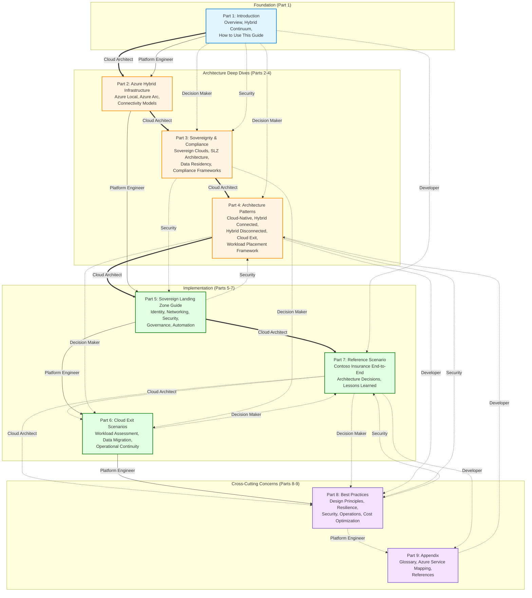

# How to Use This Guide

This chapter provides guidance on navigating the Azure Hybrid Continuum CookBook. Whether you're a cloud architect designing a new sovereign landing zone, a platform engineer implementing Azure Local infrastructure, or a decision maker evaluating cloud exit strategies, this guide offers multiple reading paths tailored to your role and objectives.

## Understanding the Guide Structure

The Azure Hybrid Continuum CookBook is organized as a **progressive journey** from foundational concepts through detailed implementation guidance. However, it is designed to be navigated **non-linearly** — you can jump directly to the sections most relevant to your immediate needs and return to foundational chapters as necessary.

The guide is structured in four major sections:

### Part 1: Foundation (Introduction)

**Chapters:** Overview, The Hybrid Continuum, How to Use This Guide

This section establishes the conceptual framework for understanding the Azure Hybrid Continuum. It defines the four stages of the continuum (Public Cloud, Connected Hybrid, Sovereign Cloud, Disconnected), explains the business and regulatory drivers for hybrid architectures, and introduces Microsoft's hybrid cloud strategy centered on Azure Arc, Azure Local, and Sovereign Landing Zones.

**Purpose:** Provides shared vocabulary and mental models for the rest of the guide. Essential for all readers.

### Part 2: Deep Dives (Infrastructure, Sovereignty, Patterns)

**Parts 2–4:** Azure Hybrid Infrastructure, Sovereignty & Compliance, Architecture Patterns

These sections provide detailed technical deep dives into the technologies, compliance frameworks, and architectural patterns that underpin the continuum:

- **Azure Hybrid Infrastructure:** Explores Azure regions and availability zones, Azure Local, Azure Arc, Azure Stack HCI, and connectivity models. Technical foundation for hybrid deployments.
- **Sovereignty & Compliance:** Covers sovereign cloud concepts, Sovereign Landing Zone architecture, data residency and sovereignty requirements, and compliance frameworks (GDPR, FedRAMP, NIS2, etc.).
- **Architecture Patterns:** Presents reusable patterns for cloud-native, hybrid connected, hybrid disconnected, and cloud exit scenarios, plus a workload placement framework for deciding where workloads should run.

**Purpose:** Technical reference material. Read selectively based on the technologies and patterns relevant to your architecture.

### Part 3: Implementation (SLZ Guide, Cloud Exit, Reference Scenario)

**Parts 5–7:** Sovereign Landing Zone Guide, Cloud Exit Scenarios, Reference Scenario

These sections transition from concepts to implementation:

- **Sovereign Landing Zone Guide:** Step-by-step guidance for implementing Sovereign Landing Zones, covering identity, networking, security, governance, and automation. Includes implementation options using Azure Portal, Bicep, and Terraform.
- **Cloud Exit Scenarios:** Practical scenarios for moving workloads across the continuum — from public cloud to connected hybrid, from connected to disconnected, with detailed data migration strategies and operational continuity guidance.
- **Reference Scenario:** A comprehensive, end-to-end reference implementation featuring Contoso Insurance, a fictional enterprise application that evolves across all four continuum stages. Demonstrates real-world architecture decisions, trade-offs, and lessons learned.

**Purpose:** Actionable implementation guidance. Follow these chapters when actively building or migrating architectures.

### Part 4: Cross-Cutting Concerns (Best Practices, Appendix)

**Parts 8–9:** Best Practices, Appendix

These sections provide cross-cutting guidance and reference material:

- **Best Practices:** Design principles, resilience patterns, security controls, operational practices, and cost optimization strategies applicable across all continuum stages.
- **Appendix:** Glossary of terms, Azure service mapping showing service availability across continuum stages, and curated links to official Microsoft documentation and external resources.

**Purpose:** Quick reference and supplementary material to support implementation work.

## Reading Paths by Role

Different roles have different priorities when approaching hybrid and sovereign cloud architectures. The following reading paths provide tailored guidance:

### Cloud Architect

**Goal:** Comprehensive understanding of hybrid architecture patterns and Sovereign Landing Zone design

**Recommended Path:**

1. **Start:** [Part 1 — Introduction](../01-introduction/README.md) (all chapters)  
   Understand the continuum framework and business drivers.

2. **Core Reading:**
   - [Part 2 — Azure Hybrid Infrastructure](../02-azure-hybrid-infrastructure/README.md) (all chapters)  
     Deep understanding of Azure Arc, Azure Local, and connectivity models.
   - [Part 3 — Sovereignty & Compliance](../03-sovereignty-and-compliance/README.md) (all chapters)  
     Sovereign Landing Zone architecture, controls, and compliance frameworks.
   - [Part 4 — Architecture Patterns](../04-architecture-patterns/README.md) (all chapters)  
     Study all four deployment patterns and the workload placement framework.

3. **Implementation Deep Dive:**
   - [Part 5 — Sovereign Landing Zone Guide](../05-sovereign-landing-zone-guide/README.md) (all chapters)  
     End-to-end SLZ design areas and implementation options.
   - [Part 7 — Reference Scenario](../07-reference-scenario/README.md) (all chapters)  
     Learn from Contoso Insurance's architecture decisions and trade-offs.

4. **Supplementary:**
   - [Part 8 — Best Practices](../08-best-practices/README.md): Design principles and resilience patterns
   - [Part 6 — Cloud Exit Scenarios](../06-cloud-exit-scenarios/README.md): Understanding workload movement strategies

**Estimated Reading Time:** 8–10 hours for full journey

### Platform Engineer

**Goal:** Hands-on implementation of Azure Local, Sovereign Landing Zones, and hybrid infrastructure

**Recommended Path:**

1. **Foundation:**
   - [Part 1 — Introduction](../01-introduction/README.md): Overview and The Hybrid Continuum  
     High-level understanding of the framework.

2. **Technical Deep Dive:**
   - [Part 2 — Azure Hybrid Infrastructure](../02-azure-hybrid-infrastructure/README.md)  
     Focus on: Azure Local (02), Azure Arc (03), Connectivity Models (05)  
     Hands-on technical foundation for hybrid deployments.

3. **Implementation:**
   - [Part 5 — Sovereign Landing Zone Guide](../05-sovereign-landing-zone-guide/README.md) (all chapters)  
     Step-by-step implementation guidance for identity, networking, security, automation.
   - [Part 6 — Cloud Exit Scenarios](../06-cloud-exit-scenarios/README.md)  
     Focus on: Data Migration Strategies (04), Operational Continuity (05)  
     Practical migration and operational guidance.

4. **Operational Excellence:**
   - [Part 8 — Best Practices](../08-best-practices/README.md)  
     Focus on: Operations (04), Cost Optimization (05)  
     Operational best practices and cost management.

5. **Reference:**
   - [Part 9 — Appendix](../09-appendix/README.md): Azure Service Mapping (02)  
     Quick reference for service availability across environments.

**Estimated Reading Time:** 5–6 hours for core implementation path

### Decision Maker (CTO, IT Director, Program Manager)

**Goal:** Strategic understanding of hybrid cloud options, compliance implications, and cloud exit considerations

**Recommended Path:**

1. **Strategic Context:**
   - [Part 1 — Introduction](../01-introduction/README.md) (all chapters)  
     Business drivers, regulatory landscape, and continuum framework.

2. **Patterns and Compliance:**
   - [Part 4 — Architecture Patterns](../04-architecture-patterns/README.md)  
     Focus on: Workload Placement Framework (05) — decision criteria for where workloads should run  
     Overview of: Cloud-Native (01), Hybrid Connected (02), Cloud Exit (04)
   - [Part 3 — Sovereignty & Compliance](../03-sovereignty-and-compliance/README.md)  
     Focus on: Sovereign Cloud Overview (01), Data Residency (04), Compliance Frameworks (05)  
     Regulatory and sovereignty implications.

3. **Cloud Exit Strategy:**
   - [Part 6 — Cloud Exit Scenarios](../06-cloud-exit-scenarios/README.md)  
     Focus on: Workload Assessment (01), Operational Continuity (05)  
     Understanding cloud repatriation options and continuity planning.

4. **Lessons Learned:**
   - [Part 7 — Reference Scenario](../07-reference-scenario/README.md)  
     Focus on: Architecture Decisions (05), Lessons Learned (06)  
     Real-world insights without implementation details.

5. **Optimization:**
   - [Part 8 — Best Practices](../08-best-practices/README.md)  
     Focus on: Design Principles (01), Cost Optimization (05)

**Estimated Reading Time:** 2–3 hours for strategic overview

### Developer

**Goal:** Understanding how applications must be designed to operate across the continuum, with focus on practical implementation

**Recommended Path:**

1. **Quick Start:**
   - [Part 1 — Introduction](../01-introduction/README.md): The Hybrid Continuum (02)  
     Understand the four deployment stages and their characteristics.

2. **Reference Implementation:**
   - [Part 7 — Reference Scenario](../07-reference-scenario/README.md) (all chapters)  
     Deep dive into Contoso Insurance application architecture, showing how a representative application is designed to operate across all four continuum stages.

3. **Service Availability:**
   - [Part 9 — Appendix](../09-appendix/README.md): Azure Service Mapping (02)  
     Understand which Azure services are available in each deployment model and plan application dependencies accordingly.

4. **Architecture Context:**
   - [Part 4 — Architecture Patterns](../04-architecture-patterns/README.md)  
     Focus on: Hybrid Connected (02), Hybrid Disconnected (03)  
     Understand patterns your application must support.

5. **Operational Best Practices:**
   - [Part 8 — Best Practices](../08-best-practices/README.md)  
     Focus on: Resilience (02), Security (03)  
     Application-level resilience and security patterns.

**Estimated Reading Time:** 3–4 hours for practical implementation focus

### Security & Compliance Professional

**Goal:** Deep understanding of security controls, compliance frameworks, and sovereignty assurance

**Recommended Path:**

1. **Compliance Landscape:**
   - [Part 1 — Introduction](../01-introduction/README.md): Overview (01)  
     Regulatory drivers and compliance challenges.
   - [Part 3 — Sovereignty & Compliance](../03-sovereignty-and-compliance/README.md) (all chapters)  
     Complete deep dive into sovereign clouds, controls, data residency, and compliance frameworks.

2. **Sovereign Landing Zones:**
   - [Part 5 — Sovereign Landing Zone Guide](../05-sovereign-landing-zone-guide/README.md)  
     Focus on: Identity & Access Management (02), Security & Governance (04)  
     Technical implementation of compliance controls.

3. **Patterns and Principles:**
   - [Part 4 — Architecture Patterns](../04-architecture-patterns/README.md)  
     Understand security implications of each deployment pattern.

4. **Security Best Practices:**
   - [Part 8 — Best Practices](../08-best-practices/README.md)  
     Focus on: Security (03), Design Principles (01)  
     Security controls and zero-trust principles.

5. **Reference Implementation:**
   - [Part 7 — Reference Scenario](../07-reference-scenario/README.md)  
     Focus on: Architecture Decisions (05)  
     Security decisions in a reference implementation.

**Estimated Reading Time:** 5–6 hours for security and compliance focus



**Reading Path Legend:**
- **Cloud Architect** (solid thick lines): Comprehensive journey through all core sections
- **Platform Engineer** (dashed lines): Implementation-focused path prioritizing hands-on guidance
- **Decision Maker** (dotted lines): Strategic overview emphasizing patterns, compliance, and cloud exit
- **Developer** (thick dotted lines): Application-centric path starting with reference implementation
- **Security & Compliance** (thick dashed lines): Security and compliance-focused journey

## Prerequisites

This guide is designed for practitioners with intermediate to advanced knowledge of cloud computing and enterprise architecture. The following prerequisites are assumed:

### Technical Knowledge

- **Azure fundamentals:** Basic understanding of Azure Resource Manager, resource groups, subscriptions, and management groups. Familiarity with Azure portal and Azure CLI.
- **Networking concepts:** IP addressing, subnets, routing, DNS, VPNs, and ExpressRoute. Understanding of hub-and-spoke network topologies.
- **Identity and access management:** Basic knowledge of Azure Active Directory (now Microsoft Entra ID), role-based access control (RBAC), and security principals.
- **Infrastructure as Code:** Exposure to at least one IaC tool (Azure Bicep, ARM templates, Terraform, or Pulumi). Ability to read and understand declarative infrastructure definitions.
- **Containerization and Kubernetes (for Arc and AKS chapters):** Basic understanding of Docker, container images, Kubernetes pods, services, and deployments.

### Recommended Prior Reading

While this guide is self-contained, the following Microsoft documentation provides valuable context:

- **[Azure Well-Architected Framework (WAF)](https://learn.microsoft.com/en-us/azure/well-architected/):** Foundational design principles for building reliable, secure, efficient, and cost-optimized architectures. This guide extends WAF principles to hybrid scenarios.
- **[Cloud Adoption Framework (CAF)](https://learn.microsoft.com/en-us/azure/cloud-adoption-framework/):** Comprehensive guidance for cloud adoption strategy, planning, and governance. The Sovereign Landing Zone guide extends CAF landing zone concepts with sovereignty controls.
- **[Azure Arc overview](https://learn.microsoft.com/en-us/azure/azure-arc/overview):** Introductory documentation for Azure Arc's capabilities and architecture.
- **[Azure Local documentation](https://learn.microsoft.com/en-us/azure/azure-local/):** Product documentation for Azure Local (formerly Azure Stack HCI).

### Knowledge Not Assumed

This guide **does not** assume:

- **Sovereign cloud expertise:** Sovereign cloud concepts, data residency requirements, and compliance frameworks are explained in Part 3.
- **Azure Local or Arc deployment experience:** Detailed explanations of these technologies are provided in Part 2.
- **Deep Kubernetes knowledge:** While Kubernetes concepts are referenced, the guide provides sufficient context for readers with basic container knowledge.

## Conventions Used in This Guide

The Azure Hybrid Continuum CookBook uses several conventions to improve readability and highlight important information:

### MkDocs Material Admonitions

This guide uses admonitions (special callout boxes) to highlight different types of information:

!!! note "Note"
    Supplementary information or context that enhances understanding but is not critical to the core content.

!!! tip "Tip"
    Practical advice, shortcuts, or recommended approaches that improve implementation efficiency.

!!! warning "Warning"
    Important cautions about potential issues, common mistakes, or considerations that could impact your architecture.

!!! danger "Critical"
    Critical warnings about security risks, compliance violations, or architectural decisions that could have severe consequences.

!!! example "Example"
    Practical examples, sample configurations, or real-world scenarios demonstrating concepts.

!!! info "Additional Context"
    Background information, historical context, or supplementary details for readers seeking deeper understanding.

### Mermaid Diagrams

Architecture diagrams throughout the guide are rendered using [Mermaid](https://mermaid.js.org/), a declarative diagramming and charting tool. Mermaid diagrams are:

- **Interactive:** Diagrams are rendered in-browser and can be zoomed and panned for detailed inspection.
- **Version-controlled:** Diagram source code is stored in Markdown, enabling versioning and collaborative editing.
- **Accessible:** Diagrams include alt text and can be navigated with screen readers.

Where diagrams are complex or require specialized design, they are created by Seldon (the team's diagram specialist) and indicated with placeholders:

```markdown
<!-- DIAGRAM: Description of diagram content - will be added by Seldon -->
```

### Links to Official Documentation

This guide extensively references official Microsoft documentation. Links are formatted as:

- **Inline reference links:** [Azure Arc overview](https://learn.microsoft.com/en-us/azure/azure-arc/overview)
- **Section references:** See the [References](#references) section at the end of each chapter for curated documentation links.

When external documentation is cited, the guide indicates the authoritative source to ensure you can access the most up-to-date information directly from Microsoft.

### Code and Configuration Examples

Code blocks are syntax-highlighted and include copy buttons for convenience:

```bicep
targetScope = 'subscription'

param location string = 'westeurope'
param environment string = 'prod'

resource rg 'Microsoft.Resources/resourceGroups@2021-04-01' = {
  name: 'rg-sovereign-${environment}'
  location: location
}
```

Configuration examples use realistic names and values but should be adapted to your specific environment. Replace placeholder values (e.g., `<your-subscription-id>`) with your actual values.

### Terminology and Glossary

Technical terms are **bolded** on first use in each chapter and defined in context. A comprehensive [Glossary](../09-appendix/01-glossary.md) is available in the Appendix for quick reference.

## Quick Reference: Document Structure

The following table provides a complete overview of the guide's structure with chapter counts and estimated reading times:

| Part | Title | Chapters | Est. Time | Description |
|------|-------|----------|-----------|-------------|
| **1** | **[Introduction](../01-introduction/README.md)** | 3 | 45 min | Foundational concepts, continuum framework, and guide navigation |
| **2** | **[Azure Hybrid Infrastructure](../02-azure-hybrid-infrastructure/README.md)** | 5 | 90 min | Azure regions, Azure Local, Azure Arc, Azure Stack HCI, connectivity models |
| **3** | **[Sovereignty & Compliance](../03-sovereignty-and-compliance/README.md)** | 5 | 90 min | Sovereign clouds, SLZ deep dive, controls, data residency, compliance frameworks |
| **4** | **[Architecture Patterns](../04-architecture-patterns/README.md)** | 5 | 75 min | Cloud-native, hybrid connected, hybrid disconnected, cloud exit, workload placement |
| **5** | **[Sovereign Landing Zone Guide](../05-sovereign-landing-zone-guide/README.md)** | 6 | 120 min | SLZ design areas, identity, networking, security, automation, implementation |
| **6** | **[Cloud Exit Scenarios](../06-cloud-exit-scenarios/README.md)** | 5 | 90 min | Workload assessment, migration scenarios, data strategies, operational continuity |
| **7** | **[Reference Scenario](../07-reference-scenario/README.md)** | 6 | 120 min | Contoso Insurance end-to-end implementation across all continuum stages |
| **8** | **[Best Practices](../08-best-practices/README.md)** | 5 | 60 min | Design principles, resilience, security, operations, cost optimization |
| **9** | **[Appendix](../09-appendix/README.md)** | 3 | 30 min | Glossary, Azure service mapping, additional resources |

**Total:** 9 parts, 43 chapters, approximately 12 hours for complete read-through (varies by reading path)

## Getting Started

Now that you understand how to navigate this guide, choose your reading path based on your role and objectives:

- **New to hybrid architectures?** Start with [Part 1 — Introduction](../01-introduction/README.md) to build foundational understanding.
- **Implementing a Sovereign Landing Zone?** Jump directly to [Part 5 — SLZ Guide](../05-sovereign-landing-zone-guide/README.md) after reviewing the continuum framework.
- **Evaluating cloud exit strategies?** Review [Part 6 — Cloud Exit Scenarios](../06-cloud-exit-scenarios/README.md) after understanding the architecture patterns in Part 4.
- **Looking for quick answers?** Use the [Glossary](../09-appendix/01-glossary.md) and [Azure Service Mapping](../09-appendix/02-azure-service-mapping.md) for rapid reference.

The Azure Hybrid Continuum CookBook is designed to grow with your needs — return to chapters as your requirements evolve and your architecture matures across the continuum.

## References

- [Azure Well-Architected Framework](https://learn.microsoft.com/en-us/azure/well-architected/)
- [Cloud Adoption Framework for Azure](https://learn.microsoft.com/en-us/azure/cloud-adoption-framework/)
- [Azure Architecture Center](https://learn.microsoft.com/en-us/azure/architecture/)
- [MkDocs Material — Admonitions](https://squidfunk.github.io/mkdocs-material/reference/admonitions/)
- [Mermaid — Diagramming and Charting Tool](https://mermaid.js.org/)

---

> **Next:** [Part 2 — Azure Hybrid Infrastructure →](../02-azure-hybrid-infrastructure/README.md)
