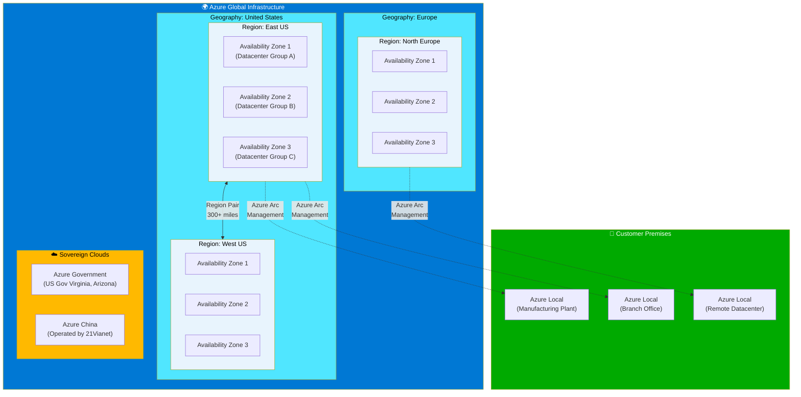
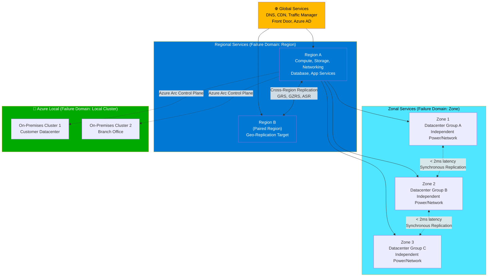

# Azure Regions & Availability Zones

## Introduction

Azure's global infrastructure forms the foundation of the hybrid continuum. Understanding how Azure organizes its cloud resources — into regions, availability zones, and edge locations — is essential for designing architectures that extend beyond the public cloud. This chapter explores Azure's physical and logical infrastructure, examining how regions and availability zones provide the resilience and compliance foundation that hybrid architectures extend into customer-controlled environments.

## Azure Global Infrastructure Overview

Microsoft Azure operates one of the world's largest cloud infrastructures, spanning 60+ regions across 140+ countries, supported by more than 300 physical datacenters and a global network backbone delivering over 200 Tbps of capacity. This infrastructure provides the physical foundation for both cloud-native and hybrid workloads.

The infrastructure hierarchy consists of:

- **Geographies**: Discrete markets preserving data residency and compliance boundaries (e.g., United States, Europe, Asia Pacific)
- **Regions**: Sets of datacenters deployed within a latency-defined perimeter, connected through a dedicated regional network
- **Availability Zones**: Unique physical locations within a region, each with independent power, cooling, and networking
- **Datacenters**: Physical facilities housing compute, storage, and networking infrastructure

This hierarchical model enables organizations to choose deployment locations that balance latency, compliance, and resilience requirements while maintaining consistent management through Azure Resource Manager.

!!! note "Infrastructure Scale"
    Azure's infrastructure continues expanding at a pace of 5-10 new regions per year, with Microsoft investing over $50 billion annually in datacenter capacity and cloud infrastructure.

## What is an Azure Region?

An **Azure region** is a geographical area containing one or more datacenters deployed within a latency-defined perimeter (typically less than 2ms round-trip time) and connected through a dedicated regional low-latency network. Each region functions as an independent failure domain, meaning that issues in one region generally do not impact other regions.

Regions serve multiple strategic purposes:

1. **Latency optimization**: Place workloads close to end users to reduce network latency
2. **Data residency**: Meet legal and regulatory requirements to keep data in specific geographies
3. **Service availability**: Access region-specific Azure services and capacity
4. **Disaster recovery**: Replicate data and applications across region boundaries for business continuity

Not all regions are created equal. Microsoft categorizes regions into:

- **Recommended regions**: Regions designed to support availability zones and offer the broadest range of service capabilities
- **Alternate regions**: Regions that extend Azure's footprint within a data residency boundary where a recommended region also exists
- **Sovereign regions**: Isolated regions operated under specific regulatory frameworks (Azure Government, Azure China operated by 21Vianet)

When selecting a region, architects must evaluate service availability, pricing variations (which can differ up to 20% between regions), compliance requirements, and proximity to end users or on-premises infrastructure.

!!! tip "Region Selection Strategy"
    For hybrid architectures, select Azure regions geographically close to Azure Local or Azure Arc-enabled on-premises infrastructure to minimize network latency for hybrid workloads spanning cloud and edge.

## Availability Zones: Fault-Isolated Infrastructure

**Availability zones** are separated groups of datacenters within a region. Each availability zone has independent power, cooling, and networking infrastructure, ensuring that if one zone experiences an outage, regional services, capacity, and high availability are supported by the remaining zones.

### Zone Architecture and Physical Separation

Availability zones provide resilience against both large-scale outages affecting entire zones and smaller-scoped failures such as server rack or cluster failures within a zone. Each zone is:

- **Physically separate**: Zones are typically separated by several kilometers, usually within 100 kilometers of each other
- **Independently powered**: Each zone has dedicated power sources, including backup generators and UPS systems
- **Network isolated**: Zones connect through redundant, high-performance networks but maintain network isolation to prevent cascading failures
- **Low latency**: Inter-zone communication achieves round-trip latency of less than 2 milliseconds, enabling synchronous replication

A datacenter location is selected using rigorous vulnerability risk assessment criteria, identifying datacenter-specific risks and evaluating shared risks between zones. This ensures zones remain independent failure domains.

### Types of Availability Zone Support

Azure services support availability zones through different deployment models:

**Zone-Redundant Resources**: Automatically replicated or distributed across multiple zones by the service. Azure manages spreading requests across zones and replicating data. If a zone fails, Microsoft manages automatic failover. Examples include:

- Zone-redundant storage (ZRS)
- Azure SQL Database zone-redundant deployment
- Azure Kubernetes Service with zone-spanning node pools
- Azure Application Gateway v2

**Zonal Resources**: Deployed to a specific availability zone that you select. Zonal resources provide isolation from faults in other zones and enable stringent latency or performance requirements. Examples include:

- Virtual machines pinned to a specific zone
- Managed disks in a specific zone
- Standard public IP addresses assigned to a zone

To achieve **zone resiliency** with zonal resources, you must design architectures with resources distributed across multiple zones and implement application-level failover logic.

**Nonzonal (Regional) Resources**: Resources not configured for availability zones. Azure may place these resources in any zone within the region, and they may experience downtime if any zone fails.

!!! warning "Zone Resilience Responsibility"
    With zone-redundant resources, Microsoft handles failover. With zonal resources, you are responsible for architecting multi-zone deployments and managing failover logic.

### Physical and Logical Zone Mapping

Each datacenter is assigned to a **physical zone**. These physical zones are mapped to **logical zones** in your Azure subscription. Different subscriptions may have different mapping orders to balance capacity across zones.

For example, subscription A might map logical zone 1 to physical zone 2, while subscription B maps logical zone 1 to physical zone 3. This randomization prevents all customers from concentrating deployments on the same physical infrastructure when they select "zone 1."

You can query your subscription's logical-to-physical zone mapping using Azure CLI, PowerShell, or Azure Resource Manager APIs to coordinate deployments with partners or across subscriptions.

## Region Pairs and Cross-Region Replication

Microsoft pairs most Azure regions within the same geography to enable cross-region disaster recovery and business continuity strategies. Region pairs have several characteristics:

- **Physical isolation**: Paired regions are separated by at least 300 miles (480 kilometers) when possible to minimize the likelihood that natural disasters, civil unrest, power outages, or physical network outages affect both regions simultaneously
- **Sequential updates**: Azure platform updates (planned maintenance) are rolled out to paired regions sequentially, never simultaneously, reducing the risk of update-related outages
- **Data residency**: Paired regions reside within the same geography (except Brazil South paired with South Central US) to meet data residency requirements for tax and law enforcement jurisdiction
- **Priority recovery**: During broad outages, recovery of one region in each pair is prioritized

Common region pairs include:

- East US ↔ West US
- North Europe ↔ West Europe
- Southeast Asia ↔ East Asia
- Australia East ↔ Australia Southeast

Some newer regions support availability zones as the primary resiliency mechanism and may not have a designated pair. Architects should design for multi-region architectures where business continuity requirements exceed single-region zone-redundant deployments.

!!! info "Replication Options"
    Azure Storage offers geo-redundant storage (GRS) and geo-zone-redundant storage (GZRS) options that automatically replicate data to the paired region, providing recovery point objectives (RPO) measured in minutes.

## Sovereign Regions and Special Cloud Environments

Azure operates **sovereign regions** — isolated Azure environments designed to meet compliance, data sovereignty, or regulatory requirements that exceed what public Azure regions provide. These clouds are physically and logically isolated from public Azure.

### Azure Government

Azure Government provides dedicated regions for U.S. federal, state, local, and tribal governments and their partners. It features:

- **Isolated network**: Separate from public Azure
- **Screened personnel**: Microsoft personnel accessing infrastructure undergo U.S. government background screening
- **Compliance certifications**: FedRAMP High, DoD IL2-IL6, ITAR, IRS 1075, CJIS, and more
- **Dedicated regions**: US Gov Virginia, US Gov Arizona, US Gov Texas, US DoD Central, US DoD East

### Azure China

Operated by 21Vianet, a Chinese internet service provider, Azure China complies with Chinese regulations requiring foreign cloud providers to partner with local companies. Data and operations remain entirely within China.

### Other Sovereign Environments

- **Azure Germany**: Previously operated under a German data trustee model; now migrated to standard Azure regions in Germany
- **Azure for National Clouds**: Specialized environments for countries requiring data sovereignty and localized operations

Sovereign regions support most Azure services but may lag behind public Azure in feature availability. They require separate subscriptions and cannot directly communicate with public Azure resources.

## How Regions Relate to Azure Local and the Hybrid Continuum

Azure regions provide the public cloud foundation, but the hybrid continuum extends this infrastructure model into customer-controlled environments through **Azure Local** (formerly Azure Stack HCI) and **Azure Arc**.

### Extending the Region Concept

Azure Local brings Azure services into customer datacenters, branch offices, and edge locations, effectively extending the region boundary beyond Microsoft-operated facilities. While Azure Local clusters are physically located on-premises, they register with an Azure region, establishing their identity in Azure Resource Manager and enabling:

- **Unified management**: Manage on-premises infrastructure using the same Azure portal, CLI, and APIs used for cloud resources
- **Consistent identity**: Azure Local VMs and resources have Azure Resource IDs and participate in Azure RBAC and policy
- **Hybrid billing**: Azure Local usage rolls up to the Azure subscription associated with the registered region

This architectural pattern creates a **logical continuum** from Azure public regions through availability zones down to customer-controlled Azure Local instances, all managed through a single control plane.

### Region Selection for Hybrid Workloads

When deploying Azure Local, organizations select an Azure region for registration. This choice impacts:

1. **Data residency**: Metadata about Azure Local resources is stored in the selected region
2. **Network latency**: Connectivity to Azure services and management endpoints originates from the selected region
3. **Service availability**: Access to region-specific Azure Arc services and capabilities
4. **Compliance scope**: Alignment with regulatory requirements for metadata storage

Best practice is to select the Azure region geographically closest to the Azure Local deployment to minimize management plane latency and ensure efficient hybrid workload communication.

!!! example "Hybrid Deployment Pattern"
    A manufacturing company deploys Azure Local clusters in five factories across Germany, all registered with the West Europe Azure region. Azure Arc provides unified governance, applying Azure Policies that flow from West Europe to all factory clusters, ensuring consistent security posture across cloud and edge.

## Fault Isolation Hierarchy in Azure

Azure's infrastructure implements multiple layers of fault isolation, from global services down to individual racks within datacenters:

### Global Layer
- **Azure Front Door**: Globally distributed entry points with automatic failover
- **Azure DNS**: Anycast DNS providing global name resolution resilience
- **Azure CDN**: Content delivery from distributed edge locations worldwide

### Regional Layer
- **Azure Resource Manager**: Regional control plane managing resources within a region
- **Regional services**: Most compute, storage, and networking services operate at region scope
- **Cross-region replication**: Services like Azure Storage GRS and Traffic Manager span regions

### Zonal Layer
- **Availability zones**: Independent datacenters within a region with isolated power, cooling, and networking
- **Zone-redundant services**: Automatic distribution across zones (e.g., ZRS storage, zone-redundant Azure SQL)

### Datacenter Layer
- **Fault domains**: Groups of servers sharing a common power source and network switch within a datacenter
- **Update domains**: Logical groups of hardware that can undergo maintenance simultaneously

### Local Layer (Hybrid Extension)
- **Azure Local clusters**: Customer-operated infrastructure registered with Azure regions
- **Azure Arc-enabled infrastructure**: Servers, Kubernetes clusters, and data services managed as Azure resources

This multi-layered approach ensures that failures at any level are contained, and workloads can achieve varying degrees of resiliency based on their tier in the hierarchy.

## Service Availability by Region

Not all Azure services are available in all regions. Microsoft categorizes services by availability:

- **Foundational services**: Available in all recommended and alternate regions (e.g., Virtual Machines, Storage, Virtual Networks)
- **Mainstream services**: Available in most recommended regions within 90 days of general availability
- **Strategic services**: Available in select regions based on customer demand and strategic positioning
- **Specialized services**: Targeted regional availability based on specialized hardware or regulatory requirements

Service availability impacts architecture decisions. Hybrid architectures must account for:

1. **Regional service gaps**: If a required service isn't available in your preferred region, you may need multi-region architectures or hybrid alternatives (e.g., running a service on Azure Local)
2. **Preview services**: New services often launch in limited regions before expanding globally
3. **Sovereign region limitations**: Sovereign clouds may not support all services available in public Azure

Always verify service availability in your target region using the [Azure Products by Region](https://azure.microsoft.com/en-us/explore/global-infrastructure/products-by-region/) page during architecture planning.

!!! tip "Hybrid Service Fallback"
    When Azure services are unavailable in your target region, consider running equivalent workloads on Azure Local or using Azure Arc-enabled services to maintain consistency across your hybrid environment.

## Why This Matters for Hybrid Architectures

Understanding Azure's regional infrastructure is critical for hybrid deployments because:

1. **Hybrid workloads span boundaries**: Applications may process data in Azure regions while serving users from Azure Local edge locations
2. **Compliance requires precision**: Data residency and sovereignty regulations often dictate both cloud region selection and on-premises deployment locations
3. **Network design depends on proximity**: The distance between Azure regions and Azure Local deployments impacts latency, bandwidth costs, and user experience
4. **Failover strategies cross boundaries**: Disaster recovery plans must account for failures at region, zone, and on-premises levels

The hybrid continuum extends Azure's infrastructure model — with its focus on fault isolation, data residency, and service availability — into every location where organizations need to run workloads. Azure Local and Azure Arc make this extension seamless, providing consistent management regardless of where infrastructure physically resides.

## References

- [Azure Regions and Availability Zones Overview](https://learn.microsoft.com/en-us/azure/reliability/availability-zones-overview)
- [Azure Global Infrastructure](https://azure.microsoft.com/en-us/explore/global-infrastructure/)
- [Azure Geographies](https://azure.microsoft.com/en-us/explore/global-infrastructure/geographies/)
- [Products Available by Region](https://azure.microsoft.com/en-us/explore/global-infrastructure/products-by-region/)
- [Azure Region Pairs](https://learn.microsoft.com/en-us/azure/reliability/cross-region-replication-azure)
- [Azure Government Documentation](https://learn.microsoft.com/en-us/azure/azure-government/)
- [Azure China Documentation](https://learn.microsoft.com/en-us/azure/china/)

---

> **Next:** [Azure Local →](02-azure-local.md)
