# Azure Arc: The Universal Control Plane

## Introduction

Azure Arc is the management plane that extends Azure governance, security, and services to any infrastructure — on-premises, multi-cloud, or edge. It is the architectural glue that makes the hybrid continuum possible, providing a single pane of glass for managing resources regardless of where they run. By projecting non-Azure resources into Azure Resource Manager, Arc enables organizations to use familiar Azure tools, policies, and services across their entire IT landscape.

This chapter explores Azure Arc's architecture, capabilities, resource types, governance model, and relationship with Azure Local, demonstrating how Arc transforms heterogeneous infrastructure into a unified, Azure-managed environment.

## What is Azure Arc?

**Azure Arc** simplifies governance and management by delivering a consistent multicloud and on-premises management platform. It addresses a fundamental challenge facing modern enterprises: controlling and governing increasingly complex environments that extend across datacenters, multiple clouds, and edge locations, each with its own set of management tools and operational models.

Azure Arc provides a centralized, unified way to:

- **Manage your entire environment together** by projecting existing non-Azure and on-premises resources into Azure Resource Manager
- **Manage virtual machines, Kubernetes clusters, and databases** as if they are running in Azure, regardless of where they physically reside
- **Use familiar Azure services and management capabilities** consistently across all resources
- **Continue using traditional ITOps** while introducing DevOps practices to support new cloud-native patterns
- **Configure custom locations** as abstraction layers on top of Arc-enabled Kubernetes clusters and cluster extensions

Azure Arc is a key component of Microsoft's **adaptive cloud** approach, helping organizations run and manage apps and services across many environments, making operations consistent and secure regardless of where workloads run.

!!! info "Arc is a Control Plane, Not Infrastructure"
    Unlike Azure Local, which provides physical infrastructure, Azure Arc is purely a management and governance layer. It projects existing resources into Azure without replacing or modifying the underlying infrastructure.

## How Azure Arc Works: Resource Projection into Azure

Azure Arc operates by installing lightweight agents on non-Azure resources, which establish connectivity to Azure and project the resource into Azure Resource Manager as a first-class Azure resource. This projection enables:

### Azure Resource Manager Integration
Once connected, Arc-enabled resources:

- Receive an **Azure Resource ID** (e.g., `/subscriptions/{sub-id}/resourceGroups/{rg}/providers/Microsoft.HybridCompute/machines/{server-name}`)
- Participate in **resource groups**, organizing hybrid resources alongside cloud resources
- Support **Azure Resource Manager templates**, enabling infrastructure-as-code deployments across hybrid environments
- Enable **Azure CLI, PowerShell, and REST API** management using the same tools as cloud resources

### Agent-Based Architecture
Azure Arc agents (Connected Machine agent for servers, Arc agent for Kubernetes) provide:

- **Outbound-only communication**: Agents initiate connections to Azure, requiring no inbound firewall rules
- **Secure authentication**: Managed identity-based authentication using Azure Active Directory
- **Heartbeat and health reporting**: Regular telemetry reporting resource status to Azure
- **Extension framework**: Plugin architecture for deploying monitoring agents, security tools, and configuration management

The agent architecture ensures Arc works in restrictive network environments, including air-gapped scenarios with periodic connectivity.

## Azure Arc-Enabled Servers

**Azure Arc-enabled servers** lets you manage Windows and Linux physical servers and virtual machines hosted outside Azure — on corporate networks, other cloud providers, or colocation facilities. When you connect a machine to Azure Arc, it becomes a **hybrid machine** with a representation in Azure, managed the same way as native Azure virtual machines.

### Key Capabilities

**Governance**:
- **Azure Policy for machine configuration**: Audit settings inside machines, enforcing security baselines and compliance requirements
- **Guest configuration policies**: Evaluate installed software, registry settings (Windows), file permissions (Linux), and service configurations
- **Compliance reporting**: Centralized dashboards showing policy compliance across hybrid server fleets

**Protection**:
- **Microsoft Defender for Endpoint**: Threat detection, vulnerability management, and proactive security monitoring via Microsoft Defender for Cloud
- **Microsoft Sentinel integration**: Collect security events and correlate with cloud and other on-premises resources for unified security operations
- **Update management**: Azure Update Manager orchestrates OS patches across Windows and Linux servers, scheduling maintenance windows and reporting compliance

**Configuration**:
- **Azure Automation**: Run PowerShell and Python runbooks for frequent management tasks, extending cloud automation to on-premises servers
- **Change tracking and inventory**: Assess configuration changes for installed software, services, registry keys, and files using Azure Monitor Agent
- **VM extensions**: Deploy supported extensions such as Azure Monitor Agent, Log Analytics agent, Custom Script Extension, and Dependency Agent

**Monitoring**:
- **VM Insights**: Monitor operating system performance, discover application components, and visualize dependencies with other resources
- **Azure Monitor Agent**: Collect performance data, events, and logs from workloads, storing them in Log Analytics workspaces
- **Resource-context log access**: Query logs using the machine's Azure Resource ID, enabling RBAC-based log access control

### Agent Status and Connectivity
The Connected Machine agent sends heartbeat messages to Azure every five minutes. If heartbeats stop, Azure marks the server **Disconnected** within 15-30 minutes. When heartbeats resume, status automatically returns to **Connected**.

If a machine remains disconnected for 45 days, its status may change to **Expired**, and its managed identity credential becomes invalid. Expired machines require manual disconnection and reconnection to resume management.

!!! warning "Agent Connectivity Requirements"
    Arc-enabled servers require periodic connectivity to Azure to renew managed identity credentials (every 45 days) and report telemetry. Plan for certificate renewal in disconnected scenarios.

### Supported Environments
Arc-enabled servers supports:

- **Physical servers and VMs outside Azure**: On-premises datacenters, colocation facilities, VMware vSphere, AWS EC2, Google Compute Engine, other cloud providers
- **Operating systems**: Windows Server 2012 R2 and later, Ubuntu, RHEL, CentOS, SUSE, Debian, Amazon Linux, Oracle Linux, and more
- **Deployment methods**: Manual agent installation, scripted deployments, Configuration Manager integration, Azure Migrate, and at-scale onboarding tools

Azure Arc-enabled servers is **not designed or supported** for managing virtual machines running in Azure. Azure VMs should use native Azure management capabilities.

## Azure Arc-Enabled Kubernetes

**Azure Arc-enabled Kubernetes** allows you to attach and configure Kubernetes clusters running anywhere — on-premises, in other clouds, or at the edge — with multiple supported distributions. Once connected, clusters appear in the Azure portal as Arc-enabled Kubernetes resources, enabling Azure-based management and governance.

### Key Capabilities

**Cluster Management**:
- **Inventory and organization**: View all Kubernetes clusters in a single Azure portal view, organized by resource groups, subscriptions, and tags
- **Configuration management with GitOps**: Deploy configurations across clusters from Git repositories using Flux v2, enabling declarative, version-controlled configuration management
- **Cluster extensions**: Install Azure services and third-party tools as cluster extensions (e.g., Azure Monitor Container Insights, Azure Defender for Kubernetes, Dapr)

**Governance and Compliance**:
- **Azure Policy for Kubernetes**: Enforce policies on clusters at scale using Azure Policy with Gatekeeper, validating admission requests against organizational policies
- **Zero-touch compliance**: Automatically apply policies to new clusters based on tags, subscriptions, or management groups, ensuring consistent security posture without manual configuration

**Azure Services on Kubernetes**:
- **Custom locations**: Define custom locations on top of Arc-enabled Kubernetes clusters, treating them as deployment targets for Azure services
- **Azure Arc-enabled data services**: Deploy Azure SQL Managed Instance and PostgreSQL on any Kubernetes cluster
- **Azure App Service on Arc**: Run Azure App Service, Functions, and Logic Apps on Arc-enabled Kubernetes
- **Event Grid on Kubernetes**: Deploy Event Grid topics and subscriptions for event-driven architectures on-premises

**Monitoring and Observability**:
- **Azure Monitor Container Insights**: Collect metrics, logs, and events from cluster nodes and containers, visualized in Azure Monitor workbooks
- **Prometheus integration**: Scrape Prometheus metrics and forward to Azure Monitor for unified monitoring across cloud and on-premises

### Supported Kubernetes Distributions
Arc-enabled Kubernetes supports any CNCF-conformant Kubernetes cluster, including:

- **On-premises**: AKS on Azure Local, Rancher RKE, Canonical Charmed Kubernetes, Red Hat OpenShift
- **Cloud providers**: Amazon EKS, Google GKE, other managed Kubernetes services
- **Edge**: K3s, MicroK8s, lightweight distributions for resource-constrained environments

Arc does not replace or modify the Kubernetes control plane; it only projects the cluster into Azure for management purposes.

!!! tip "GitOps Best Practice"
    Use Azure Arc's GitOps capabilities to treat infrastructure and application configuration as code, stored in Git repositories. This approach enables auditability, version control, and disaster recovery for cluster configurations.

## Azure Arc-Enabled Data Services

**Azure Arc-enabled data services** enable running Azure SQL Managed Instance and Azure Arc-enabled PostgreSQL on any infrastructure with Kubernetes, using the infrastructure of your choice. This capability provides cloud database benefits — elastic scaling, automated updates, security, and monitoring — on-premises.

### Key Capabilities

**Azure SQL Managed Instance on Arc**:
- **Compatibility**: Near 100% compatibility with SQL Server, supporting T-SQL, stored procedures, CLR, and SQL Agent
- **Elastic scale**: Scale compute and storage independently without application downtime
- **Automated backups**: Point-in-time restore, automated backup retention, and backup to Azure Blob Storage
- **High availability**: Built-in availability groups with automatic failover

**Azure Arc-enabled PostgreSQL**:
- **Hyperscale deployment**: Distributed tables across worker nodes for horizontal scaling
- **Flexible deployment**: Single-node or multi-node configurations based on workload requirements

**Operational Modes**:
- **Directly connected mode**: Continuous connectivity to Azure, enabling real-time monitoring, automatic updates, and Azure portal management
- **Indirectly connected mode** *(retired as of September 2025)*: Previously supported periodic connectivity for environments with limited internet access

**Benefits**:
- **Consistent tooling**: Manage Arc-enabled data services using Azure Data Studio, Azure portal, and familiar SQL tools
- **Azure services integration**: Use Azure Monitor, Azure Backup, and Azure Policy with on-premises databases
- **Licensing flexibility**: Bring existing SQL Server licenses with Software Assurance or pay-as-you-go pricing

### Deployment Architecture
Arc-enabled data services require:

- **Kubernetes cluster**: Arc-enabled Kubernetes cluster (minimum 3 worker nodes for high availability)
- **Data controller**: Custom resource managing the lifecycle of database instances
- **Storage**: Persistent volumes using Kubernetes storage classes (local storage, NFS, SAN, cloud block storage)

This architecture provides cloud database experiences on any infrastructure while maintaining local data sovereignty and low-latency access.

## Azure Arc Resource Bridge and VM Management

**Azure Arc resource bridge** is a specialized Arc component enabling lifecycle management and self-service provisioning of VMs on on-premises infrastructure, including:

- **Azure Local**: Manage VMs on Azure Local clusters through Azure portal and APIs
- **VMware vSphere**: Project vCenter-managed VMs into Azure, enabling self-service VM operations with Azure RBAC
- **System Center Virtual Machine Manager (SCVMM)**: Integrate SCVMM-managed environments with Azure

### VM Management Capabilities

**Lifecycle Operations**:
- **Create**: Provision new VMs from templates through Azure portal, CLI, or ARM templates
- **Resize**: Adjust CPU, memory, and disk configuration
- **Start, stop, restart**: Power management operations through Azure interfaces
- **Delete**: Decommission VMs with Azure-based approvals and auditing

**Self-Service Access**:
- **Azure RBAC**: Delegate VM operations to developers and application teams without granting on-premises infrastructure access
- **Developer empowerment**: Application teams can provision environments on-demand without IT tickets, accelerating development cycles

**Infrastructure Abstraction**:
- **Custom locations**: Define logical deployment targets (e.g., "East Coast Datacenter," "Factory Floor") mapping to physical infrastructure
- **Azure Migrate integration**: Discover and assess on-premises VMs, then migrate to Azure Local or Azure with unified tooling

Arc resource bridge runs as an appliance VM on the on-premises infrastructure, projecting resources into Azure through Arc connectivity.

## Azure Arc and Azure Local: The Integration Story

Azure Arc and Azure Local are deeply integrated, with Arc serving as the **management backbone** for Azure Local:

### Registration and Projection
Every Azure Local cluster is automatically registered with Azure Arc during deployment, projecting:

- **Cluster resource**: The Azure Local cluster appears as an Azure Arc resource in a resource group
- **Nodes**: Individual cluster nodes visible in Azure portal for monitoring and updates
- **Virtual networks**: Software-defined networks defined on Azure Local synchronized to Azure

### Unified Management
Through Arc integration, Azure Local gains:

- **Azure portal management**: All cluster configuration, VM management, and monitoring accessible through Azure portal
- **Azure Policy**: Governance policies applied to Azure Local clusters and VMs, enforcing security baselines
- **Azure Monitor**: Telemetry, metrics, and logs from clusters and workloads streamed to Azure Monitor
- **Azure Update Manager**: Orchestrated updates across cluster nodes, firmware, and drivers

### Hybrid Workloads
Arc enables workloads to span Azure cloud and Azure Local:

- **Azure Arc-enabled Kubernetes**: AKS clusters on Azure Local managed identically to AKS clusters in Azure
- **Azure Arc-enabled data services**: SQL Managed Instance running on Azure Local with the same management experience as Azure SQL Database
- **Consistent developer experience**: Developers deploy to Azure Local using the same ARM templates, Azure CLI commands, and Azure DevOps pipelines used for cloud deployments

This integration makes Azure Local a **logical extension of an Azure region**, with Arc providing the control plane bridging cloud and on-premises.

!!! example "Hybrid Application Pattern"
    A retail chain runs an inventory management application. The backend database runs on Azure SQL Database in the West US region. Each store runs Azure SQL Managed Instance on Azure Local via Arc, replicating data bidirectionally. During internet outages, stores continue operating with local data. Azure Arc manages policies, monitoring, and updates across all instances.

## Governance at Scale: Azure Policy, RBAC, and Tags

Azure Arc extends Azure governance capabilities to hybrid resources, enabling centralized control across distributed infrastructure:

### Azure Policy for Hybrid Resources
Azure Policy enforces organizational standards and assesses compliance at scale:

- **Built-in policies**: Microsoft-provided policies for common scenarios (e.g., "Require HTTPS for web apps," "Audit VMs without disk encryption")
- **Custom policies**: Define organization-specific policies using Azure Policy definition language
- **Policy initiatives**: Group related policies into initiatives (e.g., "CIS Benchmark," "NIST 800-53 compliance")
- **Remediation**: Automatically remediate non-compliant resources using DeployIfNotExists or Modify effects

Policies apply uniformly to Azure cloud resources, Arc-enabled servers, Arc-enabled Kubernetes clusters, and Azure Local resources.

### Role-Based Access Control (RBAC)
Azure RBAC controls access to hybrid resources using the same identity model as cloud resources:

- **Azure AD integration**: Users, groups, and service principals authenticate using Azure Active Directory
- **Built-in roles**: Assign roles such as Reader, Contributor, Owner to control access levels
- **Custom roles**: Define fine-grained permissions tailored to organizational needs
- **Scope**: Assign roles at management group, subscription, resource group, or individual resource levels

RBAC enables delegation of VM management on Azure Local to developers without granting on-premises infrastructure access.

### Tags and Resource Organization
Tags provide metadata for organizing and managing resources:

- **Cost allocation**: Tag resources by cost center, project, or environment for chargeback reporting
- **Automation**: Use tags to trigger automation workflows or select resources for policy application
- **Lifecycle management**: Tag resources with expiration dates, owners, or approval status

Tags applied to Arc-enabled resources flow through to cloud management tools, enabling unified visibility.

!!! tip "Policy-Based Tagging"
    Use Azure Policy to enforce mandatory tags on all resources, ensuring consistent metadata across hybrid environments. Example policy: "Require 'CostCenter' tag on all VMs."

## Monitoring: Azure Monitor and Log Analytics for Hybrid Environments

Azure Monitor extends cloud-native observability to hybrid resources through Azure Arc:

### Azure Monitor Agent
The **Azure Monitor Agent** (AMA) collects telemetry from Arc-enabled servers and VMs on Azure Local:

- **Performance data**: CPU, memory, disk, and network metrics
- **Event logs**: Windows Event Logs, Syslog, application logs
- **Custom logs**: Application-specific log files and structured data

Data is sent to **Log Analytics workspaces**, enabling querying with Kusto Query Language (KQL) and visualization in Azure Monitor workbooks.

### VM Insights
VM Insights provides:

- **Performance monitoring**: Time-series charts of resource utilization
- **Dependency mapping**: Visualize network connections, TCP ports, and inter-process communication
- **Alerting**: Configure alerts based on performance thresholds or anomalies

### Container Insights
For Arc-enabled Kubernetes clusters, **Container Insights** collects:

- **Node and pod metrics**: CPU, memory, and disk usage at node and pod levels
- **Container logs**: Stdout/stderr streams from containers
- **Kubernetes events**: Cluster events such as pod scheduling, failures, and scaling events

### Unified Dashboards
Azure Monitor workbooks combine data from cloud and hybrid resources into unified dashboards:

- **Multi-cluster views**: Monitor multiple Kubernetes clusters across Azure, Azure Local, and other clouds
- **Hybrid server health**: View server fleet health across datacenters and cloud regions
- **Cross-environment alerting**: Configure alerts that correlate events across hybrid boundaries

!!! example "Observability Pattern"
    An e-commerce company uses Arc to project on-premises servers, Azure Local clusters, and AWS EC2 instances into Azure. Azure Monitor dashboards show application health across all environments, alerting operations teams to issues regardless of where resources run.

## Security: Microsoft Defender for Cloud Across Hybrid Resources

**Microsoft Defender for Cloud** provides unified security posture management and threat protection across hybrid environments:

### Security Posture Management
- **Secure Score**: Aggregate security score across cloud and hybrid resources, identifying improvement opportunities
- **Security recommendations**: Actionable recommendations for hardening servers, Kubernetes clusters, and databases
- **Compliance dashboards**: Assess compliance against regulatory frameworks (ISO 27001, SOC 2, NIST)

### Threat Protection
- **Microsoft Defender for Servers**: Real-time threat detection for Arc-enabled servers using behavioral analytics and Microsoft threat intelligence
- **Microsoft Defender for Kubernetes**: Runtime protection for Arc-enabled Kubernetes clusters, detecting suspicious activities
- **Integration with Microsoft Sentinel**: Forward security alerts to Sentinel for correlation, investigation, and automated response

### Just-in-Time (JIT) VM Access
JIT access for Arc-enabled servers reduces attack surface by:

- **Locking down management ports**: Deny RDP/SSH access by default
- **Time-bound access**: Approve access requests with automatic expiration
- **Audit trail**: Log all access approvals and connection attempts

### Vulnerability Assessment
Integrated vulnerability scanning for Arc-enabled servers:

- **Agent-based scanning**: Deploy Qualys or Rapid7 vulnerability scanners as VM extensions
- **Centralized findings**: View vulnerabilities across hybrid server fleets in Defender for Cloud
- **Remediation workflows**: Track patching and mitigation efforts

Security capabilities applied through Arc ensure consistent security posture regardless of where infrastructure runs.

## Azure Arc in Disconnected Scenarios

While Azure Arc is designed for connected environments, it supports scenarios with limited or no connectivity:

### Connectivity Requirements
Arc-enabled resources require:

- **Initial connection**: Establish Arc agent connectivity to register resources
- **Periodic heartbeats**: Arc-enabled servers send heartbeats every 5 minutes; Kubernetes clusters send status updates every few minutes
- **Credential renewal**: Managed identity credentials renew every 45 days, requiring connectivity

### Limitations in Disconnected Mode
When Arc-enabled resources are disconnected from Azure:

- **Read-only status in Azure**: Resources appear "Disconnected" in Azure portal; configuration changes queued but not applied
- **No policy enforcement**: Azure Policy evaluations and remediations do not occur
- **Limited monitoring**: Telemetry is not sent to Azure Monitor
- **Manual operations**: Updates, extensions, and configurations require manual intervention

### Workarounds for Limited Connectivity
Organizations operating in bandwidth-constrained or intermittent connectivity environments can:

1. **Schedule connectivity windows**: Establish connectivity during off-peak hours to synchronize telemetry, policies, and updates
2. **Use local management tools**: Rely on Windows Admin Center, kubectl, or vendor-specific tools during disconnected periods
3. **Deploy caching proxies**: Use caching HTTP proxies to reduce bandwidth consumption for updates and telemetry
4. **Plan for expiration**: Reconnect resources before the 45-day credential expiration window

For true air-gapped environments (no connectivity), Arc's value is limited. Consider Azure Stack Hub or standalone Azure Local deployments for disconnected scenarios.

!!! warning "Disconnected Mode Limitations"
    Disconnected Arc resources lose most cloud management benefits. Plan carefully whether Arc is appropriate for environments that cannot maintain periodic connectivity.

## Pricing

Azure Arc control plane functionality is offered at **no extra cost**, including:

- **Resource organization**: Azure management groups and tags
- **Searching and indexing**: Azure Resource Graph queries
- **Access control**: Azure RBAC for hybrid resources
- **Environments and automation**: ARM templates and extensions

Azure services used on Arc-enabled resources are charged per their normal pricing:

- **Azure Monitor**: Charged for data ingestion and retention in Log Analytics workspaces
- **Microsoft Defender for Cloud**: Charged per server or Kubernetes cluster protected
- **Azure Update Manager**: Included at no charge
- **Azure Policy**: Guest configuration policies charged per server

Arc-enabled VMware vSphere and SCVMM capabilities, including VM lifecycle management, are offered at no extra cost beyond any Azure services consumed.

!!! tip "Cost Optimization"
    Monitor Azure Monitor data ingestion costs, as hybrid environments can generate significant log volumes. Use data collection rules to filter unnecessary data before ingestion.

## Why Azure Arc Matters for the Hybrid Continuum

Azure Arc is the **architectural enabler** of the hybrid continuum, providing:

1. **Unified identity and security**: Hybrid resources managed with the same Azure AD identities, RBAC, and policies as cloud resources
2. **Consistent governance**: Enforce organizational standards uniformly across cloud, on-premises, edge, and multi-cloud
3. **Developer productivity**: Developers use familiar Azure tools and workflows regardless of where infrastructure runs
4. **Operational simplicity**: Single management interface (Azure portal) for entire IT landscape, reducing tool sprawl
5. **Cloud migration path**: Project existing infrastructure into Azure as a stepping stone toward cloud migration

Without Azure Arc, hybrid environments remain fragmented across vendor-specific tools, each with different identity systems, policy frameworks, and operational models. Arc provides the **control plane unification layer** that makes the hybrid continuum operationally viable at enterprise scale.

```mermaid
graph TB
    subgraph AzureCloud["☁️ Azure Control Plane"]
        Portal["Azure Portal"]
        ARM["Azure Resource Manager"]
        ArcRP["Azure Arc Resource Providers"]
        
        subgraph AzureServices["Azure Management Services"]
            Policy["Azure Policy"]
            Monitor["Azure Monitor"]
            Security["Microsoft Defender"]
            Sentinel["Microsoft Sentinel"]
            Update["Update Management"]
            Backup["Azure Backup"]
        end
    end
    
    subgraph OnPremDC["🏢 On-Premises Datacenter"]
        subgraph Servers["Arc-enabled Servers"]
            Windows["Windows Servers"]
            Linux["Linux Servers"]
            SQLServer["SQL Server Instances"]
        end
        
        subgraph K8s["Arc-enabled Kubernetes"]
            AKS["AKS Hybrid"]
            OpenShift["OpenShift"]
            Rancher["Rancher"]
            Vanilla["Vanilla K8s"]
        end
        
        subgraph DataSvc["Arc-enabled Data Services"]
            SQLManagedInstance["SQL Managed Instance"]
            PostgreSQL["PostgreSQL Hyperscale"]
        end
        
        subgraph Virtualization["Arc-enabled VM Management"]
            VMware["VMware vSphere"]
            SCVMM["System Center VMM"]
            AzureLocal["Azure Local VMs"]
        end
    end
    
    subgraph Edge["🌐 Edge & Multi-Cloud"]
        EdgeK8s["Edge Kubernetes"]
        AWS["AWS EC2 Instances"]
        GCP["Google Cloud VMs"]
        OtherCloud["Other Cloud Resources"]
    end
    
    subgraph Agent["🔧 Azure Arc Agent Components"]
        ConnectedMachine["Connected Machine Agent<br/>(azcmagent)"]
        ExtensionMgr["Extension Manager"]
        GuestConfig["Guest Configuration"]
        CloudAgent["Azure Arc Proxy"]
    end
    
    Portal --> ARM
    ARM --> ArcRP
    ArcRP -.->|"HTTPS 443<br/>Outbound Only"| Agent
    
    AzureServices -.->|"Policies, Monitoring,<br/>Security, Updates"| Agent
    
    Agent --> Windows
    Agent --> Linux
    Agent --> SQLServer
    Agent --> AKS
    Agent --> OpenShift
    Agent --> Rancher
    Agent --> Vanilla
    Agent --> SQLManagedInstance
    Agent --> PostgreSQL
    Agent --> VMware
    Agent --> SCVMM
    Agent --> AzureLocal
    Agent --> EdgeK8s
    Agent --> AWS
    Agent --> GCP
    Agent --> OtherCloud
    
    Windows -.->|"Heartbeat<br/>Telemetry"| CloudAgent
    Linux -.->|"Heartbeat<br/>Telemetry"| CloudAgent
    K8s -.->|"Cluster<br/>Metadata"| CloudAgent
    DataSvc -.->|"Service<br/>Metrics"| CloudAgent
    
    CloudAgent -.-> ArcRP
    
    style AzureCloud fill:#0078d4,color:#fff
    style AzureServices fill:#50e6ff,color:#000
    style OnPremDC fill:#00aa00,color:#fff
    style Edge fill:#ffb900,color:#000
    style Agent fill:#e8f4fd,color:#000
```

## References

- [Azure Arc Overview](https://learn.microsoft.com/en-us/azure/azure-arc/overview)
- [Azure Arc-enabled Servers](https://learn.microsoft.com/en-us/azure/azure-arc/servers/overview)
- [Azure Arc-enabled Kubernetes](https://learn.microsoft.com/en-us/azure/azure-arc/kubernetes/overview)
- [Azure Arc-enabled Data Services](https://learn.microsoft.com/en-us/azure/azure-arc/data/overview)
- [SQL Server Enabled by Azure Arc](https://learn.microsoft.com/en-us/sql/sql-server/azure-arc/overview)
- [Azure Arc-enabled VM Management on Azure Local](https://learn.microsoft.com/en-us/azure/azure-local/manage/azure-arc-vm-management-overview)
- [Azure Arc-enabled VMware vSphere](https://learn.microsoft.com/en-us/azure/azure-arc/vmware-vsphere/overview)
- [Azure Arc-enabled System Center Virtual Machine Manager](https://learn.microsoft.com/en-us/azure/azure-arc/system-center-virtual-machine-manager/overview)
- [Azure Arc Jumpstart](https://aka.ms/AzureArcJumpstart)
- [Azure Arc Landing Zone Accelerators](https://aka.ms/ArcLZAcceleratorReady)
- [Network Requirements for Azure Arc](https://learn.microsoft.com/en-us/azure/azure-arc/network-requirements-consolidated)

---

> **Next:** [Azure Stack HCI →](04-azure-stack-hci.md)
