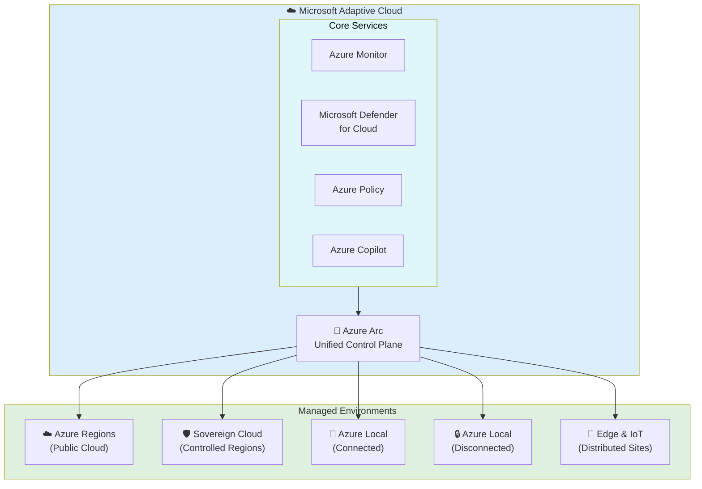
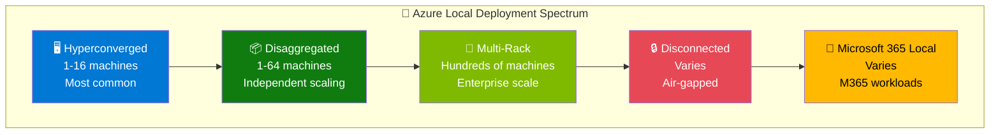
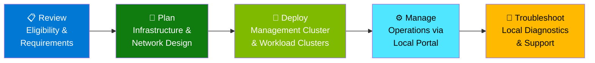
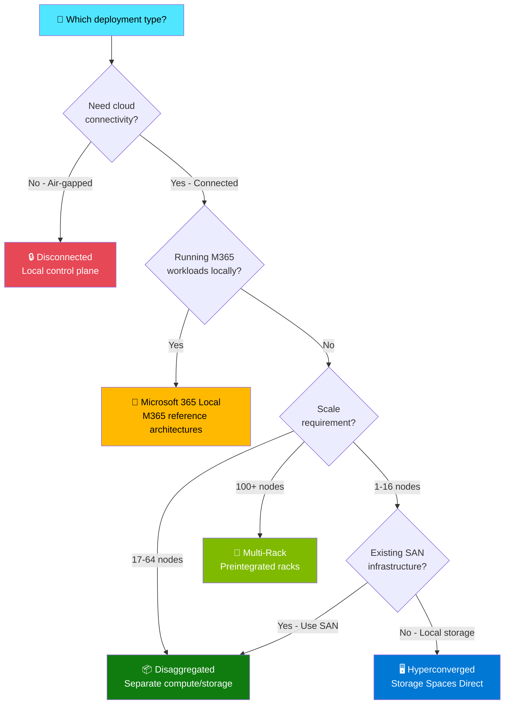

# Azure Local Deployment Types

## Introduction

Azure Local supports multiple deployment types to address different scale, performance, and connectivity requirements. Understanding the right deployment type is critical for designing hybrid architectures that match your organization's operational constraints, workload demands, and sovereignty needs.

This chapter provides a comprehensive overview of all five Azure Local deployment types, guidance on when to use each, and the role of Microsoft's **Adaptive Cloud** approach in unifying management across these deployment models.

## Microsoft Adaptive Cloud Approach

Before diving into deployment types, it's important to understand the strategic framework that unifies all Azure hybrid infrastructure: Microsoft's **Adaptive Cloud** approach.

The Adaptive Cloud is Microsoft's strategy for bringing cloud capabilities to customers wherever they operate — from hyperscale Azure regions to sovereign private clouds running in disconnected environments. The core principles are:

- **Unify teams, sites, and systems** — Consolidate siloed management into a single control plane with Azure Arc
- **Transcend legacy systems** — Modernize with composable cloud-native tool chains, containers, and data services
- **Enhance physical operations** — Build a unified data foundation across distributed sites
- **Grow with flexible infrastructure** — Scale operations with Azure infrastructure while maintaining local control

> **Figure 1:** The Adaptive Cloud architecture — Azure Arc acts as the unifying control plane, projecting Azure management capabilities across all deployment targets from public cloud to air-gapped environments.

Key products within the Adaptive Cloud:

| Product | Role |
|---------|------|
| **Azure Arc** | Unified control plane for hybrid and multicloud management |
| **Azure Local** | Distributed infrastructure extending Azure to customer locations |
| **Azure Monitor** | Observability across all environments |
| **Microsoft Defender for Cloud** | Security posture management everywhere |
| **Azure IoT Operations** | Edge and IoT workload management |
| **Microsoft Fabric** | Unified data platform spanning cloud and edge |
| **Azure Kubernetes Service** | Container orchestration across all deployment types |

> 📖 **Reference:** [Microsoft Adaptive Cloud](https://azure.microsoft.com/solutions/adaptive-cloud) | A Forrester TEI study found **304% ROI within 3 years** for organizations using Azure Arc as their adaptive cloud control plane.

---

## Deployment Types Overview

Azure Local offers five distinct deployment types, each optimized for different scale and connectivity requirements:

> **Figure 2:** The Azure Local deployment spectrum — from single hyperconverged clusters to enterprise multi-rack installations and air-gapped sovereign private clouds.

| Deployment Type | Scale | Storage Model | Use Case |
|----------------|-------|---------------|----------|
| **Hyperconverged** | 1–16 machines | Storage Spaces Direct (local drives) | General purpose, branch office, datacenter |
| **Disaggregated** | 1–64 machines | External SAN (separate storage) | Independent compute/storage scaling |
| **Multi-rack** | Hundreds of machines | Integrated rack-level storage | Enterprise-scale, preintegrated solutions |
| **Disconnected** | Varies | Any supported model | Air-gapped, sovereign private clouds |
| **Microsoft 365 Local** | Varies | Per reference architecture | Microsoft 365 workloads on-premises |

---

## Hyperconverged Deployments

### Overview

Hyperconverged is the most common Azure Local deployment type, combining compute, storage, and networking in a single cluster using **Storage Spaces Direct** for software-defined storage. It represents the classic hyperconverged infrastructure (HCI) model where storage is provided by local drives pooled across cluster nodes.

### Architecture

- **Compute:** Hyper-V hypervisor across 1–16 validated server nodes
- **Storage:** Storage Spaces Direct pools NVMe/SSD/HDD drives across nodes with mirror, parity, or mirror-accelerated parity resiliency
- **Networking:** Software-defined networking with 10/25/100 GbE RDMA-capable NICs
- **Optional external SAN:** Can attach external SAN storage for additional capacity alongside local Storage Spaces Direct

### Key Capabilities

- **Secure-by-default configuration** with 300+ security settings enabled out of the box
- **Solution updates** for simplified patching of OS, firmware, and drivers as a single operation
- **Azure Arc integration** for unified cloud management
- **Workload support:** Azure Local VMs, AKS enabled by Arc, Azure Virtual Desktop, SQL Server, Azure IoT Operations, Edge RAG, Video Indexer

### When to Use

✅ General-purpose virtualization and container hosting  
✅ Branch offices and remote sites (single-node or 2-node clusters)  
✅ Datacenters requiring 1–16 node scale  
✅ Organizations wanting the simplest deployment model  
✅ Scenarios where compute and storage scale together  

### Validated Hardware Partners

Hardware solutions are available from ASUS, Bluechip, DataON, Dell Technologies, Fujitsu, HPE, Hitachi, Lenovo, NEC, QCT, and others. See the [Azure Local Catalog](https://aka.ms/AzureStackHCICatalog) for the full list.

> 📖 **Reference:** [Hyperconverged Deployments Overview](https://learn.microsoft.com/en-us/azure/azure-local/overview/hyperconverged-overview)

---

## Disaggregated Deployments

### Overview

Disaggregated deployments **separate compute and storage** into independent tiers, using external SAN (Storage Area Network) infrastructure instead of local Storage Spaces Direct. This allows compute and storage to scale independently, supporting larger deployments (up to 64 machines) and leveraging existing enterprise SAN investments.

### Architecture

- **Compute nodes:** 1–64 machines running Hyper-V without local storage pooling
- **Storage:** External SAN (Fibre Channel, iSCSI, or NVMe-oF) providing shared storage
- **Networking:** Dedicated storage fabric plus management/workload networks
- **Independent scaling:** Add compute nodes without adding storage, or expand SAN capacity without adding compute

### Key Capabilities

- Scale compute and storage **independently** based on workload demands
- Leverage **existing SAN investments** (NetApp, Pure Storage, Dell PowerStore, etc.)
- Support **larger cluster sizes** (up to 64 nodes) than hyperconverged
- Maintain the same Azure Arc management and workload capabilities

### When to Use

✅ Organizations with existing SAN infrastructure they want to retain  
✅ Workloads where compute and storage demand grow at different rates  
✅ Deployments requiring more than 16 compute nodes  
✅ Environments requiring enterprise SAN features (snapshots, replication, deduplication)  
✅ Database-heavy workloads benefiting from dedicated high-performance storage  

> 📖 **Reference:** [Disaggregated Deployments Overview](https://learn.microsoft.com/en-us/azure/azure-local/overview/disaggregated-overview)

---

## Multi-Rack Deployments

### Overview

Multi-rack deployments are **preintegrated solutions** from OEM partners, consisting of multiple racks of compute, storage, and networking infrastructure designed and tested as a unified system. These solutions scale to **hundreds of machines** and include built-in fault tolerance at the rack level.

### Architecture

- **Multiple racks** delivered as tested, validated units from OEM partners
- **Built-in fault tolerance** — rack-level isolation ensures single rack failure doesn't take down the deployment
- **Integrated networking** — spine-leaf network fabric included in the solution
- **Centralized management** — manage all racks through Azure portal as a unified resource pool

### Key Capabilities

- Scale to **hundreds of machines** in a single managed deployment
- **Rack-level fault tolerance** — survive complete rack failures
- **Preintegrated and pre-tested** — delivered by OEM partners as turnkey solutions
- **Simplified operations** — single update and management experience across all racks

### When to Use

✅ Large enterprise datacenters requiring hundreds of compute nodes  
✅ Organizations preferring turnkey, vendor-managed infrastructure  
✅ Deployments where rack-level fault isolation is a requirement  
✅ Scenarios demanding the highest density and scale  
✅ Organizations consolidating multiple smaller clusters into a unified platform  

> 📖 **Reference:** [Multi-Rack Deployments Overview](https://learn.microsoft.com/en-us/azure/azure-local/multi-rack/multi-rack-overview)

---

## Disconnected Deployments

### Overview

Disconnected deployments provide a **local instance of the Azure control plane** with a subset of Azure capabilities, enabling organizations to run Azure Local with **no connection to the Azure cloud**. This deployment type is designed for sovereign private clouds, air-gapped environments, and scenarios where cloud connectivity is prohibited by regulation or operational constraints.

!!! warning "Eligibility Required"
    Disconnected operations require an eligible Microsoft agreement, a valid business need, and operational staff or a qualified partner. Not all organizations qualify — contact your Microsoft account team.

### Architecture

Disconnected deployments require a dedicated **management cluster** running the local Azure control plane:

| Component | Requirement |
|-----------|------------|
| **Management cluster nodes** | Minimum 3 nodes |
| **RAM per management node** | 512 GB minimum |
| **CPU cores per management node** | 24 cores minimum |
| **Purpose** | Hosts local Azure Portal, ARM, RBAC, and other control plane services |

The management cluster provides the familiar Azure experience (portal, CLI, APIs) entirely on-premises, with no external network dependencies.

### Supported Services in Disconnected Mode

Not all Azure services are available in disconnected mode. The following are supported:

| Category | Services |
|----------|----------|
| **Management** | Azure Portal (local), Azure Resource Manager, Azure RBAC |
| **Identity** | Managed Identity (local) |
| **Infrastructure** | Arc-enabled servers, Azure Local VMs |
| **Containers** | Arc-enabled Kubernetes, Azure Kubernetes Service (AKS) |
| **Registry** | Azure Container Registry (local) |
| **Security** | Azure Key Vault (local), Azure Policy |

### Deployment Flow

> **Figure 3:** The disconnected deployment lifecycle — from eligibility review through ongoing operations and troubleshooting.

### When to Use

✅ Air-gapped networks in defense, intelligence, and national security  
✅ Regulatory requirements prohibiting cloud connectivity  
✅ Critical infrastructure where internet connectivity cannot be tolerated  
✅ Remote or maritime operations without reliable connectivity  
✅ Organizations requiring complete data sovereignty with zero external dependencies  

### Key Considerations

- Available from **Azure Local version 2602+**
- Requires dedicated management cluster infrastructure (significant hardware investment)
- Subset of Azure services compared to connected mode
- Updates and patches delivered via **secure media transfer** (no over-the-air updates)
- Support engagement requires secure data transfer mechanisms

> 📖 **Reference:** [Disconnected Operations Overview](https://learn.microsoft.com/en-us/azure/azure-local/manage/disconnected-operations-overview)

---

## Microsoft 365 Local

### Overview

Microsoft 365 Local provides specific **reference architectures** for running Microsoft 365 workloads on Azure Local infrastructure. This deployment type addresses organizations that need Microsoft 365 services (Exchange, SharePoint, Teams) running on-premises for sovereignty, compliance, or latency requirements.

### When to Use

✅ Organizations requiring Microsoft 365 services on-premises  
✅ Sovereign environments where M365 cloud services are not permissible  
✅ Deployments requiring low-latency access to collaboration tools  
✅ Regulated industries needing local control of communication data  

> 📖 **Reference:** [Microsoft 365 Local Overview](https://learn.microsoft.com/en-us/azure/azure-sovereign-clouds/private/m365-local/microsoft-365-local-overview)

---

## Deployment Type Decision Guide

Use this decision tree to select the appropriate Azure Local deployment type:

> **Figure 4:** Decision tree for selecting the right Azure Local deployment type based on connectivity, scale, and infrastructure requirements.

### Quick Reference Matrix

| Criteria | Hyperconverged | Disaggregated | Multi-Rack | Disconnected | M365 Local |
|----------|---------------|---------------|------------|--------------|------------|
| **Max nodes** | 16 | 64 | Hundreds | Varies | Varies |
| **Storage** | Local (S2D) | External SAN | Integrated | Any | Per ref arch |
| **Cloud required** | Yes | Yes | Yes | No | Depends |
| **Complexity** | Low | Medium | High | Very High | High |
| **Hardware flexibility** | Multi-vendor | Multi-vendor + SAN | OEM-specific | Multi-vendor | Per ref arch |
| **Best for** | General purpose | Large-scale, existing SAN | Enterprise DC | Air-gapped | M365 on-prem |

---

## Mapping Deployment Types to the Hybrid Continuum

Each deployment type maps to specific stages of the [Hybrid Continuum](../01-introduction/02-the-hybrid-continuum.md):

| Continuum Stage | Recommended Deployment Types |
|----------------|------------------------------|
| **Stage 3: Hybrid (Cloud + Local)** | Hyperconverged, Disaggregated |
| **Stage 4: Local Connected** | Hyperconverged, Disaggregated, Multi-Rack |
| **Stage 5: Disconnected** | Disconnected (any underlying type) |

- **Stage 3** typically uses hyperconverged clusters for the local portion of hybrid workloads, with cloud handling burst and scale-out
- **Stage 4** may require disaggregated or multi-rack for larger deployments where all workloads run locally
- **Stage 5** requires the disconnected deployment type regardless of the underlying cluster architecture (hyperconverged or disaggregated nodes can run in disconnected mode)

---

## References

- [Azure Local Overview](https://learn.microsoft.com/en-us/azure/azure-local/overview)
- [Scalability and Deployments](https://learn.microsoft.com/en-us/azure/azure-local/scalability-deployments)
- [Hyperconverged Deployments](https://learn.microsoft.com/en-us/azure/azure-local/overview/hyperconverged-overview)
- [Disaggregated Deployments](https://learn.microsoft.com/en-us/azure/azure-local/overview/disaggregated-overview)
- [Multi-Rack Deployments](https://learn.microsoft.com/en-us/azure/azure-local/multi-rack/multi-rack-overview)
- [Disconnected Operations](https://learn.microsoft.com/en-us/azure/azure-local/manage/disconnected-operations-overview)
- [Microsoft 365 Local](https://learn.microsoft.com/en-us/azure/azure-sovereign-clouds/private/m365-local/microsoft-365-local-overview)
- [Microsoft Adaptive Cloud](https://azure.microsoft.com/solutions/adaptive-cloud)
- [Azure Local Catalog](https://aka.ms/AzureStackHCICatalog)

---

*Built with ❤️ by the Migrate and Modernize GBB team.*

> **Next:** [Connectivity Models →](05-connectivity-models.md)
