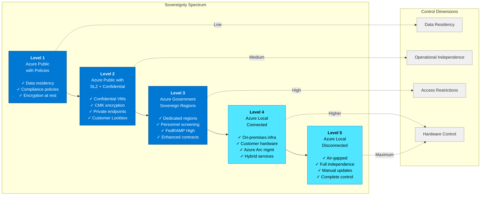

# Sovereign Cloud Overview

## Introduction

Cloud sovereignty is the principle that organizations and nations must maintain control over their data, operations, and digital infrastructure. As cloud adoption accelerates globally, sovereignty has become a critical architectural driver — especially for government, defense, critical infrastructure, and regulated industries. In an era of increasing regulatory complexity, geopolitical tensions, and data protection requirements, the ability to exert control over where data resides, who can access it, and under what conditions has evolved from a niche concern to a foundational requirement for cloud architecture.

This chapter explores the concept of digital sovereignty, Microsoft's approach to sovereignty in the cloud, and how sovereignty considerations intersect with the hybrid continuum to give organizations choice and control over their cloud deployments.

## What is Digital Sovereignty?

**Digital sovereignty** refers to the capability of organizations and nation-states to exercise authority over their digital infrastructure, data, and operations. It encompasses technical, legal, and operational measures that ensure data and systems remain under the control of the data owner, even when leveraging third-party cloud services.

Sovereignty is not a binary state but a spectrum of control mechanisms. Different workloads, regulatory environments, and risk profiles demand different levels of sovereignty. Understanding this spectrum is essential to architecting solutions that balance control with the benefits of global cloud scale, security, and innovation.

### The Three Pillars of Sovereignty

Microsoft's approach to sovereignty is built on three foundational pillars:

#### 1. Data Sovereignty

**Data sovereignty** ensures organizations control **where** their data is stored, processed, and replicated. This includes:

- **Geographic residency**: The ability to specify and enforce that data remains within certain geographic boundaries (e.g., within the EU, within national borders).
- **Data locality compliance**: Meeting regulatory requirements such as GDPR (EU), CCPA (California), or industry-specific mandates (e.g., HIPAA, FedRAMP).
- **Data transfer restrictions**: Controlling when and how data can move across borders, particularly in light of rulings such as Schrems II, which invalidated the EU-US Privacy Shield.

Azure provides data residency through its global network of regional data centers, paired with policy enforcement mechanisms that prevent data from leaving specified boundaries. For example, Azure Policy can enforce that all Storage Accounts in a subscription must reside in specific Azure regions.

#### 2. Operational Sovereignty

**Operational sovereignty** governs **who** can access and operate cloud infrastructure and under **what conditions**. This includes:

- **Access control**: Limiting administrative access to authorized personnel, with strong identity verification.
- **Customer Lockbox**: Giving organizations explicit approval rights over Microsoft support access to their environments.
- **Audit and transparency**: Providing detailed logs of all access to sensitive resources, including access by cloud operator personnel.
- **Operational independence**: Reducing dependency on the cloud provider for critical operations, including the ability to run workloads in disconnected scenarios.

Operational sovereignty is particularly critical for government, defense, and critical infrastructure organizations, where the risk of unauthorized access — even by well-intentioned cloud operators — must be minimized.

#### 3. Software Sovereignty

**Software sovereignty** ensures organizations can run and manage workloads without exclusive dependency on a single cloud provider. This includes:

- **Portability**: The ability to move workloads between clouds or to on-premises environments without architectural rework.
- **Open standards**: Leveraging open-source technologies, Kubernetes, and industry-standard APIs to avoid vendor lock-in.
- **Transparency**: Understanding the software stack, including firmware, hypervisors, and control plane components.
- **Supply chain security**: Ensuring the integrity of software components and dependencies.

Azure Local (formerly Azure Stack HCI) exemplifies software sovereignty by enabling organizations to run Azure services on-premises with consistent APIs, while retaining full control over the hardware and network infrastructure.

## Why Sovereignty Matters

The rise of cloud sovereignty as an architectural imperative is driven by several converging forces:

### Regulatory and Legal Drivers

- **Data protection laws**: GDPR (EU), LGPD (Brazil), and similar regulations mandate strict controls over personal data processing and cross-border transfers.
- **Sector-specific regulations**: Financial services (e.g., PSD2, Basel III), healthcare (HIPAA, HITECH), and defense contractors face industry-specific data handling requirements.
- **National security concerns**: Governments increasingly require that sensitive national data remain within sovereign borders and outside the reach of foreign legal jurisdictions.
- **Legal uncertainty**: Court rulings like Schrems II have invalidated data transfer agreements, creating legal risks for organizations that cannot demonstrate adequate data protection.

### Geopolitical Considerations

- **Foreign access concerns**: Worries about foreign intelligence services accessing data stored in another country's jurisdiction.
- **Supply chain risks**: Concerns about hardware and software components sourced from geopolitically sensitive regions.
- **Trade restrictions**: Export controls and sanctions that limit where certain technologies can be deployed.

### Organizational Risk and Trust

- **Data breach consequences**: High-profile data breaches have increased awareness of the need for defense-in-depth.
- **Competitive intelligence**: Organizations handling sensitive intellectual property or competitive data want assurance that it remains protected.
- **Customer trust**: Demonstrating sovereignty controls can be a competitive differentiator, particularly in regulated industries.

## Microsoft Cloud for Sovereignty

Microsoft's sovereignty offering is built on the principle that **sovereignty should be a capability, not a separate cloud**. Rather than requiring organizations to migrate to entirely separate sovereign cloud environments, Microsoft provides a unified platform with configurable sovereignty controls that can be tailored to specific workloads.

### Microsoft's Sovereignty Approach

Microsoft Sovereign Cloud brings together AI, productivity, security, and cloud services with capabilities that help organizations control where their data lives, how access is governed, and how cloud operations run. This approach includes:

- **Technical controls**: Encryption, customer-managed keys, confidential computing, network isolation, and policy-driven governance.
- **Contractual commitments**: Data Processing Agreements (DPAs), Standard Contractual Clauses (SCCs), and industry certifications.
- **Operational measures**: Customer Lockbox, transparency logs, and data residency commitments.

### The Sovereignty Spectrum

Microsoft's sovereignty offerings span a spectrum from "sovereignty-light" controls in the public cloud to fully air-gapped, disconnected environments:

#### Level 1: Azure Public Cloud with Governance Controls

The entry point for sovereignty is leveraging Azure Policy, Azure Resource Manager, and identity controls to enforce data residency, encryption, and access policies. This approach suits organizations with moderate sovereignty requirements, such as those complying with GDPR or industry regulations.

- **Key technologies**: Azure Policy, Azure RBAC, Azure Private Link, customer-managed keys.
- **Use cases**: Commercial enterprises with data residency obligations, non-sensitive government workloads.

#### Level 2: Azure Public Cloud with Sovereign Landing Zone + Confidential Computing

For higher sovereignty requirements, organizations deploy the **Sovereign Landing Zone (SLZ)**, which adds management group hierarchies, policy initiatives, and confidential computing to protect data in use. This is explored in depth in the next chapter.

- **Key technologies**: Sovereign Landing Zone, Azure Confidential Computing, Customer Lockbox, Azure Key Vault Managed HSM.
- **Use cases**: Financial services, healthcare, government agencies, critical infrastructure.

#### Level 3: Azure Government Sovereign Regions

Azure Government provides physically and logically isolated regions in the United States, with additional operational controls such as U.S. person screening for support personnel and FedRAMP High authorization.

- **Key features**: Dedicated regions, personnel screening, enhanced contractual protections.
- **Use cases**: U.S. federal, state, and local government, defense contractors.

#### Level 4: Azure Local (Connected)

Azure Local enables organizations to run Azure services on-premises in their own data centers, while maintaining connectivity to Azure for management, updates, and hybrid services such as Azure Arc.

- **Key features**: On-premises infrastructure, customer-controlled hardware, hybrid connectivity.
- **Use cases**: Data residency requirements, latency-sensitive workloads, partial cloud adoption.

#### Level 5: Azure Local (Disconnected)

The highest level of sovereignty involves fully disconnected Azure Local deployments, where there is no network connectivity to Azure's public endpoints. All management, updates, and operations occur within the customer's sovereign boundary.

- **Key features**: Air-gapped deployment, complete operational independence, manual update processes.
- **Use cases**: Defense, classified workloads, maximum operational sovereignty.

## Sovereignty vs. Compliance

While often used interchangeably, **sovereignty** and **compliance** are distinct but related concepts:

- **Compliance** refers to adherence to specific regulatory standards, industry frameworks, or contractual obligations (e.g., GDPR, ISO 27001, SOC 2, HIPAA). Compliance is about meeting external requirements through audits and certifications.
  
- **Sovereignty** is a broader architectural principle that emphasizes control, autonomy, and authority over data and operations. Sovereignty may be necessary to achieve compliance, but it also addresses organizational risk, trust, and national security considerations beyond regulatory mandates.

For example, an organization might be GDPR-compliant by encrypting data and implementing access controls, but achieving operational sovereignty requires additional controls such as Customer Lockbox, personnel screening, and audit transparency.

## Sovereignty and the Hybrid Continuum

Sovereignty is not confined to a single cloud model — it exists across the **hybrid continuum** from fully public cloud to on-premises infrastructure. The hybrid continuum enables organizations to:

- **Match sovereignty controls to workload requirements**: Sensitive workloads can run on Azure Local or in sovereign regions, while less-sensitive workloads leverage the public cloud.
- **Achieve portability and resilience**: Workloads can move between environments based on regulatory, operational, or business needs.
- **Balance control with scale**: Organizations can maintain sovereignty over critical workloads while benefiting from the innovation, scale, and cost-efficiency of the public cloud.

Azure Arc extends Azure's control plane to on-premises, multicloud, and edge environments, enabling consistent governance, policy enforcement, and identity management across the continuum. This means sovereignty controls such as Azure Policy, Azure RBAC, and Azure Monitor can be applied uniformly, whether workloads run in Azure regions, Azure Local, or even third-party clouds.

## Industry Trends and Regulatory Landscape

The regulatory landscape for digital sovereignty continues to evolve rapidly:

### European Union

- **GDPR**: Establishes strict data protection and privacy requirements, including data subject rights and cross-border data transfer restrictions.
- **Schrems II (2020)**: Invalidated the EU-US Privacy Shield, requiring organizations to assess adequacy of data protection on a case-by-case basis.
- **Data Governance Act and Data Act**: Emerging EU legislation aimed at strengthening data sovereignty and enabling data portability.
- **EU Cloud Code of Conduct**: Self-regulatory framework for cloud providers to demonstrate GDPR compliance.

### United States

- **FedRAMP**: Federal Risk and Authorization Management Program for cloud services used by U.S. government agencies.
- **CMMC (Cybersecurity Maturity Model Certification)**: Required for defense contractors handling Controlled Unclassified Information (CUI).
- **State-level laws**: California's CCPA, Virginia's CDPA, and similar laws create a patchwork of data privacy requirements.

### Global Trends

- **Data localization laws**: Countries including Russia, China, India, and Brazil have enacted laws requiring certain data to be stored and processed domestically.
- **Sovereign cloud requirements**: Governments are increasingly mandating that public sector workloads run on infrastructure within national borders, with operational controls to prevent foreign access.

## Conclusion

Cloud sovereignty is not a one-size-fits-all solution. It is a spectrum of technical, contractual, and operational controls that organizations must configure based on their workloads, regulatory obligations, and risk tolerance. Microsoft's approach — sovereignty as a capability, not a separate cloud — enables organizations to apply the right level of control to each workload, while maintaining access to global cloud innovation and scale.

The next chapters explore the **Sovereign Landing Zone** architecture, which operationalizes sovereignty through management group hierarchies, Azure Policy enforcement, and confidential computing integration, and the specific **controls and principles** that protect sovereign workloads across the hybrid continuum.

## References

- [Azure Sovereign Clouds Overview](https://learn.microsoft.com/en-gb/azure/azure-sovereign-clouds/)
- [Microsoft Cloud for Sovereignty](https://www.microsoft.com/en-us/industry/sovereignty/cloud)
- [Azure Government Overview](https://learn.microsoft.com/en-us/azure/azure-government/documentation-government-welcome)
- [Azure Confidential Computing](https://learn.microsoft.com/en-us/azure/confidential-computing/overview)

---

> **Next:** [Sovereign Landing Zone Deep Dive →](02-sovereign-landing-zone.md)
