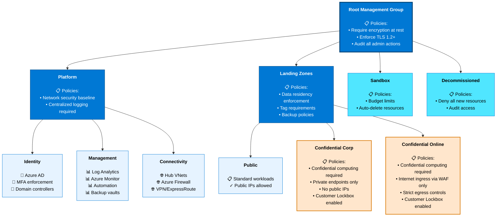
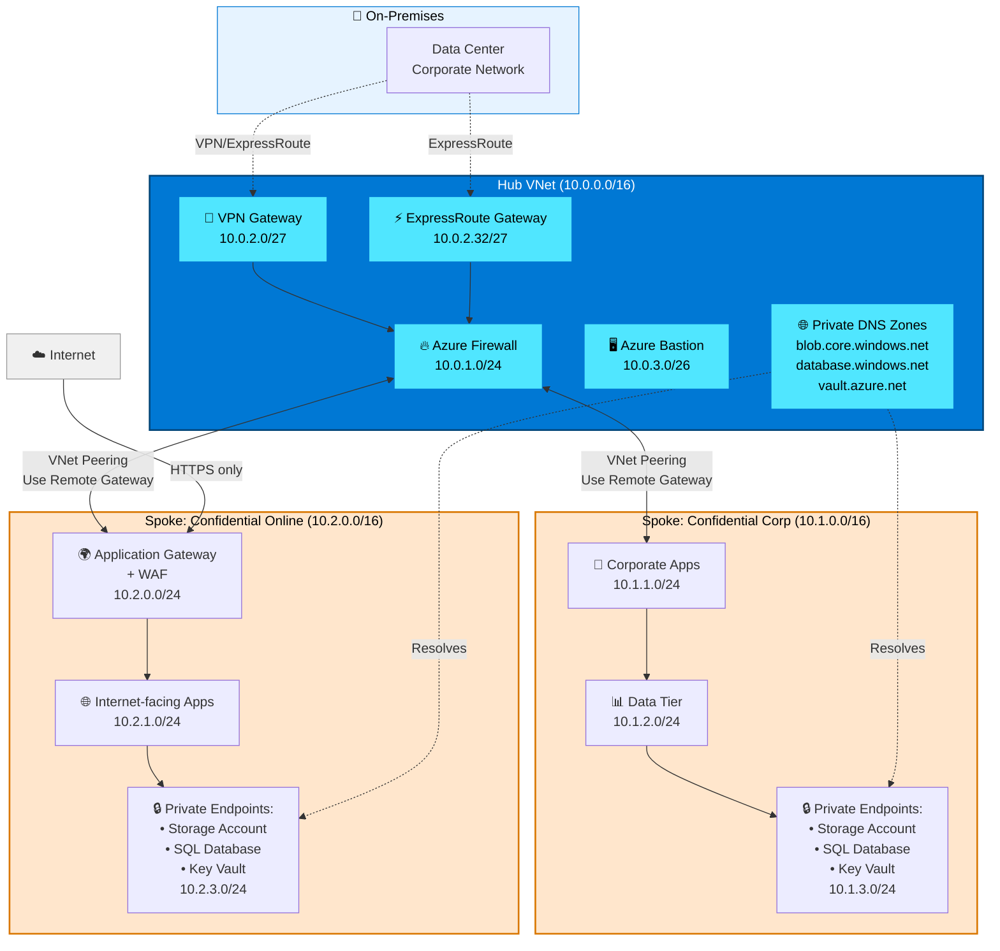

# Sovereign Landing Zone Deep Dive

## Introduction

The **Sovereign Landing Zone (SLZ)** is a variant of the Azure Landing Zone architecture, specifically designed to accelerate organizations with sovereignty requirements in meeting their specific needs. It builds on the Azure Cloud Adoption Framework's landing zone design principles while incorporating additional controls, resource organization patterns, and policy enforcement mechanisms to address sovereignty concerns in public cloud environments.

For organizations deploying workloads with data residency, operational sovereignty, or confidential computing requirements, the SLZ provides an opinionated, policy-driven architecture that enforces sovereignty controls at scale. This chapter explores the SLZ architecture in depth, examining its management group hierarchy, design area differences from standard Azure Landing Zones, network topology options, and implementation pathways.

## What is the Sovereign Landing Zone?

The Sovereign Landing Zone extends the Azure Landing Zone concept with sovereignty-specific capabilities. To understand the SLZ, it's essential to first understand the foundation it builds upon.

### Azure Landing Zones Recap

An **Azure Landing Zone** is an environment that accounts for scale, security governance, networking, and identity. It represents the "target state" of an Azure environment, designed using the principles and best practices of the Cloud Adoption Framework. Key characteristics include:

- **Modular design**: Separates platform resources (identity, networking, management) from application landing zones.
- **Policy-driven governance**: Uses Azure Policy to enforce organizational standards.
- **Subscription democratization**: Empowers application teams with subscriptions while maintaining central governance.
- **Separation of concerns**: Distinct management groups for platform services versus workload landing zones.

### How SLZ Extends Azure Landing Zones

The Sovereign Landing Zone **is not a different architecture** but an **extension** of the Azure Landing Zone with additional resource organization and policy controls tailored for sovereign workloads. Specifically:

- **Additional management groups**: The SLZ introduces `Confidential Corp` and `Confidential Online` management groups beneath the `Landing Zones` management group, segregating workloads by their confidentiality requirements.
- **Enhanced Azure Policies**: Additional policies enforce data residency, encryption requirements, network isolation, and confidential computing usage.
- **Confidential computing integration**: Native support for Azure Confidential VMs, confidential containers, and trusted execution environments (TEEs).
- **No architectural disruption**: Existing Azure Landing Zone design areas (billing, identity, network topology, platform automation) remain unchanged, ensuring compatibility with established patterns.

The SLZ is particularly suited for:

- **Government agencies** requiring data residency and operational controls.
- **Financial services** handling sensitive customer data with regulatory obligations.
- **Healthcare organizations** subject to HIPAA, HITECH, or equivalent regulations.
- **Critical infrastructure** providers needing defense-in-depth and reduced attack surface.
- **Multinational enterprises** operating in jurisdictions with strict data sovereignty laws.

## SLZ Architecture: Management Group Hierarchy

The SLZ adopts the same management group hierarchy as the Azure Landing Zone, with targeted additions to support sovereign workloads.

### Management Group Structure

```
Root Management Group
│
├── Platform
│   ├── Identity        → Identity resources (Azure AD, MFA)
│   ├── Management      → Monitoring, logging, automation
│   └── Connectivity    → Hub VNets, firewalls, gateways
│
├── Landing Zones
│   ├── Public          → Standard workloads (non-sovereign)
│   ├── Confidential Corp   → Sovereign corporate workloads (NEW)
│   └── Confidential Online → Sovereign internet-facing workloads (NEW)
│
├── Sandbox
│   └── Development and experimentation subscriptions
│
└── Decommissioned
    └── Subscriptions pending deletion
```



### Platform Management Groups

These management groups contain shared platform services and remain unchanged from the standard Azure Landing Zone:

#### Identity

Hosts identity-related resources such as domain controllers, Azure AD Connect servers, and identity management infrastructure. Policies applied here enforce secure identity practices, such as requiring multi-factor authentication (MFA) and Conditional Access.

#### Management

Contains centralized management and monitoring resources, including:

- **Azure Monitor** and Log Analytics workspaces for centralized logging.
- **Azure Automation** for runbooks and configuration management.
- **Azure Backup** vaults for disaster recovery.
- **Microsoft Defender for Cloud** and **Microsoft Sentinel** for security operations.

#### Connectivity

Houses networking infrastructure for hub-and-spoke or Virtual WAN topologies, including:

- **Hub VNet** with Azure Firewall or third-party NVAs.
- **VPN Gateway** and **ExpressRoute Gateway** for hybrid connectivity.
- **Azure Bastion** for secure RDP/SSH access.
- **Private DNS Zones** for name resolution across the environment.

### Landing Zone Management Groups

This is where the SLZ diverges from the standard Azure Landing Zone by introducing confidentiality-based segmentation.

#### Public Landing Zones

Standard workloads without sovereignty requirements. These subscriptions use default encryption, standard Azure regions, and do not enforce confidential computing. Policies applied here focus on cost management, tagging, and general security hygiene.

**Example workloads**:

- Development and testing environments.
- Non-sensitive SaaS applications.
- Public-facing websites with no personal data.

#### Confidential Corp Landing Zones (NEW)

Workloads requiring data sovereignty, operational controls, and potentially confidential computing. Subscriptions in this management group are subject to stricter policies:

- **Data residency enforcement**: Resources must be deployed in approved regions (e.g., EU regions only).
- **Encryption requirements**: Customer-managed keys (CMK) for Storage Accounts, SQL Databases, and VMs.
- **Network isolation**: Private endpoints required for all PaaS services; no public IP addresses allowed.
- **Confidential computing**: Optional but encouraged for sensitive workloads.

**Example workloads**:

- Financial trading systems.
- Healthcare patient data platforms.
- Government case management systems.
- HR systems with employee PII.

#### Confidential Online Landing Zones (NEW)

Similar to Confidential Corp, but designed for internet-facing sovereign workloads. These subscriptions require:

- **Inbound traffic via Azure Firewall or Application Gateway** with WAF.
- **Outbound traffic inspection** to prevent data exfiltration.
- **Confidential computing** for workloads processing sensitive data from external users.

**Example workloads**:

- Citizen-facing government portals.
- Healthcare patient portals.
- Financial services customer portals.

### Sandbox and Decommissioned

These management groups remain the same as in the standard Azure Landing Zone:

- **Sandbox**: For experimentation and learning, with relaxed policies but strict cost controls.
- **Decommissioned**: Holds subscriptions pending deletion, with policies to prevent resource creation.

## Design Area Differences: SLZ vs. Azure Landing Zone

The Azure Landing Zone defines eight design areas. The SLZ modifies two of these areas while leaving the others unchanged.

### Environment Design Areas

| Design Area | SLZ Difference |
|-------------|----------------|
| **Azure Billing and Active Directory Tenant** | No changes. |
| **Resource Organization** | **Addition of `Confidential Corp` and `Confidential Online` management groups** beneath `Landing Zones`. This enables workload segregation based on confidentiality requirements. |
| **Identity and Access Management** | No changes. Azure AD Conditional Access, PIM, and RBAC apply uniformly. |
| **Network Topology and Connectivity** | No changes. Hub & Spoke and Virtual WAN topologies remain supported. |

### Compliance Design Areas

| Design Area | SLZ Difference |
|-------------|----------------|
| **Security, Management & Governance** | **Additional Azure Policies** for data residency, encryption (at rest, in transit, and in use), confidential computing, and network isolation. See [Controls and Principles](03-controls-and-principles.md) for details. |
| **Platform Automation and DevOps** | No changes. ARM, Bicep, Terraform, and GitHub Actions/Azure DevOps remain the deployment mechanisms. |

### Why Minimal Changes?

The SLZ intentionally minimizes architectural disruption. Organizations that have already deployed Azure Landing Zones can **adopt the SLZ incrementally** by:

1. Creating the new `Confidential Corp` and `Confidential Online` management groups.
2. Applying sovereignty-specific Azure Policies to these management groups.
3. Migrating workloads with sovereignty requirements to subscriptions under these management groups.

This approach enables a **phased sovereignty adoption** without requiring a full platform re-architecture.

## Network Topology Options

The SLZ supports the same network topology options as the standard Azure Landing Zone, with additional security controls applied to sovereign workloads.

### Hub & Spoke Topology

In a **hub-and-spoke** topology, the hub VNet contains shared networking services (firewall, VPN/ExpressRoute gateways, Bastion), while spoke VNets contain application workloads.

**SLZ-specific considerations**:

- **Private endpoints required**: All PaaS services (Storage, SQL, Key Vault) in Confidential Corp and Confidential Online landing zones must use private endpoints terminating in spoke VNets.
- **No public IP addresses**: Azure Policy denies creation of public IPs in sovereign subscriptions.
- **Hub-based inspection**: All traffic between spokes and to/from on-premises flows through the hub firewall for inspection.
- **Private DNS zones**: Centralized private DNS zones in the hub resolve private endpoint FQDNs.



### Virtual WAN Topology

For organizations with global footprints or complex network requirements, **Azure Virtual WAN** provides a simplified hub-and-spoke topology with built-in routing and SD-WAN integration.

**SLZ-specific considerations**:

- **Secure Virtual Hub**: Azure Firewall deployed in the Virtual WAN hub for centralized traffic inspection.
- **Private endpoint support**: Spokes connect via Virtual Network Connections and use private endpoints for PaaS services.
- **Global transit**: Virtual WAN enables any-to-any connectivity (on-premises, branch, VNet) with centralized policy enforcement.

### Network Segmentation Strategy

The SLZ enforces **network segmentation** between workload tiers:

- **Public Landing Zones**: Standard network controls; public IP addresses allowed.
- **Confidential Corp Landing Zones**: Private endpoints only; no internet egress without inspection.
- **Confidential Online Landing Zones**: Internet ingress via Application Gateway/Front Door; strict egress controls.

Azure Firewall or third-party NVAs enforce **microsegmentation policies**, allowing only necessary traffic flows between landing zones. Network Security Groups (NSGs) provide defense-in-depth at the subnet level.

## Confidential Computing Integration

One of the SLZ's most powerful sovereignty capabilities is its integration with **Azure Confidential Computing**, which protects data while it is being processed (data in use), complementing encryption at rest and in transit.

### Confidential Computing in the SLZ

Confidential computing uses hardware-based **Trusted Execution Environments (TEEs)** to isolate workloads from the underlying hypervisor, cloud operator, and even privileged system administrators. Key technologies include:

- **AMD SEV-SNP (Secure Encrypted Virtualization - Secure Nested Paging)**: Encrypts VM memory and protects against hypervisor-based attacks.
- **Intel TDX (Trust Domain Extensions)**: Provides hardware isolation for confidential VMs with attestation.
- **Application enclaves (Intel SGX)**: Allows specific application code and data to run in isolated enclaves.

### Confidential VM Deployment

The SLZ encourages (and optionally enforces via Azure Policy) the use of **Confidential VMs** for workloads in the `Confidential Corp` and `Confidential Online` management groups. Confidential VMs provide:

- **Memory encryption**: VM memory is encrypted with keys managed by the CPU, inaccessible to the hypervisor.
- **Attestation**: Cryptographic proof that the VM is running on genuine hardware with expected firmware/software.
- **vTPM (virtual Trusted Platform Module)**: Enables BitLocker disk encryption tied to the VM's attested state.

**Policy enforcement example**:

```json
{
  "policyRule": {
    "if": {
      "allOf": [
        {"field": "type", "equals": "Microsoft.Compute/virtualMachines"},
        {"field": "location", "in": ["westeurope", "northeurope"]},
        {"field": "properties.securityProfile.securityType", "notEquals": "ConfidentialVM"}
      ]
    },
    "then": {
      "effect": "deny"
    }
  }
}
```

This policy **denies** creation of non-confidential VMs in specified regions, ensuring all workloads leverage confidential computing.

### Confidential Containers

For containerized workloads, the SLZ supports **confidential containers** on Azure Kubernetes Service (AKS), where container workloads run inside TEEs. This is explored further in the Controls & Principles chapter.

## Implementation Options

The Sovereign Landing Zone can be deployed using multiple Infrastructure-as-Code (IaC) mechanisms:

### 1. Azure Portal (GUI)

For proof-of-concept or small deployments, the SLZ can be configured manually via the Azure Portal. This approach is **not recommended for production** due to lack of repeatability and auditability.

### 2. Bicep / Azure Resource Manager (ARM)

Microsoft provides **Bicep modules** and ARM templates for deploying the SLZ, available in the [Azure/sovereign-landing-zone](https://github.com/Azure/sovereign-landing-zone) GitHub repository. Bicep is Azure-native and provides strong type-checking.

**Advantages**:

- Azure-native tooling with first-party support.
- Integrates with Azure DevOps and GitHub Actions.
- Declarative syntax with modular composition.

**Example deployment**:

```bash
az deployment mg create \
  --management-group-id "Contoso" \
  --location "westeurope" \
  --template-file slz-main.bicep \
  --parameters slz-parameters.json
```

### 3. Terraform

HashiCorp Terraform provides multicloud support and is widely adopted in enterprises with hybrid/multicloud strategies. Microsoft and the community maintain Terraform modules for deploying the SLZ.

**Advantages**:

- Multicloud consistency (can deploy to Azure, AWS, GCP with similar syntax).
- Strong ecosystem of modules and providers.
- State management and drift detection.

**Example deployment**:

```hcl
module "sovereign_landing_zone" {
  source  = "Azure/sovereign-landing-zone/azurerm"
  version = "~> 1.0"

  root_id             = "contoso"
  default_location    = "westeurope"
  enable_slz_policies = true
}
```

### 4. Azure Verified Modules (AVM)

Microsoft's **Azure Verified Modules** initiative provides tested, supported IaC modules for both Bicep and Terraform. AVM modules for the SLZ are under active development and will provide the highest level of confidence for production deployments.

## SLZ and Azure Local: Extending Sovereignty On-Premises

The Sovereign Landing Zone is not limited to Azure public cloud regions. Organizations can extend SLZ principles and controls to **Azure Local** (formerly Azure Stack HCI) for on-premises sovereign workloads.

### Azure Arc Integration

Azure Arc projects the Azure control plane to on-premises and multicloud environments, enabling:

- **Unified policy enforcement**: The same Azure Policies applied in the SLZ can be applied to Azure Arc-enabled servers and Kubernetes clusters running on Azure Local.
- **Consistent RBAC**: Azure AD identities and role assignments extend to on-premises resources.
- **Centralized monitoring**: Azure Monitor collects logs and metrics from on-premises workloads into the same Log Analytics workspace as cloud workloads.

### Hybrid Sovereignty Pattern

A common pattern is to run highly sensitive workloads on Azure Local (where the organization controls the hardware and facility), while running less-sensitive workloads in Azure public cloud with SLZ controls. Azure Arc provides the glue, enabling consistent governance across both environments.

**Example architecture**:

- **Azure Local (disconnected)**: Air-gapped environment for classified workloads, no connectivity to Azure.
- **Azure Local (connected via ExpressRoute)**: Sovereign on-premises environment with hybrid connectivity for management and monitoring.
- **Azure Confidential Corp Landing Zone**: Sovereign public cloud workloads with confidential computing and private endpoints.
- **Azure Public Landing Zone**: Standard public cloud workloads.

This **layered sovereignty approach** allows organizations to match control levels to workload requirements.

## Deployment Best Practices

When implementing the SLZ, consider these best practices:

1. **Start with a pilot**: Deploy the SLZ in a non-production management group hierarchy to validate policies and test workload deployment.
2. **Automate everything**: Use Bicep or Terraform to ensure repeatability and version control.
3. **Test policy impact**: Use Azure Policy's "Audit" effect before switching to "Deny" to understand compliance gaps.
4. **Plan network topology early**: Hub & Spoke vs. Virtual WAN decisions have long-term implications.
5. **Enable incremental migration**: Don't require all workloads to migrate to Confidential Landing Zones immediately; allow teams to adopt sovereignty controls as needed.
6. **Integrate with CI/CD**: Use Azure DevOps or GitHub Actions to deploy and update SLZ infrastructure.

## Conclusion

The Sovereign Landing Zone is a production-ready architecture for organizations that must meet sovereignty requirements while leveraging the scale, security, and innovation of Azure. By extending the proven Azure Landing Zone pattern with additional management groups and policies, the SLZ enables **sovereignty at scale** without disrupting existing Azure deployments.

In the next chapter, we'll explore the specific **controls and principles** that the SLZ enforces, including data residency policies, encryption controls, confidential computing, and network isolation mechanisms.

## References

- [Sovereign Landing Zone Overview](https://learn.microsoft.com/en-gb/azure/azure-sovereign-clouds/public/overview-sovereign-landing-zone)
- [SLZ Controls and Principles](https://learn.microsoft.com/en-gb/azure/azure-sovereign-clouds/public/overview-controls-principles)
- [SLZ Implementation Options](https://learn.microsoft.com/en-gb/azure/azure-sovereign-clouds/public/implementation-options)
- [Azure Landing Zone Architecture](https://learn.microsoft.com/en-us/azure/cloud-adoption-framework/ready/landing-zone/)
- [Azure Landing Zone Design Areas](https://learn.microsoft.com/en-us/azure/cloud-adoption-framework/ready/landing-zone/design-areas)

---

> **Next:** [Controls & Principles →](03-controls-and-principles.md)
