# Compliance Frameworks

## Introduction

In an era of increasingly complex and stringent regulatory requirements, **compliance** has evolved from a checkbox exercise to a continuous operational discipline. Compliance is the demonstration—through technical controls, processes, documentation, and audit evidence—that your architecture, operations, and data handling meet specific regulatory, legal, and industry standards.

For organizations operating across the **Azure Hybrid Continuum**, compliance presents unique challenges. Unlike purely cloud-native or purely on-premises environments, hybrid architectures span multiple deployment models, each with distinct compliance boundaries, control planes, and shared responsibility models. A workload running on Azure public cloud has a different compliance posture than the same workload running on Azure Local in a disconnected datacenter.

Azure provides one of the **broadest and deepest portfolios of compliance certifications** in the cloud industry, covering global, regional, industry-specific, and government standards. However, Azure's certifications are only the foundation. Organizations must understand how to leverage Azure's compliance capabilities, implement appropriate controls across their hybrid deployments, and generate the audit evidence required to demonstrate compliance to regulators, auditors, and customers.

This chapter explores key compliance frameworks relevant to hybrid and sovereign architectures, how compliance responsibilities shift across the continuum, and the tools and strategies for building a compliance-ready hybrid cloud environment.

---

## Key Compliance Frameworks for Hybrid and Sovereign Architectures

The following frameworks are particularly relevant to organizations building sovereign or hybrid architectures on Azure. Each framework addresses different regulatory domains, and many organizations must comply with multiple frameworks simultaneously.

### GDPR (General Data Protection Regulation) — European Union

**Jurisdiction**: European Union and European Economic Area (EEA)  
**Applicability**: Any organization processing personal data of EU/EEA residents, regardless of where the organization is located  
**Focus**: Data privacy, data subject rights, lawful processing, data protection by design

**Key requirements**:

- **Lawful basis for processing**: Organizations must have legal grounds (consent, contract, legitimate interest, etc.) to process personal data
- **Data subject rights**: Right to access, rectification, erasure ("right to be forgotten"), portability, and restriction of processing
- **Data Protection Impact Assessments (DPIAs)**: Required for high-risk processing activities
- **Breach notification**: Must notify supervisory authority within 72 hours of discovering a breach
- **Data Protection Officer (DPO)**: Required for public authorities and organizations engaged in large-scale processing of sensitive data
- **Cross-border data transfers**: Restricted unless adequacy decisions, Standard Contractual Clauses, or other mechanisms are in place

**Azure support**:

- Microsoft acts as **data processor** for Azure services; customers are **data controllers**
- **GDPR Data Subject Request (DSR)** tools enable customers to fulfill data subject rights
- **Azure Policy** can enforce data residency within EU regions
- **Microsoft Purview** supports data discovery, classification, and audit trails for GDPR compliance
- **EU Data Boundary** commitment minimizes data transfers outside the EU

!!! warning "Shared Responsibility for GDPR"
    While Azure provides technical controls and contractual commitments to support GDPR compliance, **customers are ultimately responsible** for ensuring their use of Azure complies with GDPR. This includes obtaining consent, conducting DPIAs, responding to DSRs, and implementing appropriate security measures.

### ISO 27001, ISO 27017, ISO 27018 — International Standards

**ISO 27001**: Information Security Management System (ISMS)  
**ISO 27017**: Cloud-specific security controls  
**ISO 27018**: Protection of personally identifiable information (PII) in public clouds

**Jurisdiction**: International  
**Applicability**: Any organization seeking to demonstrate information security maturity  
**Focus**: Risk management, security controls, continuous improvement

**Key requirements**:

- **ISMS framework**: Establish, implement, maintain, and continually improve information security management
- **Risk assessment**: Identify, analyze, and treat information security risks
- **Security controls**: Implement controls from Annex A (133 controls in ISO 27001:2022)
- **Audit and certification**: Third-party audits verify compliance

**Azure certifications**:

- Azure holds ISO 27001, 27017, and 27018 certifications across global regions
- Certifications cover Azure services, datacenters, and operational processes
- Customers can **inherit** Azure's ISO controls for their own certifications
- Scope: Azure public cloud, Azure Government, Azure Germany (historical), Azure China (operated by 21Vianet)

**Hybrid implications**:

- Azure Local and Arc-enabled servers extend Azure's security controls on-premises
- Customers implementing ISO 27001 for hybrid environments can leverage Azure's certifications as evidence for cloud components
- On-premises components require separate assessment and control implementation

### SOC 1, SOC 2, SOC 3 — Service Organization Control Reports

**SOC 1**: Financial reporting controls (SSAE 18/ISAE 3402)  
**SOC 2**: Security, availability, processing integrity, confidentiality, privacy (Trust Services Criteria)  
**SOC 3**: Public summary of SOC 2 findings

**Jurisdiction**: Primarily United States, but recognized globally  
**Applicability**: Service providers that handle customer data or processes  
**Focus**: Operational controls and audit evidence

**Key differences**:

- **SOC 1**: Relevant for organizations whose Azure usage affects financial reporting (e.g., financial services, payment processing)
- **SOC 2 Type I**: Controls designed appropriately at a point in time
- **SOC 2 Type II**: Controls operating effectively over a period (typically 6-12 months)

**Azure SOC reports**:

- Azure undergoes annual SOC 1, SOC 2, and SOC 3 audits
- Reports available via **Service Trust Portal** (requires Azure subscription)
- Covers Azure services, Microsoft support operations, and datacenter physical security

**Using Azure SOC reports**:

- Customers undergoing SOC audits can provide Azure SOC reports to their auditors
- Demonstrates that Azure, as a subservice organization, has appropriate controls
- Customers must still implement application and configuration-level controls

### FedRAMP — US Federal Risk and Authorization Management Program

**Jurisdiction**: United States federal government  
**Applicability**: Cloud service providers serving U.S. federal agencies  
**Focus**: Security authorization for cloud services

**FedRAMP impact levels**:

- **Low**: Data that is publicly available or has minimal impact if compromised
- **Moderate**: Data with limited confidentiality or integrity requirements (most common)
- **High**: Data requiring the highest levels of security (law enforcement, national security)

**Azure FedRAMP authorizations**:

- **Azure Government**: FedRAMP High authorization
- **Azure Public (US regions)**: FedRAMP High authorization for selected services
- **Azure Government DoD**: Additional DoD Cloud Computing Security Requirements Guide (SRG) Impact Level 5 authorization

**Compliance requirements**:

- Based on NIST SP 800-53 security controls
- Continuous monitoring and annual assessments
- Requires sponsoring federal agency for Authority to Operate (ATO)

**Hybrid considerations**:

- Azure Local can be used to meet data locality requirements for federal workloads that cannot be hosted in cloud
- Azure Arc extends Azure Government compliance controls to on-premises infrastructure
- Customers must ensure on-premises components meet FedRAMP controls where applicable

### HIPAA and HITECH — Healthcare Data Protection (United States)

**Jurisdiction**: United States  
**Applicability**: Healthcare providers, health plans, healthcare clearinghouses, and their business associates  
**Focus**: Protection of Protected Health Information (PHI)

**Key requirements**:

- **Administrative safeguards**: Policies, procedures, workforce training
- **Physical safeguards**: Datacenter security, device controls
- **Technical safeguards**: Encryption, access controls, audit logging
- **Breach notification**: Must notify affected individuals, HHS, and potentially media

**Azure HIPAA compliance**:

- Microsoft signs **Business Associate Agreements (BAAs)** with customers
- Azure services support HIPAA/HITECH requirements when properly configured
- **Azure confidential computing** provides additional protection for PHI in use
- **Azure Health Data Services** (FHIR, DICOM) are designed for healthcare workloads

!!! caution "Configuration Required"
    Azure provides HIPAA-compliant infrastructure, but **customers must configure services appropriately**. For example, enabling encryption, implementing access controls, and enabling audit logging are customer responsibilities.

### PCI DSS — Payment Card Industry Data Security Standard

**Jurisdiction**: Global  
**Applicability**: Organizations that store, process, or transmit credit card data  
**Focus**: Cardholder data protection

**Key requirements** (12 requirements across 6 control objectives):

1. Build and maintain a secure network
2. Protect cardholder data (encryption at rest and in transit)
3. Maintain a vulnerability management program
4. Implement strong access control measures
5. Regularly monitor and test networks
6. Maintain an information security policy

**PCI DSS levels**:

- **Level 1**: Over 6 million transactions annually (most stringent)
- **Level 2**: 1-6 million transactions
- **Level 3**: 20,000-1 million e-commerce transactions
- **Level 4**: Fewer than 20,000 e-commerce transactions

**Azure PCI DSS compliance**:

- Azure is certified as PCI DSS 3.2.1 Level 1 Service Provider
- Microsoft maintains compliance through annual Qualified Security Assessor (QSA) audits
- **Attestation of Compliance (AOC)** available via Service Trust Portal

**Responsibility for PCI DSS**:

- Azure provides compliant infrastructure
- **Customers are responsible** for their applications and data handling
- Merchants must complete Self-Assessment Questionnaires (SAQs) or undergo QSA audits based on transaction volume and deployment model

**Hybrid PCI DSS**:

- Cardholder data environments (CDEs) can span Azure and on-premises
- **Network segmentation** is critical to minimize PCI DSS scope
- Azure ExpressRoute or VPN provides secure connectivity for hybrid CDEs

### C5 — Cloud Computing Compliance Criteria Catalogue (Germany)

**Jurisdiction**: Germany  
**Applicability**: Cloud service providers serving German public sector and regulated industries  
**Focus**: Cloud security and transparency

**Background**:

- Developed by Germany's Federal Office for Information Security (BSI)
- Builds on ISO 27001 with additional cloud-specific requirements
- Addresses concerns about non-EU cloud providers and data sovereignty

**Additional requirements beyond ISO 27001**:

- **Transparency**: Detailed disclosure of subprocessors, data locations, and data access
- **Portability**: Customers must be able to migrate data and workloads
- **Auditability**: Right to audit cloud provider processes
- **Data isolation**: Multi-tenancy security

**Azure C5 attestation**:

- Azure has achieved C5 attestation for Azure Germany and EU regions
- Demonstrates compliance with German data sovereignty expectations
- Annual re-attestation by independent auditors

### ENS (Esquema Nacional de Seguridad) — Spain

**Jurisdiction**: Spain  
**Applicability**: Spanish public sector organizations  
**Focus**: Information security for government systems

**ENS security levels**:

- **Basic**: Low risk
- **Medium**: Moderate risk
- **High**: High risk (sensitive government data)

**Azure ENS compliance**:

- Azure holds ENS High certification for Spanish regions
- Enables Spanish public sector adoption of Azure
- Covers security controls across physical, logical, and organizational dimensions

### DORA (Digital Operational Resilience Act) — European Union

**Jurisdiction**: European Union  
**Applicability**: Financial entities (banks, investment firms, payment service providers, crypto-asset service providers)  
**Effective date**: January 2025  
**Focus**: ICT risk management, incident reporting, operational resilience testing, third-party risk

**Key requirements**:

- **ICT risk management framework**: Comprehensive governance and risk management
- **Incident reporting**: Mandatory reporting of major ICT-related incidents to supervisory authorities
- **Digital operational resilience testing**: Regular testing, including threat-led penetration testing (TLPT)
- **Third-party risk management**: Due diligence and oversight of ICT service providers (including cloud providers)
- **Contractual arrangements**: Specific clauses required in contracts with critical ICT third-party service providers

**Azure support for DORA**:

- Microsoft is classified as a "critical ICT third-party service provider" under DORA
- Enhanced contractual terms, audit rights, and incident notification commitments
- Azure's existing operational resilience capabilities (availability zones, disaster recovery, monitoring) support DORA requirements
- Azure Policy and Microsoft Defender for Cloud help customers monitor resilience posture

!!! info "DORA and NIS2"
    DORA complements the **NIS2 Directive** (Network and Information Security Directive), which applies more broadly across critical infrastructure sectors. Together, they represent a comprehensive EU approach to operational resilience and cybersecurity.

### NIS2 Directive — European Union

**Jurisdiction**: European Union  
**Applicability**: Essential and important entities across 18 sectors (energy, transport, banking, healthcare, digital infrastructure, etc.)  
**Effective date**: October 2024 (member states must transpose into national law)  
**Focus**: Cybersecurity risk management, incident reporting, supply chain security

**Key requirements**:

- **Cybersecurity risk management**: Implement appropriate technical and organizational measures
- **Incident notification**: Report significant incidents to national authorities within 24 hours
- **Supply chain security**: Assess cybersecurity risks from suppliers and service providers
- **Vulnerability disclosure**: Coordinate vulnerability disclosure policies
- **Management accountability**: Management bodies can be held personally liable for non-compliance

**Azure support for NIS2**:

- Azure's security baselines and Defender for Cloud align with NIS2 cybersecurity measures
- Incident detection and response capabilities support notification requirements
- Azure Arc enables consistent security policies across hybrid infrastructure
- Microsoft Sentinel provides SIEM capabilities for incident correlation and reporting

---

## Azure Compliance Offerings: Scope and Availability

Azure maintains **over 100 compliance certifications and attestations**, more than any other cloud provider. These span:

- **Global standards**: ISO 27001, SOC 2, CSA STAR
- **Regional regulations**: GDPR (EU), PDPA (Singapore), LGPD (Brazil), POPIA (South Africa)
- **Industry-specific**: HIPAA (healthcare), PCI DSS (payments), FDA 21 CFR Part 11 (pharmaceutical), GxP (life sciences)
- **Government**: FedRAMP (US), IRAP (Australia), MTCS (Singapore), ENS (Spain), C5 (Germany), G-Cloud (UK)

### Service-Specific Compliance

Not all Azure services have the same compliance scope. Compliance certifications typically apply to:

- **Generally Available (GA) services**: Fully supported, production-ready
- **Preview services**: May not yet be in compliance scope
- **Regional variations**: Some services available only in specific regions (e.g., Azure Government)

**Examples**:

- **Azure SQL Database**: Covered by most compliance frameworks (FedRAMP, HIPAA, PCI DSS, ISO 27001)
- **Azure OpenAI Service**: Expanding compliance scope; check Service Trust Portal for current status
- **Azure Arc**: Extends compliance controls but requires customer-managed infrastructure compliance

### Service Trust Portal: Your Compliance Hub

The **Microsoft Service Trust Portal** ([https://servicetrust.microsoft.com](https://servicetrust.microsoft.com)) is the central repository for Azure compliance documentation:

- **Audit reports**: SOC, ISO, FedRAMP reports
- **Data protection documentation**: GDPR resources, data processing addenda
- **Regional compliance**: Country/region-specific certifications
- **Industry compliance**: Healthcare, financial services, government resources

**Access**:

- Requires an Azure, Microsoft 365, or Dynamics 365 subscription
- Some documents require non-disclosure agreement (NDA) acceptance

---

## Shared Responsibility Model for Compliance

The **shared responsibility model** is the foundation of cloud compliance. In any cloud deployment, certain responsibilities belong to the cloud provider (Microsoft), others to the customer (your organization), and some are shared.

### Traditional Shared Responsibility (Public Cloud)

In Azure public cloud:

| **Responsibility Area**       | **Microsoft** | **Customer** |
|-------------------------------|---------------|--------------|
| Physical datacenter security  | ✅ Microsoft  |              |
| Network infrastructure        | ✅ Microsoft  |              |
| Hypervisor security           | ✅ Microsoft  |              |
| Host operating system         | ✅ Microsoft  |              |
| Virtual machine OS            |               | ✅ Customer  |
| Applications                  |               | ✅ Customer  |
| Data                          |               | ✅ Customer  |
| Identity and access           | 🔀 Shared     | 🔀 Shared    |
| Network controls (NSGs, etc.) |               | ✅ Customer  |

**Examples of shared responsibility**:

- **Identity and access management**: Microsoft secures Azure AD infrastructure; customers configure access policies, MFA, Conditional Access
- **Network security**: Microsoft provides NSGs, firewalls, DDoS protection; customers configure and manage rules

### Shared Responsibility Variations Across Service Models

Responsibility shifts based on service model:

**Infrastructure as a Service (IaaS)** (e.g., Azure VMs):

- Customer manages OS, applications, data, network configuration
- Microsoft manages physical infrastructure, hypervisor, datacenter

**Platform as a Service (PaaS)** (e.g., Azure SQL Database, App Service):

- Customer manages applications and data
- Microsoft manages OS, patching, network stack, runtime

**Software as a Service (SaaS)** (e.g., Microsoft 365, Dynamics 365):

- Customer manages data and access policies
- Microsoft manages application, infrastructure, and operations

### Shared Responsibility in Hybrid Environments

Hybrid deployments introduce additional complexity:

**Azure Arc-enabled servers**:

- **Customer responsibility increases**: Customers manage physical security, hardware, OS, patching (though Azure Arc can automate patching)
- **Microsoft provides**: Arc control plane, policy enforcement, monitoring tools
- **Compliance**: Customers must demonstrate compliance for on-premises infrastructure; Azure Arc extends visibility but doesn't transfer responsibility

**Azure Local** (on-premises):

- **Customer responsible for**:
    - Physical security of datacenter
    - Hardware procurement and maintenance
    - Network infrastructure
    - OS and hypervisor updates (facilitated by Azure Local orchestration)
- **Microsoft provides**:
    - Azure Local software stack
    - Validation and update orchestration
    - Azure Arc management plane (optional)
    - Azure services running locally
- **Compliance**: Customers have **full responsibility** for on-premises compliance; Azure Local software is validated, but deployment and operations are customer-managed

### Disconnected and Air-Gapped Environments

In fully disconnected scenarios:

- **Customer manages all aspects**: Security, updates, monitoring, incident response
- **Microsoft provides**: Software and documentation; support is limited to "sneakernet" updates and remote diagnostics (if allowed)
- **Compliance**: Customer has complete responsibility and complete control

```mermaid
graph TB
    subgraph Legend["Responsibility Legend"]
        direction LR
        MSResp["🟦 Microsoft Responsibility"]
        SharedResp["🟨 Shared Responsibility"]
        CustResp["🟧 Customer Responsibility"]
    end
    
    subgraph PublicCloud["☁️ Azure Public Cloud"]
        direction TB
        PC_App["Applications & Data"]
        PC_Runtime["Runtime & Middleware"]
        PC_OS["Operating System"]
        PC_VM["Virtualization"]
        PC_Infra["Infrastructure"]
        PC_Physical["Physical Security"]
        
        PC_App --> PC_Runtime --> PC_OS --> PC_VM --> PC_Infra --> PC_Physical
    end
    
    subgraph HybridArc["🔄 Hybrid with Azure Arc"]
        direction TB
        Arc_App["Applications & Data"]
        Arc_Runtime["Runtime & Middleware"]
        Arc_OS["Operating System"]
        Arc_VM["Virtualization"]
        Arc_Infra["Infrastructure"]
        Arc_Physical["Physical Security"]
        
        Arc_App --> Arc_Runtime --> Arc_OS --> Arc_VM --> Arc_Infra --> Arc_Physical
    end
    
    subgraph AzLocalConn["🔌 Azure Local Connected"]
        direction TB
        Conn_App["Applications & Data"]
        Conn_Runtime["Runtime & Middleware"]
        Conn_OS["Operating System"]
        Conn_VM["Virtualization"]
        Conn_Infra["Infrastructure"]
        Conn_Physical["Physical Security"]
        
        Conn_App --> Conn_Runtime --> Conn_OS --> Conn_VM --> Conn_Infra --> Conn_Physical
    end
    
    subgraph AzLocalDisc["🔒 Azure Local Disconnected"]
        direction TB
        Disc_App["Applications & Data"]
        Disc_Runtime["Runtime & Middleware"]
        Disc_OS["Operating System"]
        Disc_VM["Virtualization"]
        Disc_Infra["Infrastructure"]
        Disc_Physical["Physical Security"]
        
        Disc_App --> Disc_Runtime --> Disc_OS --> Disc_VM --> Disc_Infra --> Disc_Physical
    end
    
    PublicCloud -.->|"Increasing Customer Control"| HybridArc
    HybridArc -.->|"Increasing Customer Control"| AzLocalConn
    AzLocalConn -.->|"Increasing Customer Control"| AzLocalDisc
    
    style PublicCloud fill:#e6f3ff,stroke:#0078d4,color:#000,stroke-width:2px
    style HybridArc fill:#e6f3ff,stroke:#0078d4,color:#000,stroke-width:2px
    style AzLocalConn fill:#ffe6cc,stroke:#d97700,color:#000,stroke-width:2px
    style AzLocalDisc fill:#ffe6cc,stroke:#d97700,color:#000,stroke-width:2px
    
    style PC_App fill:#ff9933,stroke:#d97700,color:#000
    style PC_Runtime fill:#ffa500,stroke:#d97700,color:#000
    style PC_OS fill:#ffd700,stroke:#d97700,color:#000
    style PC_VM fill:#50e6ff,stroke:#0078d4,color:#000
    style PC_Infra fill:#0078d4,stroke:#004578,color:#fff
    style PC_Physical fill:#004578,stroke:#002952,color:#fff
    
    style Arc_App fill:#ff9933,stroke:#d97700,color:#000
    style Arc_Runtime fill:#ff9933,stroke:#d97700,color:#000
    style Arc_OS fill:#ff9933,stroke:#d97700,color:#000
    style Arc_VM fill:#ffd700,stroke:#d97700,color:#000
    style Arc_Infra fill:#ffd700,stroke:#d97700,color:#000
    style Arc_Physical fill:#ff9933,stroke:#d97700,color:#000
    
    style Conn_App fill:#ff9933,stroke:#d97700,color:#000
    style Conn_Runtime fill:#ff9933,stroke:#d97700,color:#000
    style Conn_OS fill:#ff9933,stroke:#d97700,color:#000
    style Conn_VM fill:#ff9933,stroke:#d97700,color:#000
    style Conn_Infra fill:#ff9933,stroke:#d97700,color:#000
    style Conn_Physical fill:#ff9933,stroke:#d97700,color:#000
    
    style Disc_App fill:#ff9933,stroke:#d97700,color:#000
    style Disc_Runtime fill:#ff9933,stroke:#d97700,color:#000
    style Disc_OS fill:#ff9933,stroke:#d97700,color:#000
    style Disc_VM fill:#ff9933,stroke:#d97700,color:#000
    style Disc_Infra fill:#ff9933,stroke:#d97700,color:#000
    style Disc_Physical fill:#ff9933,stroke:#d97700,color:#000
    
    style MSResp fill:#0078d4,stroke:#004578,color:#fff
    style SharedResp fill:#ffd700,stroke:#d97700,color:#000
    style CustResp fill:#ff9933,stroke:#d97700,color:#000
```

---

## Building a Compliance Evidence Strategy for Hybrid Deployments

Demonstrating compliance requires more than implementing controls—it requires **evidence**. Auditors, regulators, and customers require documented proof that controls are in place and operating effectively.

### Evidence Collection Across the Hybrid Continuum

**Public Cloud (Azure)**:

- **Azure Activity Logs**: Records control plane operations (resource creation, deletion, configuration changes)
- **Azure Monitor Logs**: Collects data plane activity (application logs, performance metrics)
- **Microsoft Defender for Cloud**: Security posture, vulnerability assessments, regulatory compliance dashboard
- **Azure Policy compliance reports**: Demonstrates policy enforcement and exceptions
- **Service Trust Portal audit reports**: Microsoft's third-party audit reports (SOC, ISO, FedRAMP)

**Hybrid with Azure Arc**:

- **Arc-enabled servers**: Extend Azure Activity Logs, Azure Monitor, and Azure Policy to on-premises
- **Centralized logging**: Azure Monitor Log Analytics aggregates logs from cloud and on-premises
- **Unified compliance dashboard**: Defender for Cloud shows compliance posture across hybrid estate

**Azure Local (On-Premises)**:

- **Azure Local logs**: Event logs, health logs, update logs
- **Arc integration (if connected)**: Flows logs to Azure Monitor for centralized visibility
- **Disconnected scenarios**: Local log retention, SIEM integration, or manual export for audit evidence

### Microsoft Purview for Audit and Compliance

**Microsoft Purview Audit** provides unified audit logging across Microsoft 365, Azure, and on-premises (via Arc):

- **Unified audit log**: Centralized repository of user and admin activities
- **Audit log search**: Query audit logs for compliance investigations
- **Audit retention**: Long-term retention for regulatory requirements (up to 10 years with add-ons)
- **Data governance**: Track data access, classification changes, and policy violations

### Regulatory Compliance Dashboard in Microsoft Defender for Cloud

**Microsoft Defender for Cloud** includes a **Regulatory Compliance dashboard** that continuously assesses your Azure and hybrid environment against compliance standards:

**Built-in standards**:

- Azure Security Benchmark (ASB)
- PCI DSS 3.2.1
- ISO 27001
- SOC 2
- NIST SP 800-53 (FedRAMP)
- HIPAA/HITECH
- GDPR
- CIS Microsoft Azure Foundations Benchmark

**Features**:

- **Real-time compliance posture**: Shows percentage compliance with each standard
- **Control assessment**: Detailed assessment of each control requirement
- **Remediation guidance**: Step-by-step instructions to address non-compliant resources
- **Export to CSV/PDF**: Generate compliance reports for auditors

**Hybrid support**:

- Arc-enabled servers and Azure Local resources appear in the dashboard
- Enables unified compliance reporting across cloud and on-premises

### Azure Policy for Compliance Automation

**Azure Policy** enforces organizational standards and compliance requirements through code:

**Built-in compliance initiatives**:

- **Azure Security Benchmark**: Microsoft's security best practices
- **FedRAMP High**: NIST SP 800-53 controls
- **HIPAA HITRUST 9.2**: Healthcare compliance
- **ISO 27001:2013**: Information security controls
- **PCI DSS v3.2.1**: Payment card data protection

**How it works**:

1. **Assign initiative**: Assign a compliance initiative (e.g., "NIST SP 800-53 Rev. 5") to a subscription or management group
2. **Continuous assessment**: Azure Policy evaluates resources against initiative policies
3. **Compliance reporting**: View compliance percentage and non-compliant resources
4. **Remediation**: Automatic or manual remediation of non-compliant resources

**Hybrid compliance**:

- Azure Policy applies to Arc-enabled servers and Azure Local via Arc
- Enables consistent policy enforcement across on-premises and cloud

!!! example "Policy-Driven Compliance"
    A financial services company assigns the PCI DSS v3.2.1 initiative to all subscriptions hosting cardholder data environments. Azure Policy continuously checks that encryption is enabled, logging is configured, and network segmentation is in place. Non-compliant resources are automatically flagged, and security teams receive alerts to remediate or document exceptions.

### Continuous Compliance Monitoring

Compliance is not a one-time exercise—it requires **continuous monitoring**:

**Monitoring strategy**:

1. **Establish baseline**: Assess current compliance posture using Defender for Cloud and Azure Policy
2. **Implement controls**: Remediate non-compliant resources and enforce policies
3. **Continuous monitoring**: Automated assessments detect drift and new risks
4. **Alerting**: Security teams notified of compliance violations
5. **Periodic review**: Regular audits and gap assessments (quarterly or annually)
6. **Evidence collection**: Continuous collection and retention of audit logs

**Tools for continuous compliance**:

- **Microsoft Defender for Cloud**: Real-time compliance posture
- **Azure Policy**: Continuous policy evaluation
- **Azure Monitor**: Alerting on security and compliance events
- **Microsoft Sentinel**: SIEM for security event correlation and compliance reporting
- **Microsoft Purview Compliance Manager**: Compliance assessments and action items (primarily for Microsoft 365 but extends to Azure)

---

## Compliance Challenges in Hybrid Environments

While hybrid architectures provide flexibility and sovereignty, they introduce compliance challenges:

### Challenge 1: Fragmented Visibility

**Problem**: Compliance evidence scattered across cloud provider portals, on-premises systems, and third-party tools.

**Solution**:

- Use **Azure Arc** to extend Azure control plane to on-premises
- **Centralize logging** in Azure Monitor Log Analytics or Azure Sentinel
- Implement **unified compliance dashboards** (Defender for Cloud, Microsoft Purview)

### Challenge 2: Inconsistent Policy Enforcement

**Problem**: Different policies and configurations across cloud and on-premises environments.

**Solution**:

- Use **Azure Policy** for consistent policy enforcement via Arc
- Implement **Infrastructure as Code (IaC)** (Bicep, Terraform) for repeatable, compliant deployments
- **Policy as Code**: Store policies in Git, version-controlled and auditable

### Challenge 3: Shared Responsibility Ambiguity

**Problem**: Unclear boundaries between Microsoft and customer responsibilities, especially in hybrid scenarios.

**Solution**:

- **Document responsibility matrix**: Clearly define who is responsible for each compliance control
- **Contract and SLA review**: Understand Microsoft's contractual commitments (DPA, BAA, SLA)
- **Third-party assessments**: Engage auditors to validate hybrid compliance posture

### Challenge 4: Audit Complexity

**Problem**: Auditors unfamiliar with hybrid and sovereign architectures, requiring extensive documentation.

**Solution**:

- **Proactive audit preparation**: Maintain compliance evidence repository
- **Leverage Microsoft audit reports**: Provide SOC, ISO reports from Service Trust Portal
- **Audit readiness workshops**: Educate auditors on Azure compliance capabilities and hybrid model

### Challenge 5: Regulatory Evolution

**Problem**: Regulations continuously evolve (NIS2, DORA, evolving GDPR interpretations).

**Solution**:

- **Stay informed**: Subscribe to Azure compliance updates, regulatory newsletters
- **Engage legal and compliance teams**: Regularly review regulatory changes with legal counsel
- **Flexible architectures**: Design for compliance evolution (e.g., encryption key management strategies that can adapt)

---

## Summary: Compliance Across the Hybrid Continuum

Compliance is a continuous journey, not a destination. As organizations adopt hybrid cloud strategies spanning public Azure, Arc-enabled infrastructure, and Azure Local, compliance becomes both more critical and more complex:

- **Compliance frameworks** range from global standards (ISO 27001, SOC 2) to regional regulations (GDPR, FedRAMP) to industry-specific requirements (HIPAA, PCI DSS, DORA, NIS2)
- **Azure's compliance portfolio** is the broadest in the industry, with over 100 certifications and attestations covering diverse jurisdictions and industries
- **Shared responsibility** shifts across the hybrid continuum: Microsoft manages more in public cloud PaaS; customers manage more in IaaS, Arc-enabled, and Azure Local scenarios
- **Compliance evidence** requires continuous collection across Azure Activity Logs, Defender for Cloud, Azure Policy, and Microsoft Purview
- **Hybrid compliance** introduces challenges—fragmented visibility, inconsistent policy enforcement, shared responsibility ambiguity—but also opportunities for unified governance via Azure Arc and Azure Policy
- **Tools for hybrid compliance** include Defender for Cloud regulatory compliance dashboard, Azure Policy compliance initiatives, centralized logging in Azure Monitor, and SIEM with Microsoft Sentinel
- **Continuous compliance monitoring** is essential: establish baselines, implement controls, monitor continuously, alert on violations, and collect evidence for audits

Organizations must approach compliance as a **strategic enabler**, not a constraint. By leveraging Azure's compliance capabilities, implementing consistent policies across hybrid environments, and maintaining comprehensive audit evidence, organizations can demonstrate compliance to regulators while achieving the sovereignty, resilience, and flexibility that hybrid cloud architectures provide.

The compliance journey requires partnership between technical teams (implementing controls), security teams (monitoring and responding), legal and compliance teams (interpreting regulations), and Microsoft (providing compliant infrastructure and audit evidence). With the right strategy, tools, and governance, hybrid compliance is not only achievable—it becomes a competitive advantage.

---

## References

- [Azure Compliance Documentation](https://learn.microsoft.com/en-us/azure/compliance/)
- [Microsoft Trust Center](https://www.microsoft.com/en-us/trust-center)
- [Azure Compliance Offerings](https://learn.microsoft.com/en-us/azure/compliance/offerings/)
- [Service Trust Portal](https://servicetrust.microsoft.com)
- [Regulatory Compliance in Defender for Cloud](https://learn.microsoft.com/en-us/azure/defender-for-cloud/regulatory-compliance-dashboard)
- [GDPR on Azure](https://learn.microsoft.com/en-us/compliance/regulatory/gdpr)
- [Azure Policy Compliance](https://learn.microsoft.com/en-us/azure/governance/policy/how-to/get-compliance-data)
- [Microsoft Purview Compliance Manager](https://learn.microsoft.com/en-us/microsoft-365/compliance/compliance-manager)

---

> **Next:** [Part 4 — Architecture Patterns →](../04-architecture-patterns/README.md)
