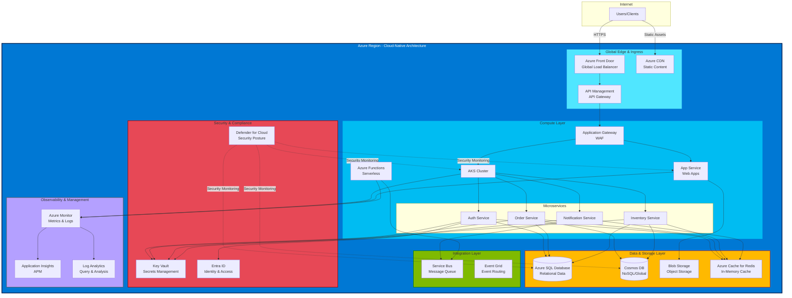

# Cloud-Native Pattern

## Introduction

The cloud-native pattern represents the starting point of the Azure Hybrid Continuum — workloads designed to run entirely in Azure public cloud, leveraging managed Platform-as-a-Service (PaaS) offerings and cloud-native design principles. This pattern maximizes operational efficiency, elasticity, and global reach by delegating infrastructure management to Azure while maintaining full application control.

For organizations beginning their cloud journey or operating workloads without data sovereignty or air-gap requirements, cloud-native provides the path of least operational overhead. Understanding this baseline pattern is essential for planning how workloads can later transition along the continuum toward hybrid or sovereign deployment models as requirements evolve.

!!! info "Pattern Summary"
    **Deployment Model:** Fully cloud-hosted on Azure  
    **Connectivity:** Persistent internet connectivity required  
    **Management Plane:** Azure Portal, Azure Resource Manager  
    **Identity:** Microsoft Entra ID (Azure AD)  
    **Target Use Cases:** SaaS applications, global web applications, microservices architectures

## Pattern Definition

Cloud-native architecture on Azure refers to applications purpose-built to exploit the unique characteristics of cloud platforms:

- **Elastic scalability:** Horizontal scaling in response to demand
- **Managed infrastructure:** Azure manages compute, storage, and network fabric
- **Distributed by design:** Microservices architectures with independent deployability
- **API-first:** Services communicate via well-defined REST/gRPC interfaces
- **DevOps-enabled:** Continuous integration and deployment with infrastructure as code

This pattern emphasizes **managed services over self-managed infrastructure**. Rather than provisioning virtual machines and installing middleware, cloud-native workloads consume services like Azure Kubernetes Service (AKS), Azure SQL Database, Azure Cosmos DB, and Azure Functions where Azure handles patching, high availability, and disaster recovery.

## When to Use Cloud-Native

The cloud-native pattern is the optimal choice when:

✅ **No data sovereignty constraints:** Data may reside in Azure regions globally  
✅ **Internet connectivity is reliable:** Applications and users can reach Azure endpoints  
✅ **Maximum agility required:** Fast iteration, frequent deployments, experimentation  
✅ **Global distribution needed:** Multi-region deployment for low-latency user access  
✅ **Unpredictable scale:** Workloads with variable or elastic demand patterns  
✅ **Small operational teams:** Limited staff to manage infrastructure and middleware

Cloud-native is **not suitable** when:

❌ Data residency regulations mandate on-premises or sovereign cloud deployment  
❌ Air-gapped or disconnected operations are required (military, classified workloads)  
❌ Latency to Azure regions exceeds application tolerance (< 5ms requirements)  
❌ Regulatory frameworks prohibit third-party infrastructure (some financial services)

## Key Azure Services

### Compute Services

| Service | Description | Use Case |
|---------|-------------|----------|
| **Azure Kubernetes Service (AKS)** | Managed Kubernetes for container orchestration | Microservices, stateless applications, CI/CD pipelines |
| **Azure Container Apps** | Serverless container platform with automatic scaling | Event-driven workloads, APIs, background jobs |
| **Azure App Service** | Fully managed PaaS for web apps and APIs | Web frontends, REST APIs, mobile backends |
| **Azure Functions** | Event-driven serverless compute | Data processing, webhooks, scheduled tasks |
| **Azure Container Instances** | Run containers without managing servers | Batch jobs, burst scaling, task automation |

### Data Services

| Service | Description | Use Case |
|---------|-------------|----------|
| **Azure SQL Database** | Managed relational database (SQL Server) | Transactional workloads, ERP systems, LOB applications |
| **Azure Cosmos DB** | Globally distributed, multi-model NoSQL database | Session stores, user profiles, real-time analytics |
| **Azure Database for PostgreSQL** | Managed PostgreSQL with high availability | Open-source database workloads, analytics |
| **Azure Cache for Redis** | Managed in-memory cache | Session state, leaderboards, real-time analytics |
| **Azure Blob Storage** | Massively scalable object storage | Media files, logs, backups, data lakes |

### Messaging and Integration

| Service | Description | Use Case |
|---------|-------------|----------|
| **Azure Service Bus** | Enterprise message broker with queues and topics | Asynchronous processing, decoupling services |
| **Azure Event Hubs** | Big data streaming and event ingestion | Telemetry, log aggregation, real-time analytics |
| **Azure Event Grid** | Event routing for event-driven architectures | Serverless automation, reactive workflows |
| **Azure Queue Storage** | Simple queue service for message passing | Work queue patterns, task distribution |

### Identity and Security

| Service | Description | Use Case |
|---------|-------------|----------|
| **Microsoft Entra ID (Azure AD)** | Cloud identity and access management | User authentication, SSO, MFA |
| **Azure Key Vault** | Secrets, keys, and certificate management | Credential storage, encryption key management |
| **Azure Application Gateway** | Web application firewall and load balancer | Web app protection, SSL termination |
| **Azure Front Door** | Global CDN and web application acceleration | Multi-region load balancing, DDoS protection |

## Cloud-Native Design Principles

### 1. Microservices Architecture

Decompose applications into small, independently deployable services, each responsible for a single business capability. Microservices enable:

- Independent scaling of high-demand components
- Technology diversity (different languages/frameworks per service)
- Fault isolation (failures don't cascade across entire application)
- Team autonomy (separate teams own separate services)

**Azure Implementation:** Deploy microservices to AKS or Azure Container Apps, use Service Bus for inter-service communication, and Azure API Management for external API exposure.

!!! example "🔗 Working Example: Contoso Insurance Sample Application"
    See the complete working implementation of this architecture at
    [ContosoInsurances-NativeToLocal](https://github.com/EmeaAppGbb/ContosoInsurances-NativeToLocal) —
    a .NET 8 enterprise application demonstrating cloud-native AKS deployment with Blazor Server, Minimal API, RabbitMQ messaging, and Bicep IaC. Explore the **`main`** branch for the full Azure cloud-native pattern, including `infra/` (Bicep templates) and `k8s/` (Kubernetes manifests).

### 2. Containerization

Package applications and dependencies into container images for consistent deployment across environments. Containers provide:

- Portability across development, test, and production
- Efficient resource utilization (higher density than VMs)
- Fast startup times for rapid scaling
- Version control for application state

**Azure Implementation:** Use Azure Container Registry (ACR) for private container image storage, AKS for orchestration, and Azure DevOps or GitHub Actions for CI/CD pipelines.

### 3. Serverless and Event-Driven

Embrace event-driven architectures where services react to events rather than polling or tight coupling. Serverless reduces operational burden by eliminating infrastructure management.

**Azure Implementation:** Azure Functions for event handlers, Event Grid for event routing, Logic Apps for workflow orchestration.

### 4. Stateless Services

Design services to be stateless wherever possible, storing session state in external caches or databases. Stateless services can be:

- Scaled horizontally without sticky sessions
- Restarted or replaced without data loss
- Deployed with blue-green or canary strategies

**Azure Implementation:** Azure Cache for Redis for session state, Azure Cosmos DB for user profiles, Azure Storage for file uploads.

### 5. Infrastructure as Code

Define all infrastructure using declarative code (ARM templates, Bicep, Terraform) to enable:

- Repeatable deployments across environments
- Version-controlled infrastructure changes
- Automated disaster recovery
- Compliance and audit trails

**Azure Implementation:** Bicep or Terraform for infrastructure provisioning, Azure DevOps Pipelines or GitHub Actions for automation, Azure Policy for compliance enforcement.

### 6. Observability and Monitoring

Instrument applications with structured logging, distributed tracing, and metrics collection to enable:

- Proactive issue detection
- Performance optimization
- Capacity planning
- Root cause analysis

**Azure Implementation:** Azure Monitor for metrics and logs, Application Insights for distributed tracing, Log Analytics for query and analysis.

## Reference Architecture

A typical cloud-native architecture on Azure includes:

**Frontend Tier:**
- Azure Front Door (global load balancing, CDN)
- Azure Application Gateway (regional load balancing, WAF)
- Azure Static Web Apps or Azure App Service (web hosting)

**Application Tier:**
- Azure Kubernetes Service (microservices orchestration)
- Azure Container Apps (serverless containers)
- Azure Functions (event-driven compute)

**Data Tier:**
- Azure SQL Database or Azure Cosmos DB (primary data store)
- Azure Cache for Redis (session and cache)
- Azure Blob Storage (object storage)

**Integration Tier:**
- Azure Service Bus (async messaging)
- Azure Event Grid (event routing)
- Azure API Management (API gateway)

**Cross-Cutting Services:**
- Microsoft Entra ID (authentication and authorization)
- Azure Key Vault (secrets management)
- Azure Monitor + Application Insights (observability)
- Azure Policy (governance and compliance)

!!! example "Example: E-Commerce Platform"
    A cloud-native e-commerce platform might deploy:
    
    - **Web frontend** on Azure Static Web Apps (React SPA)
    - **API gateway** on Azure API Management
    - **Product catalog service** as a microservice in AKS, backed by Azure Cosmos DB
    - **Order processing service** as a microservice in AKS, backed by Azure SQL Database
    - **Inventory service** as Azure Functions triggered by Service Bus messages
    - **Image storage** on Azure Blob Storage with CDN via Azure Front Door
    - **User authentication** via Entra ID with OAuth2/OpenID Connect

## Well-Architected Framework Alignment

The Azure Well-Architected Framework provides five pillars for cloud workload design. Cloud-native patterns align as follows:

| Pillar | Cloud-Native Implementation |
|--------|------------------------------|
| **Reliability** | Multi-region deployment, auto-scaling, managed PaaS services with SLA guarantees |
| **Security** | Entra ID integration, Key Vault for secrets, Azure Policy for governance, Application Gateway WAF |
| **Cost Optimization** | Auto-scaling to match demand, consumption-based pricing (Functions, Container Apps), Azure Advisor recommendations |
| **Operational Excellence** | Infrastructure as code, CI/CD automation, Azure Monitor dashboards, automated patching via managed services |
| **Performance Efficiency** | CDN for static assets, Redis cache for session state, Cosmos DB multi-region replication, AKS horizontal pod autoscaling |

For detailed guidance, see [Azure Well-Architected Framework](https://learn.microsoft.com/en-us/azure/well-architected/).

## Benefits of Cloud-Native

### Operational Efficiency

- **Reduced toil:** Azure manages OS patching, hardware failures, and capacity planning
- **Self-service infrastructure:** Development teams provision resources via IaC without operations tickets
- **Automated scaling:** Services scale up/down automatically based on demand

### Global Reach

- **Multi-region deployment:** Deploy to 60+ Azure regions worldwide for low-latency user access
- **Content distribution:** Azure Front Door and CDN deliver static content from edge locations
- **Geo-replication:** Azure Cosmos DB replicates data across regions with configurable consistency

### Developer Productivity

- **Managed services:** Focus on application logic rather than middleware management
- **Rich ecosystem:** Extensive Azure Marketplace, SDKs for all major languages, deep Visual Studio integration
- **Fast iteration:** CI/CD pipelines deploy changes to production in minutes

### Cost Model

- **Pay-per-use:** Functions and Container Apps charge only for actual execution time
- **No upfront CapEx:** Consumption-based OpEx model with no hardware investment
- **Cost optimization tools:** Azure Cost Management, Advisor, and Reserved Instances for predictable workloads

## Trade-Offs and Limitations

### Vendor Dependency

Cloud-native architectures built on Azure PaaS services create strong coupling to Azure:

- **Migration friction:** Replacing Azure Cosmos DB or Azure Functions with on-premises equivalents requires significant rearchitecture
- **Pricing lock-in:** Moving large datasets out of Azure incurs egress charges
- **Service limitations:** Bound by Azure service quotas and regional availability

!!! warning "Portability Considerations"
    To maintain optionality for future migration along the continuum:
    
    - Use containers for all application logic (portable compute)
    - Prefer industry-standard protocols (PostgreSQL over proprietary APIs)
    - Abstract PaaS dependencies behind interfaces (repository pattern for data access)
    - Document PaaS service usage and potential self-hosted alternatives

### Data Residency and Compliance

- **Geographic constraints:** Data resides in Azure regions; some countries prohibit cross-border data transfer
- **Regulatory approval:** Some industries (defense, healthcare) require additional Azure certifications
- **Audit requirements:** Third-party audits may be required to demonstrate Azure compliance

### Internet Dependency

- **Connectivity required:** Cloud-native workloads cannot tolerate prolonged internet outages
- **Latency variability:** User experience depends on quality of internet connection
- **Split-brain risk:** Network partitions can create inconsistent state across regions

### Cost at Scale

While cloud-native offers excellent cost efficiency for variable workloads, **sustained high utilization can be more expensive than owned infrastructure**. Organizations running large, predictable workloads 24/7 may find on-premises hardware more cost-effective over 3-5 year periods.

## Preparing for Continuum Migration

If future migration to hybrid or sovereign deployment models is anticipated, consider these design strategies:

### Use Open Standards

- **Container images:** Package applications as OCI-compliant containers runnable on any Kubernetes
- **Kubernetes APIs:** Deploy to AKS using standard Kubernetes manifests (not Azure-specific extensions)
- **SQL databases:** Prefer Azure Database for PostgreSQL over Azure SQL Database for easier migration to self-hosted PostgreSQL

### Abstract PaaS Dependencies

- **Repository pattern:** Abstract data access behind interfaces that can swap implementations
- **Message broker interfaces:** Use abstraction libraries (MassTransit, NServiceBus) that support multiple backends
- **Feature flags:** Use feature toggles to enable/disable cloud-specific features

### Document Service Dependencies

Maintain an inventory of all Azure PaaS services consumed by the application, noting:

- Service name and SKU
- Data volume and transaction rates
- Self-hosted alternatives (see Appendix: PaaS-to-Self-Hosted Mapping)
- Migration complexity (Low/Medium/High)

### Test Portability

Periodically test application deployment to non-Azure Kubernetes clusters (kind, k3s, OpenShift) to validate portability assumptions.

## References

- [Azure Architecture Center](https://learn.microsoft.com/en-us/azure/architecture/)
- [Azure Well-Architected Framework](https://learn.microsoft.com/en-us/azure/well-architected/)
- [Azure Kubernetes Service (AKS)](https://learn.microsoft.com/en-us/azure/aks/)
- [Azure Container Apps](https://learn.microsoft.com/en-us/azure/container-apps/)
- [Microservices architecture style](https://learn.microsoft.com/en-us/azure/architecture/guide/architecture-styles/microservices)
- [Cloud Adoption Framework](https://learn.microsoft.com/en-us/azure/cloud-adoption-framework/)

---

> **Next:** [Hybrid Connected Pattern →](02-hybrid-connected.md)
