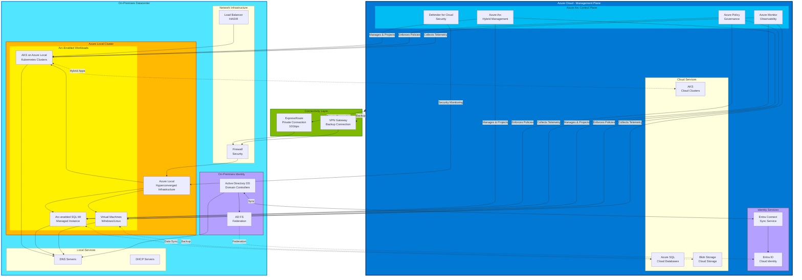

# Hybrid Connected Pattern

## Introduction

The hybrid connected pattern represents the bridge between cloud-native and fully on-premises deployment — workloads run on Azure Local or other on-premises infrastructure while maintaining **persistent connectivity to Azure** for management, monitoring, identity, and selective cloud service consumption. This pattern addresses data residency and latency requirements without sacrificing the operational benefits of centralized cloud-based management.

Organizations adopt hybrid connected architectures when regulations mandate on-premises data residency, when latency requirements demand edge computing, or when existing infrastructure investments must be integrated with cloud capabilities. Unlike the cloud-native pattern, workloads execute locally, but unlike the disconnected pattern, they leverage Azure Arc and hybrid services for unified management.

!!! info "Pattern Summary"
    **Deployment Model:** On-premises compute with cloud management plane  
    **Connectivity:** Persistent VPN/ExpressRoute to Azure required  
    **Management Plane:** Azure Portal, Azure Arc  
    **Identity:** Hybrid Entra ID (Azure AD) with on-premises AD DS  
    **Target Use Cases:** Data sovereignty, edge computing, latency-sensitive workloads

## Pattern Definition

Hybrid connected architecture splits the control plane (management, monitoring, identity) from the data plane (workload execution, data storage):

- **Data plane:** Runs on Azure Local, Azure Stack HCI, or traditional on-premises servers
- **Control plane:** Runs in Azure, managing on-premises resources via Azure Arc agents
- **Identity plane:** Hybrid Entra ID synchronizes on-premises Active Directory to Azure AD
- **Network plane:** ExpressRoute or site-to-site VPN provides secure, low-latency connectivity

This split enables **Azure management of on-premises resources**, unlocking capabilities like:

- Centralized policy enforcement across cloud and on-premises (Azure Policy)
- Unified monitoring and alerting (Azure Monitor, Log Analytics)
- Cloud-based backup and disaster recovery (Azure Backup, Azure Site Recovery)
- Hybrid Kubernetes deployment with consistent APIs (AKS on Azure Local + AKS in Azure)

## When to Use Hybrid Connected

The hybrid connected pattern is optimal when:

✅ **Data residency mandated:** Regulations require data to remain on-premises or in specific geographies  
✅ **Latency requirements:** Applications need < 10ms response times (manufacturing, healthcare imaging, financial trading)  
✅ **Existing infrastructure:** Substantial investment in on-premises hardware that must be integrated  
✅ **Regulated industries:** Healthcare (HIPAA), finance (PCI-DSS), government (FedRAMP) with cloud management allowed  
✅ **Edge computing:** Remote locations (retail stores, branch offices, oil rigs) with intermittent connectivity  
✅ **Cloud management desired:** Operations teams prefer Azure Portal over on-premises management tools

Hybrid connected is **not suitable** when:

❌ Air-gapped or zero-trust requirements prohibit cloud connectivity  
❌ Network connectivity to Azure is unreliable (< 99% uptime)  
❌ Data sovereignty regulations prohibit **any** data transmission to cloud (even metadata)  
❌ Latency to Azure regions for management operations is unacceptable

## Reference Architecture Components

### Compute Services

| Service | Description | Use Case |
|---------|-------------|----------|
| **AKS on Azure Local** | Kubernetes clusters managed via Azure Arc | Containerized applications with hybrid deployment |
| **Azure Arc-enabled VMs** | On-premises VMs managed through Azure Portal | Lift-and-shift workloads, legacy applications |
| **Azure Arc-enabled Servers** | Physical or virtual servers with Arc agent | Windows/Linux servers requiring Azure management |
| **Azure VM on Azure Local** | Infrastructure-as-a-Service VMs | Traditional workloads requiring full OS control |

### Data Services

| Service | Description | Use Case |
|---------|-------------|----------|
| **Azure Arc-enabled SQL Managed Instance** | SQL Server with Azure PaaS-like management | On-premises databases with cloud-style updates |
| **Azure Arc-enabled PostgreSQL** | PostgreSQL with Azure management | Open-source database workloads with cloud ops |
| **Azure Arc-enabled Data Services** | Self-service data provisioning locally | Database as a service on-premises |
| **Azure SQL Edge** | Lightweight SQL for edge devices | IoT scenarios, disconnected-tolerant data |

!!! note "Arc-Enabled Data Services"
    Azure Arc-enabled data services run **entirely on-premises** but are managed through Azure. Control plane operations (provisioning, scaling, patching) are initiated from Azure Portal, but data never leaves the on-premises environment.

### Messaging and Integration

For messaging, hybrid connected workloads typically use **self-hosted message brokers** to avoid data residency concerns, but can leverage Azure-based messaging for inter-site communication:

| Component | Description | Use Case |
|-----------|-------------|----------|
| **RabbitMQ** | Self-hosted AMQP message broker | On-premises microservices communication |
| **NATS** | Lightweight pub/sub messaging | Edge-to-cloud telemetry, low-latency messaging |
| **Apache Kafka** | Distributed event streaming platform | High-throughput event processing on-premises |
| **Azure Service Bus Relay** | Hybrid messaging gateway | Secure messaging between on-premises and cloud |
| **Azure Event Grid** | Event routing for hybrid scenarios | React to on-premises events from cloud functions |

### Identity and Security

| Service | Description | Use Case |
|---------|-------------|----------|
| **Hybrid Entra ID (Azure AD Connect)** | Synchronizes on-premises AD to Azure AD | Single sign-on across cloud and on-premises |
| **Azure AD Application Proxy** | Publish on-premises apps externally | Remote access without VPN |
| **Microsoft Defender for Cloud** | Unified security management | Threat detection across hybrid environment |
| **Azure Key Vault with HSM** | Centralized secrets management | Secure credential storage for hybrid apps |
| **Azure AD Domain Services** | Managed AD DS in Azure | Lift-and-shift applications requiring AD |

### Networking

| Service | Description | Use Case |
|---------|-------------|----------|
| **Azure ExpressRoute** | Private, dedicated connection to Azure | High-bandwidth, low-latency hybrid connectivity |
| **Site-to-Site VPN** | IPsec VPN over internet | Cost-effective hybrid connectivity |
| **Azure Virtual WAN** | Managed SD-WAN for hub-and-spoke | Multi-site hybrid networks |
| **Azure Private Link** | Private access to Azure PaaS services | Access Azure services without public internet |

## Data Flows: What Stays Local, What Flows to Azure

Understanding data locality is critical in hybrid connected architectures:

### Data That Stays On-Premises

- **Application data:** User records, transactions, business documents (subject to data residency)
- **Sensitive workloads:** Healthcare records (PHI), payment card data (PCI), classified information
- **High-volume data:** Video streams, sensor telemetry, large file uploads (egress cost avoidance)

### Data That Flows to Azure

- **Monitoring telemetry:** Metrics, logs, traces sent to Azure Monitor (aggregated, anonymized)
- **Configuration and policy:** Azure Policy definitions, RBAC assignments, Arc agent heartbeats
- **Backup data:** Azure Backup for disaster recovery (encrypted, potentially cross-region)
- **Identity synchronization:** User account metadata synchronized via Azure AD Connect
- **Compliance reports:** Audit logs, security findings, compliance assessments

!!! warning "Data Sovereignty Compliance"
    Even **metadata** transmitted to Azure may require legal review in highly regulated industries. Always consult compliance teams to understand what data is permissible to transmit to Azure regions.

## Management Through Azure Arc

Azure Arc extends Azure Resource Manager to on-premises and multi-cloud infrastructure, enabling unified management:

### Azure Portal Management

All Arc-enabled resources appear in Azure Portal alongside cloud resources:

- **Resource inventory:** Browse on-premises VMs, Kubernetes clusters, SQL instances
- **RBAC:** Assign Azure AD identities permissions on on-premises resources
- **Tagging:** Apply consistent tags for cost tracking and organization
- **Resource Graph queries:** Query across cloud and on-premises with KQL

### Azure Policy for Governance

Azure Policy evaluates on-premises resources for compliance:

- **Configuration baselines:** Enforce OS hardening, required agents, network settings
- **Audit mode:** Report non-compliant resources without enforcement
- **Deploy-if-not-exists policies:** Automatically install monitoring agents
- **Compliance dashboards:** View on-premises compliance alongside cloud resources

Example: Enforce that all Arc-enabled servers have the Log Analytics agent installed.

### Azure Monitor for Observability

Azure Monitor collects telemetry from hybrid infrastructure:

- **VM Insights:** CPU, memory, disk, network metrics for Arc-enabled servers
- **Container Insights:** AKS on Azure Local monitoring with node and pod metrics
- **Log Analytics:** Centralized log aggregation with KQL queries
- **Alerts:** Unified alerting across cloud and on-premises based on metrics and logs
- **Workbooks:** Custom dashboards combining cloud and on-premises data

!!! example "Hybrid Monitoring Scenario"
    A retail chain runs point-of-sale systems on Azure Local in each store. Azure Monitor collects:
    
    - Store server CPU/memory utilization
    - Application logs from POS software
    - Transaction volume metrics
    - Network latency to headquarters
    
    Operations teams in the central office view all stores in a single Azure Monitor dashboard and receive alerts if any store's infrastructure degrades.

### Azure Automation and Update Management

- **Update Management:** Schedule patching for Arc-enabled Windows and Linux servers
- **Change Tracking:** Audit configuration changes on hybrid servers
- **Runbooks:** Automate operational tasks across hybrid infrastructure
- **Desired State Configuration:** Enforce configuration baselines using PowerShell DSC

## Security in Hybrid Connected Environments

### Microsoft Defender for Cloud

Defender for Cloud extends security posture management and threat protection to hybrid environments:

- **Secure Score:** Unified security posture across Azure and Arc-enabled servers
- **Vulnerability assessments:** Scan VMs for CVEs and misconfigurations
- **Just-in-Time VM access:** Time-limited RDP/SSH access to reduce attack surface
- **Adaptive application controls:** Allowlist approved applications on servers
- **File integrity monitoring:** Detect unauthorized file changes

### Network Security

- **ExpressRoute encryption:** Use MACsec for Layer 2 encryption (supported by some providers)
- **VPN encryption:** IPsec for site-to-site connectivity
- **Azure Firewall:** Centralized firewall for hybrid traffic inspection
- **Network segmentation:** Separate production and management networks

### Identity Security

- **Hybrid Entra ID:** Provides single identity plane, but requires careful synchronization
- **Conditional Access:** Apply policies based on user location, device compliance, risk level
- **Privileged Identity Management (PIM):** Just-in-time admin access for hybrid resources
- **Multi-Factor Authentication (MFA):** Enforce strong authentication for hybrid access

!!! tip "Least Privilege for Arc Agents"
    Azure Arc agents authenticate to Azure using managed identities with minimal permissions. Review and restrict Arc agent permissions to only required Azure resources.

## Hybrid Kubernetes with AKS on Azure Local

AKS on Azure Local provides a consistent Kubernetes experience across cloud and on-premises:

### Unified Management

- **Azure Portal:** Manage both AKS (Azure) and AKS on Azure Local from the same interface
- **kubectl:** Use the same CLI and manifests across environments
- **GitOps:** Deploy applications to both environments using Flux or Argo CD via Arc

### Hybrid Workload Patterns

| Pattern | Description | Example |
|---------|-------------|---------|
| **Cloud burst** | Scale on-premises workloads to Azure during peak demand | E-commerce site handling Black Friday traffic |
| **Geo-distributed** | Run replicas in cloud and on-premises for low-latency access | Content delivery with edge caching |
| **Tiered processing** | Edge preprocessing, cloud aggregation and ML | IoT sensor data filtered locally, analyzed in Azure |

### Hybrid Networking for Kubernetes

- **Service mesh:** Use Istio or Linkerd for cross-cluster service discovery
- **Ingress controllers:** Expose AKS on Azure Local services via on-premises load balancers
- **Network policies:** Apply consistent Kubernetes network policies across environments

## Challenges and Mitigations

### Network Latency and Reliability

**Challenge:** Management operations from Azure to on-premises introduce latency (50-100ms typical for ExpressRoute).

**Mitigation:**
- Use ExpressRoute for predictable, low-latency connectivity
- Deploy Azure resources in the nearest Azure region to on-premises sites
- Cache management operations locally where possible (Arc agents cache policy)

### Split-Brain Scenarios

**Challenge:** Network partition between on-premises and Azure can create inconsistent state.

**Mitigation:**
- Design applications to tolerate temporary loss of management connectivity
- Arc agents continue operating locally during Azure outages, syncing state when connectivity restores
- Critical operations should have local failover mechanisms

### Partial Service Availability

**Challenge:** Some Azure services required for management may experience outages or throttling.

**Mitigation:**
- Implement local monitoring (Prometheus/Grafana) as backup to Azure Monitor
- Use Azure Service Health alerts to proactively detect Azure outages
- Design for graceful degradation (applications continue even if management plane is unavailable)

### Data Egress Costs

**Challenge:** Transmitting large volumes of data from on-premises to Azure incurs bandwidth and egress costs.

**Mitigation:**
- Aggregate and sample telemetry before sending to Azure Monitor
- Use local storage for high-volume logs, Azure for aggregated metrics
- Evaluate ExpressRoute unlimited data plans for high-throughput scenarios

### Compliance Complexity

**Challenge:** Hybrid architectures span regulatory boundaries, requiring careful mapping of data flows.

**Mitigation:**
- Conduct data classification and document which data categories can transit to Azure
- Use Azure Private Link to avoid exposing data over public internet
- Implement encryption in transit (TLS 1.3) and at rest for all data

## Reference Architecture Example

A typical hybrid connected architecture includes:

**On-Premises Environment (Azure Local):**
- AKS on Azure Local cluster running containerized applications
- Azure Arc-enabled SQL Managed Instance for local database
- Azure Arc-enabled servers for legacy Windows/Linux workloads
- Local storage (Storage Spaces Direct) for persistent data
- Local networking with firewall and load balancers

**Azure Cloud Environment:**
- Azure Arc management plane (automatic, no dedicated resources)
- Azure Monitor + Log Analytics workspace for telemetry aggregation
- Azure Policy assignments for compliance enforcement
- Microsoft Defender for Cloud for security monitoring
- Azure Backup vault for disaster recovery
- Hybrid Entra ID for identity synchronization

**Connectivity:**
- ExpressRoute (preferred) or site-to-site VPN
- Private Link for Azure PaaS service access (if needed)
- Azure Virtual WAN for multi-site deployments

!!! example "Example: Healthcare Provider"
    A hospital deploys electronic health records (EHR) on Azure Local to meet HIPAA data residency requirements:
    
    - **Patient data** remains entirely on-premises in Arc-enabled SQL Managed Instance
    - **Application tier** runs on AKS on Azure Local (containerized EHR frontend)
    - **Identity** uses hybrid Entra ID for clinician authentication
    - **Monitoring** sends aggregated (de-identified) metrics to Azure Monitor
    - **Backup** leverages Azure Backup for disaster recovery to secondary region
    - **Management** conducted by IT staff via Azure Portal from anywhere

## Transition Considerations

### Moving from Cloud-Native to Hybrid Connected

When migrating from Azure to hybrid connected:

1. **Replatform data services:** Replace Azure SQL Database with Arc-enabled SQL Managed Instance
2. **Migrate Kubernetes workloads:** Move AKS workloads to AKS on Azure Local
3. **Implement hybrid identity:** Deploy Azure AD Connect for identity synchronization
4. **Establish connectivity:** Set up ExpressRoute or VPN to Azure
5. **Enable Arc agents:** Onboard all on-premises servers and clusters to Azure Arc

### Moving from Hybrid Connected to Disconnected

If requirements evolve toward air-gapped deployment:

1. **Replace Arc-enabled services:** Migrate to fully self-managed alternatives (SQL Server, native Kubernetes)
2. **Deploy local identity:** Transition from hybrid Entra ID to on-premises AD DS only
3. **Implement local monitoring:** Deploy Prometheus, Grafana, and ELK stack
4. **Disconnect Azure networking:** Remove ExpressRoute/VPN connectivity
5. **Establish offline operations:** Create procedures for manual updates and certificate management

## References

- [Azure Arc overview](https://learn.microsoft.com/en-us/azure/azure-arc/overview)
- [AKS on Azure Local](https://learn.microsoft.com/en-us/azure/aks/hybrid/aks-hybrid-options-overview)
- [Azure Arc-enabled Data Services](https://learn.microsoft.com/en-us/azure/azure-arc/data/overview)
- [Azure ExpressRoute](https://learn.microsoft.com/en-us/azure/expressroute/expressroute-introduction)
- [Hybrid identity with Entra ID](https://learn.microsoft.com/en-us/entra/identity/hybrid/whatis-hybrid-identity)
- [Microsoft Defender for Cloud hybrid support](https://learn.microsoft.com/en-us/azure/defender-for-cloud/quickstart-onboard-machines)
- [Azure Monitor for hybrid environments](https://learn.microsoft.com/en-us/azure/azure-monitor/vm/monitor-virtual-machine)

---

> **Next:** [Hybrid Disconnected Pattern →](03-hybrid-disconnected.md)
