# Hybrid Disconnected Pattern

## Introduction

The hybrid disconnected pattern represents the most constrained deployment model on the Azure Hybrid Continuum — environments with **no connectivity to Azure**, either by regulatory mandate (air-gapped security requirements) or operational necessity (remote locations, military operations, maritime deployments, classified networks). This pattern demands complete operational autonomy, requiring local alternatives for every cloud service, local identity infrastructure, and self-contained monitoring and management.

Organizations operating in defense, intelligence, critical infrastructure, and highly regulated industries often face requirements that prohibit any external network connectivity. The disconnected pattern enables these organizations to adopt modern cloud-native application architectures while meeting zero-trust and air-gap requirements.

!!! info "Pattern Summary"
    **Deployment Model:** Fully on-premises with no cloud connectivity  
    **Connectivity:** Air-gapped or intentionally disconnected  
    **Management Plane:** Local management tools only  
    **Identity:** On-premises Active Directory Domain Services (AD DS), ADFS  
    **Target Use Cases:** Classified networks, critical infrastructure, remote/maritime operations

## Pattern Definition

Hybrid disconnected architecture eliminates all dependencies on Azure or external services:

- **No network connectivity:** Zero packets leave the environment (air-gapped by network design or policy)
- **Local management:** All operations, monitoring, and updates performed locally
- **Self-hosted services:** Every Azure PaaS service replaced with self-hosted alternatives
- **Local identity:** Active Directory Domain Services (AD DS) without cloud synchronization
- **Offline updates:** Software updates and patches delivered via physical media or secure one-way transfers

This pattern sacrifices the convenience of cloud management for **absolute control and data sovereignty**. Every capability present in cloud-native or hybrid connected patterns must be replicated locally using open-source or commercial software.

!!! example "🔗 Working Example: Contoso Insurance Sample Application"
    See the complete working implementation of this architecture at
    [ContosoInsurances-NativeToLocal](https://github.com/EmeaAppGbb/ContosoInsurances-NativeToLocal) —
    a .NET 8 enterprise application demonstrating fully disconnected, air-gapped deployment. Explore the **`local-disconnected`** branch to see how every Azure dependency is replaced with local alternatives: Prometheus/Grafana for monitoring, a local container registry, and on-premises identity.

## When to Use Hybrid Disconnected

The hybrid disconnected pattern is **mandatory** when:

✅ **Air-gapped security required:** Classified networks (Top Secret, Secret), weapons systems, nuclear facilities  
✅ **Regulatory prohibition:** Laws explicitly prohibit cloud connectivity (some national security contexts)  
✅ **Zero-trust environments:** Threat model assumes adversarial cloud providers  
✅ **Remote operations:** Ships, submarines, aircraft, Antarctic research stations, offshore oil platforms  
✅ **Critical infrastructure:** Power grids, water treatment, emergency services where internet outages cannot be tolerated

Hybrid disconnected is **not suitable** when:

❌ Cloud-based management is desired (use hybrid connected instead)  
❌ Global distribution or multi-region deployment is required  
❌ Operational teams lack expertise to manage full infrastructure stack  
❌ Budget constraints prevent investment in on-premises hardware and redundancy

## Reference Architecture

```mermaid
graph TB
    subgraph AirGap["Air-Gapped / Disconnected Environment"]
        subgraph Users["User Access"]
            AdminUsers[Admin Workstations]
            AppUsers[Application Users]
        end
        
        subgraph Identity["Identity & Access Management"]
            ADDS[Active Directory DS<br/>Domain Controllers]
            ADFS[AD FS<br/>Federation Services]
            FreeIPA[FreeIPA<br/>Linux Identity]
            Keycloak[Keycloak<br/>OAuth2/OIDC]
        end
        
        subgraph Compute["Compute Platform"]
            K3s[K3s / RKE2<br/>Kubernetes Cluster]
            
            subgraph Apps["Application Services"]
                AuthSvc[Auth Service]
                APIGw[API Gateway]
                AppSvc1[Business App 1]
                AppSvc2[Business App 2]
            end
        end
        
        subgraph Data["Data Services"]
            Postgres[(PostgreSQL<br/>Primary DB)]
            PostgresReplica[(PostgreSQL<br/>Replica)]
            Redis[(Redis<br/>Cache)]
            MinIO[MinIO<br/>S3-Compatible Storage]
        end
        
        subgraph Messaging["Messaging & Events"]
            RabbitMQ[RabbitMQ<br/>Message Broker]
            Kafka[Apache Kafka<br/>Event Streaming]
        end
        
        subgraph Security["Security Services"]
            Vault[HashiCorp Vault<br/>Secrets Management]
            PKI[Local PKI/CA<br/>Certificate Authority]
            SIEM[Local SIEM<br/>Security Monitoring]
        end
        
        subgraph Monitoring["Observability Stack"]
            Prometheus[Prometheus<br/>Metrics]
            Grafana[Grafana<br/>Dashboards]
            Loki[Loki<br/>Log Aggregation]
            Jaeger[Jaeger<br/>Distributed Tracing]
        end
        
        subgraph Network["Network Infrastructure"]
            FW[Firewall<br/>Segmentation]
            LB[Load Balancer<br/>HAProxy/NGINX]
            DNS[Local DNS<br/>BIND/CoreDNS]
        end
        
        subgraph Backup["Backup & DR"]
            LocalBackup[Veeam/Velero<br/>Local Backup]
            OffSite[Tape/Disk Rotation<br/>Off-Site Storage]
        end
        
        subgraph Registry["Container & Artifacts"]
            Harbor[Harbor Registry<br/>Container Images]
            Nexus[Nexus Repository<br/>Artifacts/Packages]
        end
    end
    
    subgraph External["Isolated Transfer Zone"]
        SecureMedia[Secure Media Transfer<br/>Air-Gap Data Diode]
        Updates[Updates & Patches<br/>Manual Transfer]
    end
    
    %% User Access
    AdminUsers --> ADDS
    AppUsers --> LB
    LB --> APIGw
    
    %% Kubernetes Apps
    K3s --> Apps
    APIGw --> AppSvc1 & AppSvc2
    AuthSvc --> Keycloak
    Apps --> Harbor
    
    %% Identity Flow
    ADDS --> Keycloak
    FreeIPA --> K3s
    ADDS --> ADFS
    ADFS --> AuthSvc
    
    %% Data Access
    Apps --> Postgres
    Apps --> Redis
    Apps --> MinIO
    Postgres -.->|Replication| PostgresReplica
    
    %% Messaging
    AppSvc1 & AppSvc2 --> RabbitMQ
    AppSvc1 --> Kafka
    
    %% Security
    Apps --> Vault
    Vault --> PKI
    FW --> K3s
    K3s & Apps --> SIEM
    
    %% Monitoring
    K3s & Apps & Postgres & Redis --> Prometheus
    Prometheus --> Grafana
    Apps --> Loki
    Apps --> Jaeger
    
    %% Network
    DNS --> K3s & Apps
    LB --> K3s
    
    %% Backup
    K3s & Postgres & MinIO --> LocalBackup
    LocalBackup -.->|Physical Transfer| OffSite
    
    %% External Updates
    SecureMedia -.->|One-Way Transfer| Harbor & Nexus
    Updates -.->|Manual Process| Harbor & Nexus
    
    style AirGap fill:#505050,stroke:#ffb900,stroke-width:4px,color:#fff
    style Identity fill:#b4a0ff,stroke:#5e5e5e,stroke-width:2px
    style Compute fill:#00bcf2,stroke:#0078d4,stroke-width:2px
    style Data fill:#ffb900,stroke:#d83b01,stroke-width:2px
    style Messaging fill:#7fba00,stroke:#107c10,stroke-width:2px
    style Security fill:#e74856,stroke:#a80000,stroke-width:2px
    style Monitoring fill:#00b7c3,stroke:#005b70,stroke-width:2px
    style External fill:#d83b01,stroke:#a80000,stroke-width:3px,stroke-dasharray: 5 5
```



## Reference Architecture Components

### Compute Services

| Component | Description | Use Case |
|-----------|-------------|----------|
| **Azure Stack Hub** | Microsoft's disconnected-capable Azure-consistent platform | Environments requiring Azure API compatibility |
| **Azure Local (disconnected mode)** | Hyperconverged infrastructure for VMs and containers | VM workloads, private cloud IaaS |
| **K3s** | Lightweight Kubernetes (certified, CNCF) | Edge and air-gapped Kubernetes clusters |
| **RKE2** | Rancher Kubernetes Engine v2 (security-hardened) | FIPS 140-2 compliance, government use cases |
| **OpenShift** | Enterprise Kubernetes with full lifecycle management | Large enterprises requiring commercial support |

!!! tip "Kubernetes for Disconnected Environments"
    For air-gapped Kubernetes:
    
    - **K3s:** Minimal dependencies, single binary (~70MB), fast startup, excellent for edge
    - **RKE2:** Security-focused, FIPS-compliant, CIS Kubernetes Benchmark hardened
    - **OpenShift:** Enterprise platform with built-in registry, logging, monitoring

### Data Services

| Component | Description | Use Case |
|-----------|-------------|----------|
| **SQL Server** | Microsoft's relational database (Standard/Enterprise) | Transactional workloads, ERP, LOB applications |
| **PostgreSQL** | Open-source relational database | ACID compliance, JSON support, extensibility |
| **MySQL / MariaDB** | Open-source relational databases | Web applications, content management systems |
| **MongoDB** | Document database with replication | User profiles, catalogs, session stores |
| **Redis** | In-memory cache and data structure store | Caching, session state, real-time leaderboards |
| **MinIO** | S3-compatible object storage | Unstructured data, backups, media files |
| **Ceph** | Distributed storage platform (block, file, object) | Large-scale storage with replication |

### Messaging and Integration

| Component | Description | Use Case |
|-----------|-------------|----------|
| **RabbitMQ** | AMQP message broker with high availability | Microservices messaging, work queues |
| **Apache Kafka** | Distributed event streaming platform | Event sourcing, log aggregation, real-time analytics |
| **NATS** | Lightweight, high-performance messaging | IoT telemetry, edge-to-core messaging |
| **Redis Streams** | Append-only log structure in Redis | Simple event streams without Kafka complexity |
| **Apache Pulsar** | Multi-tenant messaging with geo-replication | Large-scale messaging with guaranteed ordering |

### Identity and Security

| Component | Description | Use Case |
|-----------|-------------|----------|
| **Active Directory Domain Services (AD DS)** | On-premises directory service | Windows domain authentication, group policy |
| **Active Directory Federation Services (ADFS)** | Claims-based authentication and SSO | Web application authentication, SAML/OAuth |
| **FreeIPA** | Open-source identity management for Linux | Linux authentication, Kerberos, DNS, CA |
| **OpenLDAP** | Open-source LDAP directory | Lightweight directory for user/group management |
| **Keycloak** | Open-source identity and access management | OAuth2/OIDC provider, social login, SAML |
| **HashiCorp Vault** | Secrets management and encryption | API keys, database credentials, certificate issuance |

### Monitoring and Observability

| Component | Description | Use Case |
|-----------|-------------|----------|
| **Prometheus** | Time-series metrics database and monitoring | Infrastructure and application metrics |
| **Grafana** | Visualization and dashboarding | Metrics dashboards, alerting, exploration |
| **Loki** | Log aggregation system (Prometheus-inspired) | Application and infrastructure logs |
| **Elasticsearch + Kibana (ELK)** | Log search and analytics platform | Full-text log search, security log analysis |
| **Jaeger** | Distributed tracing system | Microservices request tracing, performance debugging |
| **Thanos** | Highly available Prometheus with long-term storage | Multi-cluster Prometheus federation |

### Container Registry

| Component | Description | Use Case |
|-----------|-------------|----------|
| **Harbor** | CNCF container registry with security scanning | Private registry with vulnerability scanning, signing |
| **Docker Registry** | Official Docker container registry | Simple private registry without advanced features |
| **Artifactory** | Universal artifact repository (commercial) | Containers, packages, binaries with enterprise features |

### Continuous Integration / Continuous Deployment

| Component | Description | Use Case |
|-----------|-------------|----------|
| **GitLab CE** | Self-hosted Git with integrated CI/CD | Source control, CI/CD pipelines, artifact storage |
| **Gitea** | Lightweight self-hosted Git service | Minimal-resource Git hosting |
| **Jenkins** | Automation server for CI/CD pipelines | Flexible CI/CD with extensive plugin ecosystem |
| **Argo CD** | GitOps continuous delivery for Kubernetes | Declarative Kubernetes app deployment |
| **Flux** | GitOps toolkit for Kubernetes | Automated Kubernetes deployment from Git |

## Mapping Azure PaaS to Self-Hosted Alternatives

This table provides a comprehensive mapping from Azure PaaS services to disconnected alternatives:

| Azure Service | Disconnected Alternative | Notes |
|---------------|---------------------------|-------|
| **Azure Kubernetes Service (AKS)** | K3s, RKE2, OpenShift | Use K3s for small/edge, RKE2 for security, OpenShift for enterprise |
| **Azure Container Registry** | Harbor, Docker Registry | Harbor adds security scanning and replication |
| **Azure SQL Database** | SQL Server (self-managed) | Requires licensing, patching, high availability setup |
| **Azure Cosmos DB** | MongoDB, Cassandra | Document model: MongoDB. Wide-column: Cassandra |
| **Azure Cache for Redis** | Redis (self-managed) | Deploy with Redis Sentinel for HA |
| **Azure Blob Storage** | MinIO, Ceph | MinIO for S3 API compatibility, Ceph for scale |
| **Azure Service Bus** | RabbitMQ, Apache Kafka | RabbitMQ for queues/topics, Kafka for event streaming |
| **Azure Event Hubs** | Apache Kafka, Apache Pulsar | Kafka is the de facto standard |
| **Azure Functions** | OpenFaaS, Knative, Kubeless | Serverless on Kubernetes |
| **Azure Key Vault** | HashiCorp Vault | Secrets, encryption keys, dynamic credentials |
| **Azure Monitor** | Prometheus + Grafana | Metrics monitoring and visualization |
| **Azure Log Analytics** | Elasticsearch + Kibana, Loki | ELK for advanced search, Loki for lightweight logs |
| **Application Insights** | Jaeger, Zipkin | Distributed tracing for microservices |
| **Azure AD (Entra ID)** | AD DS + ADFS, Keycloak | Keycloak for modern OAuth2/OIDC |
| **Azure API Management** | Kong, Tyk, KrakenD | API gateway with rate limiting, auth, analytics |
| **Azure DevOps** | GitLab CE, Jenkins + Gitea | GitLab offers integrated experience |
| **Azure Backup** | Veeam, Rubrik, Velero (K8s) | Velero for Kubernetes backup, Veeam for VMs |

!!! warning "Operational Complexity"
    Replacing managed PaaS services with self-hosted alternatives dramatically increases operational burden:
    
    - Patching and updates must be performed manually
    - High availability requires manual clustering configuration
    - Security hardening is the operator's responsibility
    - Capacity planning and scaling are manual processes

For detailed mapping, see **Appendix: PaaS-to-Self-Hosted Service Mapping**.

## Operations in Disconnected Mode

### Patch Management and Updates

**Challenge:** No internet connectivity for automatic updates.

**Solution:**

1. **Staging environment:** Maintain a connected staging environment that mirrors production
2. **Download updates:** Download OS patches, application updates, container images in staging
3. **Transfer media:** Copy updates to encrypted USB drives or other secure media
4. **Import to disconnected environment:** Transfer media through security screening
5. **Test and deploy:** Apply updates in disconnected staging, then production

!!! example "Air-Gapped Update Workflow"
    ```
    1. Connected Staging: Download RHEL security patches (Thursday)
    2. Burn to encrypted DVD, log checksums (Friday)
    3. Physical transfer via courier with chain of custody (Monday)
    4. Import to disconnected staging, verify checksums (Tuesday)
    5. Test patches in disconnected staging (Wednesday-Thursday)
    6. Apply to disconnected production during maintenance window (Friday night)
    ```

### Container Image Distribution

For Kubernetes workloads, container images must be pre-loaded into a local registry:

1. **Build images** in connected environment
2. **Export images** using `docker save` or `skopeo copy`
3. **Transfer via secure media** (encrypted USB, DVD, secure file transfer)
4. **Import to Harbor registry** in disconnected environment
5. **Deploy to Kubernetes** using local registry URL

**Tool:** Use **skopeo** for efficient image transfer:

```bash
# In connected environment
skopeo copy docker://nginx:1.25 oci-archive:nginx-1.25.tar

# Transfer nginx-1.25.tar to disconnected environment

# In disconnected environment
skopeo copy oci-archive:nginx-1.25.tar docker://harbor.local/library/nginx:1.25
```

### Certificate Management

Without cloud-based certificate authorities, disconnected environments require **local PKI**:

- **Microsoft Certificate Services:** For Windows-based environments
- **OpenSSL + custom CA:** For Linux-based environments
- **HashiCorp Vault PKI:** For automated certificate issuance and rotation
- **CFSSL:** CloudFlare's PKI toolkit for certificate management

**Best Practice:** Establish a two-tier CA hierarchy:

- **Root CA:** Offline, air-gapped, used only to sign intermediate CAs
- **Issuing CA:** Online within the environment, issues certificates to services

### Monitoring and Alerting

Deploy a full local monitoring stack:

**Metrics:** Prometheus scrapes metrics from all services and infrastructure, stores locally with retention policy (90 days typical). Grafana provides dashboards and alerting.

**Logs:** Loki or ELK stack aggregates logs from all nodes. Use Fluentd or Filebeat as log shippers.

**Traces:** Jaeger collects distributed traces from microservices, provides root cause analysis.

**Alerting:** Prometheus Alertmanager or Grafana sends alerts via local email server or SMS gateway.

!!! tip "Prometheus Federation"
    For multi-cluster environments, use Prometheus federation or Thanos to aggregate metrics from multiple disconnected sites into a central monitoring cluster.

### Backup and Disaster Recovery

Without Azure Backup or Azure Site Recovery:

- **VM Backup:** Use Veeam, Rubrik, or native hypervisor snapshots
- **Kubernetes Backup:** Use Velero to backup Kubernetes resources and persistent volumes
- **Database Backup:** Scheduled dumps to local storage, replicated to secondary site
- **Off-site backup:** Physical tape or disk rotation to geographically separate location

**Best Practice:** Follow 3-2-1 rule: 3 copies, 2 different media types, 1 off-site.

### Security Operations

Without cloud-based threat intelligence:

- **SIEM:** Deploy local SIEM (Splunk, ELK with Sigma rules) for security log analysis
- **Endpoint protection:** Use locally managed antivirus (Microsoft Defender ATP on-premises mode, CrowdStrike)
- **Intrusion detection:** Deploy Snort, Suricata, or Zeek for network traffic analysis
- **Threat intelligence:** Manually import threat feeds via secure media transfer

## Kubernetes in Air-Gapped Environments

### Choosing a Distribution

| Distribution | Best For | Key Features |
|--------------|----------|--------------|
| **K3s** | Edge, small clusters | Single binary, minimal dependencies, fast startup |
| **RKE2** | Security-focused, government | FIPS 140-2, CIS Benchmark, SELinux support |
| **OpenShift** | Enterprise, large scale | Integrated registry, logging, monitoring, commercial support |
| **Rancher** | Multi-cluster management | Centralized management for multiple K3s/RKE2 clusters |

### Air-Gap Installation Process

**K3s Air-Gapped Installation:**

1. Download K3s binary and air-gap images tarball in connected environment
2. Transfer to disconnected environment via secure media
3. Install K3s with `--airgap-install` flag, pointing to local image archive
4. K3s runs entirely from local images, no internet access required

```bash
# In connected environment
curl -sfL https://get.k3s.io | INSTALL_K3S_SKIP_START=true sh -
k3s-airgap-images-amd64.tar.gz  # Download from GitHub releases

# Transfer files to disconnected environment

# In disconnected environment
sudo mkdir -p /var/lib/rancher/k3s/agent/images/
sudo cp k3s-airgap-images-amd64.tar.gz /var/lib/rancher/k3s/agent/images/
sudo ./install-k3s.sh
```

**OpenShift Disconnected Installation:**

OpenShift supports disconnected installation via a local mirror registry. The process involves:

1. Create a local container registry (Harbor or OpenShift Registry)
2. Use `oc-mirror` tool to sync OpenShift release images to local registry
3. Install OpenShift pointing to the local mirror

### Deploying Applications to Air-Gapped Kubernetes

**Helm Charts:**

1. Download Helm chart in connected environment: `helm pull <chart>`
2. Transfer chart `.tgz` file to disconnected environment
3. Update `values.yaml` to reference local container registry
4. Install: `helm install -f values.yaml <chart>.tgz`

**GitOps (Argo CD / Flux):**

1. Host Git repository locally (Gitea or GitLab CE)
2. Configure Argo CD or Flux to watch local Git repository
3. Push manifests to local Git, Argo CD/Flux deploys automatically

## Identity Management in Disconnected Environments

### Active Directory Domain Services (AD DS)

AD DS remains the identity backbone for disconnected Windows environments:

- **Domain controllers:** Deploy at least 2 DCs for redundancy
- **Sites and Services:** Configure AD sites to optimize replication
- **Group Policy:** Centralized configuration management for Windows clients and servers
- **DNS integration:** AD DNS for service discovery

### Linux Identity: FreeIPA

FreeIPA provides integrated identity and authentication for Linux:

- **Kerberos:** Single sign-on for Linux services
- **LDAP:** Centralized user and group directory
- **DNS:** Integrated DNS for service discovery
- **Certificate Authority:** Built-in CA for issuing certificates

### Modern Authentication: Keycloak

For cloud-native applications requiring OAuth2 / OIDC:

- **Deploy Keycloak** in HA mode (clustered, backed by PostgreSQL)
- **Integrate with AD DS** via LDAP user federation
- **Configure realms and clients** for each application
- **OIDC / SAML support** for modern and legacy applications

!!! example "Disconnected Identity Architecture"
    - **Windows Servers/Clients:** Authenticate to AD DS domain controllers
    - **Linux Servers:** Authenticate to FreeIPA via SSSD
    - **Kubernetes:** Use OIDC authentication via Keycloak
    - **Web Applications:** OAuth2 via Keycloak, federated to AD DS

## Network Architecture for Disconnected Environments

### Segmentation

Apply defense-in-depth with network segmentation:

- **DMZ:** External-facing services (if any external access allowed)
- **Application tier:** Web servers, application servers
- **Database tier:** Databases, message brokers
- **Management network:** Jump boxes, monitoring, logging

### Internal DNS

Deploy authoritative DNS servers for internal name resolution:

- **AD DNS** for Windows-centric environments
- **FreeIPA DNS** for Linux-centric environments
- **CoreDNS** for Kubernetes cluster DNS

### Time Synchronization

Without internet NTP servers, deploy local NTP infrastructure:

- **Stratum 1 server:** GPS-based time source (hardware GPS receiver)
- **Stratum 2 servers:** Sync from Stratum 1, serve clients

Accurate time synchronization is **critical** for:

- Kerberos authentication (clock skew tolerance: 5 minutes)
- Log correlation across services
- Certificate validity checks

## Preparing for Reconnection (Intermittent Connectivity)

Some environments operate in **intermittent disconnected mode** — normally air-gapped, but occasionally connected for data synchronization or updates:

### Sync Patterns

**One-Way Sync (Inbound):**
- Download updates, patches, container images from cloud during connection window
- Import to local environment when disconnected

**One-Way Sync (Outbound):**
- Collect logs, metrics, backup data while disconnected
- Upload to cloud during connection window for analysis

**Bidirectional Sync:**
- Git repository synchronization (pull changes, push commits)
- Database replication (careful conflict resolution required)

**Tools:**
- **Rsync** for file synchronization
- **Git** for source code synchronization
- **Database replication** (PostgreSQL logical replication, SQL Server Always On)

### Automated Reconnection Procedures

When connectivity is restored:

1. **Verify connection:** Check certificate validity, test Azure endpoints
2. **Sync time:** Ensure NTP synchronization
3. **Pull updates:** Download OS patches, container images, threat intelligence
4. **Push telemetry:** Upload aggregated logs and metrics for analysis
5. **Backup to cloud:** Replicate critical data to Azure for disaster recovery
6. **Disconnect:** Return to air-gapped state

!!! warning "Security During Reconnection"
    Connection windows introduce risk. Apply strict controls:
    
    - Use dedicated "sync" network segment, isolated from production
    - Require multi-factor authentication for connection approval
    - Scan all incoming data for malware before importing to air-gapped network
    - Audit all data transfers with signed logs

## Security Considerations

### Threat Model Differences

Disconnected environments face different threats than cloud-connected:

- **Insider threats:** Without cloud monitoring, detection relies on local SIEM
- **Physical security:** Physical access to servers becomes critical attack vector
- **Supply chain:** All hardware, software, and media must be verified for tampering
- **Stale patches:** Slower update cadence increases vulnerability window

### Compensating Controls

Without cloud-based threat intelligence and automated response:

- **Enhanced logging:** Comprehensive logs of all authentication and authorization events
- **File integrity monitoring:** Detect unauthorized changes to system files
- **Network segmentation:** Limit blast radius of compromised systems
- **Least privilege:** Strictly enforce principle of least privilege for all accounts
- **Security awareness:** Train personnel on insider threat indicators

### Incident Response

Disconnected incident response requires:

- **Local forensics capability:** Tools and trained personnel on-site
- **Incident playbooks:** Pre-defined procedures for common scenarios
- **Evidence preservation:** Chain of custody procedures for forensic data
- **Communication plans:** Out-of-band communication (phone, in-person) during incidents

## Challenges and Trade-Offs

### Operational Complexity

Self-managing the entire infrastructure stack requires:

- **Deep expertise:** Database administration, Kubernetes operations, networking, security
- **Large operations team:** 24/7 coverage for critical systems
- **Slower innovation:** Vetting and importing new technologies is time-consuming

### Cost Structure

- **High CapEx:** Significant upfront investment in hardware, software licenses
- **Redundancy requirements:** Must provision for peak capacity (no elastic scaling)
- **Slow depreciation:** Hardware lifecycle is 3-5 years, cannot scale down during low usage

### Disaster Recovery

- **Geographic distribution:** Requires physically separate datacenters
- **Data replication:** Must build custom replication solutions
- **Recovery time:** Longer RTO/RPO than cloud-based solutions

## References

- [Azure Stack Hub Disconnected Deployment](https://learn.microsoft.com/en-us/azure-stack/operator/azure-stack-disconnected-deployment)
- [K3s — Lightweight Kubernetes](https://k3s.io/)
- [RKE2 Documentation](https://docs.rke2.io/)
- [Harbor Container Registry](https://goharbor.io/)
- [Prometheus Monitoring](https://prometheus.io/)
- [HashiCorp Vault](https://www.vaultproject.io/)
- [OpenShift Disconnected Installation](https://docs.openshift.com/container-platform/latest/installing/disconnected_install/index.html)
- [FreeIPA Identity Management](https://www.freeipa.org/)

---

> **Next:** [Cloud Exit Pattern →](04-cloud-exit.md)

---

> **Next:** [Cloud Exit Pattern →](04-cloud-exit.md)
