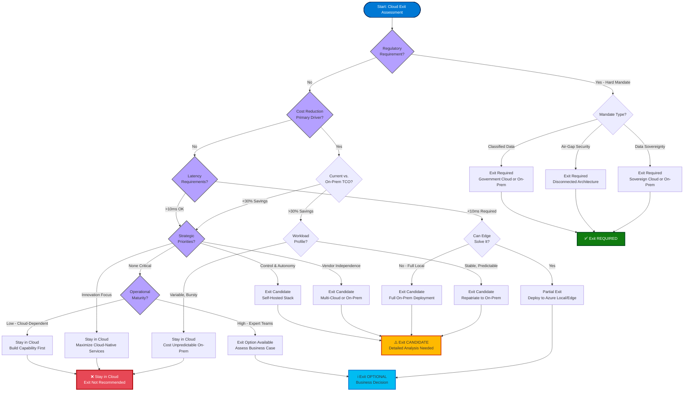

# Cloud Exit Pattern

## Introduction

Cloud exit — also known as cloud repatriation or cloud reversal — is the strategic process of migrating workloads from public cloud services to on-premises, sovereign cloud, or alternative infrastructure. While the cloud migration journey is well-documented, cloud exit is an emerging pattern driven by regulatory mandates, cost optimization opportunities, data sovereignty requirements, and strategic autonomy considerations.

Understanding cloud exit is critical for organizations operating along the Azure Hybrid Continuum. Whether motivated by compliance, economics, or geopolitics, cloud exit requires careful planning, phased execution, and an understanding of the architectural changes needed to operate without cloud dependencies.

!!! info "Pattern Summary"
    **Direction:** Public cloud → On-premises / Sovereign cloud  
    **Drivers:** Regulation, cost, sovereignty, latency, strategic control  
    **Approach:** Phased migration with workload classification  
    **Complexity:** High — PaaS replacement, identity refactoring, operational transformation

## What Is Cloud Exit?

Cloud exit is the reverse of cloud migration — moving workloads, data, and dependencies from cloud platforms (Azure, AWS, GCP) to self-managed infrastructure. Unlike cloud migration, which emphasizes lift-and-shift simplicity, cloud exit often requires:

- **Rearchitecting:** Replacing managed PaaS services with self-hosted alternatives
- **Refactoring:** Removing cloud-specific APIs and SDKs
- **Re-operationalizing:** Establishing on-premises monitoring, patching, and incident response

Cloud exit is **not necessarily a complete exit**. Many organizations pursue **selective exit** — repatriating specific workloads while retaining others in the cloud based on workload characteristics.

## Why Organizations Pursue Cloud Exit

### Regulatory and Sovereignty Mandates

Governments worldwide are enacting data sovereignty laws requiring data to remain within national borders:

- **GDPR (Europe):** Restricts cross-border data transfers; Schrems II decision limits EU-US data flows
- **PIPL (China):** Personal information must be stored domestically, with audits required for transfers
- **LGPD (Brazil):** Brazilian personal data must remain in-country unless adequate protections exist
- **NIS2 Directive (Europe):** Critical infrastructure operators must demonstrate supply chain resilience

!!! warning "Regulatory Complexity"
    Data sovereignty laws evolve rapidly. Organizations operating in multiple jurisdictions face **overlapping and sometimes conflicting requirements**, making selective cloud exit necessary.

### Cost Optimization

Cloud economics favor **variable workloads**, but sustained high utilization can be more expensive than owned infrastructure:

- **Egress costs:** Large datasets incur substantial bandwidth charges when exiting cloud
- **Predictable workloads:** Steady-state workloads (databases, file servers) are cheaper on-premises over 3-5 years
- **Reserved capacity:** Cloud savings plans help but don't match owned-hardware CapEx amortization

**Example:** A media company hosting 5PB of video content in Azure Blob Storage with 500TB/month egress pays ~$40,000/month in storage + $50,000/month in bandwidth. On-premises storage with 10Gb internet costs ~$200,000 CapEx + $5,000/month OpEx, breaking even in 12 months.

### Latency Requirements

Applications requiring ultra-low latency (< 5ms) cannot tolerate round-trips to distant Azure regions:

- **High-frequency trading:** Latency measured in microseconds
- **Industrial automation:** Real-time control systems (PLCs, SCADA)
- **Healthcare imaging:** Real-time MRI/CT scan processing
- **Autonomous vehicles:** Edge processing with millisecond response times

### Strategic Autonomy

Organizations seeking independence from cloud vendor lock-in:

- **Geopolitical risk:** Concerns about foreign government access to cloud-hosted data
- **Vendor stability:** Hedge against cloud provider service discontinuation or pricing changes
- **Negotiating leverage:** On-premises capability provides optionality in cloud contract negotiations

### Technology Maturity

As cloud-native technologies (Kubernetes, service mesh, observability) mature, the operational gap between cloud and on-premises narrows, making self-management more feasible.

## The Cloud Exit Spectrum

Cloud exit is **not binary** — organizations move along a continuum based on workload-specific requirements:

| Exit Stage | Description | Example |
|------------|-------------|---------|
| **No Exit** | All workloads remain in cloud | Pure SaaS company, startup |
| **Selective Exit** | Specific workloads repatriated | Move databases on-premises, keep APIs in cloud |
| **Hybrid Persistence** | Permanent hybrid with workload distribution | Frontend in cloud, backend on-premises |
| **Majority Exit** | Most workloads on-premises, minimal cloud use | On-prem primary, cloud backup/DR |
| **Full Exit** | Complete disconnection from cloud | Air-gapped, zero cloud dependency |

Most organizations pursuing cloud exit land in the **Selective Exit** or **Hybrid Persistence** stages, retaining cloud for specific use cases (disaster recovery, global content delivery, dev/test environments) while repatriating core production workloads.

## Cloud Exit Planning Framework

A structured cloud exit requires six phases:

### Phase 1: Assessment — Understand Current State

**Objective:** Inventory all cloud resources, dependencies, and workload characteristics.

**Activities:**

1. **Resource discovery:** Use Azure Resource Graph to inventory all resources by subscription, resource group, and resource type
2. **Dependency mapping:** Identify dependencies between resources (databases ↔ apps, apps ↔ message queues)
3. **Cost analysis:** Use Azure Cost Management to understand spending by resource, showing which workloads incur highest costs
4. **Service catalog:** List all Azure PaaS services consumed (Azure SQL, Cosmos DB, Service Bus, Key Vault, etc.)
5. **Data classification:** Tag data by sensitivity (public, internal, confidential, restricted)
6. **Compliance audit:** Identify regulatory requirements driving exit decisions

**Output:** Comprehensive inventory spreadsheet or CMDB with all workloads, dependencies, costs, and classification.

!!! tip "Use Azure Migrate for Discovery"
    Azure Migrate provides automated discovery and dependency mapping for Azure VMs, SQL databases, and web apps, accelerating the assessment phase.

### Phase 2: Workload Classification — Prioritize Exit Candidates

**Objective:** Categorize workloads by exit priority based on business, technical, and regulatory factors.

**Classification Criteria:**

| Criterion | Weight | Assessment |
|-----------|--------|------------|
| **Regulatory pressure** | High | Must exit (mandate), Should exit (best practice), Can stay (compliant) |
| **Cost savings potential** | Medium | Compare 3-year TCO (cloud vs. on-prem) |
| **Latency sensitivity** | High | Ultra-low (< 5ms), Low (< 50ms), Moderate (< 200ms), High (> 200ms OK) |
| **PaaS dependency depth** | High | None (IaaS VMs), Low (Azure SQL), Medium (Cosmos DB), High (Functions + Event Grid + ...) |
| **Data gravity** | Medium | Size of dataset, egress cost, migration time |
| **Operational maturity** | Medium | Team capability to manage on-premises |

**Priority Matrix:**

- **P1 — Exit First:** Regulatory mandate + high cost + low PaaS dependency
- **P2 — Exit Next:** Cost savings + latency needs + moderate PaaS dependency
- **P3 — Exit Later:** Strategic autonomy + complex PaaS dependencies
- **P4 — Remain in Cloud:** Low cost + cloud-native design + no regulatory pressure

**Output:** Prioritized list of workloads with exit timeline (Q1, Q2, ...) and migration strategy (Rehost, Replatform, Rearchitect).

### Phase 3: Target Architecture Design — Plan Destination State

**Objective:** Design on-premises or sovereign cloud architecture to host repatriated workloads.

**Decisions:**

1. **Infrastructure platform:**
   - **Azure Stack Hub:** For Azure API compatibility and connected operations
   - **Azure Local:** For hyperconverged infrastructure and hybrid scenarios
   - **Traditional infrastructure:** VMware, Hyper-V, bare-metal servers

2. **Kubernetes platform** (if containerized):
   - **AKS on Azure Local:** For hybrid Kubernetes with Azure management
   - **OpenShift:** For enterprise Kubernetes with commercial support
   - **K3s / RKE2:** For lightweight or security-hardened Kubernetes

3. **PaaS replacement strategy:**
   - Map each Azure PaaS service to self-hosted alternative (see table below)
   - Evaluate open-source (free, operational burden) vs. commercial (licensed, supported)

4. **Identity architecture:**
   - **Hybrid Entra ID:** For continued cloud identity integration
   - **AD DS + ADFS:** For on-premises identity with federation
   - **Keycloak:** For modern OAuth2/OIDC without Azure AD

5. **Networking:**
   - Maintain ExpressRoute/VPN for hybrid connectivity (if not full exit)
   - Design on-premises load balancing, DNS, firewall topology

**Output:** Target architecture diagrams, service mapping table, BoM (bill of materials) for hardware/software procurement.

### Phase 4: PaaS Service Migration — Replace Managed Services

**Objective:** Migrate from Azure PaaS to self-hosted alternatives.

#### Database Migration

| Azure Service | Self-Hosted Alternative | Migration Approach |
|---------------|-------------------------|---------------------|
| **Azure SQL Database** | SQL Server (Standard/Enterprise) | DMS (Database Migration Service), backup/restore, transactional replication |
| **Azure Cosmos DB** | MongoDB, Cassandra | Export to JSON/CSV, import to MongoDB; application refactoring for API differences |
| **Azure Database for PostgreSQL** | PostgreSQL (self-managed) | pg_dump / pg_restore, logical replication for live cutover |
| **Azure Database for MySQL** | MySQL / MariaDB | mysqldump, MySQL replication for live cutover |

**Key Challenges:**

- **Managed features loss:** Automatic backups, high availability, automated patching
- **Operational burden:** Must implement backup strategies, failover clustering, patch management
- **Performance tuning:** Self-managed databases require DBA expertise for optimization

#### Application Services Migration

| Azure Service | Self-Hosted Alternative | Migration Approach |
|---------------|-------------------------|---------------------|
| **Azure App Service** | Kubernetes + Ingress, traditional web servers | Containerize apps, deploy to K8s; or VM-based IIS/Apache |
| **Azure Functions** | OpenFaaS, Knative, Kubeless | Refactor to containerized functions, deploy to serverless-on-K8s |
| **Azure Container Apps** | Kubernetes + KEDA | Deploy containers to K8s, use KEDA for event-driven scaling |

#### Messaging and Integration Migration

| Azure Service | Self-Hosted Alternative | Migration Approach |
|---------------|-------------------------|---------------------|
| **Azure Service Bus** | RabbitMQ, Apache Kafka | Message replay from Service Bus to RabbitMQ/Kafka |
| **Azure Event Hubs** | Apache Kafka, Apache Pulsar | Stream replay, update producer/consumer endpoints |
| **Azure Storage Queues** | RabbitMQ, Redis queues | Drain queues, update application queue endpoints |

#### Storage Migration

| Azure Service | Self-Hosted Alternative | Migration Approach |
|---------------|-------------------------|---------------------|
| **Azure Blob Storage** | MinIO (S3-compatible), Ceph | AzCopy to download, upload to MinIO; or mount Blob as NFS, copy to local |
| **Azure Files** | SMB file server, NFS server | Robocopy (Windows), rsync (Linux) |
| **Azure Disk** | Local SAN, Storage Spaces Direct | Disk attach, VHD download, convert to local format |

### Phase 5: Workload Migration — Relocate Compute and Data

**Migration Strategies (Gartner 5 Rs):**

1. **Rehost ("Lift-and-Shift"):**
   - Move Azure VMs to on-premises VMs with minimal changes
   - **Tools:** Azure Migrate, manual VHD export, or Azure Site Recovery reverse migration
   - **Best for:** Simple IaaS workloads without PaaS dependencies

2. **Replatform:**
   - Migrate Azure SQL Database to on-premises SQL Server
   - Move AKS workloads to on-premises Kubernetes
   - **Best for:** Workloads with light PaaS dependencies

3. **Rearchitect:**
   - Replace Azure Functions with containerized microservices on Kubernetes
   - Refactor Cosmos DB usage to MongoDB or Cassandra
   - **Best for:** Deep cloud-native integrations requiring significant changes

4. **Rebuild:**
   - Rewrite application from scratch for on-premises deployment
   - **Best for:** Legacy applications with extensive cloud-specific code

5. **Replace:**
   - Retire cloud application, adopt on-premises commercial/open-source alternative
   - **Best for:** Applications where COTS on-premises solutions exist

**Phased Cutover:**

1. **Pilot workload:** Select a non-critical workload for end-to-end exit validation
2. **Parallel running:** Run workloads in both cloud and on-premises simultaneously
3. **Traffic shifting:** Gradually shift traffic from cloud to on-premises (10% → 50% → 100%)
4. **Decommissioning:** After validation period, shut down cloud resources

!!! warning "Data Synchronization"
    During parallel running, implement bidirectional data replication to keep cloud and on-premises databases synchronized. Use database-native replication or third-party tools (Rubrik, Zerto).

### Phase 6: Operational Transition — Establish On-Premises Operations

**Objective:** Implement operational capabilities previously provided by Azure.

**Monitoring and Observability:**

- Deploy Prometheus + Grafana for metrics monitoring
- Deploy Loki or ELK stack for log aggregation
- Deploy Jaeger for distributed tracing
- Train operations team on new tooling

**Security and Compliance:**

- Deploy SIEM (Splunk, ELK) for security event monitoring
- Implement endpoint protection (antivirus, EDR)
- Establish patch management processes (WSUS, Red Hat Satellite)
- Conduct compliance audits against regulatory frameworks

**Backup and Disaster Recovery:**

- Implement backup solution (Veeam, Rubrik, Commvault)
- Establish off-site backup replication
- Document and test disaster recovery procedures
- Define RPO/RTO targets

**Incident Management:**

- Establish on-call rotation for 24/7 support
- Create runbooks for common operational tasks
- Set up alerting and escalation procedures
- Implement change management processes

**Output:** Operational runbooks, trained operations team, monitoring dashboards, backup/DR plan.

## Data Migration Strategies

Data migration is often the **most complex and risky** aspect of cloud exit due to:

- **Data gravity:** Large datasets are expensive and time-consuming to move
- **Downtime constraints:** Production databases cannot be offline for extended periods
- **Data consistency:** Ensuring no data loss during migration

### Offline Migration

**Approach:** Shut down application, export data, transfer to on-premises, import, restart application.

**Pros:** Simple, no synchronization complexity, no risk of data drift

**Cons:** Requires downtime (potentially days for large datasets)

**Best for:** Small datasets (< 1TB), applications tolerating extended downtime

**Tools:** Azure Data Box (physical data transfer appliance for 40TB+), AzCopy, database backup/restore

### Online Migration (Near-Zero Downtime)

**Approach:** Establish replication from cloud to on-premises, sync continuously, cutover at designated time with minimal downtime.

**Pros:** Minimal downtime (minutes to hours), rollback capability

**Cons:** Complex setup, requires replication tooling, risk of data inconsistency

**Best for:** Large datasets (> 1TB), production databases with high availability requirements

**Tools:**

- **SQL Server:** Transactional replication, Always On availability groups
- **PostgreSQL:** Logical replication (pg_logical)
- **MySQL:** MySQL replication (source-replica topology)
- **Object storage:** Rclone with sync, MinIO mirror

!!! example "Live Database Migration Example"
    Migrate a 5TB Azure SQL Database to on-premises SQL Server:
    
    1. **Day 1:** Provision on-premises SQL Server, configure Always On availability group
    2. **Day 2-3:** Configure transactional replication from Azure SQL to on-premises SQL (initial snapshot + ongoing sync)
    3. **Day 4-7:** Validate data consistency, run parallel testing
    4. **Cutover (Day 8):** 
       - Stop writes to Azure SQL (brief maintenance window)
       - Ensure replication lag is 0 seconds
       - Point application connection strings to on-premises SQL
       - Restart application (downtime: ~10 minutes)
       - Monitor for issues
    5. **Day 9-14:** Keep Azure SQL running as failback option (read-only)
    6. **Day 15:** Decommission Azure SQL after successful validation

## Key Challenges in Cloud Exit

### Service Dependency Lock-In

Cloud platforms provide **integrated ecosystems** where services interconnect seamlessly. Replicating these integrations on-premises is challenging:

- **Azure Functions + Event Grid:** Replacing with self-hosted serverless (OpenFaaS) and event routing (NATS) requires manual wiring
- **Azure AD + Key Vault + Azure Resources:** Replicating integrated identity and secrets management requires coordination across tools (Keycloak + Vault)

**Mitigation:** During initial cloud design, abstract PaaS dependencies behind interfaces (repository pattern, abstraction layers) to ease future migration.

### Identity Refactoring

Azure AD (Entra ID) is deeply integrated into Azure-native applications. Replacing with on-premises identity requires:

- **Authentication flow changes:** OAuth2 endpoints change from Azure AD to Keycloak/ADFS
- **Authorization mapping:** Azure RBAC replaced with on-premises RBAC or AD group-based authorization
- **Application updates:** Code changes to authentication middleware, configuration updates

**Mitigation:** Use industry-standard protocols (OIDC, SAML) rather than Azure-specific SDKs to ease identity provider swaps.

### Monitoring and Observability Gaps

Azure Monitor provides integrated monitoring across PaaS services. Self-hosted monitoring requires:

- **Instrumentation:** Applications must explicitly expose metrics (Prometheus endpoints)
- **Log shipping:** Configure log forwarding to centralized aggregation (Fluentd → Loki)
- **Dashboarding:** Build custom Grafana dashboards to replace Azure Monitor views

**Mitigation:** Implement observability early (OpenTelemetry instrumentation) to enable multi-backend support.

### Loss of Managed Services Benefits

Self-hosting reintroduces operational burden:

- **Patching:** Manual patch management vs. automatic Azure updates
- **High availability:** Manual clustering and failover vs. Azure zone-redundant services
- **Scaling:** Manual capacity planning vs. autoscaling
- **Security:** Self-managed threat detection vs. Microsoft Defender for Cloud

**Mitigation:** Invest in automation (Ansible, Terraform) and training for operations teams.

### Cost of Exit

- **Egress fees:** Transferring data out of Azure incurs bandwidth charges ($0.087/GB after free tier)
- **Dual running costs:** During migration, paying for both cloud and on-premises infrastructure
- **Consulting and labor:** Migration projects require specialized expertise

**Mitigation:** Negotiate egress fee waivers with Azure account team, phase migration to minimize dual-running period.

## Anti-Patterns to Avoid

### ❌ Big Bang Migration

**Problem:** Attempting to exit all workloads simultaneously results in overwhelming complexity and risk.

**Solution:** Use phased, prioritized approach. Migrate one workload at a time, validating before proceeding.

### ❌ Skipping Dependency Mapping

**Problem:** Unidentified dependencies cause application failures post-migration.

**Solution:** Use dependency mapping tools (Azure Migrate, ServiceNow) to document all inter-service dependencies.

### ❌ Ignoring Data Gravity

**Problem:** Underestimating data transfer time and cost leads to project delays and budget overruns.

**Solution:** Calculate data transfer duration (TB / bandwidth = days) and egress costs before committing to timelines.

### ❌ No Rollback Plan

**Problem:** Migration issues without rollback capability result in prolonged outages.

**Solution:** Maintain cloud resources in read-only mode for 2-4 weeks post-cutover, enabling rapid failback.

### ❌ Underestimating Operational Maturity

**Problem:** On-premises operations teams lack skills to manage Kubernetes, databases, monitoring at cloud scale.

**Solution:** Invest in training, hire experienced personnel, or engage managed service providers for initial period.

## Cloud Exit Decision Framework

Use this decision tree to assess whether cloud exit is appropriate:

```
START → Do regulations mandate on-premises data residency?
         ├─ YES → Proceed to workload assessment [EXIT REQUIRED]
         └─ NO → Is cost significantly lower on-premises (>30% savings)?
                  ├─ YES → Proceed to TCO analysis [EXIT CANDIDATE]
                  └─ NO → Are latency requirements impossible to meet (<5ms to users)?
                           ├─ YES → Proceed to edge architecture [EXIT CANDIDATE]
                           └─ NO → Is strategic autonomy a business priority?
                                    ├─ YES → Consider selective exit [OPTIONAL EXIT]
                                    └─ NO → Remain in cloud [NO EXIT]
```



## Post-Exit Considerations

### Cloud Retention for Specific Use Cases

Even after core workload exit, many organizations retain Azure for:

- **Disaster recovery:** Azure Site Recovery as off-site DR target
- **Backup:** Azure Backup for long-term retention
- **Dev/Test:** Non-production environments in cloud for cost efficiency
- **Global CDN:** Azure Front Door for content delivery
- **Burst capacity:** Temporary scale-out to cloud during peak demand

### Sustaining Operations Without Cloud Management

On-premises operations require:

- **Dedicated operations team:** 24/7 on-call rotation
- **Automation investment:** Ansible, Terraform for infrastructure as code
- **Continuous improvement:** Regular operational reviews, post-mortems
- **Vendor relationships:** Support contracts with software vendors (Red Hat, Microsoft, database vendors)

### Reassessing Cloud Strategy

Cloud exit is not permanent. Periodically reassess:

- **Regulatory changes:** Data residency laws may relax, enabling re-migration to cloud
- **Cost evolution:** Cloud pricing changes may make re-migration economically attractive
- **Technology maturity:** New Azure features may address previous exit motivations

## References

- [Azure Migrate](https://learn.microsoft.com/en-us/azure/migrate/migrate-services-overview)
- [Cloud Adoption Framework — Migrate](https://learn.microsoft.com/en-us/azure/cloud-adoption-framework/migrate/)
- [Azure Data Box](https://learn.microsoft.com/en-us/azure/databox/)
- [Azure Site Recovery](https://learn.microsoft.com/en-us/azure/site-recovery/site-recovery-overview)
- [Database Migration Service](https://learn.microsoft.com/en-us/azure/dms/)
- [Azure Local](https://learn.microsoft.com/en-us/azure/azure-local/)
- [Azure Stack Hub](https://learn.microsoft.com/en-us/azure-stack/operator/)

---

> **Next:** [Workload Placement Framework →](05-workload-placement.md)

---

> **Next:** [Workload Placement Framework →](05-workload-placement.md)
