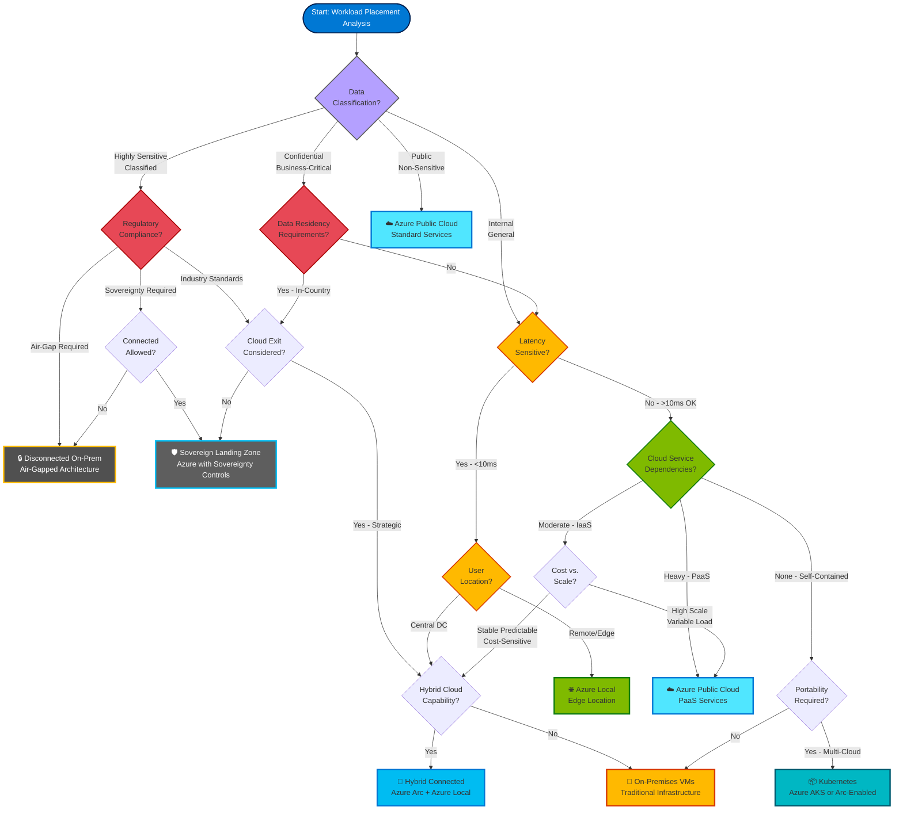

# Workload Placement Framework

## Introduction

The Azure Hybrid Continuum offers a spectrum of deployment models — from fully cloud-native to completely disconnected on-premises. The central question facing architects is: **Where should each workload run?** The Workload Placement Framework provides a structured, repeatable methodology for making this decision based on technical, regulatory, economic, and operational factors.

Workload placement is **not a one-time decision**. As regulations evolve, costs change, and technologies mature, workloads may need to migrate along the continuum. This framework enables organizations to assess current placement, identify misaligned workloads, and plan future migrations.

!!! info "Framework Summary"
    **Purpose:** Guide placement decisions across the Azure Hybrid Continuum  
    **Approach:** Multi-criteria analysis with weighted scoring  
    **Output:** Recommended deployment model per workload  
    **Cadence:** Reassess annually or when requirements change

## The Workload Placement Decision

Workload placement balances **competing concerns**:

- **Compliance:** Data residency regulations may mandate on-premises deployment
- **Performance:** Latency requirements may demand edge computing
- **Cost:** Long-term economics may favor cloud or on-premises depending on utilization patterns
- **Agility:** Cloud-native platforms enable faster iteration and scaling
- **Control:** On-premises provides maximum operational autonomy
- **Skills:** Team capabilities constrain technology choices

There is **no universal best placement**. A workload optimal for cloud-native deployment (variable demand, global users, development focus) differs from one optimal for on-premises (sustained utilization, local users, operational maturity).

## Decision Criteria

### 1. Data Residency and Sovereignty

**Question:** Where must data physically reside to satisfy regulatory and compliance requirements?

**Options:**

- **No constraints:** Data may reside anywhere globally → **Cloud-Native**
- **Regional constraints:** Data must remain in specific Azure regions (e.g., EU for GDPR) → **Cloud-Native** (region-restricted)
- **National constraints:** Data must remain within national borders → **Hybrid Connected** (Azure Local) or **Sovereign Cloud**
- **On-premises mandate:** Data cannot leave organization's physical control → **Hybrid Disconnected**

**Regulatory Frameworks Driving Placement:**

| Framework | Scope | Typical Placement |
|-----------|-------|-------------------|
| **GDPR (EU)** | Personal data of EU residents | Cloud-Native (EU regions) or Hybrid Connected |
| **HIPAA (US)** | Protected health information | Cloud-Native (with BAA) or Hybrid Connected |
| **PCI-DSS** | Payment card data | Hybrid Connected (cardholder data on-prem) |
| **FedRAMP (US Gov)** | Federal government data | Azure Government Cloud or Hybrid Connected |
| **ITAR (US Defense)** | Defense-related technical data | Hybrid Disconnected (air-gapped) |
| **PIPL (China)** | Chinese citizen personal data | On-premises in China or approved cloud |

!!! warning "Data Classification First"
    Conduct data classification before placement decisions. Not all data in an application has the same residency requirements. **Split placement** — frontend in cloud, sensitive backend on-premises — is often optimal.

### 2. Connectivity Requirements

**Question:** Can the workload tolerate loss of internet connectivity?

**Options:**

- **Always-connected:** Workload requires persistent internet connectivity (APIs calling external services) → **Cloud-Native**
- **Intermittent connectivity:** Workload functions with periodic disconnection (local processing, sync-when-connected) → **Hybrid Connected** or **Edge**
- **Zero connectivity:** Workload must function with no internet (air-gapped, classified networks) → **Hybrid Disconnected**

**Connectivity Decision Tree:**

```
Does workload require external API access (payment processing, geolocation, SaaS)?
  ├─ YES → Cloud-Native or Hybrid Connected
  └─ NO → Can workload tolerate loss of management connectivity?
           ├─ YES → Hybrid Disconnected possible
           └─ NO → Hybrid Connected required
```

### 3. Latency Requirements

**Question:** What is the maximum acceptable latency between users/data and compute?

**Latency Bands:**

| Latency Requirement | Distance to Azure | Recommended Placement |
|---------------------|-------------------|------------------------|
| **< 1ms** | Impossible from cloud | On-premises / Edge (same building) |
| **< 5ms** | < 100 miles from region | Edge or Hybrid Connected |
| **< 20ms** | < 500 miles from region | Hybrid Connected or Cloud (nearest region) |
| **< 50ms** | < 1,500 miles from region | Cloud-Native (nearest region) |
| **< 200ms** | Global | Cloud-Native (multi-region) |
| **Latency-insensitive** | Anywhere | Cloud-Native (any region) |

**Use Cases by Latency:**

- **< 1ms:** High-frequency trading, industrial control systems (PLCs, SCADA), autonomous vehicles
- **< 5ms:** Real-time gaming, AR/VR, healthcare imaging (PACS), video conferencing
- **< 20ms:** E-commerce checkout, collaboration tools, database applications
- **< 50ms:** Web applications, CRM, email
- **< 200ms:** Batch processing, reporting, non-interactive analytics

!!! tip "Measure Real Latency"
    Use `Test-NetConnection` (PowerShell) or `ping` to measure actual latency from user locations to Azure regions before making placement decisions.

### 4. Service Dependencies

**Question:** What Azure PaaS services does the workload depend on?

**Dependency Depth Assessment:**

| Dependency Level | Example | Cloud Exit Effort | Recommended Placement |
|------------------|---------|-------------------|------------------------|
| **None** | VMs with custom apps | Low (lift-and-shift) | Any placement viable |
| **Light** | Azure SQL Database | Medium (replace with SQL Server) | Cloud-Native or Hybrid Connected |
| **Moderate** | AKS + Azure Monitor | Medium-High (replace with K8s + Prometheus) | Cloud-Native or Hybrid Connected |
| **Heavy** | Functions + Event Grid + Cosmos DB | High (rearchitect) | Cloud-Native preferred |
| **Deep** | Cognitive Services + Logic Apps + ... | Very High (rebuild) | Cloud-Native strongly preferred |

**PaaS Dependency Migration Complexity:**

- **Low complexity:** Azure SQL Database → SQL Server, Azure Files → SMB shares
- **Medium complexity:** Azure Service Bus → RabbitMQ, Azure Blob Storage → MinIO
- **High complexity:** Azure Functions → OpenFaaS + refactoring, Cosmos DB → MongoDB + API changes
- **Very high complexity:** Azure Cognitive Services → self-hosted ML models, Azure Logic Apps → custom workflow engine

### 5. Scale and Elasticity

**Question:** How does workload demand vary over time?

**Demand Patterns:**

| Pattern | Description | Optimal Placement |
|---------|-------------|-------------------|
| **Constant** | Steady utilization 24/7 (±10%) | On-premises (CapEx amortization) |
| **Predictable** | Known daily/weekly cycles (e.g., business hours) | Cloud with autoscaling or On-premises with adequate capacity |
| **Variable** | Unpredictable spikes (viral content, flash sales) | Cloud-Native (elastic autoscaling) |
| **Bursty** | Long idle periods, rare intense activity | Cloud-Native (pay-per-use) |
| **Seasonal** | Annual peaks (tax season, holidays) | Hybrid with cloud burst capability |

**Cost Comparison:**

For a workload using **10 VMs equivalent** (D4s_v3: 4 vCPU, 16GB RAM):

| Utilization | Azure 3-Year Reserved | On-Premises 5-Year Amortization | Winner |
|-------------|------------------------|----------------------------------|--------|
| **20% (bursty)** | $50,000 | $120,000 | ☁️ Cloud |
| **50% (variable)** | $125,000 | $120,000 | ⚖️ Comparable |
| **80% (constant)** | $200,000 | $120,000 | 🏢 On-Premises |
| **100% (sustained)** | $250,000 | $120,000 | 🏢 On-Premises |

*Assumes: Azure D4s_v3 3-year reserved = $175/month/VM; on-premises server = $5K CapEx/server + $2K/year OpEx*

!!! note "Cloud Burst Pattern"
    For workloads with **predictable baseline + unpredictable spikes**, use hybrid placement: baseline capacity on-premises, burst to cloud during peaks.

### 6. Operational Maturity

**Question:** Does the operations team have the skills and capacity to manage on-premises infrastructure?

**Capability Assessment:**

| Capability | Cloud-Native | Hybrid Connected | Hybrid Disconnected |
|------------|--------------|------------------|---------------------|
| **Infrastructure management** | Azure-managed | Requires on-prem infra skills | Requires deep infra expertise |
| **Kubernetes operations** | AKS-managed | Requires K8s knowledge | Requires K8s + air-gap expertise |
| **Database administration** | Fully managed | Requires DBA for Arc-enabled services | Requires DBA + HA/DR setup |
| **Security operations** | Defender for Cloud | Hybrid security + local SIEM | Full local SOC required |
| **Incident response** | Azure support | Hybrid (Azure + on-prem) | Fully self-reliant |

**Red Flags for On-Premises Deployment:**

- Team has no Kubernetes experience (but workload requires K8s)
- No 24/7 on-call rotation (for production workloads)
- No experience with database clustering and failover
- No budget for training or hiring specialized personnel

### 7. Cost Model

**Question:** What is the 3-5 year total cost of ownership for each placement option?

**TCO Components:**

**Cloud-Native:**
- ✅ **No upfront CapEx** (pay-as-you-go)
- ✅ **Minimal operational labor** (Azure-managed)
- ❌ **Egress costs** for data leaving Azure
- ❌ **Premium for managed services** vs. self-managed

**On-Premises:**
- ❌ **High upfront CapEx** (servers, storage, networking)
- ❌ **Data center costs** (power, cooling, space)
- ❌ **Operational labor** (24/7 operations team)
- ✅ **No egress fees**
- ✅ **Lower per-unit cost at scale**

**Breakeven Analysis:**

Run a TCO calculator (Azure TCO Calculator, CloudHealth, custom spreadsheet) comparing:

1. Azure costs (compute + storage + networking + managed services)
2. On-premises costs (hardware + data center + salaries + software licenses)
3. Hybrid costs (Azure management plane + on-premises infrastructure)

!!! tip "Include Hidden Costs"
    On-premises TCO often underestimates:
    
    - **Facilities:** Power, cooling, physical security ($100-300/kW/year)
    - **Network:** Internet connectivity, firewall management
    - **Opportunity cost:** Staff time spent on infrastructure vs. innovation
    - **Refresh cycles:** Hardware replacement every 3-5 years

### 8. Team Skills and Preferences

**Question:** What technologies is the development team proficient in?

Developer productivity matters. A team expert in Azure PaaS services will be slower and produce lower-quality code when forced to use self-hosted alternatives they don't know.

**Skill Alignment:**

- **Cloud-first team:** Experienced with Azure services, prefers managed platforms → **Cloud-Native**
- **DevOps team:** Skilled in Kubernetes, Terraform, GitOps → **Hybrid Connected** viable
- **Infrastructure team:** Deep Linux/Windows admin skills, prefers control → **Hybrid Disconnected** viable

## Workload Classification Matrix

Combine criteria to determine recommended placement:

| Workload Type | Example | Residency | Latency | PaaS Deps | Scale | Placement |
|---------------|---------|-----------|---------|-----------|-------|-----------|
| **Global Web App** | E-commerce site | None | < 50ms | Heavy | Variable | ☁️ Cloud-Native (multi-region) |
| **Internal CRM** | Salesforce alternative | None | < 50ms | Moderate | Constant | ☁️ Cloud-Native or 🏢 On-Premises |
| **Healthcare EHR** | Patient records | On-premises | < 20ms | Light | Constant | 🔗 Hybrid Connected |
| **Industrial SCADA** | Factory automation | On-premises | < 5ms | None | Constant | 🏢 On-Premises (Edge) |
| **Classified System** | Defense application | Air-gapped | N/A | None | Constant | 🚫 Hybrid Disconnected |
| **Batch Analytics** | Nightly reports | None | Latency-insensitive | Light | Bursty | ☁️ Cloud-Native (spot instances) |
| **Financial Trading** | HFT platform | On-premises | < 1ms | None | Constant | 🏢 On-Premises (co-location) |
| **Mobile Backend** | API for mobile app | None | < 100ms | Heavy | Variable | ☁️ Cloud-Native (global) |

Legend: ☁️ Cloud-Native | 🔗 Hybrid Connected | 🏢 On-Premises | 🚫 Disconnected

## Placement Decision Tree

Use this flowchart to guide decisions:

```
START: Assess Workload

┌─────────────────────────────────────┐
│ Is data air-gapped / classified?    │
└─────────────────────────────────────┘
         │
         ├─ YES → 🚫 Hybrid Disconnected [FINAL]
         │
         └─ NO ↓

┌─────────────────────────────────────┐
│ Regulatory mandate for on-prem?     │
└─────────────────────────────────────┘
         │
         ├─ YES → Continue to latency check
         │
         └─ NO ↓

┌─────────────────────────────────────┐
│ Latency requirement < 5ms?          │
└─────────────────────────────────────┘
         │
         ├─ YES → 🏢 On-Premises or 🔗 Hybrid Connected [FINAL]
         │
         └─ NO ↓

┌─────────────────────────────────────┐
│ Heavy PaaS dependencies?            │
└─────────────────────────────────────┘
         │
         ├─ YES → ☁️ Cloud-Native preferred (exit cost high)
         │
         └─ NO ↓

┌─────────────────────────────────────┐
│ Workload utilization pattern?       │
└─────────────────────────────────────┘
         │
         ├─ Variable/Bursty → ☁️ Cloud-Native (autoscaling)
         ├─ Seasonal → 🔗 Hybrid with cloud burst
         └─ Constant → 🏢 On-Premises (TCO) or ☁️ Cloud (managed ops)

┌─────────────────────────────────────┐
│ Operations team maturity?           │
└─────────────────────────────────────┘
         │
         ├─ Low (< 5 engineers, no K8s) → ☁️ Cloud-Native
         └─ High (24/7 ops, deep expertise) → 🏢 On-Premises viable
```



## Hybrid Split Placement

Many workloads benefit from **split placement** — different tiers running in different environments:

### Pattern 1: Cloud Frontend, On-Premises Backend

**Use Case:** Regulated industries with sensitive data and global users

**Architecture:**
- **Frontend (Cloud):** Web UI, API gateway, CDN in Azure (global)
- **Backend (On-Premises):** Databases, business logic on Azure Local (data residency)
- **Integration:** ExpressRoute or VPN for secure backend access

**Benefits:**
- Global low-latency user experience
- Data sovereignty compliance
- Cloud agility for user-facing features

**Example:** European bank with GDPR requirements serves web UI from Azure West Europe, but customer financial data stays in on-premises datacenter in Frankfurt.

### Pattern 2: On-Premises Processing, Cloud Analytics

**Use Case:** High-volume data generation at edge with cloud-based ML/analytics

**Architecture:**
- **Edge (On-Premises):** Sensors, IoT devices, local data processing on Azure Local
- **Cloud (Azure):** Aggregated data sent to Azure Data Lake, analyzed with Azure Synapse, ML models trained
- **Integration:** Azure IoT Hub or Event Hubs for telemetry ingestion

**Benefits:**
- Reduced bandwidth (process and filter at edge)
- Real-time local decisions
- Historical analytics and ML in cloud

**Example:** Manufacturing plant runs predictive maintenance models locally on Azure Local for real-time alerts, sends aggregated telemetry to Azure for long-term trend analysis.

### Pattern 3: Hybrid Kubernetes

**Use Case:** Consistent application deployment across cloud and on-premises

**Architecture:**
- **On-Premises:** AKS on Azure Local running production workloads
- **Cloud:** AKS in Azure running dev/test and burst capacity
- **Management:** Azure Arc provides unified control plane
- **GitOps:** Flux or Argo CD deploys from Git to both clusters

**Benefits:**
- Consistent APIs and tooling
- Disaster recovery (failover to cloud)
- Dev/test isolation (no impact on production)

## Workload Migration Scenarios

Workloads can **move along the continuum** as requirements change:

### Scenario 1: Cloud → Hybrid Connected (Regulatory Change)

**Trigger:** New regulation mandates on-premises data residency

**Migration Path:**
1. Deploy Azure Local on-premises
2. Enable Azure Arc for hybrid management
3. Migrate databases to Arc-enabled SQL Managed Instance
4. Rehost application containers to AKS on Azure Local
5. Maintain Azure Monitor for observability

### Scenario 2: On-Premises → Cloud (Scale Requirements)

**Trigger:** Workload experiences unpredictable global demand

**Migration Path:**
1. Containerize on-premises application
2. Deploy to AKS in Azure (multi-region)
3. Replace self-hosted PostgreSQL with Azure Database for PostgreSQL
4. Implement Azure Front Door for global load balancing
5. Decommission on-premises infrastructure after validation

### Scenario 3: Hybrid Connected → Hybrid Disconnected (Threat Model Change)

**Trigger:** Zero-trust policy mandates air-gapped deployment

**Migration Path:**
1. Disable Azure Arc agents (disconnect from Azure)
2. Deploy local monitoring (Prometheus + Grafana)
3. Replace Arc-enabled data services with self-managed SQL Server
4. Deploy local identity (AD DS, ADFS)
5. Establish offline update procedures

## Reassessing Placement Over Time

Workload placement is **not static**. Reassess annually or when:

- **Regulations change:** New data residency laws enacted
- **Costs shift:** Azure pricing changes or on-premises lease renewal
- **Technology evolves:** New Azure services address previous limitations
- **Business priorities change:** Shift from cost optimization to agility
- **Security posture changes:** New threat models require different placement

**Reassessment Process:**

1. **Annual review:** Evaluate all workloads against current criteria
2. **Cost comparison:** Update TCO models with current pricing
3. **Compliance audit:** Verify alignment with latest regulations
4. **Team skill assessment:** Review operations team capabilities
5. **Migration planning:** Identify misaligned workloads, plan migrations

## Placement Examples by Industry

### Healthcare (Hospital)

| Workload | Placement | Rationale |
|----------|-----------|-----------|
| **Electronic Health Records (EHR)** | 🔗 Hybrid Connected | HIPAA requires data control; Arc-enabled SQL for management |
| **Medical imaging (PACS)** | 🏢 On-Premises | < 5ms latency required; large data volumes (TB/day) |
| **Patient portal** | ☁️ Cloud-Native | Internet-facing, low sensitivity, variable demand |
| **Billing system** | ☁️ Cloud-Native | Integration with cloud payment processors required |

### Financial Services (Bank)

| Workload | Placement | Rationale |
|----------|-----------|-----------|
| **Core banking system** | 🏢 On-Premises | Regulatory mandate, constant utilization, low latency |
| **Mobile banking app (backend)** | ☁️ Cloud-Native | Global users, variable demand, frequent updates |
| **Fraud detection ML** | ☁️ Cloud-Native | Requires Azure ML, large compute for model training |
| **ATM network** | 🔗 Hybrid Connected | Local presence required, Azure management desired |

### Manufacturing (Factory)

| Workload | Placement | Rationale |
|----------|-----------|-----------|
| **SCADA / PLC control** | 🏢 On-Premises (Edge) | < 1ms latency, air-gapped for safety |
| **MES (Manufacturing Execution)** | 🔗 Hybrid Connected | Local operations, cloud reporting |
| **Predictive maintenance ML** | ☁️ Cloud-Native | Requires large compute for model training |
| **Supply chain management** | ☁️ Cloud-Native | Integration with suppliers' cloud systems |

### Government (Defense)

| Workload | Placement | Rationale |
|----------|-----------|-----------|
| **Classified systems** | 🚫 Hybrid Disconnected | ITAR/classified mandate, air-gapped |
| **Unclassified collaboration** | ☁️ Azure Government | FedRAMP High, cloud efficiency |
| **Edge tactical systems** | 🏢 On-Premises | Deployed in field, no connectivity |
| **Logistics and HR** | ☁️ Azure Government | Non-sensitive, standard SaaS |

## Tools for Placement Assessment

### Azure Migrate

Azure Migrate provides **automated discovery and assessment** for on-premises workloads considering cloud migration:

- Server inventory and dependency mapping
- Azure sizing recommendations
- Cost estimates (pay-as-you-go, reserved, hybrid benefit)
- Readiness assessment (supported OS, compatibility issues)

**Use for:** On-Premises → Cloud placement assessment

### Azure TCO Calculator

Web-based tool for comparing cloud vs. on-premises costs:

- Input current infrastructure (servers, storage, network)
- Receive Azure cost estimate and savings projection
- Adjust assumptions (power costs, labor rates, utilization)

**Use for:** Cost-based placement decisions

### Azure Advisor

Provides **recommendations for existing Azure resources**:

- Cost optimization (resize VMs, use reserved instances)
- Reliability improvements (enable backups, multi-region)
- Security recommendations (enable MFA, update OS)
- Performance optimization (scale resources, enable caching)

**Use for:** Optimizing already-deployed cloud workloads

### Custom Placement Scorecard

Build a weighted scorecard for systematic assessment:

| Criterion | Weight | Cloud Score | On-Prem Score | Hybrid Score |
|-----------|--------|-------------|---------------|--------------|
| Residency | 30% | 0 | 10 | 7 |
| Latency | 20% | 7 | 10 | 9 |
| PaaS Deps | 15% | 10 | 0 | 5 |
| Cost (3yr) | 15% | 8 | 6 | 7 |
| Team Skills | 10% | 10 | 4 | 7 |
| Agility | 10% | 10 | 3 | 6 |
| **Total** | **100%** | **7.0** | **6.3** | **6.9** |

Highest score = recommended placement.

## Key Takeaways

1. **No one-size-fits-all:** Placement depends on workload-specific requirements
2. **Data classification first:** Not all data in a workload has same residency needs
3. **Hybrid is common:** Split placement (cloud + on-premises) often optimal
4. **Reassess regularly:** Requirements and costs change; placement should evolve
5. **TCO matters:** Consider 3-5 year costs, not just monthly bills
6. **Skills constrain options:** Team capabilities limit viable placement choices
7. **Migration is bidirectional:** Workloads can move cloud → on-prem or vice versa

## References

- [Azure Well-Architected Framework](https://learn.microsoft.com/en-us/azure/well-architected/)
- [Cloud Adoption Framework — Strategy](https://learn.microsoft.com/en-us/azure/cloud-adoption-framework/strategy/)
- [Azure Migrate](https://learn.microsoft.com/en-us/azure/migrate/)
- [Azure TCO Calculator](https://azure.microsoft.com/pricing/tco/calculator/)
- [Azure Advisor](https://learn.microsoft.com/en-us/azure/advisor/)
- [Azure Hybrid and Multicloud Solutions](https://learn.microsoft.com/en-us/azure/architecture/browse/?azure_categories=hybrid)

---

> **Next:** [Part 5 — Sovereign Landing Zone Guide →](../05-sovereign-landing-zone-guide/README.md)

---

> **Next:** [Part 5 — Sovereign Landing Zone Guide →](../05-sovereign-landing-zone-guide/README.md)
