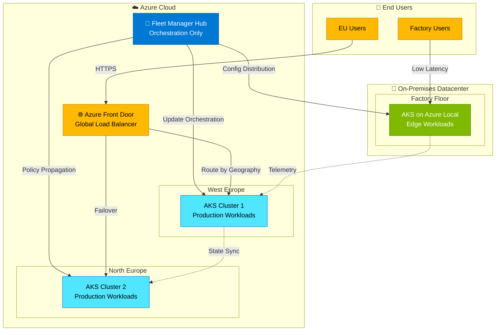
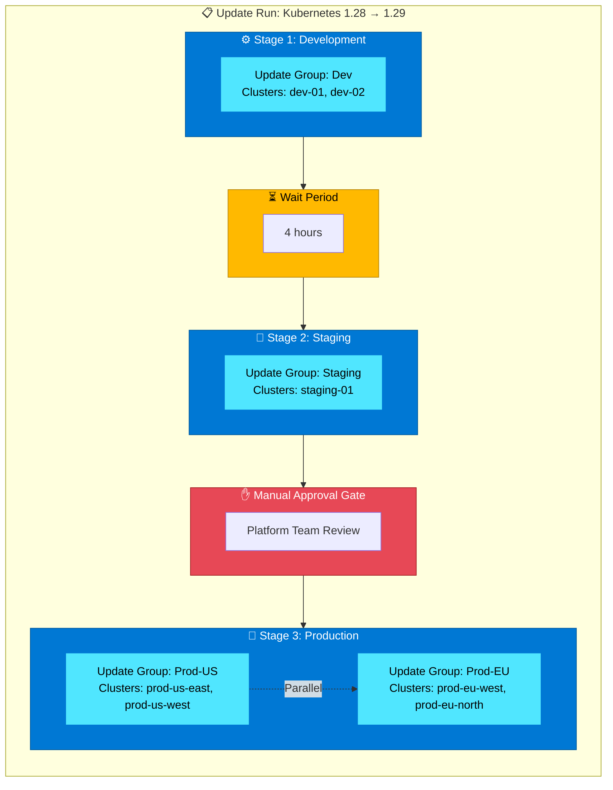

# Multi-Cluster AKS and Fleet Manager Pattern

## Introduction

As organizations scale their Kubernetes operations across multiple datacenters, regions, and cloud environments, managing multiple AKS clusters becomes a critical challenge. The **multi-cluster Fleet Manager pattern** addresses this complexity by providing centralized orchestration, consistent configuration management, and intelligent workload placement across a fleet of Kubernetes clusters spanning cloud and on-premises environments.

Azure Kubernetes Fleet Manager enables platform administrators to manage clusters at scale—whether those clusters run in multiple Azure regions, across different subscriptions, or even extend to on-premises infrastructure via Azure Local. This pattern is especially relevant for organizations operating in **Stage 3 (Hybrid)** of the Azure Hybrid Continuum, where workloads are strategically split between cloud and local environments, requiring unified management, coordinated updates, and traffic distribution across geographically distributed clusters.

!!! info "Pattern Summary"
    **Deployment Model:** Multi-cluster orchestration across cloud and on-premises  
    **Management Plane:** Azure Kubernetes Fleet Manager (hub cluster)  
    **Member Clusters:** AKS clusters (cloud) + AKS on Azure Local (on-premises) + Arc-enabled Kubernetes  
    **Use Cases:** Multi-region HA, disaster recovery, geo-distributed applications, staged rollouts  
    **Network Requirements:** Hub-to-member connectivity (direct or through Azure backbone)

## Pattern Definition

The multi-cluster Fleet Manager pattern separates orchestration responsibilities from workload execution:

- **Fleet Manager (Hub):** Centralized control plane for policy enforcement, update orchestration, and resource propagation
- **Member Clusters:** Independent AKS clusters that can run in Azure regions, on Azure Local, or as Arc-enabled Kubernetes clusters
- **Update Orchestration:** Staged, safe rollouts of Kubernetes and node image upgrades across clusters with approval gates
- **Resource Propagation:** Fleet-scoped Kubernetes resources (ConfigMaps, Secrets, Policies) distributed to selected member clusters
- **Load Balancing:** DNS-based or L7 traffic distribution across service endpoints on multiple clusters

!!! example "🔗 Working Scenarios"
    **Multi-region e-commerce platform:** Product catalog and inventory services replicated across three AKS clusters (West Europe, North Europe, UK South) with Azure Front Door distributing traffic based on geography and health.  
    
    **Hybrid manufacturing system:** Real-time production monitoring runs on AKS on Azure Local in the factory floor (low latency), while analytics and reporting run on cloud AKS, all managed through a single Fleet Manager instance.

This architecture enables **centralized management without centralized execution**, allowing teams to maintain consistent policies and configurations while workloads run close to users and data.

## When to Use Multi-Cluster Fleet Manager

The multi-cluster Fleet Manager pattern is optimal when:

✅ **Multi-region presence required:** Applications serve users across geographies requiring low-latency access  
✅ **High availability critical:** Business continuity demands active-active or active-passive cluster topologies  
✅ **Hybrid deployment:** Workloads span cloud AKS and on-premises AKS on Azure Local  
✅ **Consistent governance:** Organization needs uniform policies across 5+ Kubernetes clusters  
✅ **Staged rollout requirements:** Platform teams must orchestrate updates across test, staging, and production environments  
✅ **Disaster recovery:** Applications require automated failover between cloud and on-premises clusters

Multi-cluster Fleet Manager is **not suitable** when:

❌ Single cluster with zonal redundancy meets availability requirements  
❌ Organization manages fewer than 3 clusters with infrequent changes  
❌ Network connectivity between hub and members is unreliable (< 95% uptime)  
❌ Air-gapped member clusters cannot maintain outbound connectivity to Fleet Manager  
❌ Workload placement decisions must be made without centralized orchestration

## Multi-Datacenter AKS Patterns

### Pattern 1: Hub-and-Spoke Cluster Topology

**Use Case:** Centralized management with distributed workload execution across cloud and on-premises.

**Architecture:**
- **Hub cluster:** Fleet Manager instance (no user workloads)
- **Spoke clusters:** Regional AKS clusters + on-premises AKS on Azure Local
- **Management flow:** Policies, configurations, and updates flow from hub to spokes
- **Data flow:** User traffic never touches hub; workloads communicate peer-to-peer or through Azure backbone



**Figure: Hub-and-Spoke Topology** — Fleet Manager orchestrates policies and updates from the hub, while user traffic routes directly to member clusters based on proximity. On-premises clusters receive the same management experience as cloud clusters.

### Pattern 2: Active-Active Multi-Cluster (High Availability)

**Use Case:** Zero-downtime applications with workloads replicated across multiple clusters for high availability and load distribution.

**Architecture:**
- **Multiple active clusters:** All clusters serve production traffic simultaneously
- **Load balancing:** Azure Front Door or Traffic Manager distributes traffic based on geography, health, and latency
- **State synchronization:** Shared state persists in geo-replicated data services (Cosmos DB, Azure SQL with geo-replication)
- **Failover:** Automatic traffic rerouting if cluster becomes unhealthy

**Implementation Characteristics:**
- 🔄 **Workload replication:** Identical deployments across all clusters
- 📊 **Traffic distribution:** Weighted or round-robin load balancing
- 💾 **Stateless preferred:** Workloads designed for horizontal scalability
- 🔐 **Shared identity:** Centralized Entra ID for authentication across clusters

### Pattern 3: Active-Passive Disaster Recovery

**Use Case:** Cost-optimized disaster recovery where secondary cluster runs at reduced capacity or remains idle until failover.

**Architecture:**
- **Primary cluster:** Serves all production traffic under normal conditions
- **Secondary cluster:** Scaled down or idle, ready to accept traffic during DR event
- **Failover mechanism:** Manual or automated traffic rerouting via DNS update in Traffic Manager
- **Data replication:** Continuous backup/restore or geo-replication to secondary region

**Recovery Time Objective (RTO):**
- Active-warm secondary: 5-15 minutes (cluster ready, needs scaling)
- Active-cold secondary: 30-60 minutes (cluster must be provisioned and scaled)

### Pattern 4: Cloud-Burst Pattern

**Use Case:** Baseline workloads run on-premises (cost-optimized), burst to cloud AKS during peak demand periods.

**Architecture:**
- **Baseline tier:** AKS on Azure Local handles typical daily load
- **Burst tier:** Cloud AKS clusters provisioned on-demand (manually or via KEDA autoscaling)
- **Trigger:** Metrics-driven scale-out when on-premises capacity reaches threshold (e.g., 80% CPU/memory)
- **Data locality:** Workloads access on-premises data stores with acceptable latency over ExpressRoute/VPN

**When to Apply:**
- Predictable peak periods (retail holiday season, financial quarter-end)
- Cost sensitivity (avoid paying for full cloud capacity year-round)
- Data gravity (large datasets cannot easily move to cloud)

### Pattern 5: Geo-Distributed Pattern

**Use Case:** Applications serving users across multiple continents with data residency and low-latency requirements.

**Architecture:**
- **Regional clusters:** Clusters deployed in each required geography (e.g., Europe, North America, Asia-Pacific)
- **Data residency:** User data remains in region of origin to comply with GDPR, PIPL, or other regulations
- **Routing:** Geo-proximity routing directs users to nearest cluster
- **Cross-cluster discovery:** Service mesh (Istio, Linkerd) enables service-to-service communication across clusters when needed

## Azure Kubernetes Fleet Manager Capabilities

### Cluster-Wide Resource Propagation

Fleet Manager enables distribution of Kubernetes resources to selected member clusters based on labels and placement policies.

**Supported Resource Types:**
- ConfigMaps and Secrets (configuration and credentials)
- NetworkPolicies (consistent security rules)
- ResourceQuotas (capacity governance)
- Custom Resource Definitions (CRDs) and their instances

**Placement Strategies:**
- **PickAll:** Resource deployed to all member clusters
- **PickN:** Resource deployed to N clusters (e.g., 3 out of 5)
- **PickFixed:** Resource deployed to explicitly named clusters
- **Label selectors:** Resource deployed to clusters matching labels (e.g., `environment=production`)

!!! note "ClusterResourcePlacement"
    The `ClusterResourcePlacement` custom resource defines which Kubernetes objects to propagate and to which member clusters. Fleet Manager monitors these resources and ensures declared state matches actual state across the fleet.

### Update Orchestration

Fleet Manager orchestrates safe, staged rollouts of Kubernetes version upgrades and node image updates across member clusters.



**Figure: Staged Update Orchestration** — Updates roll out progressively from development to production environments with configurable wait periods and approval gates. Production groups can update in parallel to reduce overall rollout time while maintaining safety.

**Update Run Components:**
- **Update Stages:** Sequential phases (e.g., dev → staging → production)
- **Update Groups:** Collections of clusters updated together (can run in parallel within a stage)
- **Wait Periods:** Mandatory delays between stages for monitoring and validation
- **Approval Gates:** Manual or automated checks before proceeding to next stage
- **Maintenance Windows:** Updates honor AKS-level maintenance windows for each cluster

**Node Image Update Options:**
- **Latest:** Use freshest available node image (may differ by region)
- **Consistent:** Select latest common image across all regions for predictable results

### Multi-Cluster Networking and Load Balancing

Fleet Manager provides DNS-based layer 4 load balancing across service endpoints on multiple member clusters.

**ServiceExport Pattern:**
```yaml
apiVersion: networking.fleet.azure.com/v1alpha1
kind: ServiceExport
metadata:
  name: frontend
  namespace: production
spec:
  ports:
  - port: 80
    protocol: TCP
---
apiVersion: fleet.azure.com/v1alpha1
kind: MultiClusterService
metadata:
  name: frontend
spec:
  serviceImport:
    name: frontend
  dnsPrefix: frontend.contoso.com
  clusters:
  - name: cluster-westus
  - name: cluster-eastus
  - name: cluster-centralus
```

Traffic distributes across healthy endpoints using weighted round-robin with automatic failover when cluster health checks fail.

### Fleet-Wide RBAC and Governance

**Centralized Policy Enforcement:**
- Azure Policy for Kubernetes applied fleet-wide
- Consistent RBAC roles across member clusters
- Audit logging aggregated in centralized Log Analytics workspace

**Example Policies:**
- Enforce pod security standards (restricted, baseline)
- Require resource limits on all containers
- Block privileged containers fleet-wide
- Mandate network policies in all namespaces

## Hybrid Fleet Architecture: Cloud + Azure Local

One of Fleet Manager's unique capabilities is **unified management of heterogeneous clusters**—cloud AKS and on-premises AKS on Azure Local can belong to the same fleet.

### Enrolling AKS on Azure Local as Fleet Members

**Prerequisites:**
- AKS on Azure Local deployed and Arc-enabled
- Outbound HTTPS connectivity to Fleet Manager endpoint
- Azure RBAC permissions to join fleet

**Enrollment Process:**
```bash
# Join on-premises AKS cluster to fleet
az fleet member create \
  --resource-group fleet-rg \
  --fleet-name production-fleet \
  --name factory-cluster-01 \
  --member-cluster-id /subscriptions/.../Microsoft.Kubernetes/connectedClusters/factory-aks
```

Once enrolled, on-premises clusters receive identical management experience:
- Update orchestration (Kubernetes and node image upgrades)
- Resource propagation (ConfigMaps, Secrets, Policies)
- Fleet-wide monitoring and health dashboards

### Managing Heterogeneous Clusters

**Handling Differences:**
- **Node counts:** Cloud clusters may scale to 100+ nodes; on-premises limited by hardware
- **Specialized hardware:** On-premises clusters may have GPUs, FPGAs, or custom accelerators
- **Network topology:** On-premises clusters behind firewall; cloud clusters in VNets
- **Update schedules:** On-premises maintenance windows may differ from cloud (off-shift requirements)

**Label-Based Workload Placement:**
```yaml
apiVersion: placement.kubernetes-fleet.io/v1beta1
kind: ClusterResourcePlacement
metadata:
  name: gpu-workloads
spec:
  resourceSelectors:
  - group: apps
    version: v1
    kind: Deployment
    name: ml-training
  policy:
    placementType: PickAll
    affinity:
      clusterAffinity:
        clusterSelectorTerms:
        - labelSelector:
            matchLabels:
              hardware: gpu
              environment: production
```

### Network Connectivity Requirements

**Hub-to-Member Communication:**
- Fleet Manager initiates connections to member clusters (outbound from members)
- HTTPS (port 443) required for management plane traffic
- No requirement for member-to-member direct connectivity (unless using service mesh)

**On-Premises Connectivity Options:**
- **ExpressRoute:** Recommended for production (low latency, high throughput)
- **Site-to-Site VPN:** Acceptable for management traffic (updates, config propagation)
- **Public internet with private endpoints:** Azure Private Link for Fleet Manager endpoint

## Supporting Tools and Patterns

### GitOps Integration with Flux

Fleet Manager integrates natively with Flux v2 for Git-based continuous deployment.

**Pattern: GitOps + Fleet Manager**
1. **Source of truth:** Kubernetes manifests stored in Git repository
2. **Fleet-level Flux config:** Single FluxConfiguration applied at fleet level
3. **Propagation:** Flux controllers deployed to all member clusters via Fleet Manager
4. **Reconciliation:** Each cluster continuously syncs with Git repository

**Benefits:**
- Single Git commit updates configuration across entire fleet
- Declarative rollback (revert Git commit, all clusters reconcile)
- Audit trail (Git history shows who changed what and when)

**Example FluxConfiguration:**
```yaml
apiVersion: clusterconfig.azure.com/v1
kind: FluxConfiguration
metadata:
  name: fleet-apps
spec:
  sourceKind: GitRepository
  url: https://github.com/contoso/fleet-apps
  branch: main
  kustomizations:
  - name: apps
    path: ./production
    prune: true
    timeout: 5m
```

### Azure Traffic Manager and Front Door

**Global Traffic Distribution:**

| Service | Use Case | Routing Methods |
|---------|----------|-----------------|
| **Azure Traffic Manager** | DNS-based routing (layer 4) | Geographic, performance, weighted, priority |
| **Azure Front Door** | HTTP/HTTPS routing (layer 7) | Path-based, header-based, latency-based, session affinity |
| **Fleet DNS Load Balancing** | Multi-cluster service discovery | Weighted round-robin, health-based |

**Recommended Pattern:**
- **Front Door** for external user-facing applications (WAF, caching, SSL termination)
- **Traffic Manager** for internal APIs and non-HTTP protocols
- **Fleet DNS Load Balancing** for service-to-service within Kubernetes

### Multi-Cluster Observability

**Centralized Monitoring Architecture:**
- **Azure Monitor for Containers:** Collects metrics and logs from all fleet members
- **Azure Managed Grafana:** Unified dashboards showing fleet-wide health
- **Prometheus federation:** Central Prometheus scrapes metrics from member cluster Prometheus instances

**Key Metrics to Monitor:**
- Update run success rate (% of clusters updated without errors)
- Resource propagation lag (time from hub update to member reconciliation)
- Cross-cluster latency (for service mesh scenarios)
- Cluster health score (composite of node health, pod failures, resource pressure)

### Azure Policy for Kubernetes

**Fleet-Wide Policy Assignment:**
```bash
# Assign policy to enforce pod security baseline across fleet
az policy assignment create \
  --name enforce-pod-security-baseline \
  --scope /subscriptions/.../resourceGroups/fleet-rg/providers/Microsoft.ContainerService/fleets/prod-fleet \
  --policy /providers/Microsoft.Authorization/policyDefinitions/a8eff44f-8c92-45c3-a3fb-9880802d67a7
```

**Example Policies:**
- Kubernetes cluster containers should only use allowed images
- Kubernetes cluster pods should use approved host network and port range
- Kubernetes clusters should not allow container privilege escalation
- Enforce HTTPS ingress in Kubernetes cluster

## Decision Framework

### When to Use Fleet Manager vs. Manual Multi-Cluster Management

**Choose Fleet Manager when:**
- Managing 5+ clusters with frequent configuration changes
- Compliance requires consistent policy enforcement across environments
- Update orchestration must be staged and auditable
- Team prefers Azure Portal for cluster lifecycle management
- Hybrid deployment spans cloud and Azure Local

**Choose manual management when:**
- Managing fewer than 5 clusters with static configuration
- GitOps alone (Flux, ArgoCD) meets orchestration needs
- Air-gapped clusters cannot maintain outbound connectivity
- Organization standardized on third-party multi-cluster tools (Rancher, OpenShift)

### Fleet Membership Topology Decisions

**Topology Option 1: Single Global Fleet**
- **Pros:** Unified management, consistent policies globally
- **Cons:** Update runs must account for all timezones, blast radius of misconfiguration is global
- **Best for:** Organizations with centralized platform team, uniform environments

**Topology Option 2: Regional Fleets**
- **Pros:** Isolated blast radius, region-specific update schedules, compliance boundaries
- **Cons:** Duplicate configuration management, policy drift risk between fleets
- **Best for:** Large enterprises with regional autonomy, strict data sovereignty requirements

**Topology Option 3: Environment-Based Fleets**
- **Pros:** Separate dev/staging/production fleets prevent accidental production changes
- **Cons:** Additional overhead for fleet management, potential for environment drift
- **Best for:** Organizations with strict change control, risk-averse compliance requirements

### Network Topology for Cross-Datacenter Clusters

**Connectivity Pattern Selection:**

| Pattern | Use Case | Latency | Cost | Complexity |
|---------|----------|---------|------|------------|
| **Hub-spoke VNet peering** | All clusters in same Azure subscription/tenant | < 2ms | Low | Low |
| **ExpressRoute** | Cloud + on-premises, private connectivity required | 5-20ms | High | Medium |
| **Site-to-Site VPN** | Cloud + on-premises, cost-sensitive | 10-50ms | Low | Low |
| **Public internet (Private Link)** | Distributed clusters, management-only traffic | 20-100ms | Low | Medium |
| **Service mesh (Istio)** | Microservices require cross-cluster communication | Varies | Medium | High |

### Cost Considerations

**Fleet Manager Costs:**
- Fleet resource: No charge for the fleet itself
- Hub cluster: If using hub cluster for resource propagation, standard AKS cluster costs apply
- Member clusters: Normal AKS or Azure Local costs (fleet membership does not add charges)

**Operational Costs:**
- **Cross-region traffic:** Data egress charges for workload communication between regions
- **ExpressRoute:** Monthly port fees + data transfer (if used for on-premises connectivity)
- **Monitoring:** Log Analytics ingestion and retention costs (scale with cluster count)

**Cost Optimization Strategies:**
- Use **PickN** placement to deploy resources to subset of clusters (e.g., 3 out of 10)
- Enable **Consistent** node image updates to minimize testing required across regions
- Consolidate smaller clusters to reduce per-cluster management overhead
- Use **spot node pools** in burst clusters for non-critical workloads

## Implementation Best Practices

### Start Small, Scale Progressively

1. **Phase 1:** Create fleet with 2-3 non-production clusters
2. **Phase 2:** Test update orchestration with dev/test environment updates
3. **Phase 3:** Add production clusters, implement approval gates
4. **Phase 4:** Extend fleet to on-premises AKS on Azure Local
5. **Phase 5:** Implement cross-cluster load balancing and service mesh

### Design for Failure

- **Cluster independence:** Member clusters should function if Fleet Manager temporarily unavailable
- **Update rollback:** Maintain previous Kubernetes version node pools during cluster upgrades for quick rollback
- **Gradual rollout:** Never update all production clusters simultaneously—use staged update runs
- **Health checks:** Configure aggressive health probes for load-balanced services to detect failures quickly

### Security Considerations

- **Least privilege:** Assign Fleet Manager RBAC roles at minimum required scope (Contributor on member cluster resource groups only)
- **Network isolation:** Use Azure Private Link for Fleet Manager endpoint to avoid exposure to public internet
- **Secret management:** Use Azure Key Vault with CSI driver for secrets in member clusters, not ConfigMaps
- **Audit logging:** Enable diagnostic settings on fleet resource to send logs to Log Analytics

## Considerations and Trade-offs

### Advantages

✅ **Operational consistency:** Uniform management experience across cloud and on-premises clusters  
✅ **Reduced operational burden:** Single pane of glass for multi-cluster updates and configuration  
✅ **Risk mitigation:** Staged rollouts with approval gates prevent fleet-wide outages  
✅ **Flexibility:** Member clusters can be added/removed without disrupting existing workloads  
✅ **Hybrid-ready:** First-class support for AKS on Azure Local and Arc-enabled Kubernetes

### Limitations

⚠️ **Hub dependency:** Fleet Manager unavailable → updates and resource propagation paused (existing workloads unaffected)  
⚠️ **Connectivity requirement:** Member clusters must maintain outbound HTTPS to Fleet Manager endpoint  
⚠️ **Resource types:** Not all Kubernetes resources support fleet-wide propagation (e.g., StatefulSets with local storage)  
⚠️ **Cross-cluster state:** Fleet Manager does not manage shared state—applications must handle data replication  
⚠️ **Learning curve:** Teams must understand Fleet-specific CRDs (ClusterResourcePlacement, ServiceExport)

### When NOT to Use This Pattern

Avoid multi-cluster Fleet Manager when:

- Single AKS cluster with availability zones meets SLA requirements (99.95% uptime)
- Application cannot tolerate split-brain scenarios (strongly consistent state required)
- Network latency between clusters exceeds application tolerance (> 100ms for synchronous calls)
- Organization lacks skills to operate distributed Kubernetes systems
- Air-gapped environment prohibits Fleet Manager connectivity

## References

### Official Azure Documentation

- [Azure Kubernetes Fleet Manager Overview](https://learn.microsoft.com/en-us/azure/kubernetes-fleet/overview)
- [Fleet Manager Update Orchestration](https://learn.microsoft.com/en-us/azure/kubernetes-fleet/concepts-update-orchestration)
- [Multi-Region AKS Best Practices](https://learn.microsoft.com/en-us/azure/aks/operator-best-practices-multi-region)
- [ClusterResourcePlacement API](https://learn.microsoft.com/en-us/azure/kubernetes-fleet/concepts-resource-placement)
- [GitOps with Flux on AKS](https://learn.microsoft.com/en-us/azure/azure-arc/kubernetes/conceptual-gitops-flux2)
- [Azure Front Door Overview](https://learn.microsoft.com/en-us/azure/frontdoor/front-door-overview)

### Related Patterns

- [Hybrid Connected Pattern](02-hybrid-connected.md) — Foundation for on-premises clusters in fleet
- [Workload Placement Framework](05-workload-placement.md) — Decide which workloads to deploy to which clusters
- [Cloud-Native Pattern](01-cloud-native.md) — Single-region AKS deployment without fleet orchestration

---

> **Next:** [Sovereign Landing Zone Guide →](../05-sovereign-landing-zone-guide/README.md)
