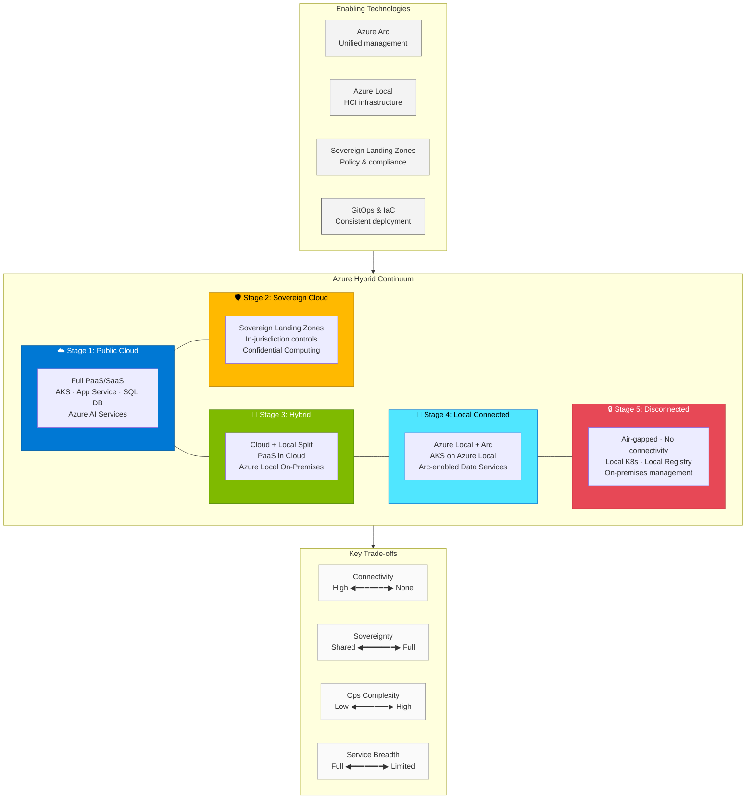

# Part 4: Architecture Patterns

This section presents proven, reusable architecture patterns for deploying workloads across the Azure Hybrid Continuum. Each pattern addresses a specific deployment model—from fully cloud-native to completely disconnected—with guidance on when to apply it and what trade-offs to consider. You'll also learn a decision framework for workload placement.

## What You'll Learn

- When to use cloud-native vs. hybrid architectures
- How to design hybrid connected solutions with Azure Local and Arc
- Architecture considerations for air-gapped, disconnected environments
- The cloud exit pattern: when and how to move from cloud to on-premises
- A structured framework for deciding where to run each workload

## Chapters

| Chapter | Description |
|---------|-------------|
| [Cloud-Native Pattern](01-cloud-native.md) | Fully public cloud architecture |
| [Hybrid Connected Pattern](02-hybrid-connected.md) | On-premises with cloud management |
| [Hybrid Disconnected Pattern](03-hybrid-disconnected.md) | Air-gapped and isolated environments |
| [Cloud Exit Pattern](04-cloud-exit.md) | Migrating from public cloud to on-premises |
| [Workload Placement Framework](05-workload-placement.md) | Decision framework for where to run what |
| [Multi-Cluster AKS and Fleet Manager](06-multi-cluster-fleet.md) | Multi-datacenter orchestration with Azure Kubernetes Fleet Manager |

## The Azure Hybrid Continuum at a Glance

The following diagram illustrates how workloads move across the five stages of the continuum, the enabling technologies at each stage, and the key trade-offs between connectivity, sovereignty, and operational complexity.

**Figure: The Azure Hybrid Continuum** — Workloads can move bidirectionally across five stages as requirements evolve. Azure Arc and Azure Local provide the foundation for consistent management, while Sovereign Landing Zones enforce compliance guardrails. The trade-off axes show how connectivity decreases and sovereignty increases as you move toward disconnected stages.

## References

- [Azure Architecture Center — Reference Architectures](https://learn.microsoft.com/en-us/azure/architecture/browse/)
- [Cloud Design Patterns](https://learn.microsoft.com/en-us/azure/architecture/patterns/)
- [Well-Architected Framework](https://learn.microsoft.com/en-us/azure/well-architected/)

---

> **Next:** [Cloud-Native Pattern →](01-cloud-native.md)
