# Design Areas Overview

## Introduction

The Sovereign Landing Zone (SLZ) is a specialized variant of the Azure Landing Zone architecture, tailored to meet the stringent requirements of organizations operating under sovereign constraints. While the SLZ inherits the foundational structure of the standard Azure Landing Zone, it introduces critical modifications across several design areas to address data residency, regulatory compliance, and operational sovereignty requirements. Understanding these design areas and their interactions is essential for architects and engineers implementing sovereign cloud solutions across the hybrid continuum.

The Azure Landing Zone architecture is built on eight core design areas that work together to provide a comprehensive, scalable, and secure cloud platform. The SLZ applies the same design principles and areas but adds sovereignty-specific controls and configurations. This chapter provides a comprehensive overview of all eight design areas, identifies where the SLZ differs from the standard Azure Landing Zone, and explores how these design areas adapt when extending to hybrid and disconnected scenarios.

## The Eight Azure Landing Zone Design Areas

The Azure Landing Zone architecture divides platform concerns into eight design areas, grouped into two categories: **environment design areas** and **compliance design areas**. Each design area addresses specific architectural concerns and provides guidance for implementation decisions.

### Environment Design Areas

**1. Azure Billing and Microsoft Entra Tenant**

This design area addresses fundamental platform setup questions: How many Azure Active Directory (now Microsoft Entra ID) tenants does your organization need? How will you structure Enterprise Agreements, Microsoft Customer Agreements, or other billing arrangements? For most sovereign implementations, a single Entra ID tenant serves the entire organization, with subscription organization and RBAC providing isolation. However, some highly regulated organizations may require multiple tenants to ensure complete isolation between different security domains.

**2. Identity and Access Management**

Identity forms the primary security perimeter in modern cloud architectures. This design area covers authentication, authorization, privileged access management, and identity federation. For sovereign environments, identity management must address both cloud-connected scenarios (using Entra ID with conditional access and multi-factor authentication) and disconnected scenarios (using on-premises Active Directory Domain Services). The design must support least-privilege access, just-in-time elevation, and comprehensive audit trails for all identity operations.

**3. Resource Organization**

Resource organization defines the management group and subscription structure that supports your workloads. The standard Azure Landing Zone uses a hierarchy with "Platform" and "Landing Zones" management groups. The SLZ extends this with additional management groups under "Landing Zones": **Public**, **Confidential Corp**, and **Confidential Online**. This structure allows different policy and compliance requirements to be applied based on data sensitivity and workload classification. Confidential workloads receive additional restrictions on VM SKUs, service availability, and data residency.

**4. Network Topology and Connectivity**

Network design defines how workloads communicate within Azure, between Azure and on-premises environments, and with the internet. The SLZ typically uses a hub-and-spoke topology with a central hub VNet containing shared services (Azure Firewall, VPN/ExpressRoute gateways, and Azure Bastion) and spoke VNets for individual workload landing zones. Network segmentation, Private Link for PaaS services, and comprehensive traffic inspection are non-negotiable requirements in sovereign architectures.

### Compliance Design Areas

**5. Security**

Security encompasses threat protection, encryption, key management, and security monitoring. The SLZ requires enhanced security controls beyond the baseline, including mandatory encryption at rest and in transit, Azure Key Vault with Hardware Security Module (HSM) backing for key material, and Microsoft Defender for Cloud with enhanced security features enabled. Security controls must extend across the hybrid continuum, protecting workloads whether they run in Azure public cloud, Azure sovereign regions, or on-premises via Azure Local.

**6. Management**

Management addresses platform operations, including monitoring, logging, backup, and disaster recovery. For sovereign workloads, management data (logs, metrics, and diagnostic information) must remain within approved geographic boundaries. This design area defines Log Analytics workspace architecture, data retention policies, and how management tools like Azure Monitor and Azure Automation integrate with sovereign requirements. Management solutions must function correctly even in intermittent or disconnected scenarios.

**7. Governance**

Governance establishes guardrails that ensure workloads remain compliant with organizational and regulatory requirements. Azure Policy is the primary tool for implementing governance at scale. The SLZ includes additional policy initiatives that enforce data residency, restrict service SKUs to approved options, mandate encryption, and require audit logging. Policy definitions are assigned at management group levels and automatically apply to all subscriptions within scope, providing consistent enforcement without manual intervention.

**8. Platform Automation and DevOps**

Automation is critical for consistent, repeatable deployment and management of landing zones. Infrastructure as Code (IaC) using Bicep or Terraform allows the SLZ to be deployed, updated, and extended in a controlled, auditable manner. CI/CD pipelines automate validation, testing, and deployment, reducing human error and ensuring policy compliance before resources are provisioned. For disconnected scenarios, automation must accommodate offline deployment workflows, including pre-built infrastructure packages deployed via physical media.

```mermaid
graph TB
    subgraph SLZ["Sovereign Landing Zone"]
        Center([SLZ Core<br/>Enhanced Security<br/>Data Sovereignty])
    end
    
    subgraph DA1["🔐 Identity & Access"]
        DA1a[Enhanced RBAC]
        DA1b[Conditional Access]
        DA1c[Privileged Identity Mgmt]
        DA1d[Data Residency Controls]
    end
    
    subgraph DA2["🌐 Network Topology"]
        DA2a[Isolated Hub & Spoke]
        DA2b[Private Endpoints Only]
        DA2c[Network Sovereignty]
        DA2d[Traffic Inspection]
    end
    
    subgraph DA3["🔒 Security & Governance"]
        DA3a[Enhanced Policies]
        DA3b[Confidential Computing]
        DA3c[Encryption at Rest/Transit]
        DA3d[Audit & Compliance]
    end
    
    subgraph DA4["📊 Management & Monitoring"]
        DA4a[Local Log Storage]
        DA4b[Sovereign Monitoring]
        DA4c[Compliance Dashboards]
        DA4d[Alert Management]
    end
    
    subgraph DA5["💼 Business Continuity"]
        DA5a[In-Region Backup]
        DA5b[Disaster Recovery]
        DA5c[Data Sovereignty DR]
        DA5d[RTO/RPO Compliance]
    end
    
    subgraph DA6["⚙️ Platform Automation"]
        DA6a[IaC Templates]
        DA6b[Policy as Code]
        DA6c[Sovereign Pipelines]
        DA6d[Compliance Validation]
    end
    
    subgraph DA7["🏗️ Resource Organization"]
        DA7a[Confidential Subscriptions]
        DA7b[Management Groups]
        DA7c[Tagging Strategy]
        DA7d[Cost Management]
    end
    
    subgraph DA8["🚀 Deployment & Operations"]
        DA8a[Landing Zone Deployment]
        DA8b[Workload Onboarding]
        DA8c[Operational Procedures]
        DA8d[Change Management]
    end
    
    Center --> DA1
    Center --> DA2
    Center --> DA3
    Center --> DA4
    Center --> DA5
    Center --> DA6
    Center --> DA7
    Center --> DA8
    
    DA1 --> DA1a & DA1b & DA1c & DA1d
    DA2 --> DA2a & DA2b & DA2c & DA2d
    DA3 --> DA3a & DA3b & DA3c & DA3d
    DA4 --> DA4a & DA4b & DA4c & DA4d
    DA5 --> DA5a & DA5b & DA5c & DA5d
    DA6 --> DA6a & DA6b & DA6c & DA6d
    DA7 --> DA7a & DA7b & DA7c & DA7d
    DA8 --> DA8a & DA8b & DA8c & DA8d
    
    style Center fill:#0078D4,stroke:#002050,stroke-width:4px,color:#fff
    style SLZ fill:#E8F4FD,stroke:#0078D4,stroke-width:2px
    
    style DA1 fill:#B4A0FF,stroke:#5E5E5E,stroke-width:3px
    style DA2 fill:#7FBA00,stroke:#107C10,stroke-width:3px
    style DA3 fill:#E74856,stroke:#A80000,stroke-width:3px
    style DA4 fill:#00B7C3,stroke:#005B70,stroke-width:3px
    style DA5 fill:#FFB900,stroke:#D83B01,stroke-width:3px
    style DA6 fill:#00BCF2,stroke:#0078D4,stroke-width:3px
    style DA7 fill:#50E6FF,stroke:#0078D4,stroke-width:3px
    style DA8 fill:#FFF100,stroke:#FFB900,stroke-width:3px
```

## SLZ-Specific Modifications by Design Area

The Sovereign Landing Zone introduces modifications to several design areas to address sovereignty requirements. Understanding these differences is crucial for successful implementation.

### Resource Organization: Confidential Landing Zones

The most visible difference in the SLZ is the addition of **Confidential Corp** and **Confidential Online** management groups beneath the "Landing Zones" management group. These management groups provide a structured way to classify workloads by sensitivity and apply appropriate controls:

- **Public**: Standard workloads with no specific sovereignty requirements
- **Confidential Corp**: Internal corporate workloads requiring enhanced data protection and access controls
- **Confidential Online**: Internet-facing workloads with stringent security and compliance requirements

Each confidential management group has additional Azure Policy assignments that enforce restrictions on:

- Approved VM SKUs (e.g., only confidential compute VMs for highly sensitive workloads)
- Data residency (workloads must remain in specific Azure regions)
- Encryption requirements (all data at rest and in transit must be encrypted)
- Service availability (only approved Azure services that meet sovereignty requirements)

### Security and Governance: Enhanced Policy Initiatives

The SLZ includes additional Azure Policy initiatives beyond the standard Azure Landing Zone baseline. These initiatives implement controls and principles specific to sovereign environments:

- **Data Residency Enforcement**: Policies that restrict resource deployment to approved Azure regions
- **Confidential Computing Requirements**: Policies that mandate confidential VM SKUs for classified workloads
- **Encryption Enforcement**: Policies requiring Azure Disk Encryption, TLS 1.2+, and encryption at rest for all storage
- **Audit and Logging**: Policies ensuring all resource operations are logged to immutable audit trails
- **Service Restrictions**: Policies limiting which Azure services can be deployed based on sovereignty compliance

These policies are typically assigned at the management group level, ensuring consistent enforcement across all subscriptions within the confidential landing zones.

!!! note "Policy Assignment Strategy"
    SLZ policies follow a layered approach: foundational policies apply at the root management group, baseline Azure Landing Zone policies apply to the "Landing Zones" management group, and sovereignty-specific policies apply to the "Confidential Corp" and "Confidential Online" management groups. This structure allows standard workloads to coexist with sovereign workloads in the same tenant while maintaining appropriate controls.

### Other Design Areas: No Structural Changes

For the remaining design areas — billing, identity, network topology, management, and platform automation — the SLZ does **not** change the fundamental architecture. However, implementation choices within these areas must consider sovereignty requirements:

- **Billing**: Ensure cost data remains within approved boundaries
- **Identity**: Configure Entra ID conditional access policies with sovereignty-specific rules
- **Network**: Implement Private Link and service endpoints to prevent data exfiltration
- **Management**: Configure Log Analytics workspaces in approved regions with data sovereignty controls
- **Automation**: Store IaC code and pipeline logs in sovereign-compliant repositories

## Design Area Assessment Checklist

Before implementing an SLZ, architects should answer key questions for each design area. This checklist ensures alignment between organizational requirements and technical design decisions.

### Billing and Tenant

- [ ] How many Entra ID tenants does your organization require?
- [ ] Will multiple sovereign jurisdictions require separate tenants?
- [ ] What billing arrangement (EA, MCA, CSP) supports your sovereignty requirements?
- [ ] How will cost allocation and chargeback be implemented?

### Identity and Access

- [ ] Will identity be cloud-only (Entra ID) or hybrid (Entra ID + AD DS)?
- [ ] What conditional access policies are required for sovereign workloads?
- [ ] How will privileged access be managed (PIM, break-glass accounts)?
- [ ] Do disconnected scenarios require standalone AD DS?

### Resource Organization

- [ ] How will workloads be classified (Public, Confidential Corp, Confidential Online)?
- [ ] What criteria determine confidential classification?
- [ ] How many subscriptions are needed initially, and how will subscription vending work?
- [ ] Will workload teams manage their own landing zones, or will a central team manage all environments?

### Network Topology

- [ ] Hub-and-spoke or Virtual WAN topology?
- [ ] What hybrid connectivity is required (ExpressRoute, VPN, both)?
- [ ] How will network segmentation enforce data isolation?
- [ ] Are Private Endpoints required for all PaaS services?

### Security

- [ ] What encryption standards are mandated (AES-256, key length requirements)?
- [ ] Will Azure Key Vault with HSM backing be required?
- [ ] What threat protection tools will be deployed (Defender for Cloud, Sentinel)?
- [ ] How will security operations be staffed and managed?

### Management

- [ ] How many Log Analytics workspaces, and where will they be deployed?
- [ ] What data retention policies are required for compliance?
- [ ] How will backup and disaster recovery be implemented?
- [ ] What monitoring and alerting thresholds are necessary?

### Governance

- [ ] Which Azure Policy initiatives are required beyond the SLZ baseline?
- [ ] How will policy compliance be monitored and enforced?
- [ ] What tagging strategy supports cost allocation and compliance reporting?
- [ ] How will policy exceptions be requested and approved?

### Platform Automation

- [ ] Bicep, Terraform, or both for IaC?
- [ ] Where will IaC source code be stored (GitHub, Azure Repos)?
- [ ] What CI/CD tooling will be used (GitHub Actions, Azure Pipelines)?
- [ ] How will disconnected environments receive infrastructure updates?

## Mapping SLZ Design Areas to the Hybrid Continuum

The hybrid continuum extends from fully connected Azure public cloud to intermittently connected hybrid environments to fully disconnected on-premises deployments. Each design area adapts to these scenarios differently.

### Connected Scenarios (Azure Public Cloud)

In fully connected scenarios, all eight design areas function as designed. Identity uses Entra ID with real-time conditional access evaluation. Network connectivity supports ExpressRoute or VPN for hybrid communication. Governance policies are evaluated continuously, and management data flows to centralized Log Analytics workspaces in real time.

### Intermittent Scenarios (Azure Local with Periodic Connectivity)

Intermittent connectivity scenarios introduce challenges for identity, management, and governance. Entra ID authentication may fail during disconnection periods, requiring cached credentials or local AD DS fallback. Management data buffers locally and syncs when connectivity is restored. Policy evaluation must tolerate delayed compliance reporting. Network topology extends the hub-and-spoke model to on-premises infrastructure, with Azure Local clusters acting as additional spoke environments.

### Disconnected Scenarios (Air-Gapped Azure Local)

Disconnected scenarios require the most significant adaptations:

- **Identity**: Standalone AD DS with no cloud dependency
- **Management**: Local monitoring infrastructure with no Azure Monitor integration
- **Governance**: Policy definitions deployed via offline packages, with local compliance scanning
- **Automation**: CI/CD pipelines run on local infrastructure with USB/media-based artifact distribution

Resource organization, network topology, and security principles remain consistent, but implementation tools change to accommodate the lack of cloud connectivity.

!!! warning "Disconnected Design Tradeoffs"
    Disconnected scenarios sacrifice some capabilities available in connected environments, including real-time policy evaluation, centralized log aggregation, and cloud-based threat intelligence. These tradeoffs must be carefully evaluated against sovereignty requirements.

## Dependencies Between Design Areas

Design areas are not independent; decisions in one area constrain or influence others. Understanding these dependencies helps sequence implementation work and avoid rework.

### Critical Dependencies

**Identity → All Other Areas**: Identity is foundational. Without identity architecture decisions finalized, RBAC assignments, conditional access policies, and privileged access management cannot be configured. Identity decisions must be made first.

**Resource Organization → Governance and Security**: Management group hierarchy must be defined before Azure Policy can be assigned. Policy assignments target management groups, so the structure must exist before policies are applied.

**Network Topology → Security and Management**: Network design determines how traffic flows and where inspection points exist. Security controls (firewall rules, Private Link) and management data collection (Log Analytics, Defender agents) depend on network connectivity.

**Automation → All Other Areas**: While automation is typically implemented last, its design should be considered early. IaC structure influences how resource organization, network topology, and policies are deployed and maintained.

### Recommended Implementation Sequence

1. **Billing and Tenant**: Establish Entra ID tenant(s) and billing structure
2. **Resource Organization**: Define management group hierarchy
3. **Identity and Access**: Configure Entra ID, conditional access, and PIM
4. **Governance**: Assign foundational Azure Policy initiatives
5. **Network Topology**: Deploy hub VNet and hybrid connectivity
6. **Security**: Enable Defender for Cloud and Sentinel
7. **Management**: Configure Log Analytics and monitoring
8. **Platform Automation**: Implement IaC and CI/CD pipelines

This sequence ensures each layer builds on the previous one, minimizing rework and configuration drift.

## Next Steps

With a clear understanding of the eight design areas and how the SLZ modifies them for sovereignty, you can begin detailed design for each area. The following chapters explore identity and access management, network topology, security and governance, platform automation, and implementation options in depth.

As you work through each design area, continually validate decisions against sovereignty requirements and assess how they will function across the hybrid continuum. Sovereign architectures demand precision and consistency; careful planning in the design phase prevents costly remediation later.

## References

- [Azure Landing Zone Design Areas](https://learn.microsoft.com/en-us/azure/cloud-adoption-framework/ready/landing-zone/design-areas)
- [Sovereign Landing Zone Overview](https://learn.microsoft.com/en-gb/azure/azure-sovereign-clouds/public/overview-sovereign-landing-zone)
- [SLZ Design Area Differences](https://learn.microsoft.com/en-gb/azure/azure-sovereign-clouds/public/overview-sovereign-landing-zone#design-area-differences-in-slz-vs-azure-landing-zone)
- [Azure Landing Zone Architecture](https://learn.microsoft.com/en-us/azure/cloud-adoption-framework/ready/landing-zone/)
- [Cloud Adoption Framework Design Principles](https://learn.microsoft.com/en-us/azure/cloud-adoption-framework/ready/landing-zone/design-principles)

---

> **Next:** [Identity & Access Management →](02-identity-and-access.md)
