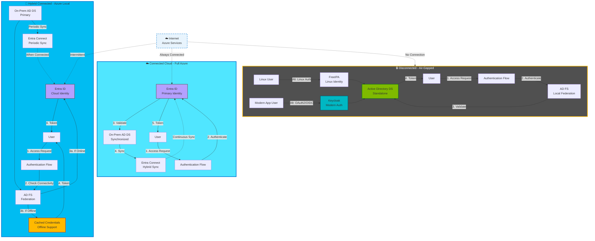

# Identity & Access Management

## Introduction

Identity is the foundation of zero-trust security and the primary control plane for sovereign cloud architectures. In traditional perimeter-based security models, network boundaries defined trust; in modern cloud environments, identity verification occurs at every access request. For sovereign workloads, identity management must satisfy stringent requirements: strong authentication, comprehensive audit trails, minimal privileged access, and the ability to function across connected, intermittent, and fully disconnected scenarios.

This chapter explores identity and access management (IAM) design for Sovereign Landing Zones, covering cloud-native identity with Microsoft Entra ID, hybrid identity architectures, and on-premises Active Directory Domain Services for disconnected environments. It addresses privileged access management, conditional access policies, emergency access procedures, and how identity architecture adapts across the hybrid continuum from Azure public cloud to air-gapped Azure Local deployments.

## Identity Architecture Options for Sovereign Environments

Sovereign organizations must choose an identity architecture that aligns with connectivity requirements, regulatory constraints, and operational realities. Four primary patterns exist, each with distinct tradeoffs.

### Cloud-Native Identity with Microsoft Entra ID

Microsoft Entra ID (formerly Azure Active Directory) provides cloud-native identity services with built-in features for authentication, authorization, conditional access, and identity protection. For sovereign workloads operating in connected Azure environments, Entra ID offers the strongest capabilities:

- **Passwordless Authentication**: FIDO2 security keys, Windows Hello for Business, and Microsoft Authenticator app eliminate password-related attacks
- **Multi-Factor Authentication (MFA)**: Enforced for all user and privileged accounts, with adaptive policies based on risk signals
- **Conditional Access Policies**: Grant or deny access based on user, device, location, and risk level
- **Privileged Identity Management (PIM)**: Just-in-time elevation to privileged roles with approval workflows and time-limited access
- **Identity Protection**: Machine learning-based risk detection for compromised credentials and anomalous sign-in behavior

For sovereign environments, Entra ID tenants should be configured with the following baseline:

- **Home region**: Entra ID tenant home region must be set to an approved sovereign region if available (e.g., EU Data Boundary for European organizations)
- **MFA enforcement**: Mandatory MFA for all administrative accounts, recommended for all user accounts
- **Conditional Access baseline**: Deny access from non-compliant devices, block legacy authentication, require MFA for all cloud apps
- **PIM configuration**: No standing privileged role assignments; all elevation requires justification and time limits

!!! warning "Entra ID Data Residency"
    While Entra ID stores most identity data in the tenant's home region, some features (e.g., Identity Protection risk signals) may process data globally. Organizations with strict data residency requirements should review Entra ID's data location documentation and consider additional controls.

### Hybrid Identity with Entra Connect

Most sovereign organizations have existing on-premises Active Directory Domain Services (AD DS) deployments supporting Windows-based workloads, legacy applications, and corporate networks. Hybrid identity architectures synchronize on-premises AD DS identities to Entra ID, enabling single sign-on (SSO) across cloud and on-premises resources.

**Microsoft Entra Connect** (formerly Azure AD Connect) is the primary tool for hybrid identity. It synchronizes user accounts, groups, and password hashes (or supports pass-through authentication) from on-premises AD DS to Entra ID. Two authentication methods are available:

1. **Password Hash Synchronization (PHS)**: AD DS password hashes are synchronized to Entra ID, allowing authentication to occur entirely in the cloud. This method is most resilient to on-premises outages.
2. **Pass-Through Authentication (PTA)**: Authentication requests from Entra ID are passed through agents running on-premises to AD DS. Passwords never leave the on-premises environment, but authentication requires on-premises availability.

For sovereign environments, **Password Hash Synchronization with Seamless SSO** is typically recommended because:

- Authentication continues functioning even if on-premises infrastructure is unavailable
- PHS provides faster authentication and lower latency for cloud workloads
- Entra ID's Identity Protection features work best with PHS

**Architecture Considerations for Hybrid Identity**:

- Deploy Entra Connect in high-availability mode with a staging server for failover
- Synchronize only necessary accounts; service accounts and break-glass accounts may remain on-premises only
- Implement Azure AD Application Proxy for secure access to on-premises web applications without VPN
- Use Entra ID conditional access policies to enforce device compliance for both cloud and on-premises resources

### Federated Identity with Active Directory Federation Services (ADFS)

Some sovereign organizations require **federated identity** using Active Directory Federation Services (ADFS) for regulatory or compliance reasons. ADFS provides claims-based authentication and allows organizations to maintain full control over authentication infrastructure.

However, **ADFS is increasingly discouraged** for new deployments because:

- It requires significant infrastructure (load balancers, ADFS servers, Web Application Proxy servers)
- It lacks modern authentication features available in Entra ID (passwordless, risk-based conditional access)
- It creates a dependency on on-premises availability for cloud authentication
- Microsoft's strategic direction is cloud-based identity with Entra ID

For organizations with existing ADFS deployments, migration to Entra ID with Password Hash Synchronization should be prioritized unless specific regulatory requirements mandate on-premises authentication control.

### On-Premises AD DS for Disconnected Scenarios

Fully disconnected sovereign environments, such as classified networks or air-gapped Azure Local deployments, cannot use Entra ID. These scenarios require standalone **Active Directory Domain Services** with no cloud dependency.

In disconnected AD DS architectures:

- **Domain Controllers**: Deploy redundant domain controllers on-premises or in Azure Local VMs for high availability
- **Group Policy**: Apply security baselines, encryption requirements, and access controls via Group Policy Objects (GPOs)
- **Local RBAC**: Use AD DS groups to define roles and permissions for local resources
- **Certificate Services**: Deploy Active Directory Certificate Services (AD CS) for internal PKI if TLS inspection or certificate-based authentication is required

Disconnected AD DS environments sacrifice cloud identity features (conditional access, identity protection, PIM) but provide full sovereignty over authentication infrastructure. Organizations must implement compensating controls for security monitoring, privileged access management, and audit logging using on-premises tools.

## Privileged Identity Management for Least-Privilege Access

Privileged accounts represent the highest risk in any identity system. Compromised privileged credentials allow attackers to bypass security controls, exfiltrate data, and persist within environments. Sovereign architectures must enforce strict controls over privileged access.

### Entra ID Privileged Identity Management (PIM)

**Privileged Identity Management (PIM)** in Entra ID eliminates standing privileged role assignments. Instead of granting permanent administrative rights, PIM provides:

- **Just-In-Time Elevation**: Users activate privileged roles on-demand for a limited time (typically 1-8 hours)
- **Approval Workflows**: Role activation can require approval from designated approvers
- **Justification Requirements**: Users must provide a business justification for every elevation
- **Multi-Factor Authentication**: MFA is enforced at activation time, even if the user authenticated with MFA at sign-in
- **Audit Trails**: All privileged role activations are logged immutably for compliance reporting

**Recommended PIM Configuration for Sovereign Workloads**:

- **No permanent assignments** for Global Administrator, Privileged Role Administrator, or Security Administrator roles
- **8-hour maximum activation duration** for highly privileged roles
- **Approval required** for Global Administrator role activation
- **Alerts configured** for suspicious privileged role usage patterns
- **Access reviews scheduled quarterly** to recertify eligible role assignments

### Privileged Access Workstations (PAW)

For the most sensitive administrative operations, **Privileged Access Workstations** provide a hardened, isolated environment for privileged tasks. PAWs are dedicated devices configured with strict security controls:

- Isolated from general productivity networks
- Limited application installation (only approved administrative tools)
- No internet browsing or email access
- Comprehensive logging of all activity
- Conditional Access policies requiring PAW device compliance for privileged role activation

PAWs reduce the risk of credential theft from phishing, malware, or compromised productivity systems.

## Conditional Access Policies for Sovereign Workloads

**Conditional Access** is Entra ID's policy engine for access control. It evaluates signals about the user, device, location, and risk level to make real-time access decisions: allow, deny, or require additional verification.

### Baseline Conditional Access Policies for Sovereignty

Every sovereign environment should implement the following baseline policies:

**1. Require MFA for All Users**

- **Condition**: All cloud apps, all users
- **Grant**: Require multi-factor authentication
- **Effect**: Users must complete MFA at every sign-in (or session lifetime expires)

**2. Block Legacy Authentication**

- **Condition**: All cloud apps, all users, legacy authentication clients (e.g., IMAP, POP3, SMTP)
- **Grant**: Block access
- **Effect**: Prevents authentication from clients that don't support MFA, eliminating a major attack vector

**3. Require Compliant or Hybrid Joined Devices**

- **Condition**: All cloud apps, all users
- **Grant**: Require device to be marked compliant (via Intune) or Hybrid Azure AD joined
- **Effect**: Unmanaged personal devices cannot access corporate resources

**4. Block Access from Non-Approved Locations**

- **Condition**: All cloud apps, all users, locations outside approved countries/regions
- **Grant**: Block access
- **Effect**: Enforces geographic access restrictions for data residency compliance

**5. Require MFA and Compliant Device for Privileged Roles**

- **Condition**: All cloud apps, users with eligible or active privileged role assignments
- **Grant**: Require MFA AND compliant device
- **Effect**: Highest security for accounts with elevated permissions

### Risk-Based Conditional Access

Entra ID **Identity Protection** calculates risk scores for users and sign-ins based on detected anomalies. Conditional Access policies can respond to risk:

- **User Risk Policy**: If a user's credentials are compromised (e.g., found in a credential leak), require password reset and MFA
- **Sign-In Risk Policy**: If a sign-in exhibits suspicious behavior (e.g., travel from improbable locations), require MFA or block access

Risk-based policies provide adaptive security without impacting legitimate users.

!!! tip "Conditional Access Testing"
    Always test conditional access policies in **report-only mode** before enforcement. Report-only mode logs what the policy would have done without actually blocking access, allowing you to validate configuration and identify unintended impacts.

## Emergency Access Accounts and Break-Glass Procedures

Even the most carefully designed identity system can fail due to misconfigurations, service outages, or conditional access policy errors. **Emergency access accounts** (also called break-glass accounts) provide a fail-safe mechanism for regaining administrative access.

### Break-Glass Account Design

Emergency access accounts must be:

- **Cloud-only accounts**: Not synchronized from on-premises AD DS, to ensure availability if hybrid identity is broken
- **Excluded from Conditional Access policies**: Exempt from MFA and device compliance requirements to avoid lockout
- **Assigned permanent Global Administrator role**: Only role that can modify all configurations
- **Monitored with alerts**: Any sign-in to a break-glass account triggers immediate investigation

**Best Practices**:

- Create **two** break-glass accounts (for redundancy)
- Use **long, randomly generated passwords** (e.g., 64 characters) stored in a physical safe
- Document procedures for using break-glass accounts and rehearse annually
- Review sign-in logs weekly to detect unauthorized use

Break-glass accounts are a necessary risk mitigation but must be carefully protected. Unauthorized use represents a complete compromise of the tenant.

## Managed Identities for Azure Resources

**Managed identities** eliminate the need to store credentials in code or configuration files. Azure manages the lifecycle of these identities automatically, providing authentication tokens to Azure resources that need to access other Azure services.

### System-Assigned Managed Identity

A **system-assigned managed identity** is tied to a specific Azure resource (VM, App Service, Function). When the resource is deleted, the identity is automatically deleted. Use system-assigned identities for resource-specific access.

### User-Assigned Managed Identity

A **user-assigned managed identity** is a standalone Azure resource that can be assigned to multiple Azure resources. Use user-assigned identities when multiple resources need the same permissions (e.g., multiple VMs accessing the same Key Vault).

### Managed Identities for Sovereign Workloads

For sovereign environments, managed identities provide security benefits:

- **No credential management**: No passwords, keys, or certificates to store, rotate, or leak
- **Least-privilege enforcement**: Assign only the specific Azure RBAC roles required
- **Audit trail**: All managed identity authentication is logged in Azure Activity Log

**Common Patterns**:

- VM managed identity accesses Key Vault to retrieve application secrets
- Azure Function managed identity writes to Azure Storage or Azure SQL Database
- Azure Kubernetes Service (AKS) workload identity accesses Azure resources using pod-assigned managed identities

## Identity Across the Hybrid Continuum

Identity architecture must adapt to different connectivity scenarios as workloads move across the hybrid continuum.

### Connected Scenarios (Azure Public Cloud)

In fully connected Azure environments, **Entra ID with conditional access and PIM** provides the most robust identity solution:

- **Authentication**: Cloud-based with real-time risk evaluation
- **Authorization**: Azure RBAC with just-in-time elevation
- **Device Management**: Intune-managed devices with compliance policies
- **Monitoring**: Real-time sign-in logs and identity protection alerts

### Intermittent Scenarios (Azure Local with Periodic Connectivity)

Intermittent connectivity scenarios require identity resilience to handle disconnection periods:

- **Primary Authentication**: Entra ID with Password Hash Synchronization (allows cloud authentication during on-premises outages)
- **Fallback Authentication**: Cached credentials on domain-joined devices allow local sign-in during disconnection
- **Sync Strategy**: Entra Connect synchronizes changes whenever connectivity is available
- **Token Lifetime**: Configure longer token lifetimes to accommodate disconnection periods (with risk tradeoffs)

For Azure Local clusters registered with Azure Arc, **Arc-enabled servers** use local credentials during disconnection and re-synchronize with Entra ID when connectivity resumes.

### Disconnected Scenarios (Air-Gapped Azure Local)

Fully disconnected scenarios eliminate Entra ID entirely and rely on on-premises AD DS:

- **Authentication**: On-premises domain controllers only
- **Authorization**: Active Directory groups and Group Policy
- **Device Management**: Group Policy and System Center Configuration Manager (SCCM)
- **Monitoring**: Local event log collection with no cloud integration

Disconnected identity architectures require compensating controls:

- **Manual audit review**: No automated identity protection or risk detection
- **Privileged access**: Implement PAM solutions like Microsoft Identity Manager (MIM) or third-party alternatives
- **Service accounts**: Store credentials in hardware security modules (HSMs) or encrypted password vaults

## Service Principal Management and Secret Rotation

**Service principals** represent applications and services in Entra ID, analogous to service accounts in AD DS. For sovereign workloads, service principals must be carefully managed:

- **Certificate-based authentication** preferred over client secrets (certificates are more secure and auditable)
- **Short-lived secrets**: If client secrets are required, set expiration to 90 days or less
- **Automated rotation**: Implement Azure Key Vault integration for automatic secret rotation
- **Least-privilege permissions**: Assign only required API permissions and Azure RBAC roles
- **Audit trail**: Monitor service principal sign-ins and API usage

!!! note "Managed Identity vs. Service Principal"
    Prefer **managed identities** over service principals whenever possible. Managed identities eliminate credential management entirely, while service principals require secret or certificate lifecycle management.

## Entra ID and Customer Lockbox for Sovereignty

For organizations with concerns about Microsoft personnel accessing their data, **Customer Lockbox for Azure** provides an additional approval layer. When Microsoft support engineers need access to customer data to resolve a support case, Customer Lockbox requires explicit customer approval before access is granted.

**Customer Lockbox Benefits for Sovereignty**:

- **Explicit approval**: Customer must approve each access request
- **Time-limited access**: Access is granted for a specific duration
- **Audit trail**: All Customer Lockbox requests and approvals are logged
- **Deny option**: Customer can deny access requests, though this may delay issue resolution

Customer Lockbox is available for Azure services and Entra ID. For sovereign workloads, enabling Customer Lockbox provides an additional control layer aligned with zero-trust principles.

## Identity Design Recommendations for Sovereign Landing Zones

Based on the patterns and best practices discussed, the following recommendations apply to most sovereign implementations:

1. **Use Entra ID with PHS for connected and intermittent scenarios**: Provides the strongest feature set and resilience
2. **Implement comprehensive conditional access policies**: Enforce MFA, device compliance, and location restrictions
3. **Eliminate standing privileged role assignments**: Use PIM for all administrative roles
4. **Deploy break-glass accounts and document procedures**: Test annually to ensure they function correctly
5. **Prefer managed identities over service principals**: Eliminate credential management where possible
6. **Plan for disconnected identity**: For Azure Local air-gapped scenarios, design standalone AD DS with compensating controls
7. **Enable Customer Lockbox**: For additional sovereignty assurance over Microsoft support access

Identity is the foundation of sovereign security. A well-designed identity architecture enforces least-privilege access, provides comprehensive audit trails, and adapts to the connectivity constraints of the hybrid continuum.

## References

- [Microsoft Entra ID Overview](https://learn.microsoft.com/en-us/entra/fundamentals/whatis)
- [Hybrid Identity with Entra Connect](https://learn.microsoft.com/en-us/entra/identity/hybrid/)
- [Privileged Identity Management](https://learn.microsoft.com/en-us/entra/id-governance/privileged-identity-management/)
- [Conditional Access Documentation](https://learn.microsoft.com/en-us/entra/identity/conditional-access/)
- [Identity Protection](https://learn.microsoft.com/en-us/entra/id-protection/)
- [Managed Identities for Azure Resources](https://learn.microsoft.com/en-us/entra/identity/managed-identities-azure-resources/)
- [Customer Lockbox for Azure](https://learn.microsoft.com/en-us/azure/security/fundamentals/customer-lockbox-overview)
- [Privileged Access Workstations](https://learn.microsoft.com/en-us/security/privileged-access-workstations/privileged-access-devices)

---

> **Next:** [Network Topology →](03-network-topology.md)

---

> **Next:** [Network Topology →](03-network-topology.md)
