# Network Topology

## Introduction

Network architecture forms the backbone of any cloud platform, controlling how workloads communicate, how data flows between environments, and where security controls are enforced. For Sovereign Landing Zones, network design takes on additional significance: it must enforce data residency requirements, prevent unauthorized data exfiltration, provide secure connectivity across the hybrid continuum, and maintain resilience even during disconnection periods.

This chapter explores network topology design for sovereign environments, focusing on hub-and-spoke architecture with Azure Firewall, DNS resolution strategies, hybrid connectivity using ExpressRoute and VPN, network segmentation techniques, Private Endpoints for PaaS services, and how network design adapts as workloads extend from Azure public cloud to Azure Local and disconnected environments.

## Hub-and-Spoke Network Topology for SLZ

The **hub-and-spoke topology** is the recommended network architecture for Azure Landing Zones and Sovereign Landing Zones. It provides centralized control over security, routing, and hybrid connectivity while allowing workload isolation in spoke virtual networks.

### Hub VNet: Centralized Shared Services

The **hub VNet** serves as the central point for shared networking services:

- **Azure Firewall**: All north-south (internet-bound) and east-west (inter-spoke) traffic flows through the firewall for inspection and filtering
- **VPN Gateway or ExpressRoute Gateway**: Provides secure connectivity to on-premises networks
- **Azure Bastion**: Secure RDP/SSH access to VMs without exposing them to the public internet
- **Azure DDoS Protection**: Protects public IP addresses from distributed denial-of-service attacks
- **Network Virtual Appliances (optional)**: Third-party firewalls, intrusion detection/prevention systems, or SD-WAN appliances if required

The hub VNet typically has multiple subnets:

- `AzureFirewallSubnet` (required name): For Azure Firewall instances
- `GatewaySubnet` (required name): For VPN or ExpressRoute gateways
- `AzureBastionSubnet` (required name): For Azure Bastion service
- Management subnet: For monitoring tools, DNS servers, or domain controllers

**Hub VNet IP Address Planning**: The hub VNet should use a private IP address space that does not overlap with on-premises networks or spoke VNets. Typical ranges:

- Hub VNet: `10.0.0.0/16` (provides 65,536 IP addresses)
- Azure Firewall subnet: `10.0.1.0/26` (requires /26 or larger)
- Gateway subnet: `10.0.2.0/27` (requires /27 or larger)
- Bastion subnet: `10.0.3.0/26` (requires /26 or larger)

### Spoke VNets: Workload Isolation

Each **spoke VNet** hosts a single workload or application landing zone. Spoke VNets are peered to the hub VNet, allowing them to use hub services (firewall, gateway, DNS) without direct connectivity to each other. This design enforces network isolation between workloads.

**Spoke VNet Characteristics**:

- **Dedicated address space**: Each spoke has a unique IP range (e.g., `10.1.0.0/16`, `10.2.0.0/16`)
- **Peering to hub**: VNet peering configured with "Use remote gateway" enabled, allowing traffic to on-premises via the hub's gateway
- **Route tables (UDR)**: User-defined routes direct all traffic destined for the internet or other spokes to the Azure Firewall in the hub
- **Network Security Groups (NSGs)**: Applied to subnets within the spoke to control inbound and outbound traffic at Layer 4

Spoke VNets map to the management group structure in the SLZ:

- **Public landing zones**: Standard spoke VNets for non-sensitive workloads
- **Confidential Corp landing zones**: Spoke VNets with additional NSG restrictions and mandatory Private Endpoints
- **Confidential Online landing zones**: Spoke VNets for internet-facing workloads with strict egress controls

```mermaid
graph TB
    subgraph Cloud["☁️ Azure Cloud Services"]
        EntraID[Entra ID]
        AzureMonitor[Azure Monitor]
        Defender[Defender for Cloud]
    end
    
    subgraph Hub["🏢 Hub VNet - 10.0.0.0/16"]
        subgraph HubServices["Hub Services"]
            AzFW[Azure Firewall<br/>10.0.1.0/24<br/>Traffic Inspection]
            Bastion[Azure Bastion<br/>10.0.2.0/24<br/>Secure Access]
            Gateway[ExpressRoute Gateway<br/>10.0.3.0/24<br/>Hybrid Connection]
            HubDNS[Private DNS Resolver<br/>10.0.4.0/24]
        end
    end
    
    subgraph Spoke1["🔐 Spoke 1: Confidential Corp - 10.1.0.0/16"]
        Spoke1Subnet1[App Subnet<br/>10.1.1.0/24<br/>Confidential VMs]
        Spoke1Subnet2[Data Subnet<br/>10.1.2.0/24<br/>Confidential SQL MI]
        Spoke1PE[Private Endpoints<br/>10.1.3.0/24]
        Spoke1NSG[NSG: Deny All<br/>Except Required]
    end
    
    subgraph Spoke2["🛡️ Spoke 2: Confidential Online - 10.2.0.0/16"]
        Spoke2Subnet1[AKS Cluster<br/>10.2.1.0/24<br/>Confidential Containers]
        Spoke2Subnet2[App Service<br/>10.2.2.0/24<br/>VNet Integration]
        Spoke2PE[Private Endpoints<br/>10.2.3.0/24]
        Spoke2NSG[NSG: Strict Rules]
    end
    
    subgraph Spoke3["📊 Spoke 3: Public Workloads - 10.3.0.0/16"]
        Spoke3Subnet1[Public App Tier<br/>10.3.1.0/24]
        Spoke3Subnet2[Integration Tier<br/>10.3.2.0/24]
        Spoke3PE[Private Endpoints<br/>10.3.3.0/24]
    end
    
    subgraph OnPrem["🏢 On-Premises"]
        AzureLocal[Azure Local Cluster<br/>192.168.0.0/16]
        OnPremDNS[On-Prem DNS]
        OnPremAD[Active Directory DS]
    end
    
    subgraph PaaS["🔒 Azure PaaS Services"]
        SQLConfidential[(Confidential SQL MI<br/>Private Endpoint)]
        KeyVault[Key Vault<br/>Private Endpoint]
        Storage[Storage Account<br/>Private Endpoint]
        ACR[Container Registry<br/>Private Endpoint]
    end
    
    %% Hub to Spoke Peering
    Hub <-->|VNet Peering| Spoke1
    Hub <-->|VNet Peering| Spoke2
    Hub <-->|VNet Peering| Spoke3
    
    %% All traffic through Firewall
    Spoke1Subnet1 & Spoke1Subnet2 -->|User Defined Route| AzFW
    Spoke2Subnet1 & Spoke2Subnet2 -->|User Defined Route| AzFW
    Spoke3Subnet1 & Spoke3Subnet2 -->|User Defined Route| AzFW
    
    %% Private Endpoints
    Spoke1PE --> SQLConfidential
    Spoke1PE --> KeyVault
    Spoke2PE --> ACR
    Spoke2PE --> KeyVault
    Spoke3PE --> Storage
    
    %% Hybrid Connectivity
    Gateway <-->|ExpressRoute<br/>Private Connection| AzureLocal
    AzureLocal --> OnPremDNS
    AzureLocal --> OnPremAD
    
    %% DNS Resolution
    HubDNS <-.->|Conditional Forward| OnPremDNS
    Spoke1 & Spoke2 & Spoke3 -.->|DNS Query| HubDNS
    
    %% Cloud Services
    EntraID -.->|Identity| Hub & Spoke1 & Spoke2 & Spoke3
    AzureMonitor -.->|Monitoring| Hub & Spoke1 & Spoke2 & Spoke3
    Defender -.->|Security| Hub & Spoke1 & Spoke2 & Spoke3
    
    %% Bastion Access
    Bastion -.->|Secure RDP/SSH| Spoke1Subnet1 & Spoke2Subnet1
    
    style Hub fill:#0078d4,stroke:#002050,stroke-width:3px,color:#fff
    style Spoke1 fill:#e74856,stroke:#a80000,stroke-width:3px,color:#fff
    style Spoke2 fill:#ffb900,stroke:#d83b01,stroke-width:3px
    style Spoke3 fill:#7fba00,stroke:#107c10,stroke-width:3px
    style OnPrem fill:#50e6ff,stroke:#0078d4,stroke-width:3px
    style PaaS fill:#b4a0ff,stroke:#5e5e5e,stroke-width:2px
    style Cloud fill:#e8f4fd,stroke:#0078d4,stroke-width:2px
    style AzFW fill:#e74856,stroke:#a80000,stroke-width:2px,color:#fff
    style Gateway fill:#00bcf2,stroke:#0078d4,stroke-width:2px
```

### Network Segmentation and Micro-Segmentation

**Network segmentation** divides the network into smaller zones to limit blast radius and enforce security boundaries. The SLZ implements segmentation at multiple levels:

1. **Management Group Level**: Public, Confidential Corp, and Confidential Online workloads are separated into different spoke VNets
2. **Subnet Level**: Within each spoke VNet, subnets isolate application tiers (web, app, database)
3. **NSG Level**: Network security groups enforce Layer 4 rules at the subnet or NIC level

**Micro-segmentation** extends segmentation to the application level using:

- **Application Security Groups (ASGs)**: Logical groupings of VMs that allow NSG rules based on application role (e.g., "web servers," "database servers") rather than IP addresses
- **Azure Firewall FQDN filtering**: Layer 7 rules that allow or deny traffic based on fully qualified domain names, not just IP addresses
- **Azure Private Link**: Isolates PaaS service endpoints to specific VNets, preventing exposure to the public internet

!!! tip "Segmentation Best Practices for Sovereignty"
    For confidential workloads, implement **default-deny** firewall and NSG rules. Explicitly allow only required traffic flows. This approach minimizes attack surface and prevents data exfiltration through unintended network paths.

## Virtual WAN Topology as an Alternative

**Azure Virtual WAN** provides a managed hub-and-spoke topology with built-in routing, VPN, ExpressRoute, and firewall capabilities. Virtual WAN simplifies multi-region, multi-hub architectures and is suitable for large-scale deployments.

**Virtual WAN Architecture**:

- **Virtual Hub**: Managed hub VNet deployed per region
- **Integrated Gateway**: VPN and ExpressRoute gateways are part of the Virtual Hub
- **Azure Firewall Manager**: Centralized policy management for Azure Firewalls across multiple hubs
- **Routing Intents**: Simplified routing configuration for internet-bound and private traffic

**When to Use Virtual WAN**:

- Multi-region deployments with inter-region connectivity requirements
- Large-scale branch office connectivity (100+ VPN sites)
- Need for global transit routing (e.g., branch-to-branch via Azure backbone)

**When to Use Traditional Hub-and-Spoke**:

- Single-region deployments
- Requirement for custom routing or third-party NVAs in the hub
- Need for granular control over every networking resource

For most sovereign implementations, **traditional hub-and-spoke** is sufficient and provides more control. Virtual WAN is recommended for globally distributed organizations with complex inter-region connectivity requirements.

## Hybrid Connectivity Options

Hybrid connectivity links Azure VNets to on-premises networks, enabling workloads to communicate securely across the hybrid continuum. Three primary options exist: ExpressRoute, Site-to-Site VPN, and Point-to-Site VPN.

### ExpressRoute: Private, Dedicated Connectivity

**Azure ExpressRoute** provides a private, dedicated connection between on-premises infrastructure and Azure. Traffic traverses a connectivity provider's network, never crossing the public internet. ExpressRoute is the preferred connectivity option for sovereign workloads due to its security and performance benefits.

**ExpressRoute Architecture**:

- **ExpressRoute Circuit**: Provisioned through a connectivity provider (e.g., Equinix, Megaport, AT&T) with bandwidth from 50 Mbps to 100 Gbps
- **Private Peering**: Connects on-premises networks to Azure VNets (hub VNet in the SLZ)
- **Microsoft Peering** (optional): Direct connectivity to Microsoft 365 and Azure public services without internet transit
- **Gateway**: ExpressRoute Virtual Network Gateway deployed in the hub's `GatewaySubnet`

**ExpressRoute Benefits for Sovereignty**:

- **Data residency**: Traffic does not transit the public internet, reducing exposure
- **Predictable latency**: Dedicated bandwidth ensures consistent performance
- **High availability**: Redundant circuits across multiple connectivity provider locations

**ExpressRoute Design Considerations**:

- **SKU selection**: Choose Standard (single-region connectivity) or Premium (global connectivity) based on requirements
- **Gateway SKU**: Higher SKUs (ErGw2AZ, ErGw3AZ) provide more throughput and connections
- **Redundancy**: Deploy two circuits in different peering locations for resilience

### Site-to-Site VPN: Encrypted Tunnel Over Internet

**Site-to-Site VPN** creates an IPsec-encrypted tunnel between on-premises VPN devices and Azure VPN Gateway. S2S VPN uses the public internet for transport, making it less expensive than ExpressRoute but with variable latency and lower security posture.

**VPN Gateway Architecture**:

- **VPN Gateway**: Deployed in the hub's `GatewaySubnet`
- **Local Network Gateway**: Represents the on-premises VPN device in Azure
- **Connection**: Configures the IPsec tunnel with pre-shared key or certificate authentication

**VPN Gateway SKUs**:

- **VpnGw1-5AZ**: Zone-redundant gateways with throughput from 650 Mbps to 10 Gbps
- **Active-active mode**: Deploy two gateway instances for redundancy

**S2S VPN Use Cases**:

- Backup connectivity for ExpressRoute circuits
- Connectivity for remote sites without ExpressRoute availability
- Development and test environments where cost is a priority

**Security Considerations for S2S VPN**:

- Use **IKEv2** protocol (more secure than IKEv1)
- Enable **BGP** for dynamic routing
- Configure **custom IPsec policies** to enforce AES-256 encryption and SHA-256 hashing
- Monitor VPN Gateway metrics and logs for connection stability

### Point-to-Site VPN: Individual Client Connectivity

**Point-to-Site (P2S) VPN** allows individual users to connect to Azure VNets from remote locations. P2S VPN is suitable for remote administration, not for production workload connectivity.

**P2S VPN Authentication Methods**:

- **Azure AD authentication**: Users authenticate with their Entra ID credentials
- **Certificate-based authentication**: Clients present a certificate issued by a trusted CA
- **RADIUS authentication**: Integrates with existing on-premises authentication infrastructure

For sovereign environments, **Azure AD authentication with MFA** is recommended for P2S VPN, ensuring strong identity verification for remote administrators.

## DNS Architecture for Hybrid Sovereign Environments

DNS resolution is critical for name-based connectivity between Azure and on-premises resources. The SLZ requires a DNS architecture that supports:

- Resolution of on-premises DNS names from Azure
- Resolution of Azure Private DNS zone names from on-premises
- Private Endpoint DNS resolution
- Split-brain DNS for public and private resolution of the same FQDN

### Azure Private DNS Zones

**Azure Private DNS** provides name resolution for resources within Azure VNets without exposing DNS records to the public internet. Private DNS zones are linked to VNets, allowing resources in those VNets to resolve records in the zone.

**Common Private DNS Zones for SLZ**:

- `privatelink.blob.core.windows.net`: For Storage Account Private Endpoints
- `privatelink.database.windows.net`: For Azure SQL Database Private Endpoints
- `privatelink.vaultcore.azure.net`: For Key Vault Private Endpoints
- Custom zones: `corp.contoso.com` for internal Azure resources

**Private DNS Zone Design**:

- **Centralized zones**: Create Private DNS zones in the connectivity subscription (part of the platform landing zone)
- **VNet links**: Link Private DNS zones to the hub VNet and all spoke VNets
- **Automation**: Use Azure Policy to automatically create DNS A records when Private Endpoints are deployed

### DNS Conditional Forwarding for Hybrid Environments

To enable hybrid DNS resolution:

1. **On-Premises to Azure**: Configure on-premises DNS servers with conditional forwarders for Azure Private DNS zones. Forward queries to an Azure-hosted DNS server (e.g., a VM running DNS Server role in the hub VNet).
2. **Azure to On-Premises**: Deploy DNS Forwarder VMs in the hub VNet. Configure these VMs to forward queries for on-premises domains to on-premises DNS servers.

**DNS Forwarder VM Configuration**:

- Deploy at least **two VMs** for redundancy (availability set or availability zones)
- Configure VMs with static private IP addresses (e.g., `10.0.4.4`, `10.0.4.5`)
- Configure Azure VNet DNS settings to use these IPs as custom DNS servers
- Configure conditional forwarders on the VMs for on-premises domains

<!-- DIAGRAM: DNS architecture for hybrid SLZ showing Azure Private DNS Zones, on-premises DNS forwarding, and resolution flow for both connected and disconnected scenarios -->

### Split-Brain DNS for Sovereign Workloads

**Split-brain DNS** allows the same domain name to resolve to different IP addresses depending on the client's location. For example, `api.contoso.com` resolves to a public IP when accessed from the internet and to a private IP when accessed from the internal network.

Split-brain DNS is essential for sovereign workloads that require private connectivity within Azure and on-premises but still provide limited public access for specific scenarios.

**Implementation**:

- **Public DNS zone**: Hosts public A records (e.g., `api.contoso.com` → public IP)
- **Private DNS zone**: Hosts private A records (e.g., `api.contoso.com` → private IP)
- **VNet link**: Private DNS zone linked to Azure VNets, overriding public DNS resolution for resources inside the VNet

## Private Endpoints for All PaaS Services

Azure PaaS services (Storage Accounts, SQL Database, Key Vault, Cosmos DB) traditionally use public endpoints accessible over the internet. For sovereign workloads, **public endpoint access is unacceptable** due to data exfiltration risk.

**Azure Private Link** provides private connectivity to PaaS services via **Private Endpoints**. A Private Endpoint is a network interface with a private IP address from your VNet, allowing secure access to the PaaS service without public internet exposure.

### Private Endpoint Architecture

When a Private Endpoint is created:

1. Azure provisions a network interface in the specified subnet with a private IP address
2. The PaaS service is accessible via this private IP
3. Public access to the service can be disabled entirely
4. Azure Private DNS automatically creates an A record for the Private Endpoint (if DNS integration is enabled)

**Private Endpoint Benefits for Sovereignty**:

- **Data residency**: Traffic remains within the Azure backbone, never crossing the public internet
- **No data exfiltration risk**: Public endpoints can be disabled, eliminating internet-based access vectors
- **Consistent network security**: NSG rules apply to Private Endpoint traffic just like VM traffic

### Mandatory Private Endpoints for Confidential Landing Zones

For **Confidential Corp** and **Confidential Online** landing zones in the SLZ, Azure Policy should enforce Private Endpoint usage:

- **Deny policy**: Block creation of Storage Accounts, SQL Databases, or Key Vaults without Private Endpoints
- **Audit policy**: Report existing resources with public endpoints for remediation
- **DeployIfNotExists policy**: Automatically create Private Endpoints when new PaaS resources are provisioned

!!! warning "Private Endpoint Limitations"
    Some Azure services do not support Private Link (though the list is shrinking). For services without Private Link support, consider using **Service Endpoints** (less secure, but better than public endpoints) or deploying the service in a dedicated subnet with NSGs.

## Network Security Groups (NSGs)

**Network Security Groups** provide Layer 4 (TCP/UDP) filtering for traffic to and from Azure resources. NSGs consist of security rules that allow or deny traffic based on source IP, destination IP, source port, destination port, and protocol.

### NSG Best Practices for Sovereign Workloads

1. **Default-deny posture**: Start with "Deny All" rules and explicitly allow only required traffic
2. **Application Security Groups**: Use ASGs to simplify NSG rules (e.g., "Allow HTTP from WebTier to AppTier")
3. **Service tags**: Use service tags (e.g., `AzureLoadBalancer`, `Internet`) instead of IP ranges for Azure platform traffic
4. **Logging**: Enable NSG flow logs and send them to Log Analytics for analysis
5. **Layered defense**: Apply NSGs at both the subnet level and NIC level for defense in depth

**Example NSG Rule for Confidential Workload**:

- **Priority**: 1000
- **Name**: Deny-Internet-Outbound
- **Direction**: Outbound
- **Action**: Deny
- **Source**: VirtualNetwork
- **Destination**: Internet
- **Port**: * (all)
- **Protocol**: * (all)

This rule blocks all outbound internet traffic, preventing data exfiltration. Workloads must use Private Endpoints or the Azure Firewall for necessary outbound connectivity.

## Azure Firewall for Centralized Traffic Inspection

**Azure Firewall** is a managed, cloud-native firewall service that provides Layer 4 (TCP/UDP) and Layer 7 (HTTP/HTTPS) filtering, threat intelligence, DNS proxy, and TLS inspection capabilities. In the SLZ hub-and-spoke topology, Azure Firewall serves as the central enforcement point for all north-south and east-west traffic.

### Azure Firewall Rule Collections

Azure Firewall uses three types of rule collections:

1. **Network Rules**: Layer 4 filtering based on IP address, port, and protocol (e.g., "Allow SSH from management subnet to all VNets")
2. **Application Rules**: Layer 7 filtering based on FQDN (e.g., "Allow HTTPS to *.microsoft.com")
3. **NAT Rules**: Destination NAT for inbound traffic to private IPs (e.g., "Forward port 443 on public IP to internal web server")

### Firewall Policies for SLZ

**Azure Firewall Manager** centralizes firewall policy management. For the SLZ, create hierarchical policies:

- **Base policy**: Global rules that apply to all firewalls (e.g., deny all by default, allow Azure platform services)
- **Confidential policy**: Inherits from base policy, adds restrictions for confidential workloads (e.g., block all internet access except approved FQDNs)
- **Public policy**: Inherits from base policy, allows broader internet access for non-sensitive workloads

### TLS Inspection for Sovereign Workloads

**TLS inspection** (also called SSL/TLS decryption) allows Azure Firewall to inspect HTTPS traffic for threats. For sovereign workloads with strict data protection requirements, TLS inspection may be **required** to detect encrypted malware or data exfiltration attempts.

**TLS Inspection Prerequisites**:

- **Azure Key Vault**: Store the TLS inspection certificate in Key Vault
- **Intermediate CA certificate**: Firewall uses this certificate to re-sign HTTPS traffic
- **Client trust**: Client devices must trust the intermediate CA certificate

TLS inspection has privacy implications: it decrypts all HTTPS traffic. Organizations must balance security benefits against privacy concerns and regulatory requirements.

## DDoS Protection

**Azure DDoS Protection** defends public IP addresses against distributed denial-of-service attacks. DDoS Protection operates at the network edge, scrubbing malicious traffic before it reaches your resources.

### DDoS Protection Tiers

- **DDoS Network Protection** (previously Standard): Provides enhanced DDoS mitigation, adaptive tuning, cost protection, and rapid response support
- **DDoS IP Protection**: Per-IP protection with simpler billing

For sovereign workloads with public-facing services (e.g., web applications, APIs), **DDoS Network Protection** is recommended. It provides:

- **Always-on traffic monitoring**: Analyzes baseline traffic patterns and detects anomalies
- **Automatic attack mitigation**: Applies mitigation policies within seconds of attack detection
- **Cost protection**: Microsoft credits costs for scaled-out resources during DDoS attacks
- **Rapid response support**: Access to DDoS experts during active attacks

## Network Topology for Azure Local Integration

Extending the SLZ to **Azure Local** (formerly Azure Stack HCI) requires adapting the hub-and-spoke topology to include on-premises infrastructure as additional "spokes."

### Azure Local Network Requirements

Azure Local clusters have specific network requirements:

- **Management network**: For cluster management and Azure Arc connectivity
- **Storage network**: For Storage Spaces Direct traffic between cluster nodes (typically 25 Gbps RDMA)
- **Compute network**: For VM and container workloads

**Connectivity Options**:

1. **ExpressRoute**: Azure Local management and compute networks connect to Azure via ExpressRoute Private Peering
2. **S2S VPN**: Backup connectivity or primary connectivity for smaller deployments
3. **Azure Arc**: Azure Local clusters register with Azure Arc, enabling management and policy enforcement from the Azure portal

### Routing Considerations for Hybrid Topologies

When Azure Local clusters are connected to the Azure hub VNet:

- **BGP**: Configure Border Gateway Protocol to dynamically exchange routes between Azure and on-premises networks
- **Route summarization**: Advertise summarized routes to minimize routing table size
- **Hub as transit**: Route all Azure Local-to-Azure traffic through the hub VNet firewall for inspection

<!-- Diagram note: Extend the hub-and-spoke diagram to show on-premises Azure Local cluster connected via ExpressRoute to the hub VNet -->

## Disconnected Network Architecture

Fully disconnected sovereign environments operate without any connection to Azure public cloud. Network design for disconnected scenarios focuses on local resilience and isolation.

### Disconnected Network Design Principles

1. **Air-gapped**: No physical or logical connection to external networks
2. **Local routing**: All routing occurs on-premises (no dependency on Azure Virtual Network Gateway)
3. **Self-contained DNS**: On-premises DNS servers provide all name resolution
4. **Firewalls at boundaries**: Network security appliances at the perimeter and between network zones

**Example Disconnected Topology**:

- **Core network**: Central datacenter with Azure Local clusters, domain controllers, DNS servers
- **Workload networks**: Isolated VLANs or VNets for different workload classifications
- **Management network**: Dedicated network for administrative access (PAWs, jump servers)
- **No internet access**: All updates and software delivered via physical media (USB, DVD)

For disconnected Azure Local deployments, the "hub-and-spoke" concept is replicated on-premises using VLANs, software-defined networking (SDN), or network virtualization.

## Network Monitoring and Observability

Network monitoring provides visibility into traffic flows, performance, and security events. For sovereign environments, monitoring data must remain within approved boundaries and meet retention requirements.

### Network Watcher

**Azure Network Watcher** provides tools for network diagnostics and monitoring:

- **NSG Flow Logs**: Capture all traffic allowed or denied by NSGs
- **Connection Monitor**: Monitor connectivity between Azure resources and on-premises endpoints
- **Traffic Analytics**: Analyze NSG flow logs to identify traffic patterns, top talkers, and anomalies
- **Packet Capture**: Capture network packets for detailed troubleshooting

### Azure Monitor for Networks

**Azure Monitor** provides centralized monitoring for network resources:

- **Metrics**: Track performance metrics for VPN Gateway, ExpressRoute, Firewall, and Load Balancers
- **Alerts**: Configure alerts for VPN disconnect, ExpressRoute circuit down, firewall rule violations
- **Logs**: Collect diagnostic logs from all network resources to Log Analytics

For sovereign workloads, configure **Log Analytics workspaces** in approved regions and set retention policies to meet compliance requirements.

## Network Design Recommendations for SLZ

Based on the architecture patterns and best practices discussed, the following recommendations apply to most sovereign network implementations:

1. **Use hub-and-spoke topology** with Azure Firewall in the hub
2. **Deploy ExpressRoute** for hybrid connectivity (with S2S VPN as backup)
3. **Require Private Endpoints** for all PaaS services in confidential landing zones
4. **Implement default-deny NSG rules** with explicit allow rules for required traffic
5. **Enable DDoS Network Protection** for public-facing services
6. **Deploy DNS forwarder VMs** in the hub for hybrid DNS resolution
7. **Use Azure Private DNS zones** for Private Endpoint DNS integration
8. **Configure NSG flow logs** and Traffic Analytics for network observability
9. **Plan IP address space carefully** to avoid overlaps and accommodate future growth
10. **Test failover scenarios** for ExpressRoute and VPN Gateway redundancy

Network architecture is foundational for sovereign cloud deployments. A well-designed network enforces security boundaries, enables hybrid connectivity, and provides the control plane for data residency enforcement across the continuum.

## References

- [Hub-Spoke Network Topology](https://learn.microsoft.com/en-us/azure/architecture/networking/architecture/hub-spoke)
- [Azure Virtual WAN](https://learn.microsoft.com/en-us/azure/virtual-wan/)
- [Azure Firewall Documentation](https://learn.microsoft.com/en-us/azure/firewall/)
- [Azure ExpressRoute](https://learn.microsoft.com/en-us/azure/expressroute/)
- [Azure VPN Gateway](https://learn.microsoft.com/en-us/azure/vpn-gateway/)
- [Azure Private Link](https://learn.microsoft.com/en-us/azure/private-link/)
- [Azure Private DNS](https://learn.microsoft.com/en-us/azure/dns/private-dns-overview)
- [Network Security Groups](https://learn.microsoft.com/en-us/azure/virtual-network/network-security-groups-overview)
- [Azure DDoS Protection](https://learn.microsoft.com/en-us/azure/ddos-protection/)
- [Network Watcher](https://learn.microsoft.com/en-us/azure/network-watcher/)

---

> **Next:** [Security & Governance →](04-security-governance.md)

---

> **Next:** [Security & Governance →](04-security-governance.md)
