# Security & Governance

## Introduction

Security and governance represent the design areas where the Sovereign Landing Zone most significantly diverges from the standard Azure Landing Zone. While all Azure deployments benefit from security controls and governance guardrails, sovereign workloads operate under heightened scrutiny: regulatory mandates, data residency requirements, audit obligations, and operational sovereignty constraints demand security and governance architectures that go beyond baseline recommendations.

This chapter details the security controls, policy initiatives, and governance structures that define the Sovereign Landing Zone. It covers SLZ-specific Azure Policy configurations, Microsoft Defender for Cloud posture management, Microsoft Sentinel for security operations, compliance reporting mechanisms, and how security and governance adapt across connected, intermittent, and disconnected deployment scenarios.

## SLZ-Specific Azure Policy Initiatives

**Azure Policy** is the foundation of governance in Azure. It provides declarative rules that evaluate resource configurations and enforce organizational standards. For the Sovereign Landing Zone, Azure Policy goes beyond the standard Azure Landing Zone baseline to implement controls specific to sovereignty requirements.

### Policy Assignment Architecture

Azure Policy assignments follow a hierarchical model aligned with the management group structure:

1. **Root Management Group**: Foundational policies that apply to all subscriptions (e.g., require tags, audit role assignments)
2. **Platform Management Group**: Policies specific to platform landing zone resources (connectivity, identity, management subscriptions)
3. **Landing Zones Management Group**: Baseline security and governance policies for all workload landing zones
4. **Confidential Corp / Confidential Online Management Groups**: Sovereignty-specific policies with stricter controls

This layered approach allows standard workloads to coexist with sovereign workloads in the same tenant while maintaining appropriate isolation and controls.

### Sovereign Baseline Policy Initiatives

The SLZ includes additional policy initiatives beyond the standard Azure Landing Zone:

**1. Data Residency Enforcement**

Data residency policies ensure resources are deployed only in approved Azure regions and that data does not leave specified geographic boundaries:

```json
{
  "policyDefinitionId": "/providers/Microsoft.Authorization/policyDefinitions/e56962a6-4747-49cd-b67b-bf8b01975c4c",
  "displayName": "Allowed locations",
  "policyType": "BuiltIn",
  "mode": "Indexed",
  "parameters": {
    "listOfAllowedLocations": {
      "value": ["westeurope", "northeurope"]
    }
  }
}
```

This policy **denies** deployment of resources to any region outside the approved list. For EU-based sovereign organizations, the list typically includes only EU regions.

**2. Confidential Computing Requirements**

For highly sensitive workloads classified under "Confidential Online," policies may mandate the use of Azure Confidential Computing VMs:

- **Allowed VM SKUs**: Only DC-series (confidential compute) VMs permitted
- **Encryption**: Require confidential disk encryption (encryption keys never exposed to hypervisor)
- **Attestation**: Require remote attestation for confidential VMs

**3. Encryption Enforcement**

Encryption at rest and in transit is mandatory for all sovereign workloads:

- **Azure Disk Encryption**: All VM disks must be encrypted (policy effect: `Deny` if not configured)
- **Storage Account encryption**: Require encryption with customer-managed keys (CMK) in Azure Key Vault
- **TLS version**: Enforce TLS 1.2 or higher for all PaaS services (deny TLS 1.0/1.1)
- **HTTPS-only**: Storage Accounts, App Services, and API Management must reject HTTP traffic

**4. Audit and Logging Requirements**

Comprehensive audit logging is essential for compliance and forensic analysis:

- **Diagnostic settings**: Require diagnostic logs for all resources, sent to centralized Log Analytics workspace
- **Activity log retention**: Activity logs must be retained for at least 1 year (many regulations require 7 years)
- **Immutable logs**: Send logs to immutable storage (WORM - Write Once, Read Many) for tamper protection
- **Log Analytics workspace location**: Workspace must reside in approved region to enforce log data residency

**5. Service and SKU Restrictions**

Not all Azure services meet sovereignty requirements (e.g., some services store metadata in central locations, others don't support customer-managed keys). Policies restrict which services can be deployed:

- **Allowed resource types**: Explicitly allow only approved Azure services (e.g., Virtual Machines, Storage Accounts, Azure SQL Database)
- **Deny specific services**: Block services that don't meet sovereignty requirements (e.g., Cognitive Services may be blocked due to data processing locations)
- **Require Private Endpoints**: Deny deployment of PaaS services without Private Endpoints for confidential landing zones

!!! note "Policy Effect Types"
    Azure Policy supports multiple effects: **Audit** (log non-compliance but allow), **Deny** (block non-compliant deployments), **DeployIfNotExists** (automatically remediate), and **Modify** (change resource properties). For sovereign workloads, **Deny** is preferred over **Audit** to enforce controls proactively.

### Custom Policy Definitions for Sovereignty

While Azure provides hundreds of built-in policies, sovereign requirements often demand custom policies. Examples:

**Custom Policy: Require Customer Lockbox Enablement**

```json
{
  "mode": "All",
  "policyRule": {
    "if": {
      "allOf": [
        {
          "field": "type",
          "equals": "Microsoft.Storage/storageAccounts"
        },
        {
          "field": "Microsoft.Storage/storageAccounts/customerLockboxEnabled",
          "notEquals": "true"
        }
      ]
    },
    "then": {
      "effect": "deny"
    }
  }
}
```

This policy denies creation of Storage Accounts without Customer Lockbox enabled, ensuring Microsoft support personnel cannot access data without explicit customer approval.

**Custom Policy: Deny Public IP Addresses in Confidential Landing Zones**

```json
{
  "mode": "All",
  "policyRule": {
    "if": {
      "field": "type",
      "equals": "Microsoft.Network/publicIPAddresses"
    },
    "then": {
      "effect": "deny"
    }
  }
}
```

Assigned to the Confidential Corp or Confidential Online management groups, this policy prevents any resource from having a public IP address, enforcing private connectivity only.

### Policy Compliance Monitoring

Azure Policy provides a compliance dashboard showing:

- **Compliance percentage**: How many resources comply with assigned policies
- **Non-compliant resources**: Specific resources violating policies
- **Exemptions**: Resources explicitly exempted from policies (with justification)

For sovereign environments, policy compliance must be **100% for Deny policies** (non-compliance is impossible because deployment is blocked) and monitored continuously for Audit policies. Non-compliance with Audit policies should trigger remediation workflows.

## Microsoft Defender for Cloud Configuration

**Microsoft Defender for Cloud** (formerly Azure Security Center and Azure Defender) provides unified security management and threat protection across Azure, hybrid, and multi-cloud environments. For the SLZ, Defender for Cloud is configured with enhanced capabilities and sovereign-specific settings.

### Defender for Cloud Plans

Defender for Cloud offers multiple protection plans:

- **Defender for Servers**: Threat detection for VMs, vulnerability scanning, file integrity monitoring, just-in-time VM access
- **Defender for Storage**: Malware scanning, sensitive data discovery, activity monitoring
- **Defender for SQL**: Vulnerability assessment, threat detection, SQL injection protection
- **Defender for Key Vault**: Anomalous access detection
- **Defender for Resource Manager**: Azure control plane threat detection
- **Defender for DNS**: DNS layer threat detection

For sovereign workloads, **enable all Defender plans** to maximize threat visibility and protection coverage.

### Regulatory Compliance Dashboard

Defender for Cloud includes a **regulatory compliance dashboard** that maps Azure Policy assignments to compliance standards such as:

- **ISO 27001**: Information security management
- **NIST SP 800-53**: Security and privacy controls for federal information systems (U.S.)
- **PCI DSS 3.2.1**: Payment card industry data security standard
- **GDPR**: General Data Protection Regulation (EU)
- **HIPAA/HITRUST**: Healthcare data protection (U.S.)

The compliance dashboard shows:

- **Compliance percentage** per standard
- **Passed controls**: Security controls where resources are compliant
- **Failed controls**: Security controls with non-compliant resources
- **Remediation steps**: Guidance for achieving compliance

For sovereign organizations, the compliance dashboard provides evidence for audits and regulatory assessments. Compliance reports can be exported as PDF or CSV for submission to regulators.

### Enhanced Security Features for Sovereign Workloads

**1. Secure Score**

Defender for Cloud calculates a **Secure Score** (0-100%) based on implemented security recommendations. Improving the Secure Score strengthens security posture. For sovereign workloads, target a Secure Score of **90% or higher**.

**2. Just-In-Time (JIT) VM Access**

JIT VM access reduces exposure to network-based attacks by locking down inbound ports (e.g., RDP, SSH) by default and opening them on-demand for limited time periods. When an administrator needs access:

1. Submit a JIT access request
2. Defender for Cloud validates the request (RBAC permissions, MFA)
3. NSG rules are modified to allow access from the administrator's IP for a specified duration (e.g., 3 hours)
4. Access is automatically revoked when the time expires

JIT access is **mandatory for privileged access** to VMs in sovereign landing zones.

**3. Adaptive Application Controls**

Adaptive application controls use machine learning to define allowlists of applications that should run on VMs. Any application not on the allowlist is blocked, preventing malware execution.

**4. File Integrity Monitoring**

File integrity monitoring (FIM) tracks changes to critical files and registry keys on VMs, alerting when unauthorized modifications occur (potential indicator of compromise).

### Defender for Cloud in Hybrid Environments

For Azure Local clusters and on-premises servers, **Azure Arc** extends Defender for Cloud protection:

- **Arc-enabled servers**: Register on-premises VMs with Azure Arc, enabling Defender for Cloud agents
- **Hybrid security posture**: View security recommendations for on-premises and Azure resources in a unified dashboard
- **Threat detection**: Defender for Servers provides threat detection for Arc-enabled servers

For disconnected environments, Defender for Cloud cannot function (no connectivity to Azure). Organizations must deploy alternative security tools (e.g., endpoint detection and response solutions, host-based intrusion detection).

```mermaid
graph TB
    subgraph Root["Root Management Group"]
        RootNode[Tenant Root<br/>Foundational Policies]
    end
    
    subgraph Platform["Platform Management Group"]
        PlatformNode[Platform<br/>Infrastructure Services]
        
        subgraph PlatformChildren["Platform Children"]
            Management[Management<br/>Monitoring & Logging]
            Connectivity[Connectivity<br/>Hub Networks]
            Identity[Identity<br/>Domain Controllers]
        end
    end
    
    subgraph LandingZones["Landing Zones Management Group"]
        LZNode[Landing Zones<br/>Workload Subscriptions]
        
        subgraph ConfidentialLZ["🔐 Confidential Landing Zones"]
            ConfidentalCorp[Confidential Corp<br/>High Security Workloads]
            ConfidentialOnline[Confidential Online<br/>Internet-Facing Confidential]
        end
        
        subgraph StandardLZ["📊 Standard Landing Zones"]
            Corp[Corp<br/>Internal Workloads]
            Online[Online<br/>Public Workloads]
        end
    end
    
    subgraph Decommissioned["Decommissioned"]
        Decomm[Decommissioned<br/>Quarantine Subscriptions]
    end
    
    subgraph Sandbox["Sandbox"]
        SandboxNode[Sandbox<br/>Development & Testing]
    end
    
    %% Hierarchy
    RootNode --> PlatformNode
    RootNode --> LZNode
    RootNode --> Decomm
    RootNode --> SandboxNode
    
    PlatformNode --> Management
    PlatformNode --> Connectivity
    PlatformNode --> Identity
    
    LZNode --> ConfidentalCorp
    LZNode --> ConfidentialOnline
    LZNode --> Corp
    LZNode --> Online
    
    %% Policy Annotations
    RootNode -.->|Inherit| RootPolicies[Root Policies:<br/>✓ Allowed Regions<br/>✓ Required Tags<br/>✓ Audit Encryption]
    
    PlatformNode -.->|Inherit + Add| PlatformPolicies[Platform Policies:<br/>✓ Root Policies<br/>✓ Diagnostic Settings<br/>✓ Network Rules]
    
    ConfidentalCorp -.->|Inherit + Enhance| ConfidentialPolicies[Confidential Policies:<br/>✓ Root + LZ Policies<br/>✓ Deny Public Endpoints<br/>✓ Require Private Link<br/>✓ Confidential Computing<br/>✓ Defender for Cloud Required<br/>✓ Customer Managed Keys<br/>✓ Data Sovereignty Controls]
    
    Corp -.->|Inherit| StandardPolicies[Standard LZ Policies:<br/>✓ Root Policies<br/>✓ Security Baseline<br/>✓ Backup Required]
    
    %% RBAC
    subgraph RBAC["🔑 RBAC Assignments"]
        RootRBAC[Root: Tenant Admins]
        PlatformRBAC[Platform: Platform Team]
        LZOwner[LZ: Workload Owners]
        SecOps[All: Security Readers]
    end
    
    RootRBAC -.->|Contributor<br/>at Root| RootNode
    PlatformRBAC -.->|Contributor<br/>at Platform| PlatformNode
    LZOwner -.->|Owner<br/>at Subscription| ConfidentalCorp & Corp
    SecOps -.->|Security Reader<br/>at Root| RootNode
    
    %% Defender & Sentinel
    subgraph Security["🛡️ Security Services"]
        DefenderPlan[Defender for Cloud Plans:<br/>✓ Servers<br/>✓ Containers<br/>✓ SQL<br/>✓ Storage<br/>✓ Key Vault]
        Sentinel[Sentinel:<br/>✓ Log Analytics Workspace<br/>✓ Data Connectors<br/>✓ Analytics Rules]
    end
    
    DefenderPlan -.->|Enabled on| ConfidentalCorp & ConfidentialOnline
    Sentinel -.->|Monitors| Management
    Management -.->|Collects from| ConfidentalCorp & ConfidentialOnline & Corp & Online
    
    %% Key Vault Governance
    subgraph KVGov["🔐 Key Vault Governance"]
        KVPolicy[Key Vault Policies:<br/>✓ Purge Protection Required<br/>✓ Soft Delete Enabled<br/>✓ Private Endpoint Only<br/>✓ Firewall Rules Required]
        KVRBAC[Key Vault RBAC:<br/>✓ Key Vault Administrator<br/>✓ Key Vault Secrets Officer<br/>✓ Key Vault Secrets User]
    end
    
    KVPolicy -.->|Applied to| ConfidentalCorp & ConfidentialOnline
    KVRBAC -.->|Assigned per Vault| ConfidentalCorp & ConfidentialOnline
    
    style Root fill:#0078D4,stroke:#002050,stroke-width:3px,color:#fff
    style Platform fill:#50E6FF,stroke:#0078D4,stroke-width:3px
    style LandingZones fill:#7FBA00,stroke:#107C10,stroke-width:3px
    style ConfidentialLZ fill:#E74856,stroke:#A80000,stroke-width:3px,color:#fff
    style StandardLZ fill:#FFB900,stroke:#D83B01,stroke-width:3px
    style Decommissioned fill:#5E5E5E,stroke:#000,stroke-width:2px,color:#fff
    style Sandbox fill:#00B7C3,stroke:#005B70,stroke-width:2px
    
    style ConfidentalCorp fill:#C4314B,stroke:#5E0000,stroke-width:2px,color:#fff
    style ConfidentialOnline fill:#E74856,stroke:#A80000,stroke-width:2px,color:#fff
    
    style Security fill:#B4A0FF,stroke:#5E5E5E,stroke-width:2px
    style RBAC fill:#FFF100,stroke:#FFB900,stroke-width:2px
    style KVGov fill:#00BCF2,stroke:#0078D4,stroke-width:2px
```



## Microsoft Sentinel for Security Operations

**Microsoft Sentinel** is a cloud-native Security Information and Event Management (SIEM) and Security Orchestration, Automation, and Response (SOAR) solution. For sovereign environments, Sentinel provides centralized security monitoring, threat detection, and incident response capabilities across the hybrid continuum.

### Sentinel Architecture for SLZ

Sentinel is built on Azure Monitor Log Analytics workspaces. For the SLZ:

- **Workspace location**: Deploy the Log Analytics workspace in an approved sovereign region
- **Data connectors**: Ingest logs from Azure resources, on-premises systems, and third-party security tools
- **Data residency**: All log data remains in the workspace's region (meets sovereignty requirements)

### Data Connectors for Hybrid Environments

Sentinel ingests security data from multiple sources:

**Azure-native connectors**:

- **Azure Activity Logs**: Control plane operations (resource create/delete/modify)
- **Azure AD Sign-in Logs**: Authentication events, conditional access policy results
- **Azure Firewall Logs**: Allowed/denied traffic, threat intelligence matches
- **Defender for Cloud Alerts**: Security alerts from Defender for Cloud
- **Azure Key Vault Logs**: Key and secret access events

**Hybrid and on-premises connectors**:

- **Syslog**: Linux server logs via syslog forwarder
- **Windows Security Events**: Windows Event Logs from domain controllers, servers, and workstations
- **Common Event Format (CEF)**: Logs from third-party security appliances (firewalls, IDS/IPS)
- **Microsoft Defender for Endpoint**: Endpoint detection and response data

**Third-party connectors**:

- **AWS CloudTrail**, **Google Cloud Audit Logs**: Multi-cloud security monitoring
- **Okta**, **Palo Alto Networks**, **Cisco**: Integration with third-party security tools

### Sovereign-Specific Detection Rules

Sentinel uses **analytics rules** to detect threats. For sovereign workloads, implement detection rules for:

**1. Data Exfiltration Detection**

- Unusual data egress patterns (large volumes of data transferred to external IPs)
- Access to Storage Accounts from non-approved geographic locations
- Credential usage from unexpected countries (impossible travel scenarios)

**2. Privileged Access Anomalies**

- Privileged role activation outside business hours
- Multiple failed PIM activation attempts
- Break-glass account usage (should trigger immediate investigation)

**3. Policy Violation Attempts**

- Attempts to create resources in disallowed regions
- Attempts to disable diagnostic logging
- Attempts to modify Azure Policy assignments

**4. Lateral Movement Detection**

- Unusual authentication patterns (e.g., service account authenticating to many servers in short time)
- Use of administrative tools from non-privileged workstations
- SMB or RDP connections between workload VMs (possible lateral movement)

### Automated Response with Sentinel Playbooks

Sentinel **Playbooks** (powered by Azure Logic Apps) automate incident response:

**Example Playbook: Isolate Compromised VM**

1. **Trigger**: Sentinel detects malware on a VM
2. **Action**: Playbook modifies NSG to block all inbound/outbound traffic for the compromised VM
3. **Notification**: Playbook sends alert to security team via Teams or email
4. **Ticket**: Playbook creates incident ticket in ServiceNow or Jira

Automated response reduces incident response time from hours to seconds.

## Governance Structure for Sovereign Landing Zones

Governance defines how the cloud platform is managed, who has access, how costs are controlled, and how compliance is enforced. For the SLZ, governance must balance control (centralized enforcement) with agility (workload teams need autonomy).

### Management Group Hierarchy Enforcement

The SLZ management group hierarchy is defined in code (Bicep or Terraform) and enforced via Azure Policy:

```
Root
├── Platform
│   ├── Connectivity
│   ├── Identity
│   └── Management
└── Landing Zones
    ├── Public
    ├── Confidential Corp
    └── Confidential Online
```

**Governance enforcement**:

- **Policy inheritance**: Policies assigned at the root or "Landing Zones" management group apply to all child subscriptions
- **Lock subscriptions to management groups**: Use Azure Policy to deny moving subscriptions between management groups without approval (prevents circumventing policies)
- **RBAC scoping**: Assign administrative roles at appropriate management group levels (e.g., network team has Owner role on Connectivity subscription only)

### Subscription Vending with Sovereign Guardrails

**Subscription vending** is the process of provisioning new subscriptions for workload teams. For the SLZ, vending must apply sovereignty guardrails automatically:

**Vending Workflow**:

1. **Request**: Workload team submits request via ServiceNow or Azure DevOps
2. **Classification**: Workload is classified (Public, Confidential Corp, Confidential Online)
3. **Provisioning**: Automation creates subscription under the appropriate management group
4. **Policy application**: Azure Policy automatically applies governance guardrails
5. **RBAC assignment**: Workload team is granted Contributor role on the subscription
6. **Networking**: Spoke VNet is created and peered to the hub
7. **Handoff**: Subscription is delivered to the workload team

The key principle: **workload teams never start with a blank subscription**. All subscriptions are pre-configured with security controls, networking, and monitoring.

### Resource Tagging Strategy for Sovereign Classification

**Tags** provide metadata about Azure resources. For sovereign environments, tags support cost allocation, compliance reporting, and automation:

**Recommended Tags**:

- `CostCenter`: Business unit or department for chargeback
- `Owner`: Technical contact for the resource
- `Environment`: Dev, Test, Prod
- `DataClassification`: Public, Internal, Confidential, HighlyConfidential
- `Compliance`: ISO27001, GDPR, HIPAA (comma-separated list)
- `BackupPolicy`: Daily, Weekly, None

**Enforcing Tags with Azure Policy**:

Azure Policy can require tags at resource creation and deny deployment if tags are missing:

```json
{
  "policyRule": {
    "if": {
      "field": "tags['DataClassification']",
      "exists": "false"
    },
    "then": {
      "effect": "deny"
    }
  }
}
```

This policy ensures all resources are classified, enabling automated compliance reporting.

### Cost Management and Budgets

For sovereign workloads, cost management must respect data sovereignty (cost data should not leave approved regions). Azure Cost Management provides:

- **Cost analysis**: Breakdown of costs by subscription, resource group, tag, or service
- **Budgets**: Set spending limits with alerts when thresholds are reached
- **Cost allocation**: Use tags to allocate costs to business units
- **Recommendations**: Identify underutilized resources for cost optimization

**Sovereign Cost Management Considerations**:

- **Data residency**: Cost data is stored in the billing region (typically aligned with Enterprise Agreement location)
- **Chargeback**: Use tags and management group hierarchy to generate chargeback reports for workload teams
- **Reservation planning**: Purchase Azure Reservations for predictable workloads to reduce costs (ensure reservations are scoped to approved regions)

## Azure Monitor for Sovereign Environments

**Azure Monitor** provides comprehensive monitoring for Azure resources, applications, and infrastructure. For the SLZ, monitoring data must be collected, stored, and retained in compliance with sovereignty requirements.

### Log Analytics Workspace Architecture

The **Log Analytics workspace** is the central repository for log and metric data. For sovereign environments:

- **Workspace location**: Deploy in an approved sovereign region (e.g., West Europe for EU sovereignty)
- **Data residency**: All log data remains in the workspace's region
- **Retention**: Configure retention periods to meet compliance requirements (30 days default, up to 730 days)

**Workspace Design Options**:

1. **Single centralized workspace**: All resources send logs to one workspace (simplest, suitable for small/medium organizations)
2. **Regional workspaces**: One workspace per region (for global organizations with data residency per region)
3. **Workload-specific workspaces**: Separate workspaces for different sensitivity levels (e.g., one for confidential workloads, one for public workloads)

### Diagnostic Settings for All Resources

**Diagnostic settings** configure which logs and metrics are collected from Azure resources. For sovereign environments, Azure Policy enforces diagnostic settings:

```json
{
  "policyDefinitionId": "/providers/Microsoft.Authorization/policyDefinitions/...",
  "displayName": "Deploy Diagnostic Settings for Storage Accounts to Log Analytics workspace",
  "policyType": "BuiltIn",
  "mode": "Indexed",
  "effect": "DeployIfNotExists"
}
```

This policy automatically creates diagnostic settings for Storage Accounts, ensuring all access logs are sent to Log Analytics.

### Data Export and Retention Policies

For long-term retention and compliance, export logs to **Azure Storage** with immutable storage policies:

- **Immutable storage (WORM)**: Write Once, Read Many storage prevents log tampering
- **Retention policies**: Logs retained for 7 years or more for regulatory compliance
- **Export rules**: Automatically export logs from Log Analytics to Storage Account

**Kusto Query Language (KQL)** enables querying of logs for forensic analysis:

```kql
AzureActivity
| where TimeGenerated > ago(7d)
| where OperationNameValue == "Microsoft.Resources/subscriptions/resourceGroups/delete"
| project TimeGenerated, Caller, ResourceGroup, SubscriptionId
```

This query identifies all resource group deletions in the last 7 days — critical for audit trails.

### Monitoring for Disconnected Environments

For disconnected Azure Local deployments, Azure Monitor cannot be used. Alternatives include:

- **System Center Operations Manager (SCOM)**: On-premises monitoring with agents on servers and infrastructure
- **Elastic Stack (ELK)**: Open-source log aggregation (Elasticsearch, Logstash, Kibana)
- **Splunk**: Enterprise SIEM deployed on-premises

Logs must be collected locally and retained on-premises storage, with backups following sovereign data handling procedures.

## Compliance Reporting and Evidence Collection

Sovereign organizations face regular audits from regulators, third-party assessors, and internal compliance teams. Security and governance architectures must support evidence collection.

### Evidence Collection Mechanisms

**1. Azure Policy Compliance Reports**

- Export compliance reports showing which resources comply with policies
- Include timestamps, resource IDs, and policy assignment details
- Export as PDF or CSV for audit submissions

**2. Activity Log Exports**

- Activity logs provide an immutable record of all control plane operations
- Export activity logs to immutable storage for long-term retention
- Activity logs are tamper-proof (Azure maintains integrity)

**3. Defender for Cloud Compliance Dashboard**

- Export compliance dashboard as PDF showing compliance with ISO 27001, NIST, GDPR, etc.
- Include secure score, passed/failed controls, and remediation status

**4. Sentinel Incident Reports**

- Export incident details: timeline, affected resources, response actions taken
- Demonstrate security monitoring and incident response capabilities

**5. Log Analytics Queries**

- Document KQL queries used for compliance validation
- Run queries on-demand during audits to demonstrate real-time compliance

### Continuous Compliance Validation

Rather than scrambling during audits, implement **continuous compliance validation**:

- **Automated compliance checks**: Run daily Azure Policy compliance scans
- **Compliance dashboards**: Real-time dashboard showing compliance status across all subscriptions
- **Alert on non-compliance**: Trigger alerts when resources fall out of compliance (e.g., diagnostic settings disabled)
- **Remediation workflows**: Automatically remediate non-compliance or create tickets for manual remediation

Continuous compliance ensures the environment is always audit-ready.

## Security and Governance Across the Hybrid Continuum

Security and governance requirements remain constant across the hybrid continuum, but implementation mechanisms change.

### Connected Scenarios (Azure Public Cloud)

- **Azure Policy**: Real-time policy evaluation and enforcement
- **Defender for Cloud**: Continuous security posture assessment
- **Sentinel**: Cloud-native SIEM with AI-powered threat detection
- **Monitoring**: Real-time log ingestion and alerting

### Intermittent Scenarios (Azure Local with Periodic Connectivity)

- **Azure Policy**: Policies applied when connected, compliance evaluated during sync
- **Defender for Cloud**: Security posture syncs when connected
- **Sentinel**: Logs buffer locally, upload when connectivity resumes
- **Monitoring**: Local buffering with delayed centralized analysis

### Disconnected Scenarios (Air-Gapped Azure Local)

- **Policy**: Deploy policies via offline packages, local evaluation with PowerShell DSC or third-party tools
- **Security**: On-premises tools (SCOM, Splunk, endpoint security)
- **SIEM**: Local SIEM deployment (no cloud dependency)
- **Monitoring**: Fully local monitoring infrastructure

Disconnected scenarios sacrifice real-time cloud-based analytics but maintain equivalent security and governance rigor through on-premises tooling.

## Security and Governance Recommendations for SLZ

Based on the controls and patterns discussed, the following recommendations apply to sovereign implementations:

1. **Implement layered Azure Policy assignments** at root, platform, landing zones, and confidential management groups
2. **Enforce data residency with Deny policies** to prevent resource deployment in non-approved regions
3. **Enable all Defender for Cloud plans** for comprehensive threat protection
4. **Deploy Sentinel with sovereign-specific detection rules** for data exfiltration and privileged access anomalies
5. **Require diagnostic settings for all resources** via DeployIfNotExists policies
6. **Export logs to immutable storage** for tamper-proof audit trails
7. **Use subscription vending** to ensure all new subscriptions start with governance guardrails
8. **Implement resource tagging with DataClassification** to support compliance reporting
9. **Enable JIT VM access** for privileged administrative access to VMs
10. **Review policy compliance and Secure Score** weekly, with remediation workflows for non-compliance

Security and governance are not point-in-time activities; they require continuous monitoring, validation, and improvement. The SLZ provides the framework and tooling to maintain a strong security posture and governance discipline across the hybrid continuum.

## References

- [Azure Policy Documentation](https://learn.microsoft.com/en-us/azure/governance/policy/)
- [SLZ Controls and Principles](https://learn.microsoft.com/en-gb/azure/azure-sovereign-clouds/public/overview-controls-principles)
- [Microsoft Defender for Cloud](https://learn.microsoft.com/en-us/azure/defender-for-cloud/)
- [Microsoft Sentinel](https://learn.microsoft.com/en-us/azure/sentinel/)
- [Azure Monitor](https://learn.microsoft.com/en-us/azure/azure-monitor/)
- [Log Analytics Workspaces](https://learn.microsoft.com/en-us/azure/azure-monitor/logs/log-analytics-overview)
- [Azure Cost Management](https://learn.microsoft.com/en-us/azure/cost-management-billing/)
- [Management Groups](https://learn.microsoft.com/en-us/azure/governance/management-groups/)
- [Resource Tagging Best Practices](https://learn.microsoft.com/en-us/azure/cloud-adoption-framework/ready/azure-best-practices/resource-tagging)

---

> **Next:** [Platform Automation →](05-platform-automation.md)

---

> **Next:** [Platform Automation →](05-platform-automation.md)
