# Platform Automation

## Introduction

Infrastructure as Code (IaC) and automated deployment pipelines are non-negotiable requirements for modern cloud platforms. Manual configuration leads to drift, inconsistency, and human error — all unacceptable in sovereign environments where compliance, auditability, and repeatability are paramount. For the Sovereign Landing Zone, automation serves multiple purposes: it ensures consistent deployment of security controls, provides audit trails for infrastructure changes, enables rapid environment provisioning, and supports disaster recovery scenarios.

This chapter explores platform automation strategies for the SLZ, covering Infrastructure as Code using Bicep and Terraform, CI/CD pipeline design with Azure DevOps and GitHub Actions, GitOps for Kubernetes workloads, automated policy enforcement, drift detection and remediation, testing and validation strategies, and how automation adapts for disconnected environments where traditional cloud-based CI/CD pipelines are unavailable.

## Infrastructure as Code for SLZ Deployment

Infrastructure as Code treats infrastructure configuration as software, stored in version control, reviewed through pull requests, and deployed through automated pipelines. For the SLZ, IaC provides:

- **Repeatability**: Deploy identical environments for dev, test, and production
- **Auditability**: Every infrastructure change is tracked in Git history
- **Disaster recovery**: Recreate environments from code after catastrophic failures
- **Consistency**: Eliminate configuration drift between environments

Three IaC tools are commonly used for Azure Landing Zone and SLZ deployments: Bicep, Terraform, and ARM templates. ARM templates are the legacy option and not recommended for new deployments.

### Bicep: Microsoft's Recommended IaC for Azure

**Bicep** is a domain-specific language (DSL) for deploying Azure resources. It compiles to ARM templates but provides cleaner syntax, better tooling, and type safety. Bicep is Microsoft's strategic direction for Azure IaC.

**Bicep Benefits for SLZ**:

- **Azure-native**: First-party support from Microsoft, always up-to-date with new Azure features
- **Type safety**: Strong typing prevents many configuration errors at compile time
- **Module system**: Reusable modules for management groups, policies, networking, and subscriptions
- **Declarative**: Describe desired state; Azure Resource Manager ensures reality matches
- **VS Code integration**: IntelliSense, syntax highlighting, and validation

**Example Bicep Module: Deploy Management Group Hierarchy**

```bicep
targetScope = 'managementGroup'

param rootManagementGroupId string
param companyPrefix string

resource platformMg 'Microsoft.Management/managementGroups@2021-04-01' = {
  name: '${companyPrefix}-platform'
  properties: {
    displayName: 'Platform'
    details: {
      parent: {
        id: tenantResourceId('Microsoft.Management/managementGroups', rootManagementGroupId)
      }
    }
  }
}

resource landingZonesMg 'Microsoft.Management/managementGroups@2021-04-01' = {
  name: '${companyPrefix}-landingzones'
  properties: {
    displayName: 'Landing Zones'
    details: {
      parent: {
        id: tenantResourceId('Microsoft.Management/managementGroups', rootManagementGroupId)
      }
    }
  }
}

resource confidentialCorpMg 'Microsoft.Management/managementGroups@2021-04-01' = {
  name: '${companyPrefix}-confidentialcorp'
  properties: {
    displayName: 'Confidential Corp'
    details: {
      parent: {
        id: landingZonesMg.id
      }
    }
  }
}
```

This module creates the management group hierarchy programmatically. It can be deployed with:

```bash
az deployment mg create \
  --management-group-id <root-mg-id> \
  --location westeurope \
  --template-file managementGroups.bicep \
  --parameters rootManagementGroupId=<root-mg-id> companyPrefix=contoso
```

**Bicep Module Organization for SLZ**:

```
├── modules/
│   ├── managementGroups/
│   │   └── managementGroups.bicep
│   ├── policy/
│   │   ├── policyDefinitions.bicep
│   │   └── policyAssignments.bicep
│   ├── networking/
│   │   ├── hubVnet.bicep
│   │   ├── spokeVnet.bicep
│   │   └── firewall.bicep
│   ├── identity/
│   │   └── userAssignedIdentity.bicep
│   └── monitoring/
│       └── logAnalyticsWorkspace.bicep
├── parameters/
│   ├── dev.bicepparam
│   ├── test.bicepparam
│   └── prod.bicepparam
└── main.bicep
```

This structure separates concerns, making modules reusable across environments and projects.

### Terraform: Multi-Cloud IaC with Azure Provider

**Terraform** by HashiCorp is an open-source IaC tool supporting multiple cloud providers. For organizations with multi-cloud strategies or existing Terraform expertise, Terraform is a viable alternative to Bicep.

**Terraform Benefits for SLZ**:

- **Multi-cloud**: Deploy to Azure, AWS, GCP, and on-premises infrastructure from the same codebase
- **Mature ecosystem**: Large community, extensive module library (Terraform Registry)
- **State management**: Terraform state tracks resource relationships and dependencies
- **Plan/Apply workflow**: Preview changes before applying them (reduce risk)

**Terraform Azure Landing Zone Module**:

The **Azure Landing Zone Terraform module** (also called CAF Enterprise Scale module) provides a complete implementation of the Azure Landing Zone architecture, including SLZ-specific configurations:

```hcl
module "enterprise_scale" {
  source  = "Azure/caf-enterprise-scale/azurerm"
  version = "~> 4.0"

  root_parent_id   = data.azurerm_client_config.current.tenant_id
  root_id          = "contoso"
  root_name        = "Contoso"
  library_path     = "${path.root}/lib"

  deploy_management_resources    = true
  deploy_identity_resources      = true
  deploy_connectivity_resources  = true

  # SLZ-specific: Add Confidential Corp and Confidential Online management groups
  custom_landing_zones = {
    "${root_id}-confidentialcorp" = {
      display_name               = "Confidential Corp"
      parent_management_group_id = "${root_id}-landingzones"
      subscription_ids           = []
      archetype_config = {
        archetype_id   = "confidential_corp"
        parameters     = {}
        access_control = {}
      }
    }
    "${root_id}-confidentialonline" = {
      display_name               = "Confidential Online"
      parent_management_group_id = "${root_id}-landingzones"
      subscription_ids           = []
      archetype_config = {
        archetype_id   = "confidential_online"
        parameters     = {}
        access_control = {}
      }
    }
  }
}
```

This Terraform configuration deploys the full SLZ architecture, including management groups, policies, networking, and monitoring.

**Terraform State Management for SLZ**:

Terraform state files contain sensitive information (resource IDs, metadata). For sovereign workloads, **remote state with encryption** is mandatory:

```hcl
terraform {
  backend "azurerm" {
    resource_group_name  = "rg-terraform-state"
    storage_account_name = "sttfstatecontoso"
    container_name       = "tfstate"
    key                  = "slz.tfstate"
    use_azuread_auth     = true
  }
}
```

This configuration stores Terraform state in an Azure Storage Account with:

- **Encryption at rest** (Storage Account encryption with customer-managed keys)
- **Access control** (Azure RBAC restricts who can read/modify state)
- **Audit logs** (Diagnostic settings log all state file access)

### ARM Templates (Legacy)

**Azure Resource Manager (ARM) templates** are JSON-based templates for deploying Azure resources. While ARM templates are still supported, they are verbose, error-prone, and difficult to maintain. **Bicep compiles to ARM templates**, so there is no functionality benefit to writing ARM templates directly. ARM templates should only be used for backward compatibility or when integrating with legacy automation.

!!! tip "IaC Tool Selection for SLZ"
    **Use Bicep** if your organization is Azure-focused and values first-party Microsoft support. **Use Terraform** if your organization has multi-cloud requirements or existing Terraform expertise. **Do not use ARM templates** for new deployments.

## CI/CD Pipeline Design for Sovereign Environments

Continuous Integration and Continuous Deployment (CI/CD) pipelines automate the deployment of infrastructure and application code. For the SLZ, pipelines must enforce security controls, validate compliance, and maintain audit trails.

### Pipeline Stages for SLZ Deployment

A typical SLZ deployment pipeline includes the following stages:

**1. Linting and Validation**

- **Bicep**: `az bicep build` validates syntax
- **Terraform**: `terraform fmt` checks formatting, `terraform validate` checks configuration
- **Policy-as-Code**: Validate custom Azure Policy definitions with `az policy definition create --mode Indexed --rules <file> --dry-run`

**2. Static Analysis and Security Scanning**

- **Checkov**: Open-source tool for scanning IaC for security misconfigurations
- **TFSec**: Terraform-specific security scanner
- **Azure Policy**: Test IaC against Azure Policy definitions (simulate policy evaluation before deployment)

**3. Testing**

- **Unit tests**: Test individual modules in isolation (e.g., Bicep module deploys expected resources)
- **Integration tests**: Deploy to a test environment and validate end-to-end functionality
- **Policy compliance tests**: Deploy resources and verify Azure Policy compliance

**4. Approval Gate**

- **Manual approval**: Require approval from infrastructure team before deploying to production
- **Automated checks**: Require successful test results, no security findings, no policy violations

**5. Deployment**

- **Bicep**: `az deployment mg create` (management group scope) or `az deployment sub create` (subscription scope)
- **Terraform**: `terraform apply` with remote state and approval
- **Idempotent**: Pipelines can run repeatedly without causing errors (IaC is declarative)

**6. Post-Deployment Validation**

- **Compliance scan**: Run Azure Policy compliance scan
- **Security posture**: Check Defender for Cloud Secure Score
- **Smoke tests**: Verify critical resources (e.g., firewall, VPN gateway) are operational

### Azure DevOps Pipelines for SLZ

**Azure DevOps Pipelines** provide CI/CD capabilities with deep integration into Azure. For sovereign environments, Azure DevOps can be deployed in approved regions with data residency controls.

**Example Azure DevOps Pipeline (YAML)**:

```yaml
trigger:
  branches:
    include:
      - main

variables:
  azureSubscription: 'Platform-ServiceConnection'

stages:
  - stage: Validate
    jobs:
      - job: LintAndValidate
        steps:
          - task: AzureCLI@2
            inputs:
              azureSubscription: $(azureSubscription)
              scriptType: 'bash'
              scriptLocation: 'inlineScript'
              inlineScript: |
                az bicep build --file main.bicep
                echo "Bicep validation passed"

  - stage: Test
    dependsOn: Validate
    jobs:
      - job: SecurityScan
        steps:
          - script: |
              docker run --rm -v $(pwd):/src bridgecrew/checkov -d /src --framework bicep
            displayName: 'Run Checkov security scan'

  - stage: Deploy
    dependsOn: Test
    jobs:
      - deployment: DeployToProduction
        environment: Production
        strategy:
          runOnce:
            deploy:
              steps:
                - task: AzureCLI@2
                  inputs:
                    azureSubscription: $(azureSubscription)
                    scriptType: 'bash'
                    scriptLocation: 'inlineScript'
                    inlineScript: |
                      az deployment mg create \
                        --management-group-id contoso-root \
                        --location westeurope \
                        --template-file main.bicep \
                        --parameters @prod.parameters.json
```

This pipeline validates Bicep syntax, runs security scanning, and deploys to production with an approval gate (configured in the Azure DevOps environment).

### GitHub Actions for SLZ

**GitHub Actions** provide CI/CD capabilities integrated with GitHub repositories. For organizations using GitHub for source control, GitHub Actions offer a streamlined workflow.

**Example GitHub Actions Workflow**:

```yaml
name: Deploy SLZ

on:
  push:
    branches:
      - main

jobs:
  validate:
    runs-on: ubuntu-latest
    steps:
      - uses: actions/checkout@v3
      - name: Azure Login
        uses: azure/login@v1
        with:
          creds: ${{ secrets.AZURE_CREDENTIALS }}
      - name: Validate Bicep
        run: az bicep build --file main.bicep

  security-scan:
    runs-on: ubuntu-latest
    needs: validate
    steps:
      - uses: actions/checkout@v3
      - name: Run Checkov
        uses: bridgecrewio/checkov-action@master
        with:
          directory: .
          framework: bicep

  deploy:
    runs-on: ubuntu-latest
    needs: security-scan
    environment: production
    steps:
      - uses: actions/checkout@v3
      - name: Azure Login
        uses: azure/login@v1
        with:
          creds: ${{ secrets.AZURE_CREDENTIALS }}
      - name: Deploy SLZ
        run: |
          az deployment mg create \
            --management-group-id contoso-root \
            --location westeurope \
            --template-file main.bicep \
            --parameters @prod.parameters.json
```

This workflow mirrors the Azure DevOps pipeline structure: validate, scan, deploy with approval.

### Pipeline Security: Service Connections and Managed Identities

CI/CD pipelines require credentials to deploy Azure resources. For sovereign workloads, credentials must be tightly controlled:

**Azure DevOps Service Connections**:

- Use **Managed Identity** authentication (assign managed identity to Azure DevOps agent pool, grant RBAC permissions)
- If service principal is required, store credentials in Azure Key Vault (never in pipeline variables)
- Use **workload identity federation** (OIDC-based authentication, no secrets required)

**GitHub Actions Secrets**:

- Use **OpenID Connect (OIDC)** to authenticate GitHub Actions to Azure without secrets
- Configure Azure AD application with federated credentials for GitHub
- GitHub Actions receives short-lived tokens directly from Azure AD

!!! warning "Avoid Service Principal Secrets in Pipelines"
    Service principal secrets (client secrets, certificates) represent a significant security risk if leaked. Prefer **managed identities** or **workload identity federation** to eliminate secrets entirely.

```mermaid
graph LR
    subgraph Source["📝 Source Control"]
        Git[Git Repository<br/>Bicep/Terraform]
        GitOps[GitOps Manifests<br/>Kubernetes YAML]
    end
    
    subgraph CI["🔨 CI Pipeline - Build & Validate"]
        Lint[Lint & Format<br/>Check Syntax]
        Validate[Validate Templates<br/>Azure What-If]
        SecurityScan[Security Scan<br/>Checkov/TFSec]
        Test[Unit Tests<br/>Pester/Terratest]
    end
    
    subgraph Artifacts["📦 Artifact Storage"]
        ACR[Azure Container Registry<br/>Container Images]
        ArtifactStore[Artifact Store<br/>Bicep Modules / TF Modules]
    end
    
    subgraph CD["🚀 CD Pipeline - Connected Environment"]
        Approval[Manual Approval Gate<br/>Change Review]
        DeployDev[Deploy to Dev<br/>Test Environment]
        ComplianceCheck[Compliance Validation<br/>Policy Check]
        DeployProd[Deploy to Prod<br/>SLZ Environment]
        Verify[Post-Deploy Verify<br/>Health Checks]
    end
    
    subgraph Disconnected["🔒 Disconnected Track"]
        OfflineBuild[Offline Package Build<br/>Bundle All Dependencies]
        SecureTransfer[Secure Transfer<br/>Air-Gap Data Diode]
        DisconnectedDeploy[Deploy to Disconnected<br/>Air-Gapped Environment]
        ManualValidation[Manual Validation<br/>Compliance Review]
    end
    
    subgraph Monitoring["📊 Continuous Monitoring"]
        AzMonitor[Azure Monitor<br/>Deployment Health]
        PolicyMonitor[Policy Compliance<br/>Non-Compliance Alerts]
        Sentinel[Sentinel<br/>Security Events]
    end
    
    %% Connected Flow
    Git --> Lint
    Lint --> Validate
    Validate --> SecurityScan
    SecurityScan --> Test
    Test --> ArtifactStore
    GitOps --> ACR
    
    ArtifactStore --> Approval
    ACR --> Approval
    
    Approval -->|Approved| DeployDev
    DeployDev --> ComplianceCheck
    ComplianceCheck -->|Compliant| DeployProd
    ComplianceCheck -->|Non-Compliant| Approval
    DeployProd --> Verify
    
    %% Disconnected Flow
    Git -.->|Branch| OfflineBuild
    OfflineBuild --> SecureTransfer
    SecureTransfer -.->|Physical Media Transfer| DisconnectedDeploy
    DisconnectedDeploy --> ManualValidation
    
    %% Monitoring
    DeployProd --> AzMonitor
    DeployProd --> PolicyMonitor
    DeployProd --> Sentinel
    
    DisconnectedDeploy -.->|Local Monitoring| ManualValidation
    
    style Source fill:#7FBA00,stroke:#107C10,stroke-width:2px
    style CI fill:#00BCF2,stroke:#0078D4,stroke-width:2px
    style Artifacts fill:#FFB900,stroke:#D83B01,stroke-width:2px
    style CD fill:#50E6FF,stroke:#0078D4,stroke-width:2px
    style Disconnected fill:#505050,stroke:#FFB900,stroke-width:3px,color:#fff
    style Monitoring fill:#B4A0FF,stroke:#5E5E5E,stroke-width:2px
    
    style Approval fill:#E74856,stroke:#A80000,stroke-width:2px,color:#fff
    style ComplianceCheck fill:#E74856,stroke:#A80000,stroke-width:2px,color:#fff
    style SecurityScan fill:#E74856,stroke:#A80000,stroke-width:2px,color:#fff
    style SecureTransfer fill:#D83B01,stroke:#A80000,stroke-width:2px,color:#fff
```



## GitOps for Kubernetes Workloads

**GitOps** is a declarative approach to continuous deployment where Git is the single source of truth for infrastructure and application configuration. Changes to Git automatically trigger deployments, ensuring the cluster state always matches the desired state in Git.

### GitOps with Azure Arc-Enabled Kubernetes

For **Azure Arc-enabled Kubernetes clusters** (including AKS and Azure Local with AKS), **Flux** is the recommended GitOps operator:

**Flux Architecture**:

1. **Git repository**: Contains Kubernetes manifests (YAML files for deployments, services, ingress)
2. **Flux controller**: Runs in the Kubernetes cluster, watches the Git repository
3. **Reconciliation**: Flux applies changes from Git to the cluster (deploy, update, delete resources)
4. **Drift detection**: If resources are manually modified, Flux reverts them to match Git

**Enable GitOps on Azure Arc-Enabled Cluster**:

```bash
az k8s-configuration flux create \
  --resource-group rg-arc-clusters \
  --cluster-name arc-cluster-01 \
  --cluster-type connectedClusters \
  --name slz-gitops-config \
  --namespace flux-system \
  --scope cluster \
  --url https://github.com/contoso/slz-k8s-config \
  --branch main \
  --kustomization name=apps path=./apps prune=true
```

This command configures Flux to deploy applications from the `apps/` directory in the Git repository.

### Benefits of GitOps for Sovereign Workloads

- **Auditability**: All changes to Kubernetes resources are tracked in Git history
- **Declarative**: Desired state is defined in Git; Flux ensures reality matches
- **Disaster recovery**: Recreate cluster workloads from Git after failures
- **Multi-cluster**: Deploy the same configuration to multiple clusters (dev, test, prod)

### GitOps in Disconnected Environments

For disconnected Azure Local clusters, GitOps requires adaptation:

- **Local Git server**: Deploy GitLab or Azure DevOps Server on-premises
- **Flux with local Git**: Configure Flux to watch the local Git repository
- **Manual Git sync**: Update local Git repository via USB/media when new versions are available

GitOps principles (Git as source of truth, automated reconciliation) remain valid even without cloud connectivity.

## Automated Policy Enforcement

Azure Policy provides automated enforcement of governance guardrails, but policies themselves must be deployed and managed via IaC and CI/CD pipelines.

### Policy as Code

**Policy as Code** treats Azure Policy definitions and assignments as IaC:

- **Policy definitions**: Stored as JSON files in Git
- **Policy assignments**: Deployed via Bicep or Terraform modules
- **Versioning**: Policy changes tracked in Git history
- **Testing**: Validate policy definitions before deployment

**Example: Custom Policy Definition (JSON)**

```json
{
  "properties": {
    "displayName": "Require Private Endpoint for Storage Accounts",
    "policyType": "Custom",
    "mode": "Indexed",
    "description": "Deny creation of Storage Accounts without Private Endpoints",
    "metadata": {
      "category": "Storage"
    },
    "policyRule": {
      "if": {
        "allOf": [
          {
            "field": "type",
            "equals": "Microsoft.Storage/storageAccounts"
          },
          {
            "field": "Microsoft.Storage/storageAccounts/privateEndpointConnections",
            "exists": "false"
          }
        ]
      },
      "then": {
        "effect": "deny"
      }
    }
  }
}
```

Deploy this policy with Bicep:

```bicep
resource policyDef 'Microsoft.Authorization/policyDefinitions@2021-06-01' = {
  name: 'require-private-endpoint-storage'
  properties: {
    displayName: 'Require Private Endpoint for Storage Accounts'
    policyType: 'Custom'
    mode: 'Indexed'
    description: 'Deny creation of Storage Accounts without Private Endpoints'
    policyRule: {
      if: {
        allOf: [
          {
            field: 'type'
            equals: 'Microsoft.Storage/storageAccounts'
          }
          {
            field: 'Microsoft.Storage/storageAccounts/privateEndpointConnections'
            exists: false
          }
        ]
      }
      then: {
        effect: 'deny'
      }
    }
  }
}
```

This approach ensures policy definitions are version-controlled, reviewed, and tested before deployment.

## Drift Detection and Remediation

**Configuration drift** occurs when resources are manually modified outside of IaC pipelines, causing divergence between the desired state (in code) and actual state (in Azure). For sovereign workloads, drift is a compliance risk.

### Detecting Drift with IaC Tools

**Terraform**:

```bash
terraform plan -detailed-exitcode
```

If resources have drifted, `terraform plan` detects differences and proposes changes to bring reality back in line with code. Exit code 2 indicates drift.

**Bicep**:

Bicep does not have built-in drift detection, but **What-If operations** show what would change if the template were deployed:

```bash
az deployment mg what-if \
  --management-group-id contoso-root \
  --location westeurope \
  --template-file main.bicep \
  --parameters @prod.parameters.json
```

If What-If shows unexpected changes, drift has occurred.

### Automated Drift Remediation

**Azure Policy with DeployIfNotExists Effect**:

Azure Policy can automatically remediate non-compliant resources:

```json
{
  "effect": "DeployIfNotExists",
  "details": {
    "type": "Microsoft.Insights/diagnosticSettings",
    "existenceCondition": {
      "allOf": [
        {
          "field": "Microsoft.Insights/diagnosticSettings/logs[*].enabled",
          "equals": "true"
        }
      ]
    },
    "deployment": {
      "properties": {
        "mode": "incremental",
        "template": {
          "$schema": "https://schema.management.azure.com/schemas/2019-04-01/deploymentTemplate.json#",
          "contentVersion": "1.0.0.0",
          "resources": [
            {
              "type": "Microsoft.Insights/diagnosticSettings",
              "apiVersion": "2021-05-01-preview",
              "name": "diag-settings",
              "properties": {
                "workspaceId": "[parameters('logAnalyticsWorkspaceId')]",
                "logs": [
                  {
                    "category": "allLogs",
                    "enabled": true
                  }
                ]
              }
            }
          ]
        }
      }
    }
  }
}
```

This policy automatically creates diagnostic settings for resources that are missing them — remediating drift caused by manual configuration.

## Testing and Validation

Testing infrastructure code is critical for preventing deployment failures and ensuring compliance.

### Infrastructure Testing Strategies

**1. Unit Testing (Bicep with Pester)**

**Pester** is a PowerShell testing framework that can validate Bicep modules:

```powershell
Describe 'Hub VNet Module' {
    It 'Should deploy VNet with correct address space' {
        $deployment = az deployment sub create `
            --location westeurope `
            --template-file hubVnet.bicep `
            --parameters addressPrefix='10.0.0.0/16' `
            --query properties.outputs

        $deployment.vnetId | Should -Not -BeNullOrEmpty
        $deployment.addressPrefix | Should -Be '10.0.0.0/16'
    }
}
```

**2. Integration Testing (Terraform with Terratest)**

**Terratest** is a Go library for testing Terraform modules:

```go
func TestHubVNet(t *testing.T) {
    terraformOptions := &terraform.Options{
        TerraformDir: "../modules/hub-vnet",
        Vars: map[string]interface{}{
            "address_prefix": "10.0.0.0/16",
        },
    }

    defer terraform.Destroy(t, terraformOptions)
    terraform.InitAndApply(t, terraformOptions)

    vnetId := terraform.Output(t, terraformOptions, "vnet_id")
    assert.NotEmpty(t, vnetId)
}
```

**3. Policy Compliance Testing**

Deploy resources to a test environment and validate Azure Policy compliance:

```bash
az policy state list \
  --resource-group rg-test \
  --query "[?complianceState=='NonCompliant']"
```

If any resources are non-compliant, the test fails.

### Pre-Deployment Validation

Before deploying to production, validate that the deployment will succeed:

- **What-If (Bicep)**: Preview changes without applying them
- **Plan (Terraform)**: Show what Terraform will create, modify, or destroy
- **Policy simulation**: Test resource configurations against Azure Policy definitions

Pre-deployment validation reduces the risk of failed deployments and unexpected changes.

## Secrets Management in CI/CD Pipelines

CI/CD pipelines often need secrets (database passwords, API keys, certificates). For sovereign workloads, secrets must be stored and accessed securely.

### Azure Key Vault Integration

**Azure Key Vault** is the recommended solution for secrets management:

- **Centralized storage**: All secrets stored in Key Vault, not in pipeline variables or code
- **Access control**: Azure RBAC controls who can read secrets
- **Audit logs**: All secret access is logged
- **Managed identity**: Pipelines authenticate to Key Vault using managed identity (no service principal secrets)

**Example: Azure DevOps Variable Group Linked to Key Vault**

```yaml
variables:
  - group: 'KeyVault-Secrets'

steps:
  - task: AzureCLI@2
    inputs:
      azureSubscription: $(azureSubscription)
      scriptType: 'bash'
      scriptLocation: 'inlineScript'
      inlineScript: |
        echo "Database password: $(dbPassword)"
```

The `KeyVault-Secrets` variable group is linked to Key Vault, and `$(dbPassword)` is retrieved automatically.

**Example: GitHub Actions Secret from Key Vault**

```yaml
- name: Get Secret from Key Vault
  uses: azure/get-keyvault-secrets@v1
  with:
    keyvault: 'kv-contoso-prod'
    secrets: 'dbPassword'
  id: secrets

- name: Use Secret
  run: echo "Password is ${{ steps.secrets.outputs.dbPassword }}"
```

## Automation for Disconnected Environments

Disconnected sovereign environments cannot use cloud-based CI/CD pipelines. Automation must be adapted for offline operation.

### Offline IaC Deployment Patterns

**1. Pre-Built Infrastructure Packages**

- IaC templates (Bicep, Terraform) and dependencies (modules, providers) are packaged offline
- Packages are transferred to the disconnected environment via USB or physical media
- Deployment occurs on-premises using local tooling (Azure CLI, Terraform binary)

**2. USB/Media-Based Update Distribution**

- Software updates, policy definitions, and IaC templates are packaged as disk images
- Images are transferred to disconnected environments via USB drives
- On-premises administrators deploy updates manually using documented procedures

**3. Local CI/CD Tooling (GitLab, Jenkins)**

- Deploy GitLab or Jenkins on-premises for source control and CI/CD
- Pipelines run locally, deploying to Azure Local clusters
- No external network dependencies; all tooling runs air-gapped

### Example Offline Deployment Workflow

1. **Package creation (on connected system)**:
   - Run `az bicep build` to compile Bicep templates to ARM templates
   - Package ARM templates, parameter files, and deployment scripts into a ZIP file
   - Sign the package with a code-signing certificate (ensures integrity)

2. **Transfer to disconnected environment**:
   - Copy ZIP file to USB drive
   - Transport USB drive to disconnected environment via secure courier

3. **Deployment (on disconnected system)**:
   - Validate package signature (ensure it hasn't been tampered with)
   - Extract package contents
   - Run deployment script: `az deployment mg create --template-file main.json --parameters @prod.parameters.json`

This workflow ensures sovereign requirements are met even in the most restrictive environments.

## Platform Automation Recommendations for SLZ

Based on the patterns and tools discussed, the following recommendations apply to sovereign automation strategies:

1. **Use Bicep for Azure-native IaC** or Terraform for multi-cloud scenarios
2. **Store all infrastructure code in Git** with branch protection and pull request reviews
3. **Implement CI/CD pipelines** with lint, validate, test, approve, and deploy stages
4. **Use managed identities or workload identity federation** for pipeline authentication (no service principal secrets)
5. **Enable GitOps with Flux** for Kubernetes workloads on Azure Arc-enabled clusters
6. **Treat Azure Policy as code** with version control and automated deployment
7. **Implement drift detection** with scheduled pipeline runs (`terraform plan` or `az deployment what-if`)
8. **Store secrets in Azure Key Vault** with pipeline integration for secret retrieval
9. **Test infrastructure code** with unit tests, integration tests, and policy compliance tests
10. **Plan for offline automation** in disconnected scenarios with pre-built packages and local CI/CD tooling

Platform automation is the enabler for consistent, auditable, and repeatable infrastructure deployments across the hybrid continuum. A well-designed automation strategy reduces human error, accelerates deployment velocity, and ensures compliance with sovereignty requirements.

## References

- [SLZ Implementation Options](https://learn.microsoft.com/en-gb/azure/azure-sovereign-clouds/public/implementation-options)
- [Azure Landing Zone — Bicep Modules](https://github.com/Azure/ALZ-Bicep)
- [Azure Landing Zone — Terraform Module](https://github.com/Azure/terraform-azurerm-caf-enterprise-scale)
- [Bicep Documentation](https://learn.microsoft.com/en-us/azure/azure-resource-manager/bicep/)
- [Terraform Azure Provider](https://registry.terraform.io/providers/hashicorp/azurerm/latest/docs)
- [Azure DevOps Pipelines](https://learn.microsoft.com/en-us/azure/devops/pipelines/)
- [GitHub Actions for Azure](https://learn.microsoft.com/en-us/azure/developer/github/github-actions)
- [Azure Arc GitOps with Flux](https://learn.microsoft.com/en-us/azure/azure-arc/kubernetes/conceptual-gitops-flux2)
- [Checkov - Infrastructure Security Scanning](https://www.checkov.io/)
- [Terratest - Infrastructure Testing](https://terratest.gruntwork.io/)

---

> **Next:** [Implementation Options →](06-implementation-options.md)

---

> **Next:** [Implementation Options →](06-implementation-options.md)
