# Implementation Options

## Introduction

The preceding chapters have explored the design areas, identity architecture, network topology, security controls, governance structures, and automation strategies for the Sovereign Landing Zone. This chapter brings those concepts together into practical implementation guidance, providing step-by-step instructions for deploying an SLZ using the supported tooling options: Bicep, Terraform, and Azure Portal.

Implementation choices depend on organizational context, existing expertise, multi-cloud strategy, and operational constraints. This chapter compares the implementation options, provides detailed walkthroughs for Bicep and Terraform deployments, covers post-deployment validation, explains how to extend the SLZ to Azure Local, and addresses day-2 operations including updates, policy additions, and provisioning new landing zones.

## Implementation Option Comparison

Three primary implementation paths exist for deploying a Sovereign Landing Zone: **Bicep**, **Terraform**, and **Azure Portal**. Each has distinct advantages, tradeoffs, and ideal use cases.

### Bicep: Microsoft's Recommended IaC for Azure

**Bicep** is Microsoft's domain-specific language for Azure infrastructure deployment. It compiles to ARM templates but provides cleaner syntax, better tooling, and type safety.

**Strengths**:

- **Azure-native**: First-party support from Microsoft with guaranteed compatibility for new Azure features
- **Simple syntax**: Declarative, human-readable syntax that's easier to learn than ARM JSON
- **Type safety**: Strong typing prevents configuration errors at compile time
- **Modular**: Reusable modules for management groups, policies, networking, and monitoring
- **Tooling**: Excellent VS Code integration with IntelliSense, validation, and visualization
- **No state file**: No separate state management (Azure Resource Manager maintains state)

**Weaknesses**:

- **Azure-only**: Cannot deploy to other cloud providers (AWS, GCP) or on-premises infrastructure
- **Relatively new**: Smaller community and fewer examples compared to Terraform
- **Limited looping**: Less flexible iteration constructs compared to Terraform

**Ideal for**:

- Organizations fully committed to Azure
- Teams valuing first-party Microsoft support
- Deployments requiring rapid adoption of new Azure features
- Organizations preferring declarative IaC without state file management

### Terraform: Multi-Cloud IaC with Strong Community

**Terraform** by HashiCorp is an open-source IaC tool supporting multiple cloud providers through a plugin-based provider model.

**Strengths**:

- **Multi-cloud**: Deploy to Azure, AWS, GCP, on-premises, and SaaS platforms from the same codebase
- **Mature ecosystem**: Large community, extensive module library (Terraform Registry)
- **Powerful language**: HCL provides flexible looping, conditionals, and functions
- **Plan/Apply workflow**: Preview changes before applying (reduces deployment risk)
- **State management**: Explicit state tracking with remote backends for team collaboration

**Weaknesses**:

- **State file complexity**: State files require careful management, encryption, and backup
- **Provider lag**: Azure provider may lag behind new Azure features (typically days to weeks)
- **Third-party dependency**: Reliance on HashiCorp for provider updates and bug fixes
- **State drift**: Manual changes outside Terraform cause drift requiring reconciliation

**Ideal for**:

- Multi-cloud organizations deploying to Azure, AWS, and/or GCP
- Teams with existing Terraform expertise and module libraries
- Organizations requiring advanced IaC language features (complex conditionals, loops)
- Deployments where plan/apply preview workflow is critical

### Azure Portal: Manual Deployment with Portal Accelerator

The **Azure Landing Zone Portal Accelerator** provides a guided, wizard-based deployment experience in the Azure Portal.

**Strengths**:

- **No coding required**: Point-and-click interface suitable for learning and exploration
- **Guided experience**: Wizard walks through design decisions with explanations
- **Fast for POCs**: Deploy a basic landing zone in 30-60 minutes
- **Visual feedback**: Real-time visualization of management group structure and policies

**Weaknesses**:

- **Not repeatable**: Manual deployments are difficult to replicate consistently
- **No version control**: No Git history, code review, or audit trail
- **Difficult to maintain**: Updates require manual intervention; no automated drift correction
- **Not suitable for production**: Sovereign environments require IaC for auditability and repeatability

**Ideal for**:

- Learning Azure Landing Zone concepts
- Proof-of-concept deployments for evaluation
- Small-scale, non-production environments
- Organizations assessing whether to adopt Azure Landing Zones before committing to IaC

!!! warning "Portal Accelerator Not Recommended for Production SLZ"
    While the Portal Accelerator is useful for learning, **production sovereign environments must use IaC** (Bicep or Terraform) to meet auditability, repeatability, and compliance requirements. Manual deployments cannot provide the necessary audit trails for sovereign workloads.

```mermaid
graph TD
    Start([Start: SLZ Implementation]) --> ExistingLZ{Existing<br/>Landing Zone?}
    
    ExistingLZ -->|Yes| AdoptType{Adoption<br/>Approach?}
    ExistingLZ -->|No - Greenfield| IaCChoice
    
    AdoptType -->|Retrofit Existing| AssessGaps[Assess Gaps<br/>vs. SLZ Requirements]
    AdoptType -->|Fresh Start| IaCChoice
    
    AssessGaps --> RetrofitPlan[Create Retrofit Plan<br/>Incremental Changes]
    RetrofitPlan --> IaCChoice
    
    IaCChoice{IaC Tool<br/>Preference?} -->|Multi-Cloud Strategy| Terraform[✅ Terraform<br/>Azure Landing Zones TF]
    IaCChoice -->|Azure-Native| Bicep[✅ Bicep<br/>Azure Landing Zones Bicep]
    IaCChoice -->|Portal-Based POC| Portal[⚠️ Azure Portal<br/>Manual Setup]
    IaCChoice -->|CI/CD Focus| Pipeline{Existing<br/>Pipeline?}
    
    Pipeline -->|GitHub Actions| Bicep
    Pipeline -->|Azure DevOps| Bicep
    Pipeline -->|GitLab / Jenkins| Terraform
    
    Terraform --> CloudType{Multi-Cloud<br/>Required?}
    Bicep --> CloudType
    Portal --> CloudType
    
    CloudType -->|Yes| TerraformAdvanced[Terraform with<br/>Cloud-Agnostic Modules]
    CloudType -->|No - Azure Only| ConnectivityCheck
    
    TerraformAdvanced --> ConnectivityCheck
    
    ConnectivityCheck{Connectivity<br/>Model?} -->|Connected| Connected[Connected SLZ<br/>Azure Arc Enabled]
    ConnectivityCheck -->|Intermittent| Intermittent[Hybrid SLZ<br/>Azure Local + Arc]
    ConnectivityCheck -->|Disconnected| Disconnected[Disconnected SLZ<br/>Air-Gapped]
    
    Connected --> DeployMethod{Deployment<br/>Method?}
    Intermittent --> DeployMethod
    Disconnected --> OfflinePackage[Create Offline Package<br/>Bundle IaC + Dependencies]
    
    OfflinePackage --> DisconnectedDeploy[Manual Deployment<br/>Air-Gapped Environment]
    
    DeployMethod -->|Automated| AutoDeploy[Automated Pipeline<br/>CI/CD Deployment]
    DeployMethod -->|Manual/Controlled| ManualDeploy[Manual Steps<br/>with IaC]
    
    AutoDeploy --> Validate[Validate Deployment<br/>Policy Compliance]
    ManualDeploy --> Validate
    DisconnectedDeploy --> ManualValidate[Manual Validation<br/>Compliance Review]
    
    Validate --> Success[✅ SLZ Deployed<br/>Ready for Workloads]
    ManualValidate --> Success
    
    Success --> Operate[Operational Mode<br/>Workload Onboarding]
    
    style Start fill:#0078D4,stroke:#002050,stroke-width:2px,color:#fff
    style Success fill:#107C10,stroke:#004B1C,stroke-width:3px,color:#fff
    style Operate fill:#7FBA00,stroke:#107C10,stroke-width:3px
    
    style Terraform fill:#00BCF2,stroke:#0078D4,stroke-width:2px
    style Bicep fill:#50E6FF,stroke:#0078D4,stroke-width:2px
    style Portal fill:#FFB900,stroke:#D83B01,stroke-width:2px
    
    style Connected fill:#50E6FF,stroke:#0078D4,stroke-width:2px
    style Intermittent fill:#00BCF2,stroke:#0078D4,stroke-width:2px
    style Disconnected fill:#505050,stroke:#FFB900,stroke-width:3px,color:#fff
    
    style ExistingLZ fill:#B4A0FF,stroke:#5E5E5E,stroke-width:2px
    style IaCChoice fill:#B4A0FF,stroke:#5E5E5E,stroke-width:2px
    style CloudType fill:#B4A0FF,stroke:#5E5E5E,stroke-width:2px
    style ConnectivityCheck fill:#B4A0FF,stroke:#5E5E5E,stroke-width:2px
    style DeployMethod fill:#B4A0FF,stroke:#5E5E5E,stroke-width:2px
```



## Bicep Implementation Walkthrough

This section provides a detailed walkthrough for deploying the Sovereign Landing Zone using Bicep.

### Prerequisites

Before deploying the SLZ with Bicep, ensure the following:

- **Azure CLI** installed (version 2.40.0 or later)
- **Bicep CLI** installed (`az bicep install`)
- **Azure subscription** with Owner or User Access Administrator role at tenant root
- **Management group permissions** to create and modify management groups
- **Git repository** for storing Bicep code (GitHub, Azure Repos, or GitLab)

### Repository Structure

Organize the Bicep deployment repository with a modular structure:

```
slz-bicep/
├── modules/
│   ├── managementGroups/
│   │   └── main.bicep
│   ├── policy/
│   │   ├── definitions/
│   │   │   ├── data-residency.bicep
│   │   │   └── encryption-enforcement.bicep
│   │   └── assignments/
│   │       └── main.bicep
│   ├── networking/
│   │   ├── hub-vnet.bicep
│   │   ├── spoke-vnet.bicep
│   │   ├── firewall.bicep
│   │   └── private-dns-zones.bicep
│   ├── monitoring/
│   │   ├── log-analytics.bicep
│   │   └── sentinel.bicep
│   └── identity/
│       └── user-assigned-identity.bicep
├── parameters/
│   ├── dev.bicepparam
│   ├── test.bicepparam
│   └── prod.bicepparam
├── scripts/
│   ├── deploy.sh
│   └── validate.sh
└── main.bicep
```

### Step 1: Deploy Management Group Hierarchy

**File: `modules/managementGroups/main.bicep`**

```bicep
targetScope = 'managementGroup'

@description('Prefix for management group names')
param companyPrefix string

@description('Root management group ID')
param rootMgId string

// Platform management group
resource platformMg 'Microsoft.Management/managementGroups@2021-04-01' = {
  name: '${companyPrefix}-platform'
  properties: {
    displayName: 'Platform'
    details: {
      parent: {
        id: tenantResourceId('Microsoft.Management/managementGroups', rootMgId)
      }
    }
  }
}

// Landing Zones management group
resource landingZonesMg 'Microsoft.Management/managementGroups@2021-04-01' = {
  name: '${companyPrefix}-landingzones'
  properties: {
    displayName: 'Landing Zones'
    details: {
      parent: {
        id: tenantResourceId('Microsoft.Management/managementGroups', rootMgId)
      }
    }
  }
}

// SLZ-specific: Confidential Corp management group
resource confidentialCorpMg 'Microsoft.Management/managementGroups@2021-04-01' = {
  name: '${companyPrefix}-confidentialcorp'
  properties: {
    displayName: 'Confidential Corp'
    details: {
      parent: {
        id: landingZonesMg.id
      }
    }
  }
}

// SLZ-specific: Confidential Online management group
resource confidentialOnlineMg 'Microsoft.Management/managementGroups@2021-04-01' = {
  name: '${companyPrefix}-confidentialonline'
  properties: {
    displayName: 'Confidential Online'
    details: {
      parent: {
        id: landingZonesMg.id
      }
    }
  }
}

// Public landing zones
resource publicMg 'Microsoft.Management/managementGroups@2021-04-01' = {
  name: '${companyPrefix}-public'
  properties: {
    displayName: 'Public'
    details: {
      parent: {
        id: landingZonesMg.id
      }
    }
  }
}
```

**Deploy the management group hierarchy:**

```bash
az deployment mg create \
  --management-group-id <tenant-root-mg-id> \
  --location westeurope \
  --template-file modules/managementGroups/main.bicep \
  --parameters companyPrefix=contoso rootMgId=<tenant-root-mg-id>
```

### Step 2: Deploy Azure Policy Definitions and Assignments

**File: `modules/policy/definitions/data-residency.bicep`**

```bicep
targetScope = 'managementGroup'

resource allowedLocationsPolicy 'Microsoft.Authorization/policyDefinitions@2021-06-01' = {
  name: 'slz-allowed-locations'
  properties: {
    displayName: 'SLZ: Allowed Locations for Data Residency'
    policyType: 'Custom'
    mode: 'Indexed'
    description: 'Restricts resource deployment to approved Azure regions for data residency compliance'
    metadata: {
      category: 'Data Residency'
      version: '1.0.0'
    }
    parameters: {
      allowedLocations: {
        type: 'Array'
        metadata: {
          displayName: 'Allowed locations'
          description: 'The list of locations that resources can be deployed to'
        }
      }
    }
    policyRule: {
      if: {
        allOf: [
          {
            field: 'location'
            notIn: '[parameters(\'allowedLocations\')]'
          }
          {
            field: 'location'
            notEquals: 'global'
          }
          {
            field: 'type'
            notEquals: 'Microsoft.AzureActiveDirectory/b2cDirectories'
          }
        ]
      }
      then: {
        effect: 'deny'
      }
    }
  }
}
```

**Deploy policy definitions:**

```bash
az deployment mg create \
  --management-group-id contoso-landingzones \
  --location westeurope \
  --template-file modules/policy/definitions/data-residency.bicep
```

**Assign policies to management groups:**

Policies should be assigned at the appropriate management group level to enforce controls. For example, assign the data residency policy to the "Landing Zones" management group so it applies to all child subscriptions.

### Step 3: Deploy Hub and Spoke Networking

**File: `modules/networking/hub-vnet.bicep`**

```bicep
targetScope = 'resourceGroup'

@description('Hub VNet address space')
param addressPrefix string = '10.0.0.0/16'

@description('Location for hub resources')
param location string = resourceGroup().location

resource hubVnet 'Microsoft.Network/virtualNetworks@2023-05-01' = {
  name: 'vnet-hub'
  location: location
  properties: {
    addressSpace: {
      addressPrefixes: [
        addressPrefix
      ]
    }
    subnets: [
      {
        name: 'AzureFirewallSubnet'
        properties: {
          addressPrefix: '10.0.1.0/26'
        }
      }
      {
        name: 'GatewaySubnet'
        properties: {
          addressPrefix: '10.0.2.0/27'
        }
      }
      {
        name: 'AzureBastionSubnet'
        properties: {
          addressPrefix: '10.0.3.0/26'
        }
      }
    ]
  }
}

output vnetId string = hubVnet.id
output firewallSubnetId string = hubVnet.properties.subnets[0].id
```

**Deploy hub networking:**

```bash
# Create resource group for hub networking
az group create --name rg-connectivity-hub --location westeurope

# Deploy hub VNet
az deployment group create \
  --resource-group rg-connectivity-hub \
  --template-file modules/networking/hub-vnet.bicep \
  --parameters addressPrefix=10.0.0.0/16
```

### Step 4: Deploy Azure Firewall and Firewall Policy

Azure Firewall provides centralized traffic inspection. Deploy the firewall in the hub VNet with a firewall policy defining rule collections.

### Step 5: Deploy Log Analytics and Sentinel

**File: `modules/monitoring/log-analytics.bicep`**

```bicep
targetScope = 'resourceGroup'

@description('Log Analytics workspace name')
param workspaceName string

@description('Location')
param location string = resourceGroup().location

@description('Data retention in days')
param retentionInDays int = 90

resource logAnalyticsWorkspace 'Microsoft.OperationalInsights/workspaces@2022-10-01' = {
  name: workspaceName
  location: location
  properties: {
    sku: {
      name: 'PerGB2018'
    }
    retentionInDays: retentionInDays
  }
}

output workspaceId string = logAnalyticsWorkspace.id
output workspaceKey string = logAnalyticsWorkspace.listKeys().primarySharedKey
```

**Deploy Log Analytics:**

```bash
az group create --name rg-management-monitoring --location westeurope

az deployment group create \
  --resource-group rg-management-monitoring \
  --template-file modules/monitoring/log-analytics.bicep \
  --parameters workspaceName=law-contoso-prod retentionInDays=365
```

### Parameter Files for Environments

Use parameter files to define environment-specific configurations:

**File: `parameters/prod.bicepparam`**

```bicep
using './main.bicep'

param companyPrefix = 'contoso'
param allowedLocations = ['westeurope', 'northeurope']
param hubAddressPrefix = '10.0.0.0/16'
param logAnalyticsRetention = 365
```

### Full Deployment Script

**File: `scripts/deploy.sh`**

```bash
#!/bin/bash

set -e

TENANT_ROOT_MG="contoso-root"
LOCATION="westeurope"

echo "Deploying Sovereign Landing Zone..."

# Step 1: Management Groups
echo "Step 1: Deploying management group hierarchy..."
az deployment mg create \
  --management-group-id $TENANT_ROOT_MG \
  --location $LOCATION \
  --template-file modules/managementGroups/main.bicep \
  --parameters @parameters/prod.bicepparam

# Step 2: Policy Definitions
echo "Step 2: Deploying policy definitions..."
az deployment mg create \
  --management-group-id $TENANT_ROOT_MG \
  --location $LOCATION \
  --template-file modules/policy/definitions/data-residency.bicep

# Step 3: Hub Networking
echo "Step 3: Deploying hub networking..."
az group create --name rg-connectivity-hub --location $LOCATION
az deployment group create \
  --resource-group rg-connectivity-hub \
  --template-file modules/networking/hub-vnet.bicep \
  --parameters @parameters/prod.bicepparam

# Step 4: Monitoring
echo "Step 4: Deploying Log Analytics and Sentinel..."
az group create --name rg-management-monitoring --location $LOCATION
az deployment group create \
  --resource-group rg-management-monitoring \
  --template-file modules/monitoring/log-analytics.bicep \
  --parameters @parameters/prod.bicepparam

echo "SLZ deployment complete!"
```

## Terraform Implementation Walkthrough

This section provides a detailed walkthrough for deploying the Sovereign Landing Zone using Terraform with the **Azure Landing Zone Terraform module** (CAF Enterprise Scale).

### Prerequisites

- **Terraform** installed (version 1.5.0 or later)
- **Azure CLI** installed and authenticated (`az login`)
- **Storage Account** for Terraform remote state (with encryption and RBAC)
- **Git repository** for storing Terraform code

### Module Structure

The Azure Landing Zone Terraform module simplifies SLZ deployment:

```hcl
terraform {
  required_version = ">= 1.5.0"
  
  required_providers {
    azurerm = {
      source  = "hashicorp/azurerm"
      version = "~> 3.100"
    }
  }

  backend "azurerm" {
    resource_group_name  = "rg-terraform-state"
    storage_account_name = "sttfstatecontoso"
    container_name       = "tfstate"
    key                  = "slz.tfstate"
    use_azuread_auth     = true
  }
}

provider "azurerm" {
  features {}
}

module "enterprise_scale" {
  source  = "Azure/caf-enterprise-scale/azurerm"
  version = "~> 4.0"

  # Root management group configuration
  root_parent_id = data.azurerm_client_config.current.tenant_id
  root_id        = "contoso"
  root_name      = "Contoso"

  # Deploy core resources
  deploy_management_resources    = true
  deploy_identity_resources      = false
  deploy_connectivity_resources  = true

  # Connectivity configuration (hub-and-spoke)
  configure_connectivity_resources = {
    settings = {
      hub_networks = [
        {
          enabled = true
          config = {
            address_space                = ["10.0.0.0/16"]
            location                     = "westeurope"
            enable_hub_network_mesh_peering = false
            
            azure_firewall = {
              enabled = true
              config = {
                sku_tier                          = "Standard"
                enable_dns_proxy                  = true
                firewall_policy_id                = null
              }
            }
            
            express_route_gateway = {
              enabled = true
              config = {
                sku = "ErGw1AZ"
              }
            }
            
            vpn_gateway = {
              enabled = false
            }
          }
        }
      ]
      
      location = "westeurope"
      
      private_dns_zones = {
        enabled = true
        private_dns_zone_names = [
          "privatelink.blob.core.windows.net",
          "privatelink.database.windows.net",
          "privatelink.vaultcore.azure.net"
        ]
      }
    }
  }

  # SLZ-specific: Add Confidential landing zones
  custom_landing_zones = {
    "${root_id}-confidentialcorp" = {
      display_name               = "Confidential Corp"
      parent_management_group_id = "${root_id}-landingzones"
      subscription_ids           = []
      archetype_config = {
        archetype_id   = "confidential_corp"
        parameters     = {
          allowed_locations = {
            value = ["westeurope", "northeurope"]
          }
        }
        access_control = {}
      }
    }
    
    "${root_id}-confidentialonline" = {
      display_name               = "Confidential Online"
      parent_management_group_id = "${root_id}-landingzones"
      subscription_ids           = []
      archetype_config = {
        archetype_id   = "confidential_online"
        parameters     = {
          allowed_locations = {
            value = ["westeurope", "northeurope"]
          }
        }
        access_control = {}
      }
    }
  }
}

data "azurerm_client_config" "current" {}
```

### Custom Archetype Definitions for SLZ

Create custom archetypes for confidential landing zones:

**File: `lib/archetype_definitions/confidential_corp.json`**

```json
{
  "confidential_corp": {
    "policy_assignments": [
      "Deny-PublicEndpoints",
      "Enforce-EncryptTransit",
      "Audit-UnusedResources",
      "Deny-PublicIP"
    ],
    "policy_definitions": [],
    "policy_set_definitions": [],
    "role_definitions": [],
    "archetype_id": "confidential_corp"
  }
}
```

### Deployment Workflow

```bash
# Step 1: Initialize Terraform
terraform init

# Step 2: Validate configuration
terraform validate

# Step 3: Plan deployment (preview changes)
terraform plan -out=tfplan

# Step 4: Review plan output
# Ensure management groups, policies, and networking are configured correctly

# Step 5: Apply deployment
terraform apply tfplan

# Step 6: Verify deployment
terraform output
```

### Variable Configuration

**File: `terraform.tfvars`**

```hcl
root_id = "contoso"
root_name = "Contoso"

allowed_locations = ["westeurope", "northeurope"]

hub_address_space = "10.0.0.0/16"

log_analytics_retention_days = 365
```

## Post-Deployment Validation

After deploying the SLZ, validate that all components are configured correctly and comply with policies.

### Validation Checklist

**1. Management Group Hierarchy**

```bash
az account management-group list --query "[].{Name:name, DisplayName:displayName}" -o table
```

Verify that the management group hierarchy matches the desired structure: Platform, Landing Zones, Confidential Corp, Confidential Online, Public.

**2. Policy Assignments**

```bash
az policy assignment list --scope "/providers/Microsoft.Management/managementGroups/contoso-confidentialcorp" -o table
```

Verify that sovereignty-specific policies are assigned to the Confidential management groups.

**3. Network Topology**

```bash
az network vnet list --query "[].{Name:name, AddressSpace:addressSpace.addressPrefixes}" -o table
```

Verify that the hub VNet and any deployed spoke VNets have the expected address spaces.

**4. Azure Firewall Configuration**

```bash
az network firewall list --query "[].{Name:name, Location:location}" -o table
```

Verify that Azure Firewall is deployed in the hub VNet.

**5. Policy Compliance**

```bash
az policy state summarize --management-group contoso-root
```

Review policy compliance percentage. For Deny policies, compliance should be 100% (non-compliant resources cannot be deployed).

**6. Defender for Cloud Secure Score**

Navigate to **Microsoft Defender for Cloud** in the Azure Portal and review the Secure Score. Aim for 90% or higher.

**7. Log Analytics Data Ingestion**

```bash
az monitor log-analytics workspace list --query "[].{Name:name, Location:location}" -o table
```

Verify that the Log Analytics workspace is deployed and that diagnostic settings are sending logs.

## Extending the SLZ to Azure Local

To extend the SLZ to Azure Local (on-premises Azure Stack HCI), additional configuration is required for hybrid connectivity, Arc registration, and policy enforcement.

### Step 1: Deploy ExpressRoute or VPN Connectivity

If not already configured, establish hybrid connectivity between Azure and the on-premises network where Azure Local is deployed.

### Step 2: Register Azure Local Cluster with Azure Arc

Azure Local clusters can be registered with Azure Arc to enable cloud-based management:

```bash
az connectedmachine connect \
  --resource-group rg-azurelocal \
  --name azurelocal-cluster-01 \
  --location westeurope
```

Once registered, the Azure Local cluster appears in the Azure Portal and can be managed with Azure Policy, Defender for Cloud, and Azure Monitor.

### Step 3: Deploy Spoke VNet for Azure Local Connectivity

Create a spoke VNet that is peered to the hub VNet. This spoke VNet will host Azure resources that communicate with Azure Local workloads:

```bash
az network vnet create \
  --resource-group rg-connectivity-azurelocal \
  --name vnet-spoke-azurelocal \
  --address-prefix 10.10.0.0/16 \
  --location westeurope

az network vnet peering create \
  --resource-group rg-connectivity-hub \
  --name hub-to-azurelocal \
  --vnet-name vnet-hub \
  --remote-vnet /subscriptions/.../resourceGroups/rg-connectivity-azurelocal/providers/Microsoft.Network/virtualNetworks/vnet-spoke-azurelocal \
  --allow-vnet-access \
  --allow-forwarded-traffic \
  --use-remote-gateways
```

### Step 4: Extend Azure Policy to Arc-Enabled Resources

Azure Policy can be extended to Arc-enabled servers and Kubernetes clusters:

```bash
az policy assignment create \
  --name assign-defender-arc \
  --scope /subscriptions/<subscription-id> \
  --policy /providers/Microsoft.Authorization/policyDefinitions/<policy-id> \
  --params '{"effect": {"value": "DeployIfNotExists"}}'
```

Arc-enabled resources now inherit policies from the SLZ management group hierarchy.

## Day-2 Operations

Day-2 operations include updates, adding new policies, provisioning new landing zones, and managing changes to the SLZ.

### Adding New Azure Policy Definitions

To add a new custom policy:

1. Create the policy definition as a Bicep or Terraform module
2. Commit the module to Git
3. Run the CI/CD pipeline to deploy the policy definition
4. Assign the policy to the appropriate management group
5. Monitor policy compliance and remediate non-compliant resources

### Provisioning New Landing Zones (Subscription Vending)

To provision a new landing zone for a workload team:

1. Create a new subscription (via Azure Portal or programmatically)
2. Move the subscription under the appropriate management group (Confidential Corp, Confidential Online, or Public)
3. Policies are automatically applied based on management group inheritance
4. Deploy a spoke VNet for the landing zone and peer it to the hub
5. Assign RBAC roles to the workload team

Automate this process with a subscription vending pipeline using Azure DevOps or GitHub Actions.

### Updating the SLZ

To update the SLZ (e.g., add new policies, change network configuration):

1. Modify the Bicep or Terraform code
2. Commit changes to a feature branch
3. Submit a pull request for code review
4. Run CI/CD pipeline to validate changes (lint, test, policy compliance)
5. Approve the pull request and merge to main
6. CI/CD pipeline deploys changes to production
7. Verify changes with post-deployment validation

### Monitoring for Drift

Schedule a daily pipeline run to detect configuration drift:

**Terraform:**

```bash
terraform plan -detailed-exitcode
```

If exit code is 2, drift has occurred. Alert the infrastructure team to investigate and remediate.

**Bicep:**

```bash
az deployment mg what-if \
  --management-group-id contoso-root \
  --location westeurope \
  --template-file main.bicep \
  --parameters @prod.bicepparam
```

Review the What-If output for unexpected changes.

## Decision Matrix for Implementation Approach

Use the following decision matrix to select the appropriate implementation approach:

| **Criteria**                     | **Bicep**                     | **Terraform**                | **Azure Portal**       |
|-----------------------------------|-------------------------------|------------------------------|-------------------------|
| **Azure-only environment**        | ✅ Recommended                | ⚠️ Works, but overkill      | ❌ Not for production  |
| **Multi-cloud environment**       | ❌ Azure-only                 | ✅ Recommended               | ❌ Not for production  |
| **Existing Terraform expertise**  | ⚠️ Learning curve             | ✅ Recommended               | N/A                     |
| **First-party support priority**  | ✅ Recommended                | ⚠️ Third-party provider      | ✅ Microsoft-supported |
| **Production sovereign workload** | ✅ Recommended                | ✅ Recommended               | ❌ Not suitable        |
| **POC or learning environment**   | ⚠️ Good for learning          | ⚠️ Good for learning         | ✅ Fastest for POC     |
| **Auditability required**         | ✅ Git history + CI/CD        | ✅ Git history + CI/CD       | ❌ No audit trail      |

**Recommendation**: For production Sovereign Landing Zones, use **Bicep** if Azure-only, or **Terraform** if multi-cloud. Do not use the Azure Portal for production deployments.

## Timeline and Effort Estimates

The following estimates provide guidance for planning SLZ deployments:

**Bicep Implementation**:

- **Design phase**: 2-4 weeks (architecture decisions, policy definitions, network design)
- **Development phase**: 4-6 weeks (write Bicep modules, parameter files, CI/CD pipelines)
- **Testing phase**: 2-3 weeks (unit tests, integration tests, policy compliance validation)
- **Deployment phase**: 1 week (deploy to production, post-deployment validation)
- **Total**: 9-14 weeks

**Terraform Implementation**:

- **Design phase**: 2-4 weeks
- **Development phase**: 4-6 weeks (configure CAF Enterprise Scale module, custom archetypes, CI/CD)
- **Testing phase**: 2-3 weeks
- **Deployment phase**: 1 week
- **Total**: 9-14 weeks

**Portal Implementation (POC only)**:

- **Deployment**: 4-8 hours (use Portal Accelerator)
- **Not suitable for production**

**Factors affecting timeline**:

- **Organizational complexity**: More subscriptions, regions, or landing zones increase effort
- **Existing infrastructure**: Migrating from existing infrastructure requires additional planning
- **Custom policies**: Defining custom sovereignty policies adds development time
- **Disconnected scenarios**: Offline deployment patterns add complexity

## Summary

The Sovereign Landing Zone provides a comprehensive, secure, and compliant foundation for sovereign cloud workloads across the hybrid continuum. Implementation success depends on selecting the right tooling (Bicep or Terraform), following IaC best practices, and committing to automation for repeatability and auditability.

This chapter provided practical implementation guidance, comparing Bicep and Terraform approaches, walking through deployment steps, covering post-deployment validation, and addressing day-2 operations. With the design areas, identity architecture, network topology, security controls, governance structures, and automation strategies covered in the preceding chapters, you now have the complete knowledge required to design, deploy, and operate a Sovereign Landing Zone that meets the most stringent sovereignty requirements.

## References

- [Sovereign Landing Zone Implementation Options](https://learn.microsoft.com/en-gb/azure/azure-sovereign-clouds/public/implementation-options)
- [ALZ Bicep Modules](https://github.com/Azure/ALZ-Bicep)
- [ALZ Terraform Module (CAF Enterprise Scale)](https://github.com/Azure/terraform-azurerm-caf-enterprise-scale)
- [Azure Landing Zone Portal Accelerator](https://learn.microsoft.com/en-us/azure/cloud-adoption-framework/ready/landing-zone/implementation-options#azure-landing-zone-portal-accelerator)
- [Bicep Documentation](https://learn.microsoft.com/en-us/azure/azure-resource-manager/bicep/)
- [Terraform Azure Provider](https://registry.terraform.io/providers/hashicorp/azurerm/latest/docs)
- [Azure Arc Overview](https://learn.microsoft.com/en-us/azure/azure-arc/overview)

---

> **Next:** [Part 6 — Cloud Exit Scenarios →](../06-cloud-exit-scenarios/README.md)

---

> **Next:** [Part 6 — Cloud Exit Scenarios →](../06-cloud-exit-scenarios/README.md)
