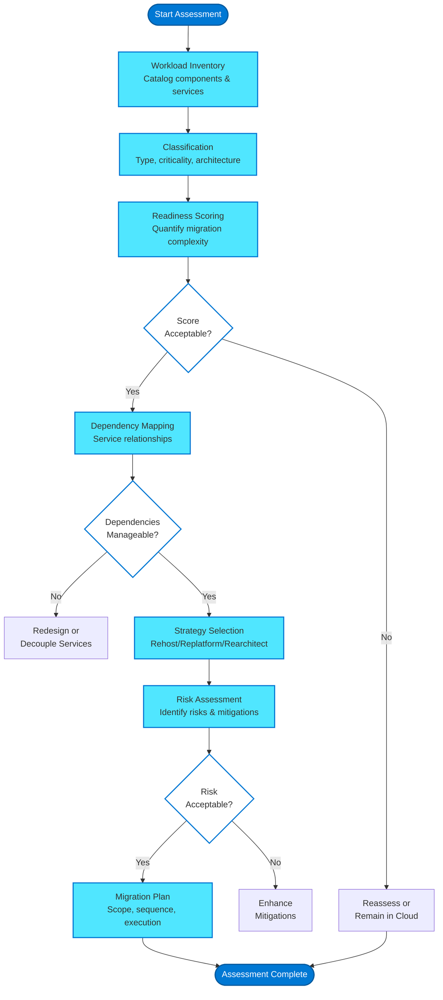
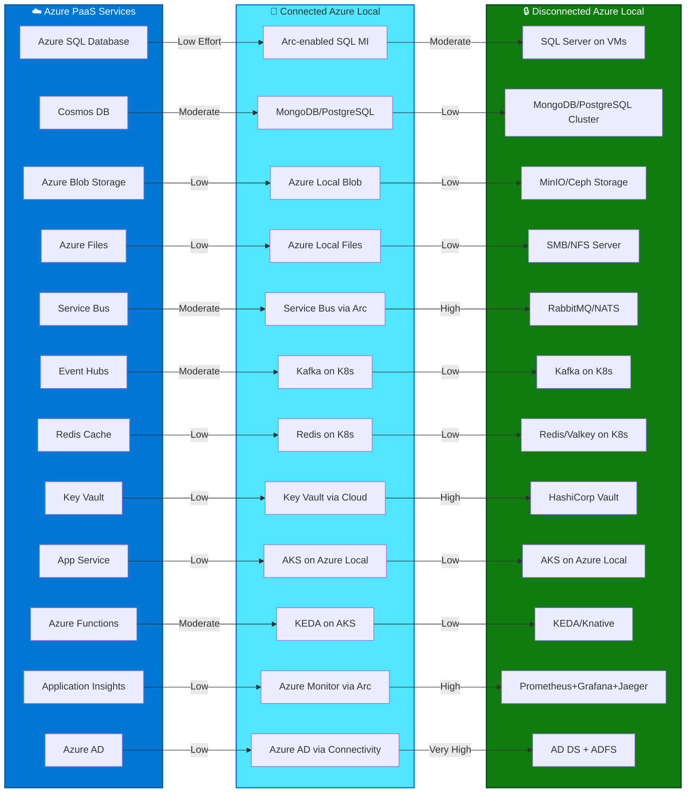

# Workload Assessment

## Introduction

Before initiating any cloud exit journey, a comprehensive workload assessment is fundamental to success. Moving workloads from Azure public cloud to Azure Local—whether connected or fully disconnected—requires understanding the technical, operational, and business dimensions of each application, its dependencies, and its suitability for the target environment.

This chapter provides a structured assessment framework for evaluating workloads, scoring their cloud exit readiness, mapping dependencies, and selecting the appropriate migration strategy. The goal is to transform uncertainty into actionable intelligence, enabling informed decisions about which workloads to move, when to move them, and how to execute the migration with minimal risk.

!!! warning "Cloud Exit is Not for Everyone"
    Cloud exit is a strategic decision driven by specific business, regulatory, or operational requirements. Most organizations benefit from staying in the cloud. Assess carefully before committing to exit strategies.

## Assessment Framework Overview

The cloud exit assessment framework consists of six sequential phases, each building on the previous:

1. **Workload Inventory** — Catalog all components, services, and dependencies
2. **Classification** — Categorize workloads by type, criticality, and architecture
3. **Readiness Scoring** — Quantify migration complexity using multi-dimensional scores
4. **Dependency Mapping** — Visualize service relationships and identify coupling points
5. **Strategy Selection** — Choose the appropriate migration approach (rehost, replatform, rearchitect)
6. **Risk Assessment** — Identify risks, define mitigations, and establish rollback procedures



Each phase produces artifacts that feed into subsequent phases, culminating in a comprehensive migration plan with well-defined scope, sequencing, and risk mitigation strategies.

## Workload Inventory and Classification

### Comprehensive Inventory

Begin by cataloging every component of the workload ecosystem:

**Application Components:**

- **Frontend services**: Web applications, SPAs, static content hosts
- **Backend APIs**: REST APIs, GraphQL endpoints, gRPC services
- **Worker processes**: Background jobs, scheduled tasks, queue consumers
- **Databases**: Relational (SQL), NoSQL (Cosmos DB, MongoDB), cache layers (Redis)
- **Message brokers**: Service Bus, Event Hubs, Event Grid, custom queue systems
- **Storage services**: Blob storage, file shares, data lakes

**Infrastructure Dependencies:**

- **Compute**: Virtual machines, container instances, Kubernetes clusters (AKS)
- **Networking**: Virtual networks, load balancers, Application Gateways, DNS zones
- **Security**: Key Vaults, Managed Identities, certificates, firewall rules
- **Monitoring**: Application Insights, Log Analytics workspaces, alerts
- **Identity**: Azure AD integrations, RBAC assignments, service principals

**External Dependencies:**

- **Third-party SaaS**: Payment processors, authentication providers, analytics platforms
- **External APIs**: Partner integrations, data providers, notification services
- **On-premises systems**: Existing hybrid connections, legacy systems, shared databases

!!! tip "Use Azure Resource Graph for Automated Discovery"
    Azure Resource Graph enables powerful queries across subscriptions to identify resources, tags, relationships, and configurations. Combine with Azure Migrate's discovery tools for comprehensive inventory automation.

### Workload Classification Matrix

Classify each workload using multiple dimensions:

| Classification Dimension | Options | Assessment Impact |
|-------------------------|---------|-------------------|
| **Workload Type** | Web app, API service, Data processing, Database, Storage | Determines migration approach and tooling |
| **Architecture Pattern** | Monolith, Microservices, Serverless, Batch processing | Influences decomposition and migration sequencing |
| **Deployment Model** | IaaS (VMs), CaaS (AKS), PaaS (App Service), FaaS (Functions) | Defines replatforming requirements |
| **Data Characteristics** | Stateless, Stateful, Database-backed, High-volume data | Drives data migration strategy |
| **Business Criticality** | Tier 1 (mission-critical), Tier 2 (important), Tier 3 (low-priority) | Sets migration priority and acceptable downtime |
| **Compliance Requirements** | Data sovereignty, Audit requirements, Regulatory constraints | Validates cloud exit rationale |

## Cloud Exit Readiness Scoring

Quantify migration complexity using four key scoring dimensions. Each dimension scores 1-5 (1 = low complexity, 5 = high complexity):

### 1. PaaS Coupling Score

**Measures**: How tightly the workload is coupled to Azure-specific PaaS services

| Score | Description | Examples |
|-------|-------------|----------|
| **1** | No Azure PaaS dependencies; purely IaaS-based | VMs running standard software, containerized apps using open standards |
| **2** | Minimal PaaS usage; easily replaceable services | Azure Storage as simple blob store, basic Key Vault usage |
| **3** | Moderate PaaS integration; requires replatforming | App Service with managed identity, Cosmos DB with standard APIs |
| **4** | Heavy PaaS reliance; significant code changes needed | Azure Functions with Durable Functions, Service Bus with advanced features |
| **5** | Deep Azure-specific integration; potential rearchitecture | Heavy use of Azure AD B2C, Cognitive Services, proprietary APIs |

**Mitigation**: Higher scores require more planning for service replacement and potential code refactoring.

### 2. Data Gravity Score

**Measures**: Volume of data that must migrate and the complexity of data relationships

| Score | Description | Examples |
|-------|-------------|----------|
| **1** | Minimal data (<100 GB); simple schema | Configuration databases, small application databases |
| **2** | Moderate data (100 GB - 1 TB); standard schema | Typical application databases with relational structure |
| **3** | Significant data (1-10 TB); multiple data stores | Multi-database applications, moderate blob storage |
| **4** | Large data (10-50 TB); complex relationships | Data warehouses, extensive blob storage, multiple regions |
| **5** | Massive data (>50 TB); intricate data ecosystem | Data lakes, global replication, complex data pipelines |

**Mitigation**: Higher scores may require Azure Data Box for physical transfer or extended migration windows.

### 3. Operational Complexity Score

**Measures**: Deployment complexity, configuration management, and operational dependencies

| Score | Description | Characteristics |
|-------|-------------|-----------------|
| **1** | Simple, self-contained deployment | Single service, minimal configuration, no external dependencies |
| **2** | Moderate complexity | Few services, standard configuration management, limited integrations |
| **3** | Multi-component system | Microservices architecture, moderate service mesh, shared dependencies |
| **4** | Complex distributed system | Many microservices, complex networking, cross-service transactions |
| **5** | Highly complex ecosystem | Global distribution, complex orchestration, tight SLA requirements |

### 4. Business Criticality Score

**Measures**: Impact of downtime and business tolerance for migration risk

| Score | Description | Acceptable Downtime |
|-------|-------------|---------------------|
| **1** | Non-critical development/test environment | Days |
| **2** | Low-priority production workload | Hours (planned maintenance) |
| **3** | Important business application | 1-4 hours (maintenance window) |
| **4** | Mission-critical system | Minutes (<30 min) |
| **5** | Zero-downtime requirement | Seconds or none; requires blue/green migration |

### Composite Readiness Score

Calculate the overall complexity score:

```
Cloud Exit Readiness Score = (PaaS Coupling × 0.35) + (Data Gravity × 0.30) + 
                             (Operational Complexity × 0.20) + (Business Criticality × 0.15)
```

**Interpretation:**

- **1.0 - 2.0**: Low complexity — straightforward migration candidate
- **2.1 - 3.5**: Moderate complexity — requires careful planning and staging
- **3.6 - 4.5**: High complexity — needs extensive preparation and may require phased approach
- **4.6 - 5.0**: Very high complexity — consider if cloud exit is truly necessary

!!! example "Readiness Score Example"
    **E-commerce Platform Assessment:**
    
    - PaaS Coupling: 3.5 (uses App Service, SQL Database, Service Bus, Key Vault)
    - Data Gravity: 4.0 (5 TB product catalog + images, customer data across multiple databases)
    - Operational Complexity: 4.5 (microservices architecture, 15 services, complex networking)
    - Business Criticality: 5.0 (revenue-generating, zero-downtime requirement)
    
    **Score**: (3.5×0.35) + (4.0×0.30) + (4.5×0.20) + (5.0×0.15) = **4.2** (High Complexity)
    
    **Recommendation**: Requires phased migration with blue/green deployment, extensive testing, and fallback procedures.

## Dependency Mapping

Dependency mapping is critical for determining migration sequencing and avoiding service disruptions.

### Service-to-Service Dependencies

Create a dependency graph identifying:

- **Synchronous dependencies**: Service A calls Service B via HTTP/gRPC (tight coupling)
- **Asynchronous dependencies**: Service A publishes events consumed by Service B (loose coupling)
- **Shared data dependencies**: Services sharing databases or storage accounts
- **Infrastructure dependencies**: Shared virtual networks, load balancers, DNS zones

**Dependency Analysis Questions:**

1. Can services operate independently during migration?
2. Which services must migrate together as a group?
3. Can dependencies tolerate increased latency during hybrid operation?
4. Are there circular dependencies requiring coordinated cutover?

### PaaS-to-Self-Hosted Replacement Mapping

Map each Azure PaaS service to its on-premises equivalent:



| Azure PaaS Service | Connected Azure Local | Disconnected Azure Local |
|-------------------|----------------------|--------------------------|
| **Azure SQL Database** | Arc-enabled SQL Managed Instance | SQL Server on VMs/containers |
| **Cosmos DB** | MongoDB / PostgreSQL (with extensions) | MongoDB / PostgreSQL cluster |
| **Azure Storage (Blob)** | Azure Local blob service | MinIO / Ceph object storage |
| **Azure Files** | Azure Local file shares | SMB/NFS file server cluster |
| **Service Bus** | Service Bus via Arc (limited) | RabbitMQ / NATS |
| **Event Hubs** | Kafka on Kubernetes | Kafka on Kubernetes |
| **Redis Cache** | Redis on Kubernetes | Redis on Kubernetes / Valkey |
| **Key Vault** | Key Vault via cloud connectivity | HashiCorp Vault / Kubernetes secrets |
| **App Service** | AKS on Azure Local | AKS on Azure Local |
| **Azure Functions** | KEDA on AKS | KEDA on AKS / Knative |
| **Application Insights** | Azure Monitor (via Arc) | Prometheus + Grafana + Jaeger |
| **Azure AD** | Azure AD (via connectivity) | AD DS + ADFS |

**Migration Effort Assessment:**

- **Drop-in replacement** (low effort): Azure SQL → SQL Server, Azure Files → SMB shares
- **Moderate effort**: Cosmos DB → MongoDB (connection string changes, minor API differences)
- **Significant effort**: Azure Functions → KEDA on AKS (deployment model changes)
- **Rearchitecture required**: Azure AD B2C → Custom identity solution (major development)

### Shared Services and Platform Dependencies

Identify shared platform components that multiple workloads depend on:

- **Shared databases**: Must migrate with all dependent services
- **Shared Key Vaults**: Secrets must be migrated or kept accessible
- **Shared virtual networks**: Network topology changes affect all connected services
- **Shared monitoring**: Instrumentation strategy must span migration phases

## Migration Strategy Selection

Choose the appropriate strategy based on readiness scores and dependency analysis:

### Rehost (Lift and Shift)

**When to Use:**
- Low PaaS coupling score (1-2)
- IaaS-based workloads (VMs, containerized apps)
- Minimal code changes acceptable

**Approach:**
- VM-to-VM migration using Azure Migrate
- Container image migration to local registry
- Configuration updates for local endpoints

**Advantages:**
- Fastest migration path
- Lowest risk
- Minimal downtime possible

**Disadvantages:**
- May not optimize for target environment
- Retains legacy architectural patterns

!!! success "Ideal Rehost Candidates"
    Stateless containerized applications with external configuration, VMs running standard software, applications already designed for portability.

### Replatform

**When to Use:**
- Moderate PaaS coupling (2-3)
- Azure PaaS services with clear open-source equivalents
- Acceptable code changes for service substitution

**Approach:**
- Replace Azure SQL with SQL Server on Azure Local
- Replace Service Bus with RabbitMQ or NATS
- Update connection strings and minor API changes

**Advantages:**
- Maintains application logic
- Reduces Azure-specific dependencies
- Prepares for full disconnection

**Disadvantages:**
- Requires testing of service replacements
- Potential API incompatibilities
- Increased migration timeline

### Rearchitect

**When to Use:**
- High PaaS coupling (4-5)
- Deep Azure-specific integrations (Functions, B2C, Cognitive Services)
- Opportunity to modernize architecture

**Approach:**
- Redesign components to use portable patterns
- Replace proprietary services with open standards
- Refactor tightly coupled services

**Advantages:**
- Future-proof architecture
- Improved portability
- Opportunity for optimization

**Disadvantages:**
- Longest timeline
- Highest risk
- Significant development effort

**Decision Tree:**

```
Is PaaS Coupling Score ≤ 2?
├── YES → Consider Rehost (lift and shift)
└── NO → Is there a direct open-source equivalent?
    ├── YES → Consider Replatform
    └── NO → Consider Rearchitect or evaluate if cloud exit is appropriate
```

## Risk Assessment and Mitigation Planning

### Risk Categories

**Technical Risks:**

- **Data loss during migration**: Mitigate with validated backups, checksums, parallel run periods
- **Service incompatibility**: Mitigate with thorough testing, feature parity validation
- **Performance degradation**: Mitigate with performance baselines, load testing
- **Network connectivity issues**: Mitigate with redundant connections, offline fallback procedures

**Operational Risks:**

- **Extended downtime**: Mitigate with phased cutover, blue/green deployments
- **Team skill gaps**: Mitigate with training programs, external expertise
- **Incomplete documentation**: Mitigate with runbook development, knowledge transfer sessions
- **Rollback complexity**: Mitigate with tested rollback procedures, decision criteria

**Business Risks:**

- **Customer impact**: Mitigate with communication plans, SLA adjustments
- **Revenue loss**: Mitigate with minimal-downtime strategies
- **Regulatory compliance**: Mitigate with legal review, compliance validation
- **Cost overruns**: Mitigate with detailed costing, contingency budgets

### Risk Mitigation Matrix

For each identified risk, document:

- **Risk description**: Clear statement of what could go wrong
- **Likelihood** (1-5): Probability of occurrence
- **Impact** (1-5): Severity if it occurs
- **Risk score**: Likelihood × Impact
- **Mitigation strategy**: Actions to reduce likelihood or impact
- **Owner**: Person responsible for mitigation
- **Status**: Not started, In progress, Complete

Prioritize risks with score ≥ 15 (high likelihood × high impact) for immediate mitigation planning.

## Assessment Tools and Automation

### Azure Migrate

**Capabilities:**
- Automated discovery of VMs, applications, databases
- Dependency visualization using agentless or agent-based methods
- Performance baselines and rightsizing recommendations
- Migration planning and execution tools

**Usage for Cloud Exit:**
Use Azure Migrate's discovery and assessment features to gather inventory data and dependency maps, even though final migration target is Azure Local rather than Azure cloud.

### Azure Resource Graph

**Capabilities:**
- Query resources across subscriptions at scale
- Export resource configurations, tags, relationships
- Identify PaaS service usage patterns

**Example Query** — Identify all PaaS services in a subscription:

```kusto
Resources
| where type in (
    'microsoft.web/sites',
    'microsoft.sql/servers',
    'microsoft.documentdb/databaseaccounts',
    'microsoft.servicebus/namespaces',
    'microsoft.eventhub/namespaces'
)
| project name, type, resourceGroup, location
| order by type asc
```

### Custom Assessment Scripts

**PowerShell-based Discovery:**
- Enumerate all resources in target resource groups
- Export configurations and dependencies
- Generate inventory spreadsheets

**Application-Level Assessment:**
- Code analysis for Azure SDK usage
- Configuration scanning for connection strings and endpoints
- Dependency tree generation from deployment manifests

### Assessment Deliverables

The assessment phase should produce:

1. **Workload Inventory Spreadsheet**: All services, dependencies, classifications
2. **Dependency Diagram**: Visual representation of service relationships
3. **Readiness Scorecard**: Scores for each workload with complexity ratings
4. **PaaS Replacement Matrix**: Mapping of Azure services to local equivalents
5. **Migration Strategy Document**: Recommended approach for each workload
6. **Risk Register**: Identified risks with mitigation plans
7. **High-Level Migration Plan**: Sequencing, timeline, resource requirements

These artifacts form the foundation for detailed migration planning and execution covered in subsequent chapters.

## References

- [Azure Migrate — Assessment](https://learn.microsoft.com/en-us/azure/migrate/concepts-assessment-calculation)
- [Azure Resource Graph](https://learn.microsoft.com/en-us/azure/governance/resource-graph/)
- [Cloud Adoption Framework — Assess](https://learn.microsoft.com/en-us/azure/cloud-adoption-framework/migrate/assess/)

---

> **Next:** [Public Cloud → Connected Azure Local →](02-public-to-connected.md)
