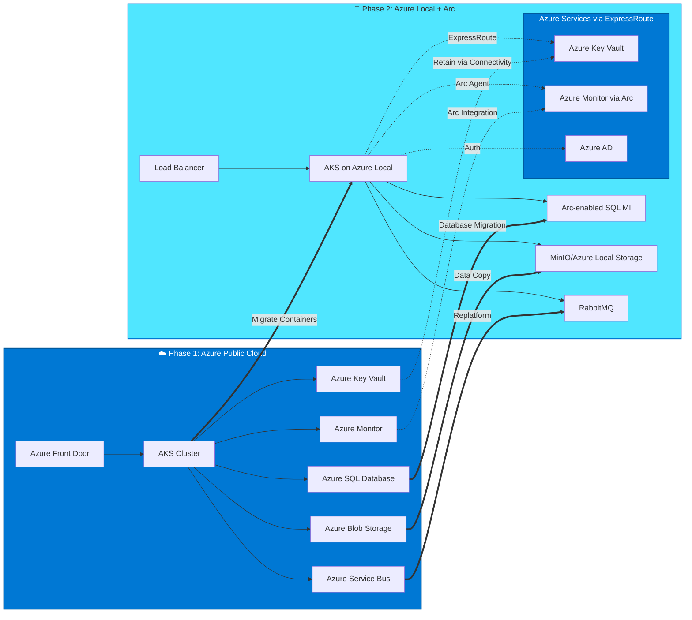

# Public Cloud → Connected Azure Local

## Introduction

The first stage of cloud exit transitions workloads from Azure public cloud to Azure Local infrastructure while maintaining connectivity to Azure management services. This hybrid phase represents the lowest-risk cloud exit approach because Azure Arc preserves access to familiar management tools, monitoring, security services, and identity infrastructure.

This chapter provides a step-by-step methodology for migrating workloads to Azure Local in connected mode, covering infrastructure preparation, workload-specific migration strategies, PaaS service replacement, data migration execution, validation procedures, and rollback plans. The goal is to establish a stable hybrid environment that can operate on-premises while retaining the operational benefits of Azure management.

!!! info "Connected Mode Advantages"
    Connected Azure Local maintains Azure Portal management, Azure AD authentication, Azure Monitor integration, and policy enforcement. This significantly reduces operational complexity compared to fully disconnected deployments.

## Prerequisites and Readiness Validation

### Azure Local Cluster Deployed

Before beginning workload migration, ensure:

- **Azure Local cluster is operational**: Minimum 3 nodes for production, validated health checks
- **Registered with Azure**: Cluster appears in Azure Portal with active Arc connection
- **Networking configured**: Connectivity to Azure services via ExpressRoute or site-to-site VPN
- **Storage provisioned**: Sufficient capacity for workload data with appropriate performance tiers
- **Kubernetes enabled**: AKS on Azure Local deployed if containerized workloads are migrating

**Validation Checklist:**

```powershell
# Verify cluster health
Get-AzureStackHCI

# Confirm Arc connectivity
az connectedk8s show --name <cluster-name> --resource-group <rg-name>

# Check available capacity
Get-StoragePool | Get-PhysicalDisk
```

### Network Connectivity Established

**Required Connectivity:**

- **ExpressRoute (Recommended)**: Dedicated private connection with predictable latency
  - Enables Azure Arc management traffic
  - Supports Azure AD authentication
  - Allows Azure Monitor data upload
  - Minimum recommended: 1 Gbps circuit

- **Site-to-Site VPN (Alternative)**: Encrypted tunnel over public internet
  - Lower cost than ExpressRoute
  - Higher latency and less predictable performance
  - Sufficient for management traffic, may impact large data migrations

**Network Requirements:**

| Service | Outbound Ports | Destinations | Purpose |
|---------|---------------|--------------|---------|
| **Azure Arc** | 443 (HTTPS) | management.azure.com, login.microsoftonline.com | Cluster management and authentication |
| **Azure Monitor** | 443 (HTTPS) | *.ods.opinsights.azure.com | Metrics and logs upload |
| **Container Registry** | 443 (HTTPS) | *.azurecr.io, mcr.microsoft.com | Container image pulls |
| **Azure AD** | 443 (HTTPS) | login.microsoftonline.com, graph.microsoft.com | Authentication and authorization |

!!! warning "Network Bandwidth Planning"
    Size connectivity based on: monitoring data volume (typically 1-5 Mbps), Arc management overhead (minimal), and container image pulls during deployments. Do not rely on this connection for application data transfer—use dedicated migration network or offline methods.

### Identity and Access Management

**Azure AD Integration:**

- Service principals created for Arc agents and managed identities
- RBAC roles assigned for cluster management
- Conditional access policies configured if required

**Local Identity Requirements:**

- Local administrator accounts for emergency access
- Break-glass procedures documented for connectivity loss scenarios

## Infrastructure Preparation

### Sizing the Azure Local Cluster

Use assessment data from Chapter 1 to determine cluster requirements:

**Compute Sizing:**

```
Required CPU cores = (Sum of workload vCPUs) × 1.3 (overhead) + 10% (burst capacity)
Required Memory = (Sum of workload RAM) × 1.2 (overhead) + 15% (burst capacity)
```

**Example Calculation:**
- Workloads require: 120 vCPUs, 480 GB RAM
- Cluster needs: (120 × 1.3) + 12 = 168 vCPUs, (480 × 1.2) + 72 = 648 GB RAM
- Node recommendation: 4 nodes × 44 cores × 512 GB RAM per node

**Storage Sizing:**

- **Capacity**: Total workload data + 30% growth + 20% overhead for replication/snapshots
- **Performance**: Match IOPS and throughput requirements from Azure performance baselines
- **Tiers**: Use NVMe for databases, SSD for general workloads, HDD for cold storage

**Network Architecture:**

- **Management network**: 1 GbE for out-of-band management
- **Storage network**: 25 GbE (minimum) for Storage Spaces Direct traffic
- **Workload network**: 10/25 GbE based on application throughput requirements
- **Uplink to Azure**: Via ExpressRoute or VPN gateway (separate from internal networks)

### Azure Arc Configuration

**Enable Required Resource Providers:**

```bash
# Register Arc providers
az provider register --namespace Microsoft.Kubernetes
az provider register --namespace Microsoft.KubernetesConfiguration
az provider register --namespace Microsoft.ExtendedLocation

# Verify registration
az provider show -n Microsoft.Kubernetes -o table
```

**Install Arc Extensions:**

```bash
# Azure Monitor for containers
az k8s-extension create \
  --name azuremonitor-containers \
  --cluster-name <cluster-name> \
  --resource-group <rg-name> \
  --cluster-type connectedClusters \
  --extension-type Microsoft.AzureMonitor.Containers \
  --configuration-settings logAnalyticsWorkspaceResourceID=<workspace-id>

# Azure Policy
az k8s-extension create \
  --name azure-policy \
  --cluster-name <cluster-name> \
  --resource-group <rg-name> \
  --cluster-type connectedClusters \
  --extension-type Microsoft.PolicyInsights
```

## Migration Approach by Workload Type



### Containerized Workloads: AKS → AKS on Azure Local

**Migration Strategy: Blue/Green Deployment**

This approach maintains the existing AKS cluster (blue) while building the new AKS on Azure Local environment (green), enabling safe cutover with instant rollback capability.

**Step 1: Prepare AKS on Azure Local**

```bash
# Create AKS cluster on Azure Local
az aksarc create \
  --name production-cluster \
  --resource-group azurelocal-rg \
  --custom-location <custom-location-id> \
  --node-count 5 \
  --node-vm-size Standard_D8s_v3 \
  --load-balancer-sku standard

# Connect to cluster
az aksarc get-credentials --name production-cluster --resource-group azurelocal-rg
```

**Step 2: Migrate Container Images**

```bash
# Option A: Re-tag and push images to local registry (if using local ACR mirror)
SOURCE_ACR="myazureacr.azurecr.io"
TARGET_ACR="azurelocal-acr.azurecr.io"

az acr import \
  --name azurelocal-acr \
  --source $SOURCE_ACR/app/backend:v2.1 \
  --image app/backend:v2.1

# Option B: Keep using Azure ACR via network connectivity (simpler initial migration)
# No image migration needed; update kubeconfig only
```

**Step 3: Deploy Workloads**

```bash
# Apply Kubernetes manifests with environment-specific values
kubectl apply -f manifests/namespace.yaml
kubectl apply -f manifests/configmaps/
kubectl apply -f manifests/secrets/ # Updated with new connection strings
kubectl apply -f manifests/deployments/
kubectl apply -f manifests/services/

# Verify deployment
kubectl get pods -n production
kubectl get services -n production
```

**Step 4: Update Ingress and DNS**

```yaml
# Update ingress to use Azure Local load balancer
apiVersion: networking.k8s.io/v1
kind: Ingress
metadata:
  name: production-ingress
  annotations:
    kubernetes.io/ingress.class: nginx
    cert-manager.io/cluster-issuer: letsencrypt-prod
spec:
  rules:
  - host: app.company.com
    http:
      paths:
      - path: /
        pathType: Prefix
        backend:
          service:
            name: backend-service
            port:
              number: 80
```

**Step 5: DNS Cutover**

```
# Before cutover:
app.company.com → Azure Load Balancer (public IP) → AKS in Azure

# After cutover:
app.company.com → On-premises Load Balancer → AKS on Azure Local

# Minimize downtime:
1. Lower DNS TTL to 60 seconds (24 hours before cutover)
2. Verify Azure Local environment handles test traffic
3. Update DNS to point to on-premises load balancer IP
4. Monitor for 15-30 minutes
5. If issues occur, revert DNS entry (blue/green rollback)
```

**Step 6: Validate and Monitor**

```bash
# Smoke tests
kubectl exec -it <pod-name> -- curl http://backend-service/health

# Load test
kubectl run -it --rm load-test --image=busybox --restart=Never -- /bin/sh
# Run load tests from inside cluster

# Monitor Azure Monitor
# Review Azure Local cluster metrics in Azure Portal
```

!!! success "Zero-Downtime Pattern"
    Use weighted DNS or traffic manager to gradually shift traffic from Azure AKS to Azure Local AKS (10% → 50% → 100%), validating at each stage. This canary approach minimizes risk for critical workloads.

### Virtual Machine Workloads: Azure VMs → Azure Local VMs

**Migration Strategy: Azure Migrate or Manual VM Export/Import**

**Option A: Azure Migrate (Recommended for Large VM Fleets)**

```bash
# Set up Azure Migrate project
az migrate project create \
  --name azurelocal-migration \
  --resource-group migration-rg \
  --location eastus

# Discover VMs (install migrate agent on source VMs)
# Assessment and migration performed via Azure Portal
```

**Migrate appliance guides replication, test failover, and final cutover.**

**Option B: Manual VHD Export (Suitable for Small Numbers)**

```powershell
# Export VM disk from Azure
$vm = Get-AzVM -ResourceGroupName "source-rg" -Name "app-server-01"
$disk = Get-AzDisk -ResourceGroupName "source-rg" -DiskName $vm.StorageProfile.OsDisk.Name

# Grant SAS access
$sas = Grant-AzDiskAccess -ResourceGroupName "source-rg" -DiskName $disk.Name -Access Read -DurationInSecond 3600

# Download VHD using AzCopy
azcopy copy "$($sas.AccessSAS)" "C:\VHDs\app-server-01.vhd"

# Import to Azure Local
# (Use Azure Local VM management to create VM from uploaded VHD)
```

**Post-Migration Configuration:**

- Update VM agent to Azure Local agent
- Reconfigure static IPs for local network
- Update DNS records
- Validate applications function correctly

### Database Workloads: Azure SQL → Arc-enabled SQL Managed Instance

**Migration Strategy: Database Migration Service + Cutover**

**Step 1: Deploy Arc-enabled SQL Managed Instance**

```bash
# Create custom location for data services
az customlocation create \
  --name azurelocal-data-location \
  --resource-group azurelocal-rg \
  --namespace arc-data \
  --host-resource-id <arc-cluster-id> \
  --cluster-extension-ids <data-extension-id>

# Deploy SQL Managed Instance
az sql mi-arc create \
  --name production-sql-mi \
  --resource-group azurelocal-rg \
  --location <custom-location> \
  --storage-class managed-premium \
  --replicas 3 \
  --cores-request 4 \
  --memory-request 8Gi
```

**Step 2: Schema and Data Migration**

```bash
# Export schema using SQL Server Management Studio or Azure Data Studio
# Schema scripts saved to migration folder

# Use Database Migration Service for online migration
az datamigration sql-managed-instance create \
  --source-sql-connection "source-connection-string" \
  --target-sql-connection "target-connection-string" \
  --migration-mode Online

# Monitor migration progress
az datamigration sql-managed-instance show \
  --name migration-job-01 \
  --resource-group migration-rg
```

**Step 3: Application Cutover**

```
# Update connection strings in application configuration
Before: Server=myserver.database.windows.net;Database=ProductionDB;
After:  Server=production-sql-mi.azurelocal.local,1433;Database=ProductionDB;

# Enable connection encryption
Encrypt=True;TrustServerCertificate=False;
```

**Step 4: Validate Data Integrity**

```sql
-- Compare row counts
SELECT COUNT(*) FROM Orders; -- Run on both source and target

-- Validate critical data
SELECT TOP 10 * FROM Orders ORDER BY OrderDate DESC;

-- Check foreign key relationships
EXEC sp_fkeys @pktable_name = 'Customers';
```

### Storage: Azure Blob → Azure Local Storage

**Migration Strategy: AzCopy Bulk Transfer**

**Step 1: Prepare Azure Local Storage**

```bash
# Create storage account on Azure Local (if available)
# Or provision SMB/NFS file shares
# Or deploy MinIO for S3-compatible object storage

# For Azure Local native storage:
az storage account create \
  --name azurelocalstorage \
  --resource-group azurelocal-rg \
  --location <custom-location> \
  --sku Premium_LRS
```

**Step 2: Transfer Data**

```bash
# Install AzCopy
# Configure source and destination connections

# Bulk copy
azcopy copy \
  "https://sourceaccount.blob.core.windows.net/container/*" \
  "https://azurelocalstorage.blob.local/container/" \
  --recursive=true \
  --check-length=true

# Verify checksums
azcopy sync \
  "https://sourceaccount.blob.core.windows.net/container" \
  "https://azurelocalstorage.blob.local/container" \
  --delete-destination=false
```

**Step 3: Update Application Configuration**

```csharp
// Before
BlobServiceClient blobServiceClient = new BlobServiceClient(
    "DefaultEndpointsProtocol=https;AccountName=myaccount;AccountKey=...");

// After
BlobServiceClient blobServiceClient = new BlobServiceClient(
    "DefaultEndpointsProtocol=https;AccountName=azurelocalstorage;AccountKey=...;BlobEndpoint=https://azurelocalstorage.blob.local/");
```

## PaaS Service Replacement for Connected Mode

### Azure Service Bus → Keep or Replace

**Option A: Continue Using Azure Service Bus via Connectivity**

- Simplest approach for connected mode
- No code changes required
- Depends on network reliability
- Suitable for low-volume messaging

**Option B: Replace with RabbitMQ or NATS**

Deploy message broker on Kubernetes:

```yaml
# RabbitMQ Helm deployment
helm repo add bitnami https://charts.bitnami.com/bitnami

helm install rabbitmq bitnami/rabbitmq \
  --set auth.username=admin \
  --set auth.password=<secure-password> \
  --set replicaCount=3 \
  --set persistence.size=10Gi
```

**Update application code:**

```csharp
// Before: Azure Service Bus
ServiceBusClient client = new ServiceBusClient(connectionString);
ServiceBusSender sender = client.CreateSender(queueName);

// After: RabbitMQ with MassTransit
var busControl = Bus.Factory.CreateUsingRabbitMq(cfg =>
{
    cfg.Host("rabbitmq.azurelocal.local", "/", h =>
    {
        h.Username("admin");
        h.Password("password");
    });
});
```

### Azure Key Vault → Maintain or Replace

**Option A: Continue Using Azure Key Vault**

- Requires network connectivity
- Managed identities work via Arc
- Simplest for connected mode

**Option B: Deploy HashiCorp Vault**

```bash
# Deploy Vault via Helm
helm repo add hashicorp https://helm.releases.hashicorp.com

helm install vault hashicorp/vault \
  --set server.ha.enabled=true \
  --set server.ha.replicas=3

# Initialize and unseal Vault
kubectl exec -it vault-0 -- vault operator init
kubectl exec -it vault-0 -- vault operator unseal <key>
```

### Azure Container Registry → Cloud or Local Mirror

**Option A: Keep Azure Container Registry**

- Images pulled from cloud registry
- Requires network connectivity during deployments
- No migration needed

**Option B: Harbor Local Registry**

```bash
# Deploy Harbor
helm repo add harbor https://helm.goharbor.io

helm install harbor harbor/harbor \
  --set expose.type=loadBalancer \
  --set externalURL=https://harbor.azurelocal.local \
  --set persistence.persistentVolumeClaim.registry.size=500Gi

# Mirror images from ACR
docker pull myazureacr.azurecr.io/app/backend:v2.1
docker tag myazureacr.azurecr.io/app/backend:v2.1 harbor.azurelocal.local/app/backend:v2.1
docker push harbor.azurelocal.local/app/backend:v2.1
```

## Data Migration Execution Patterns

### Online Migration (Minimal Downtime)

**Approach**: Establish replication from Azure to Azure Local, synchronize continuously, then cutover during short maintenance window.

**Suitable for**:
- Databases with high change rate
- Mission-critical systems requiring <15 minutes downtime
- Workloads with strict SLAs

**Process**:
1. Set up replication (e.g., SQL transactional replication)
2. Allow synchronization to catch up
3. Enter read-only mode on source
4. Perform final sync
5. Cutover to target
6. Validate and enable writes

### Offline Migration (Planned Downtime)

**Approach**: Schedule maintenance window, export data, transfer, import, and validate.

**Suitable for**:
- Databases with low change rate
- Non-critical systems tolerating hours of downtime
- Large datasets where replication isn't feasible

**Process**:
1. Schedule maintenance window
2. Stop writes to source
3. Export data (database backup, blob copy, etc.)
4. Transfer to Azure Local (network or physical media)
5. Import data
6. Validate integrity
7. Resume operations

### Hybrid Operation (Extended Coexistence)

**Approach**: Run workloads in both environments simultaneously with data synchronization or federation.

**Suitable for**:
- Phased user migration
- Testing and validation periods
- Gradual traffic shifting

**Challenges**:
- Data consistency complexity
- Dual operational burden
- Increased cost during transition

## Validation and Testing Post-Migration

### Functional Validation Checklist

- [ ] **Application health endpoints respond**: `/health`, `/ready` return 200 OK
- [ ] **User authentication works**: Login functionality validated
- [ ] **Database connectivity verified**: Application can read/write data
- [ ] **Inter-service communication validated**: APIs respond correctly
- [ ] **External integrations functional**: Third-party services accessible
- [ ] **Background jobs executing**: Scheduled tasks and workers operational
- [ ] **File uploads/downloads work**: Storage operations validated
- [ ] **Monitoring and logging functional**: Metrics and logs flowing to monitoring systems

### Performance Validation

```bash
# Load testing from Azure Local environment
kubectl run -it load-test --image=grafana/k6 --restart=Never -- run - <<EOF
import http from 'k6/http';
import { check, sleep } from 'k6';

export let options = {
  stages: [
    { duration: '2m', target: 100 },
    { duration: '5m', target: 100 },
    { duration: '2m', target: 0 },
  ],
};

export default function () {
  let res = http.get('https://app.azurelocal.local/api/health');
  check(res, { 'status was 200': (r) => r.status == 200 });
  sleep(1);
}
EOF
```

**Performance Metrics to Validate:**
- Response time within acceptable range (compare to Azure baseline)
- Throughput meets requirements
- Error rate <0.1%
- Database query performance comparable

### Data Integrity Validation

```sql
-- Row count comparison
SELECT 'Orders' AS TableName, COUNT(*) AS RowCount FROM Orders
UNION ALL
SELECT 'Customers', COUNT(*) FROM Customers
UNION ALL
SELECT 'Products', COUNT(*) FROM Products;

-- Checksum validation (SQL Server example)
SELECT CHECKSUM_AGG(CHECKSUM(*)) FROM Orders;
-- Compare checksum between source and target
```

### Security Validation

- [ ] **TLS certificates valid**: All HTTPS endpoints use valid certificates
- [ ] **Authentication working**: Users can log in with Azure AD (via Arc) or local AD
- [ ] **Authorization enforced**: RBAC and policies enforced correctly
- [ ] **Secrets accessible**: Applications can retrieve secrets from Key Vault/Vault
- [ ] **Network policies active**: Traffic flows only through allowed paths

## Rollback Procedures

### Decision Criteria for Rollback

Initiate rollback if:

- **Critical functionality broken**: Core features non-operational after 2 hours troubleshooting
- **Data integrity issues**: Corruption or loss detected
- **Performance degradation >50%**: Unacceptable latency or throughput
- **Security vulnerabilities**: New security gaps introduced
- **Exceeded downtime SLA**: Maintenance window exceeded with no resolution

### Rollback Process: AKS Workloads

```bash
# Immediate DNS rollback
# Update DNS to point back to Azure AKS load balancer IP
# TTL should be low (60s) for fast propagation

# Verify Azure AKS cluster still operational
kubectl get pods -n production --context=azure-aks-context

# If Azure resources were stopped, restart them
az aks start --name azure-aks-cluster --resource-group azure-rg
```

### Rollback Process: Database Workloads

**If using online migration (replication active):**

```sql
-- Pause application writes to Azure Local SQL MI
-- Resume writes to Azure SQL Database
-- Replication catches up automatically
-- Update application connection strings back to Azure SQL
```

**If using offline migration (no replication):**

```sql
-- Restore Azure SQL Database from backup taken before migration
-- Data entered during Azure Local operation may be lost
-- Communication plan critical for affected users
```

### Rollback Process: VMs

```bash
# Keep Azure VMs in stopped (deallocated) state during validation period
# If rollback needed, restart Azure VMs
az vm start --name app-server-01 --resource-group azure-rg

# Update load balancer to route traffic back to Azure VMs
```

!!! warning "Rollback Window Limitation"
    Rollback becomes increasingly difficult as time passes. Establish clear decision gates (e.g., 2-hour, 24-hour, 1-week) with documented "point of no return" when Azure resources will be decommissioned.

## Decision Points and Real-World Considerations

### When to Maintain Cloud Dependencies

**Keep using Azure PaaS in connected mode if:**

- Service has no good open-source equivalent (e.g., specific Cognitive Services)
- Migration effort outweighs benefit
- Workload will eventually move back to cloud
- Network connectivity is highly reliable

**Example**: Keep Azure AD, Azure Monitor, Azure Key Vault via connectivity to minimize initial migration complexity. Plan to replace these in Phase 2 (disconnected migration) only if needed.

### Phased Migration Strategy

**Phase 1**: Migrate stateless applications and low-risk workloads
**Phase 2**: Migrate databases and stateful services
**Phase 3**: Migrate mission-critical workloads with extensive validation
**Phase 4**: Decommission Azure resources after validation period

This approach builds confidence and operational muscle before tackling high-risk migrations.

### Communication and Stakeholder Management

- **Transparent timelines**: Communicate realistic timelines with contingency buffers
- **Regular status updates**: Daily during migration execution, weekly during preparation
- **Success criteria**: Define measurable success metrics before starting migration
- **Escalation paths**: Clear escalation for technical and business issues

The connected Azure Local phase establishes the foundation for eventual full cloud exit while maintaining operational safety nets. Once stable, organizations can evaluate whether to progress to disconnected mode or remain in this hybrid state indefinitely.

## References

- [AKS on Azure Local](https://learn.microsoft.com/en-us/azure/aks/hybrid/)
- [Azure Arc-enabled SQL Managed Instance](https://learn.microsoft.com/en-us/azure/azure-arc/data/managed-instance-overview)
- [Azure Local VM Management](https://learn.microsoft.com/en-us/azure/azure-local/manage/manage-virtual-machines-in-azure-portal)
- [Azure Migrate — Server Migration](https://learn.microsoft.com/en-us/azure/migrate/tutorial-migrate-physical-virtual-machines)

---

> **Next:** [Connected → Disconnected Azure Local →](03-connected-to-disconnected.md)
