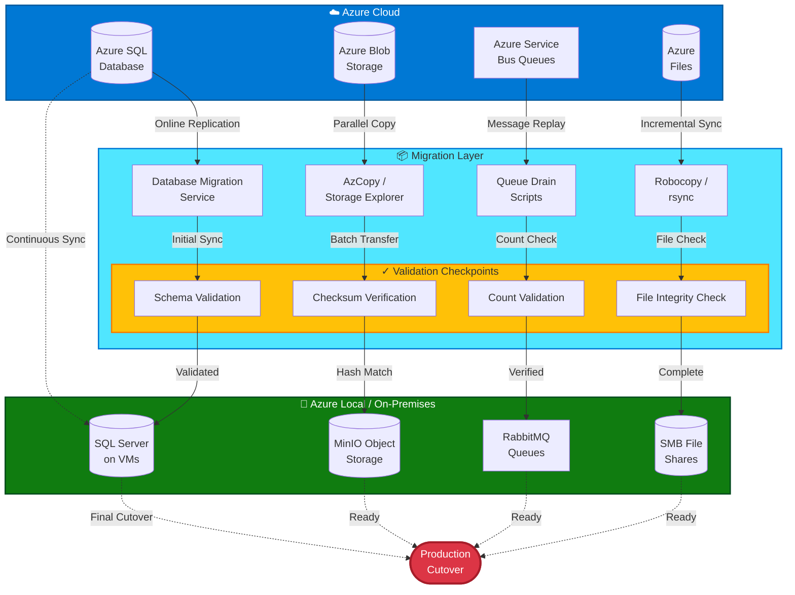

# Data Migration Strategies

## Introduction

Data migration is often the most critical, complex, and risky aspect of cloud exit. Unlike compute resources that can be recreated or applications that can be redeployed, data carries the history, state, and value of an organization's operations. Loss, corruption, or extended unavailability of data during migration can have catastrophic business consequences.

This chapter covers comprehensive strategies for migrating data across the hybrid continuum—from Azure cloud storage to on-premises systems—with specific attention to minimizing downtime, ensuring data integrity, maintaining consistency during transition periods, and meeting compliance requirements. The goal is to move data safely, verify it completely, and maintain business continuity throughout the process.

!!! warning "Data Migration Risk Profile"
    Data migration failures represent the highest risk category in cloud exit projects. The combination of data volume, complexity, and business criticality demands extensive planning, testing, and validation. Never proceed without verified backup and rollback procedures.

## Data Migration Challenges

### Data Volume and Transfer Times

**The Challenge:**

Large datasets require substantial time to transfer over network connections. A 10 TB database over a 1 Gbps connection theoretically takes 22+ hours, but real-world factors (network overhead, encryption, packet loss, retransmissions) often double or triple this estimate.

**Impact:**

- Extended migration windows
- Increased risk of consistency issues during long transfers
- Potential for interruption requiring restart
- Business pressure to complete migration faster than technically feasible

**Mitigation Strategies:**

- **Bandwidth planning**: Dedicate migration network separate from production traffic
- **Compression**: Enable data compression during transfer (often 30-50% reduction)
- **Parallel transfers**: Split data into segments transferred simultaneously
- **Physical transfer**: Use Azure Data Box for datasets >20 TB
- **Incremental synchronization**: Initial bulk transfer + delta synchronization closer to cutover

### Data Consistency During Migration

**The Challenge:**

Applications continue to write data during migration. Ensuring consistency between source (Azure) and target (Azure Local) systems while data is actively changing requires careful coordination.

**Consistency Models:**

| Model | Description | Use Case | Downtime |
|-------|-------------|----------|----------|
| **Snapshot-based** | Take point-in-time snapshot, transfer, restore | Low-change databases, acceptable data loss | Minimal (read-only during final sync) |
| **Replication-based** | Continuous replication to target | High-change databases, minimal data loss tolerance | Minimal (seconds during cutover) |
| **Dual-write** | Application writes to both source and target | Zero data loss requirement | None (during transition period) |
| **Quiesce-and-transfer** | Stop writes, transfer, resume | Batch systems, scheduled maintenance | Hours (duration of transfer) |

**Choosing the Right Model:**

- **Mission-critical databases with high transaction volume**: Replication-based
- **Data warehouses and analytics databases**: Snapshot-based
- **E-commerce and financial systems**: Dual-write or replication-based
- **Development/test environments**: Quiesce-and-transfer

### Schema and Format Compatibility

**The Challenge:**

Azure PaaS services sometimes use proprietary formats, extensions, or features not available in open-source alternatives. Cosmos DB's multi-model capabilities, Azure SQL's temporal tables, and Azure Storage's hierarchical namespaces may require transformation during migration.

**Assessment Questions:**

1. Does the target system support all features used in the source?
2. Are there proprietary extensions requiring code changes?
3. Can data be exported in a standard format (SQL, JSON, CSV, Parquet)?
4. Are character encodings, date formats, and collations compatible?

**Mitigation:**

- Schema comparison tools (e.g., SQL Server Data Tools schema compare)
- Feature parity analysis before migration
- Transformation scripts for incompatible features
- Comprehensive testing with production-like data

### Encryption and Key Management

**The Challenge:**

Azure-managed encryption keys (Azure Key Vault, Storage Account keys) are not accessible after disconnection. Data must be re-encrypted with locally managed keys, or encryption keys must be exported before disconnection.

**Key Migration Strategies:**

```bash
# Export Azure Key Vault keys before disconnection
az keyvault key backup --vault-name my-keyvault --name database-encryption-key --file dek-backup.key

# Import into HashiCorp Vault or local key management system
vault write transit/keys/database-encryption-key type=aes256-gcm96
```

**Encryption Transition Patterns:**

- **Re-encryption**: Decrypt with Azure keys during export, re-encrypt with local keys during import
- **Key export**: Export Azure keys before disconnection, import into local key management
- **Transparent transition**: Use application-level encryption independent of storage layer

## Migration Strategies by Data Type

### Relational Databases: Azure SQL → SQL Server / PostgreSQL

#### Online Migration with Minimal Downtime

**Approach**: Use transactional replication or log shipping to continuously synchronize data from Azure SQL to target system.

**For SQL Server:**

```sql
-- Step 1: Configure Azure SQL as publisher
EXEC sp_addlinkedserver 
    @server = 'AZURE_LOCAL_SQL', 
    @srvproduct = '', 
    @provider = 'SQLNCLI', 
    @datasrc = 'sql-mi.azurelocal.local';

-- Step 2: Set up transactional replication
EXEC sp_replicationdboption 
    @dbname = 'ProductionDB', 
    @optname = 'publish', 
    @value = 'true';

EXEC sp_addpublication 
    @publication = 'ProductionDB_Publication',
    @sync_method = 'concurrent',
    @repl_freq = 'continuous',
    @status = 'active';

-- Step 3: Add articles (tables) to publication
EXEC sp_addarticle 
    @publication = 'ProductionDB_Publication',
    @article = 'Orders',
    @source_object = 'Orders',
    @destination_table = 'Orders';

-- Repeat for all tables

-- Step 4: Create subscription on target
EXEC sp_addsubscription 
    @publication = 'ProductionDB_Publication',
    @subscriber = 'AZURE_LOCAL_SQL',
    @destination_db = 'ProductionDB',
    @subscription_type = 'push';
```

**Cutover Process:**

```sql
-- Monitor replication lag
SELECT 
    subscriber_db,
    DATEDIFF(SECOND, last_sync_timestamp, GETDATE()) AS ReplicationLagSeconds
FROM distribution.dbo.MSdistribution_status;

-- When lag is <5 seconds:
-- 1. Set application to read-only mode
-- 2. Wait for replication to catch up completely
-- 3. Update connection strings to point to Azure Local
-- 4. Resume write operations
-- 5. Disable replication
```

**Alternative: Database Migration Service (DMS)**

```bash
# Create DMS project
az dms project create \
  --resource-group migration-rg \
  --service-name my-dms-service \
  --name db-migration-project \
  --source-platform SQL \
  --target-platform SQLDB \
  --location eastus

# Create migration task
az dms project task create \
  --resource-group migration-rg \
  --service-name my-dms-service \
  --project-name db-migration-project \
  --name migration-task-01 \
  --source-connection-json @source-connection.json \
  --target-connection-json @target-connection.json \
  --database-options-json @database-options.json \
  --task-type OnlineMigration
```

#### Offline Migration with Backup/Restore

**Approach**: Export database as backup file, transfer to Azure Local, restore.

**For Large Databases (Faster Restore):**

```sql
-- On Azure SQL: Export database
-- Use Azure Data Studio or SSMS to generate BACPAC file
-- Or use native backup (if available on your tier)

-- Alternative: Use bcp for individual tables
bcp "SELECT * FROM Orders" queryout "Orders.dat" -S server.database.windows.net -d ProductionDB -U username -P password -n

-- Transfer files to Azure Local (network copy or Data Box)

-- On Azure Local SQL: Restore database
RESTORE DATABASE ProductionDB
FROM DISK = '\\nas.azurelocal.local\backups\ProductionDB.bak'
WITH MOVE 'ProductionDB' TO 'C:\SQLData\ProductionDB.mdf',
     MOVE 'ProductionDB_log' TO 'C:\SQLData\ProductionDB_log.ldf',
     REPLACE,
     STATS = 10;

-- Verify restore
SELECT name, state_desc FROM sys.databases WHERE name = 'ProductionDB';
```

**For PostgreSQL Migration:**

```bash
# Export from Azure Database for PostgreSQL
pg_dump -h myserver.postgres.database.azure.com \
        -U myuser@myserver \
        -d productiondb \
        -Fc -b -v -f productiondb.backup

# Transfer to Azure Local
scp productiondb.backup azurelocal:/var/lib/postgresql/backups/

# Restore on Azure Local PostgreSQL
pg_restore -h localhost \
           -U postgres \
           -d productiondb \
           -v productiondb.backup
```

### Blob/Object Storage: Azure Blob → MinIO / Local Storage

#### Online Migration with AzCopy

**Approach**: Use AzCopy to synchronize blobs from Azure Storage to target object storage (MinIO, Ceph) or file shares.

**Step 1: Install AzCopy and Configure Authentication**

```bash
# Download AzCopy
wget https://aka.ms/downloadazcopy-v10-linux
tar -xvf downloadazcopy-v10-linux
sudo mv azcopy_linux_amd64_*/azcopy /usr/local/bin/

# Authenticate to Azure Storage
export AZCOPY_AUTO_LOGIN_TYPE=SPN
export AZCOPY_SPA_APPLICATION_ID=<app-id>
export AZCOPY_SPA_CLIENT_SECRET=<secret>
export AZCOPY_TENANT_ID=<tenant-id>
```

**Step 2: Bulk Copy with Validation**

```bash
# Initial bulk copy
azcopy copy \
  "https://mystorage.blob.core.windows.net/production-data/*?<SAS-token>" \
  "http://minio.azurelocal.local:9000/production-data/" \
  --recursive=true \
  --check-length=true \
  --s2s-preserve-blob-tags=true \
  --log-level=INFO

# Incremental sync (copy only changed/new files)
azcopy sync \
  "https://mystorage.blob.core.windows.net/production-data/?<SAS-token>" \
  "http://minio.azurelocal.local:9000/production-data/" \
  --recursive=true \
  --delete-destination=false \
  --compare-hash=MD5
```

**Step 3: Verify Transfer Completeness**

```bash
# Count files in source
az storage blob list --account-name mystorage --container-name production-data --query "length([*])"

# Count files in destination (MinIO via mc command-line client)
mc ls --recursive minio/production-data/ | wc -l

# Compare file counts and spot-check file integrity
```

**Step 4: Application Configuration Update**

```csharp
// Before: Azure Blob Storage
BlobServiceClient blobServiceClient = new BlobServiceClient(
    "DefaultEndpointsProtocol=https;AccountName=mystorage;AccountKey=<key>;EndpointSuffix=core.windows.net");

// After: MinIO S3-compatible storage
var s3Client = new AmazonS3Client(
    new BasicAWSCredentials("minioadmin", "minioadmin"),
    new AmazonS3Config
    {
        ServiceURL = "http://minio.azurelocal.local:9000",
        ForcePathStyle = true
    });
```

#### Offline Migration with Azure Data Box

**When to Use:**

- Data volume >20 TB
- Network bandwidth insufficient for acceptable transfer time
- Regulatory requirements for offline data transfer

**Process:**

```bash
# Step 1: Order Azure Data Box from Azure Portal
# Microsoft ships empty Data Box device to your location

# Step 2: Connect Data Box to local network and copy data
# Use Data Box Web UI or SMB/NFS shares

# Copy to Data Box
robocopy \\mystorage.blob.core.windows.net\production-data\ E:\production-data\ /E /Z /MT:32

# Step 3: Ship Data Box back to Microsoft
# Microsoft uploads data to specified Azure Storage account

# Step 4: Download from Azure Storage to Azure Local
# Use AzCopy as shown above, but now from Data Box target storage

# Alternative: Use Data Box for direct on-premises delivery
# (Requires Data Box Edge or Data Box Gateway appliance)
```

### Queue/Message Data: Azure Service Bus → RabbitMQ / NATS

#### Drain-and-Replay Pattern

**Approach**: Stop message producers, allow consumers to drain queues, replay messages to new queue system during cutover.

**Step 1: Deploy Target Message Broker**

```bash
# Deploy RabbitMQ on Kubernetes
helm install rabbitmq bitnami/rabbitmq \
  --set auth.username=admin \
  --set auth.password=<secure-password> \
  --set replicaCount=3 \
  --set persistence.size=20Gi \
  --namespace messaging

# Create queues and exchanges matching Azure Service Bus topology
kubectl exec -it rabbitmq-0 -n messaging -- rabbitmqadmin declare queue name=order-processing durable=true
kubectl exec -it rabbitmq-0 -n messaging -- rabbitmqadmin declare exchange name=order-events type=topic durable=true
```

**Step 2: Dual-Write Pattern During Transition**

```csharp
// Temporarily write to both Azure Service Bus and RabbitMQ
public async Task PublishOrderEvent(OrderEvent orderEvent)
{
    // Publish to Azure Service Bus
    await serviceBusSender.SendMessageAsync(new ServiceBusMessage(JsonSerializer.Serialize(orderEvent)));
    
    // Also publish to RabbitMQ
    var body = Encoding.UTF8.GetBytes(JsonSerializer.Serialize(orderEvent));
    channel.BasicPublish(exchange: "order-events", routingKey: "order.created", body: body);
}

// Update consumers to read from RabbitMQ
// Validate processing works correctly
// Remove Azure Service Bus publishers after validation period
```

**Step 3: Message Archive and Replay**

```csharp
// If messages must be preserved and replayed:
// 1. Export messages from Azure Service Bus
ServiceBusReceiver receiver = serviceBusClient.CreateReceiver(queueName);
List<ServiceBusReceivedMessage> messages = new List<ServiceBusReceivedMessage>();

await foreach (ServiceBusReceivedMessage message in receiver.ReceiveMessagesAsync(maxMessages: 100))
{
    messages.Add(message);
    await receiver.CompleteMessageAsync(message);
}

// 2. Store messages to durable storage
File.WriteAllText("message-archive.json", JsonSerializer.Serialize(messages));

// 3. Replay to RabbitMQ
foreach (var message in messages)
{
    var body = Encoding.UTF8.GetBytes(message.Body.ToString());
    channel.BasicPublish(exchange: "", routingKey: queueName, body: body);
}
```

### File Shares: Azure Files → SMB/NFS Shares

#### Robocopy Migration for Windows File Shares

**Approach**: Use Robocopy to mirror Azure Files to on-premises file server with incremental synchronization.

```powershell
# Mount Azure Files as network drive
$storageAccountKey = ConvertTo-SecureString -String "<storage-key>" -AsPlainText -Force
$credential = New-Object System.Management.Automation.PSCredential -ArgumentList "Azure\mystorageaccount", $storageAccountKey
New-PSDrive -Name Z -PSProvider FileSystem -Root "\\mystorageaccount.file.core.windows.net\share" -Credential $credential -Persist

# Initial bulk copy with Robocopy
robocopy Z:\ \\azurelocal-fs\share\ /E /Z /MT:32 /R:3 /W:10 /LOG:C:\Migration\robocopy-log.txt

# Incremental sync (run multiple times as cutover approaches)
robocopy Z:\ \\azurelocal-fs\share\ /E /Z /MT:32 /R:3 /W:10 /XO /LOG+:C:\Migration\robocopy-incremental.txt

# Final sync during cutover window
robocopy Z:\ \\azurelocal-fs\share\ /E /Z /MT:32 /R:3 /W:10 /LOG+:C:\Migration\robocopy-final.txt
```

**Verify File Integrity:**

```powershell
# Compare file counts
(Get-ChildItem -Path Z:\ -Recurse -File).Count
(Get-ChildItem -Path \\azurelocal-fs\share\ -Recurse -File).Count

# Spot-check file hashes
Get-FileHash Z:\ImportantFile.pdf -Algorithm SHA256
Get-FileHash \\azurelocal-fs\share\ImportantFile.pdf -Algorithm SHA256
```

#### rsync Migration for Linux NFS Shares

```bash
# Mount Azure Files as NFS (if enabled)
sudo mount -t nfs mystorageaccount.file.core.windows.net:/mystorageaccount/share /mnt/azure-files

# Initial bulk copy
rsync -avz --progress --stats /mnt/azure-files/ /mnt/azurelocal-nfs/

# Incremental sync
rsync -avz --progress --stats --delete /mnt/azure-files/ /mnt/azurelocal-nfs/

# Verify with checksums
find /mnt/azure-files/ -type f -exec md5sum {} \; | sort > /tmp/source-checksums.txt
find /mnt/azurelocal-nfs/ -type f -exec md5sum {} \; | sort > /tmp/target-checksums.txt
diff /tmp/source-checksums.txt /tmp/target-checksums.txt
```

## Data Validation and Integrity Verification

### Database Validation Strategies

#### Row Count Comparison

```sql
-- Generate row counts for all tables
SELECT 
    t.name AS TableName,
    SUM(p.rows) AS RowCount
FROM sys.tables t
INNER JOIN sys.partitions p ON t.object_id = p.object_id
WHERE p.index_id IN (0,1)
GROUP BY t.name
ORDER BY t.name;

-- Run on both source and target, compare results
-- Difference indicates incomplete migration or ongoing writes
```

#### Checksum Validation

```sql
-- SQL Server: CHECKSUM_AGG for entire table
SELECT 'Orders' AS TableName, CHECKSUM_AGG(CHECKSUM(*)) AS Checksum
FROM Orders
UNION ALL
SELECT 'Customers', CHECKSUM_AGG(CHECKSUM(*)) FROM Customers
UNION ALL
SELECT 'Products', CHECKSUM_AGG(CHECKSUM(*)) FROM Products;

-- Run on both source and target
-- Matching checksums indicate identical data
-- Caveat: Sensitive to row order; ensure consistent ORDER BY if needed
```

#### Application-Level Validation

```csharp
// Critical data validation queries
public async Task<ValidationReport> ValidateMigration()
{
    var report = new ValidationReport();
    
    // Verify critical business metrics match
    report.SourceOrderCount = await sourceDb.Orders.CountAsync();
    report.TargetOrderCount = await targetDb.Orders.CountAsync();
    
    report.SourceRevenue = await sourceDb.Orders.SumAsync(o => o.TotalAmount);
    report.TargetRevenue = await targetDb.Orders.SumAsync(o => o.TotalAmount);
    
    // Verify recent data transferred
    var recentDate = DateTime.UtcNow.AddDays(-7);
    report.SourceRecentOrders = await sourceDb.Orders.Where(o => o.OrderDate >= recentDate).CountAsync();
    report.TargetRecentOrders = await targetDb.Orders.Where(o => o.OrderDate >= recentDate).CountAsync();
    
    // Verify referential integrity
    var orphanedOrders = await targetDb.Orders
        .Where(o => !targetDb.Customers.Any(c => c.CustomerId == o.CustomerId))
        .CountAsync();
    report.OrphanedRecords = orphanedOrders;
    
    return report;
}
```

### Blob/Object Storage Validation

#### File Count and Size Comparison

```bash
# Azure Blob Storage inventory
az storage blob list \
  --account-name mystorage \
  --container-name production-data \
  --query "[].{name:name, size:properties.contentLength}" \
  --output json > azure-inventory.json

# Count and total size
jq '[.[] | .size] | add' azure-inventory.json # Total bytes
jq 'length' azure-inventory.json # File count

# MinIO inventory
mc ls --recursive --json minio/production-data/ > minio-inventory.json

# Compare counts and sizes
# Build custom script to compare manifests
```

#### Checksum Verification

```python
import hashlib
import boto3

def verify_blob_migration(azure_container, minio_bucket, sample_size=100):
    """
    Verify blob migration by comparing MD5 hashes of sample files.
    """
    # Get random sample of files from Azure
    azure_blobs = list_azure_blobs(azure_container)
    sample_blobs = random.sample(azure_blobs, min(sample_size, len(azure_blobs)))
    
    mismatches = []
    for blob_name in sample_blobs:
        # Download from Azure and compute hash
        azure_content = download_azure_blob(azure_container, blob_name)
        azure_hash = hashlib.md5(azure_content).hexdigest()
        
        # Download from MinIO and compute hash
        minio_content = download_minio_object(minio_bucket, blob_name)
        minio_hash = hashlib.md5(minio_content).hexdigest()
        
        if azure_hash != minio_hash:
            mismatches.append({
                'blob': blob_name,
                'azure_md5': azure_hash,
                'minio_md5': minio_hash
            })
    
    return mismatches
```

### Message Queue Validation

**Validation Approach:**

- Monitor dead-letter queues for message processing failures
- Compare message counts (if messages are persisted)
- End-to-end transaction testing: send test messages through entire pipeline

```bash
# RabbitMQ queue depth
kubectl exec -it rabbitmq-0 -n messaging -- rabbitmqctl list_queues name messages

# Verify no messages in dead-letter queue
kubectl exec -it rabbitmq-0 -n messaging -- rabbitmqctl list_queues name messages | grep dlq
```

## Minimal Downtime Strategies

### Blue/Green Deployment Pattern

**Approach**: Run both environments in parallel, switch traffic atomically at cutover.

**Architecture:**

```
Phase 1: Blue (Azure) handles 100% traffic
Phase 2: Green (Azure Local) built and validated with shadow traffic
Phase 3: Traffic switched to Green; Blue remains warm for rollback
Phase 4: Blue decommissioned after validation period
```

**DNS Cutover:**

```bash
# Before: app.company.com → Azure (20.10.5.123)
# After:  app.company.com → Azure Local (192.168.10.100)

# Lower TTL 24 hours before cutover
az network dns record-set a update \
  --resource-group dns-rg \
  --zone-name company.com \
  --name app \
  --set ttl=60

# Cutover: Update A record
az network dns record-set a update \
  --resource-group dns-rg \
  --zone-name company.com \
  --name app \
  --set ipv4Addresses="192.168.10.100"

# Rollback if needed (revert to Azure IP)
az network dns record-set a update \
  --resource-group dns-rg \
  --zone-name company.com \
  --name app \
  --set ipv4Addresses="20.10.5.123"
```

### Canary Deployment Pattern

**Approach**: Gradually shift traffic from Azure to Azure Local in controlled increments.

**Implementation with Traffic Manager:**

```bash
# Configure Traffic Manager with weighted routing
# Initially: Azure 100%, Azure Local 0%

# Increment 1: Shift 10% to Azure Local
az network traffic-manager endpoint update \
  --name azure-endpoint \
  --profile-name migration-profile \
  --resource-group migration-rg \
  --type azureEndpoints \
  --weight 90

az network traffic-manager endpoint update \
  --name azurelocal-endpoint \
  --profile-name migration-profile \
  --resource-group migration-rg \
  --type externalEndpoints \
  --weight 10

# Monitor error rates, latency, and user feedback
# If stable, increase to 25%, then 50%, then 100%
```

### Database Replication with Read Replica

**Approach**: Establish read replica on Azure Local, promote to primary during cutover.

```sql
-- Set up log shipping (SQL Server)
-- On Azure SQL: Configure transaction log backups to accessible location
BACKUP LOG ProductionDB 
TO DISK = '\\shared-storage\logs\ProductionDB_log.trn'
WITH NOFORMAT, NOINIT, COMPRESSION;

-- On Azure Local SQL: Restore log backups continuously
RESTORE LOG ProductionDB
FROM DISK = '\\shared-storage\logs\ProductionDB_log.trn'
WITH NORECOVERY;

-- Cutover:
-- 1. Stop application writes
-- 2. Take final log backup and restore
-- 3. Recover database (make it writable)
RESTORE DATABASE ProductionDB WITH RECOVERY;

-- 4. Update application connection strings
-- 5. Resume writes
```

## Data Sovereignty Considerations During Migration

### Compliance Requirements

**Questions to Address:**

1. **Geographic restrictions**: Can data legally transit through specific regions?
2. **Encryption in transit**: Are there requirements for specific encryption standards?
3. **Chain of custody**: Must data transfer be audited and logged?
4. **Data residency**: Can data temporarily reside in Azure after primary operations move to Azure Local?

**Mitigation Strategies:**

- Use ExpressRoute with Microsoft peering (private connectivity) instead of public internet
- Implement end-to-end encryption independent of transport layer
- Maintain detailed audit logs of all data movement
- Obtain legal sign-off on migration plan before execution

### Regulatory Approval

**Process:**

1. Document data flow diagrams showing source, transit paths, and destination
2. Identify all data classifications involved (PII, PHI, financial, etc.)
3. Obtain compliance team review and approval
4. Coordinate with legal counsel for cross-border data movement
5. Notify regulatory bodies if required by jurisdiction

### Audit Trail

```bash
# Log all AzCopy operations
azcopy copy \
  "source" \
  "destination" \
  --log-level=INFO \
  --output-type=json \
  > migration-log-$(date +%Y%m%d-%H%M%S).json

# Capture cryptographic hashes of all migrated data
find /mnt/azurelocal-data/ -type f -exec sha256sum {} \; > migration-hashes.txt

# Store audit trail in immutable storage
# Retention period per compliance requirements (typically 7 years)
```



## Data Migration Tools and Automation

### Azure Database Migration Service

**Capabilities:**
- Online and offline database migrations
- Support for SQL Server, PostgreSQL, MySQL, MongoDB
- Minimal downtime for mission-critical databases
- Automated schema and data migration

**Workflow:**

```bash
# Create DMS instance
az dms create \
  --resource-group migration-rg \
  --name my-dms-service \
  --location eastus \
  --sku-name Premium_4vCores \
  --subnet /subscriptions/<sub-id>/resourceGroups/<rg>/providers/Microsoft.Network/virtualNetworks/<vnet>/subnets/<subnet>

# Create migration project and task (as shown earlier)
```

### AzCopy for Blob Transfer

**Best Practices:**

- Use SAS tokens with minimal required permissions
- Enable logging for audit trail
- Implement retry logic for transient failures
- Use `--check-length` flag to validate file sizes
- Consider `--cap-mbps` to avoid saturating network links

### Custom Migration Scripts

**Example: Parallel Table Migration**

```python
import pyodbc
import concurrent.futures

def migrate_table(table_name, source_conn_str, target_conn_str):
    """Migrate a single table from source to target."""
    source_conn = pyodbc.connect(source_conn_str)
    target_conn = pyodbc.connect(target_conn_str)
    
    # Export from source
    cursor = source_conn.cursor()
    cursor.execute(f"SELECT * FROM {table_name}")
    rows = cursor.fetchall()
    
    # Import to target
    columns = [column[0] for column in cursor.description]
    placeholders = ','.join(['?' for _ in columns])
    insert_sql = f"INSERT INTO {table_name} ({','.join(columns)}) VALUES ({placeholders})"
    
    target_cursor = target_conn.cursor()
    target_cursor.executemany(insert_sql, rows)
    target_conn.commit()
    
    print(f"Migrated {len(rows)} rows from {table_name}")

# Parallel execution
tables = ['Orders', 'Customers', 'Products', 'Inventory']
with concurrent.futures.ThreadPoolExecutor(max_workers=4) as executor:
    futures = [executor.submit(migrate_table, table, source_conn, target_conn) for table in tables]
    concurrent.futures.wait(futures)
```

## Post-Migration Data Management

### Data Retention and Archival

**Strategy:**

- Define retention policies for Azure data after migration
- Archive historical data that won't be migrated (e.g., data older than 7 years)
- Maintain access to Azure Storage for compliance lookback periods
- Plan decommissioning timeline for Azure resources

### Ongoing Synchronization (Hybrid Period)

If maintaining hybrid operation for extended period:

```bash
# Schedule incremental sync job (cron on Linux)
0 2 * * * /usr/local/bin/azcopy sync "https://source/*" "/target/" --delete-destination=false

# Monitor sync status
tail -f /var/log/azcopy-sync.log
```

Data migration is not a single event but a carefully orchestrated process requiring technical precision, business coordination, and unwavering focus on data integrity. The strategies outlined in this chapter provide a framework for moving data safely across the hybrid continuum, but every organization must adapt these patterns to their specific requirements, risk tolerance, and operational constraints.

## References

- [Azure Database Migration Service](https://learn.microsoft.com/en-us/azure/dms/)
- [AzCopy](https://learn.microsoft.com/en-us/azure/storage/common/storage-ref-azcopy)
- [Azure Data Box](https://learn.microsoft.com/en-us/azure/databox/)
- [Database Migration Assistant](https://learn.microsoft.com/en-us/sql/dma/dma-overview)

---

> **Next:** [Operational Continuity →](05-operational-continuity.md)
