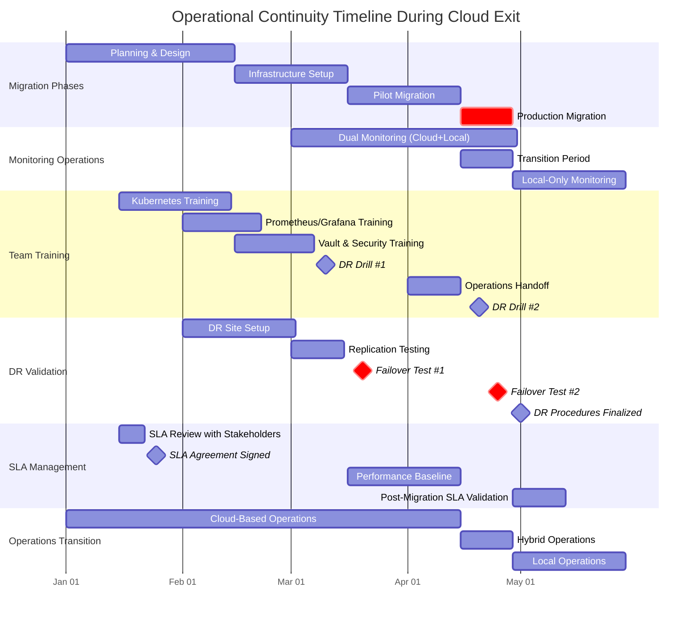

# Operational Continuity

## Introduction

Maintaining operational continuity during cloud exit is not optional—it's a fundamental requirement for successful migration. While technical challenges of moving workloads and data receive significant attention, the operational dimension—monitoring, incident response, backup/disaster recovery, change management, and team readiness—often determines whether a cloud exit succeeds or fails.

This chapter addresses the critical operational aspects of cloud exit: ensuring that your organization can continue to detect, diagnose, and resolve issues throughout the migration journey and in the target environment. The goal is to maintain—and ideally improve—operational capabilities as you transition from cloud-native tooling to self-managed infrastructure.

!!! warning "Operational Continuity is Non-Negotiable"
    Technical migration success means nothing if your team can't monitor systems, respond to incidents, or recover from failures. Operational readiness must be validated before each migration phase, not discovered after problems arise.

## Operational Continuity Planning

### The Operational Readiness Framework

Operational continuity planning consists of five interconnected pillars:

1. **Monitoring and Observability**: Ability to see system health and performance
2. **Incident Response**: Capability to detect, triage, and resolve issues
3. **Backup and Disaster Recovery**: Mechanisms to protect and restore data/systems
4. **Change Management**: Processes to deploy updates safely
5. **Team Readiness**: Skills, documentation, and procedures for self-sufficiency

Each pillar must be addressed in every migration phase (assessment, connected Azure Local, disconnected Azure Local).

### Runbook Development

**Runbook Categories:**

| Runbook Type | Purpose | Examples |
|-------------|---------|----------|
| **Operational Procedures** | Day-to-day operations | Health checks, log reviews, capacity monitoring |
| **Incident Response** | Troubleshooting and resolution | Service down, performance degradation, security incident |
| **Change Procedures** | Deploying updates | Application deployment, infrastructure updates, certificate rotation |
| **Disaster Recovery** | Major outages and data loss | Cluster failure, data corruption, site disaster |
| **Migration Procedures** | Cloud exit-specific tasks | Service cutover, validation checks, rollback procedures |

**Runbook Template:**

```markdown
# Runbook: [Title]

**Purpose**: [What this runbook accomplishes]
**Trigger**: [When to execute this runbook]
**Prerequisites**: [Access, tools, information needed]
**Estimated Time**: [How long execution takes]
**Risk Level**: [Low/Medium/High]

## Pre-Execution Checklist
- [ ] Verify maintenance window approved
- [ ] Confirm backup completed successfully
- [ ] Notify stakeholders of pending work

## Execution Steps
1. [Step with specific commands]
   ```bash
   # Example command
   kubectl get pods -n production
   ```
2. [Verification of previous step]
3. [Next step]

## Validation
- [ ] Service health endpoint returns 200 OK
- [ ] No error spikes in logs
- [ ] Performance metrics within normal range

## Rollback Procedure
[Step-by-step rollback if execution fails]

## Post-Execution
- [ ] Update change log
- [ ] Notify stakeholders of completion
- [ ] Archive logs for audit trail
```

**Runbook Repository:**

```bash
# Organize runbooks in Git repository
runbooks/
├── operational/
│   ├── daily-health-check.md
│   ├── weekly-capacity-review.md
│   └── certificate-rotation.md
├── incident-response/
│   ├── pod-crashloop.md
│   ├── database-performance.md
│   └── network-connectivity-loss.md
├── change-management/
│   ├── deploy-application-update.md
│   └── kubernetes-upgrade.md
├── disaster-recovery/
│   ├── restore-from-backup.md
│   └── cluster-rebuild.md
└── migration/
    ├── database-cutover.md
    ├── dns-update.md
    └── rollback-to-azure.md
```

### Team Training and Skill Development

**Training Plan:**

| Phase | Skills Required | Training Method | Duration |
|-------|----------------|-----------------|----------|
| **Pre-Migration** | Azure Local architecture, Kubernetes fundamentals | Instructor-led training, Microsoft Learn modules | 2-4 weeks |
| **Connected Migration** | AKS on Azure Local, Arc-enabled services, hybrid networking | Hands-on labs, sandbox environment | 2-3 weeks |
| **Disconnected Migration** | Prometheus/Grafana, HashiCorp Vault, Harbor, AD DS | Vendor training, internal workshops | 3-4 weeks |
| **Post-Migration** | Day 2 operations, troubleshooting, performance tuning | Shadowing, incident reviews, continuous learning | Ongoing |

**Skill Assessment:**

```markdown
# Team Skill Matrix

| Skill Area | Engineer A | Engineer B | Engineer C | Target |
|------------|-----------|-----------|-----------|--------|
| Kubernetes Operations | 3/5 | 4/5 | 2/5 | 4/5 |
| Prometheus/Grafana | 2/5 | 3/5 | 1/5 | 4/5 |
| SQL Server Administration | 4/5 | 3/5 | 5/5 | 4/5 |
| HashiCorp Vault | 1/5 | 2/5 | 1/5 | 3/5 |
| Harbor Registry | 2/5 | 2/5 | 1/5 | 3/5 |
| Incident Response | 4/5 | 5/5 | 3/5 | 4/5 |

**Gap Analysis**: Vault and Harbor require focused training. Plan 2-week workshop.
```

**Knowledge Transfer Sessions:**

- **Vendor-led training**: Engage Microsoft, HashiCorp, or other vendors for specialized training
- **Internal workshops**: Senior engineers train team on organization-specific configurations
- **Lunch-and-learns**: Weekly sessions on specific topics (e.g., "Debugging Kubernetes networking")
- **Documentation sprints**: Team collaborates to document environment and procedures
- **Incident post-mortems**: Review real issues to build institutional knowledge

### Communication Plan

**Stakeholder Communication Matrix:**

| Stakeholder Group | Communication Frequency | Channel | Content |
|------------------|------------------------|---------|---------|
| **Executive Leadership** | Weekly during migration | Email summary, monthly meeting | Migration status, risks, budget |
| **Application Teams** | Daily during cutover | Slack channel, daily standup | Technical updates, action items |
| **End Users** | As needed (planned downtime) | Email, status page | Maintenance windows, service impact |
| **Operations Team** | Real-time during migration | Dedicated war room, chat | Technical coordination, issue resolution |
| **Compliance/Legal** | Bi-weekly | Email, meetings | Regulatory compliance, audit trail |

**Communication Templates:**

```markdown
# Migration Status Update - Week [N]

**Overall Status**: [On Track / At Risk / Delayed]

**Completed This Week**:
- [Milestone 1]
- [Milestone 2]

**In Progress**:
- [Current work]

**Planned Next Week**:
- [Upcoming milestones]

**Risks and Issues**:
- [Risk 1]: [Mitigation]
- [Issue 1]: [Resolution plan]

**Metrics**:
- Workloads migrated: X/Y
- Data transferred: X TB / Y TB
- Validation tests passed: X/Y
```

## Monitoring During Transition

### Dual Monitoring Strategy

During migration, maintain **overlapping monitoring** in both environments:

**Phase 1: Azure Only**
```
[Azure Monitor] ← [Azure Workloads]
[Application Insights]
```

**Phase 2: Dual Monitoring (Hybrid)**
```
[Azure Monitor] ← [Azure Workloads] → [Being Phased Out]
                       ↓
[Prometheus/Grafana] ← [Azure Local Workloads] → [Primary Monitoring]
```

**Phase 3: Azure Local Only**
```
[Prometheus/Grafana] ← [Azure Local Workloads]
[Loki for Logs]
```

**Dual Monitoring Implementation:**

```yaml
# Application deployment with both Azure Monitor and Prometheus instrumentation
apiVersion: apps/v1
kind: Deployment
metadata:
  name: backend-api
  annotations:
    # Prometheus scraping
    prometheus.io/scrape: "true"
    prometheus.io/port: "8080"
    prometheus.io/path: "/metrics"
spec:
  template:
    spec:
      containers:
      - name: api
        image: harbor.azurelocal.local/app/backend:v2.1
        env:
        # Application Insights (temporary during migration)
        - name: APPLICATIONINSIGHTS_CONNECTION_STRING
          value: "InstrumentationKey=...;IngestionEndpoint=https://..."
        # OpenTelemetry to local Prometheus/Jaeger (permanent)
        - name: OTEL_EXPORTER_OTLP_ENDPOINT
          value: "http://otel-collector.monitoring.svc.cluster.local:4317"
```

### Dashboard Migration

**Strategy**: Recreate critical Azure Monitor dashboards in Grafana before cutover.

**Azure Monitor Dashboard Example:**

```json
// Azure Monitor query for request rate
requests
| where timestamp > ago(1h)
| summarize RequestCount = count() by bin(timestamp, 1m)
| render timechart
```

**Equivalent Grafana/PromQL:**

```promql
# Request rate per minute
sum(rate(http_requests_total[1m]))
```

**Dashboard Migration Checklist:**

- [ ] Identify critical dashboards in Azure Monitor
- [ ] Document queries and visualizations
- [ ] Recreate in Grafana using Prometheus data sources
- [ ] Validate metrics match between Azure and local monitoring
- [ ] Train team on Grafana navigation and customization
- [ ] Archive Azure Monitor dashboards for reference

**Dashboard-as-Code:**

```yaml
# Grafana dashboard provisioning (ConfigMap or file)
apiVersion: 1
providers:
  - name: 'default'
    orgId: 1
    folder: 'Production'
    type: file
    options:
      path: /etc/grafana/provisioning/dashboards

# Store dashboard JSON in Git for version control
dashboards/
├── application-overview.json
├── kubernetes-cluster-health.json
└── database-performance.json
```

### Alert Routing and Notification

**Alert Transition Plan:**

| Alert Source | Destination | Transition Phase |
|-------------|-------------|------------------|
| **Azure Monitor** | Email, Teams | Phase 1: Azure only |
| **Azure Monitor + Prometheus** | Email, Teams, Slack | Phase 2: Dual monitoring |
| **Prometheus Alertmanager** | Email, Slack, PagerDuty | Phase 3: Azure Local only |

**Alertmanager Configuration:**

```yaml
# alertmanager-config.yaml
global:
  smtp_smarthost: 'smtp.company.local:25'
  smtp_from: 'alertmanager@azurelocal.local'

route:
  receiver: 'team-email'
  group_by: ['alertname', 'cluster', 'namespace']
  group_wait: 30s
  group_interval: 5m
  repeat_interval: 4h
  routes:
  - match:
      severity: critical
    receiver: 'pagerduty'
    continue: true
  - match:
      severity: warning
    receiver: 'team-slack'

receivers:
- name: 'team-email'
  email_configs:
  - to: 'ops-team@company.local'

- name: 'team-slack'
  slack_configs:
  - api_url: 'https://hooks.slack.com/services/...'
    channel: '#ops-alerts'
    title: 'Alert: {{ .GroupLabels.alertname }}'
    text: '{{ range .Alerts }}{{ .Annotations.description }}{{ end }}'

- name: 'pagerduty'
  pagerduty_configs:
  - service_key: '<pagerduty-integration-key>'
```

**Critical Alerts to Migrate:**

- Pod/container crash loops
- High CPU or memory utilization
- Disk space warnings
- Database connection pool exhaustion
- Application error rate spikes
- Certificate expiration warnings
- Backup failures

## Incident Response Across Environments

### On-Call Procedures During Transition

**On-Call Rotation:**

```
Week 1-2: Dual on-call (Azure expert + Azure Local expert)
Week 3-4: Primary on-call (Azure Local) + Secondary (Azure expert as backup)
Week 5+:  Single on-call (Azure Local expertise assumed)
```

**On-Call Runbook:**

```markdown
# On-Call Playbook - Cloud Exit Migration Period

## Alert Triage Process

1. **Acknowledge alert** within 5 minutes
2. **Identify environment**:
   - Azure workload? Check Azure Monitor
   - Azure Local workload? Check Grafana
   - Hybrid issue? Check both

3. **Initial assessment**:
   - Impact: How many users affected?
   - Severity: Service down, degraded, or warning?
   - Environment: Azure, Azure Local, or networking between?

4. **Escalation criteria**:
   - Service completely down → Page senior engineer immediately
   - Data integrity concern → Page database specialist
   - Migration-related issue → Contact migration lead

## Common Scenarios

### Scenario 1: Pod Crash Loop (Azure Local)
**Symptoms**: Pod restarting repeatedly, application unavailable
**Investigation**:
- Check pod logs: `kubectl logs <pod-name> -n <namespace> --previous`
- Check events: `kubectl describe pod <pod-name> -n <namespace>`
- Check resource limits: CPU/memory throttling?
**Resolution**: See runbook `incident-response/pod-crashloop.md`

### Scenario 2: Database Connection Failures
**Symptoms**: Application errors related to database connectivity
**Investigation**:
- Verify database is running: `kubectl get pods -n databases`
- Check connection string configuration
- Test connectivity: `kubectl exec -it <app-pod> -- nc -zv db-host 1433`
**Resolution**: See runbook `incident-response/database-connectivity.md`

### Scenario 3: Network Connectivity Loss to Azure
**Symptoms**: Arc agents disconnected, monitoring gaps
**Investigation**:
- Check VPN/ExpressRoute status
- Verify DNS resolution: `nslookup management.azure.com`
- Check firewall rules
**Resolution**: See runbook `incident-response/azure-connectivity-loss.md`
**Note**: If workloads on Azure Local, application should continue running!
```

### Escalation Paths

```
Level 1 (On-Call Engineer)
  ↓ (Cannot resolve within 30 min)
Level 2 (Senior Engineer / Subject Matter Expert)
  ↓ (Multi-system outage or data integrity concern)
Level 3 (Engineering Manager + Migration Lead)
  ↓ (Business-critical decision needed)
CTO / Incident Commander
```

### War Room Procedures for Migration Events

**War Room Setup:**

- **Physical location**: Conference room with screens for dashboards
- **Virtual bridge**: Microsoft Teams or Zoom meeting (recorded)
- **Communication channel**: Dedicated Slack/Teams channel (#migration-war-room)
- **Roles**:
  - **Incident Commander**: Coordinates overall response
  - **Technical Leads**: Engineers working on resolution
  - **Scribe**: Documents timeline and decisions
  - **Communications Lead**: Updates stakeholders

**War Room Activation Criteria:**

- Planned cutover events (database migration, DNS change)
- Unplanned critical incidents during migration
- Rollback procedures

**War Room Protocol:**

```markdown
# War Room Activation Checklist

## T-minus 30 minutes (Planned Event)
- [ ] War room opened (physical + virtual)
- [ ] All roles assigned and present
- [ ] Dashboards displayed (Azure Monitor + Grafana)
- [ ] Stakeholder communication sent
- [ ] Runbook reviewed by all participants

## T-minus 5 minutes
- [ ] Final go/no-go decision
- [ ] Backup verified
- [ ] Rollback procedure ready

## Execution Phase
- [ ] Scribe logging all actions and timestamps
- [ ] Engineers executing runbook steps
- [ ] Incident Commander providing status updates every 15 minutes

## Validation Phase
- [ ] Health checks executed
- [ ] Smoke tests passed
- [ ] Monitoring shows normal metrics

## Closure
- [ ] Stakeholder communication (success or rollback)
- [ ] War room debrief scheduled within 24 hours
- [ ] Incident report drafted
```

## Backup and Disaster Recovery

### Pre-Migration Backups

**Golden Rule**: Always have verified backups before starting migration.

**Backup Validation Checklist:**

- [ ] Full backup of all databases completed within 24 hours of migration
- [ ] Backup restoration **tested and verified** (not just assumed)
- [ ] Backup stored in multiple locations (on-premises + cloud + offline)
- [ ] Backup restoration time measured and documented
- [ ] Backup retention policy aligns with compliance requirements
- [ ] Application configuration backed up (Kubernetes manifests, secrets, ConfigMaps)
- [ ] Infrastructure-as-Code state backed up (Terraform state, Ansible inventories)

**Database Backup:**

```sql
-- SQL Server full backup with verification
BACKUP DATABASE ProductionDB
TO DISK = '\\nas.azurelocal.local\backups\ProductionDB_PreMigration.bak'
WITH COMPRESSION, CHECKSUM, STATS = 10;

-- Verify backup
RESTORE VERIFYONLY
FROM DISK = '\\nas.azurelocal.local\backups\ProductionDB_PreMigration.bak';

-- Test restore to temporary database
RESTORE DATABASE ProductionDB_Test
FROM DISK = '\\nas.azurelocal.local\backups\ProductionDB_PreMigration.bak'
WITH MOVE 'ProductionDB' TO 'C:\SQLData\ProductionDB_Test.mdf',
     MOVE 'ProductionDB_log' TO 'C:\SQLData\ProductionDB_Test_log.ldf';
```

**Kubernetes Backup (Velero):**

```bash
# Create pre-migration backup
velero backup create pre-migration-backup \
  --include-namespaces production,data,monitoring \
  --snapshot-volumes=true \
  --wait

# Verify backup
velero backup describe pre-migration-backup --details

# Test restore to separate namespace
velero restore create pre-migration-restore \
  --from-backup pre-migration-backup \
  --namespace-mappings production:production-test
```

### DR Strategy for Azure Local

**Recovery Time Objective (RTO)** and **Recovery Point Objective (RPO):**

| Tier | Service Examples | RTO | RPO | Backup Frequency |
|------|-----------------|-----|-----|------------------|
| **Tier 1 (Critical)** | Order processing, payment APIs | <15 minutes | <5 minutes | Continuous replication + hourly snapshots |
| **Tier 2 (Important)** | Customer portal, reporting | <4 hours | <1 hour | Hourly backups |
| **Tier 3 (Standard)** | Internal tools, dev environments | <24 hours | <24 hours | Daily backups |

**DR Architecture Options:**

1. **Active-Passive**: Primary Azure Local site + cold standby site
   - RPO: Last backup (hours)
   - RTO: Time to restore + validate (hours)
   - Cost: Lower (standby hardware can be minimal)

2. **Active-Active**: Two Azure Local sites with data replication
   - RPO: Near-zero (synchronous replication)
   - RTO: Minutes (automatic failover)
   - Cost: Higher (full redundant infrastructure)

3. **Hybrid DR**: Azure Local primary + Azure cloud as DR
   - RPO: Replication lag (minutes to hours)
   - RTO: Time to failover to Azure
   - Cost: Moderate (pay for Azure resources during DR events)

**Backup Automation:**

```yaml
# CronJob for daily database backups
apiVersion: batch/v1
kind: CronJob
metadata:
  name: database-backup
  namespace: data
spec:
  schedule: "0 2 * * *" # 2 AM daily
  jobTemplate:
    spec:
      template:
        spec:
          containers:
          - name: backup
            image: harbor.azurelocal.local/tools/backup-agent:latest
            env:
            - name: DB_HOST
              value: "sql-mi.azurelocal.local"
            - name: BACKUP_LOCATION
              value: "/mnt/backups"
            volumeMounts:
            - name: backup-storage
              mountPath: /mnt/backups
          volumes:
          - name: backup-storage
            persistentVolumeClaim:
              claimName: backup-pvc
          restartPolicy: OnFailure
```

### Business Continuity Plan Updates

**Pre-Migration BCP:**

- Primary: Azure cloud resources
- DR: Azure secondary region or availability zones
- Failover: Automated via Azure Traffic Manager

**Post-Migration BCP:**

- Primary: Azure Local on-premises cluster
- DR: Secondary Azure Local site or hybrid Azure cloud
- Failover: Manual or semi-automated via DNS or load balancer reconfiguration

**BCP Testing:**

- **Quarterly DR drills**: Simulate primary site failure, validate failover procedures
- **Annual full DR test**: Complete failover including data restoration
- **Post-mortem documentation**: Record lessons learned, update runbooks

## Change Management During Cloud Exit

### Freeze Periods

**Change Freeze Windows:**

- **Hard freeze**: 72 hours before and 48 hours after major cutover events
  - No application changes
  - No infrastructure changes
  - Emergency security patches only (with approval)

- **Soft freeze**: 1 week before and after migration phases
  - Application changes allowed with approval
  - Infrastructure changes discouraged
  - Rollback procedures required for all changes

**Change Request Process:**

```markdown
# Change Request - Migration Period

**Change ID**: CHG-2024-001
**Requested by**: [Name]
**Date**: [Date]
**Type**: Application Update / Infrastructure Change / Configuration Change

**Description**: [What is changing]

**Justification**: [Why is this needed during migration]

**Risk Assessment**:
- Impact: [High / Medium / Low]
- Likelihood of issues: [High / Medium / Low]
- Affected systems: [List]

**Rollback Plan**: [How to revert this change]

**Testing Completed**:
- [ ] Dev environment tested
- [ ] Staging environment tested
- [ ] Rollback procedure tested

**Approvals**:
- [ ] Engineering Manager
- [ ] Migration Lead
- [ ] (If high risk) CTO
```

### Rollback Triggers and Procedures

**Rollback Decision Criteria:**

| Trigger | Severity | Action |
|---------|----------|--------|
| **Service completely unavailable >15 min** | Critical | Immediate rollback |
| **Data integrity issues detected** | Critical | Immediate rollback |
| **Error rate >10% of requests** | High | Rollback within 30 min if not resolved |
| **Performance degradation >50%** | High | Rollback if not resolved within 1 hour |
| **Minor issues, <5% users affected** | Low | Continue, monitor closely, fix forward |

**Rollback Authority:**

- **Incident Commander**: Can authorize rollback for critical issues
- **Migration Lead**: Can authorize rollback for high severity
- **CTO**: Required for rollback after >4 hours post-cutover (point of no return approaching)

**Rollback Procedure (Application Cutover):**

```markdown
# Rollback Procedure: Application Cutover

**Execution Time**: 15-30 minutes

## Steps

1. **Notify stakeholders** (Slack + Email)
   "Initiating rollback to Azure environment due to [reason]"

2. **Update DNS** to point back to Azure
   ```bash
   az network dns record-set a update \
     --resource-group dns-rg \
     --zone-name company.com \
     --name app \
     --set ipv4Addresses="<azure-public-ip>"
   ```

3. **Verify Azure environment operational**
   ```bash
   curl -v https://app-azure.company.com/health
   ```

4. **Resume writes to Azure database** (if failed over)
   - Reconfigure application connection strings
   - Redeploy pods with Azure configuration

5. **Monitor for stability** (30 minutes)
   - Error rates return to baseline
   - Performance metrics normal

6. **Debrief and root cause analysis**
   - Schedule post-mortem within 24 hours
   - Document what went wrong
   - Update migration plan
```

### Post-Migration Hypercare Period

**Hypercare Definition**: Intensive monitoring and support period immediately following migration.

**Duration**: 2-4 weeks post-cutover

**Hypercare Activities:**

- **24/7 monitoring**: War room staffed continuously for first 48-72 hours
- **Daily check-ins**: Operations team meets daily to review metrics and issues
- **Accelerated incident response**: Reduced SLA response times (5 min acknowledgment)
- **Stakeholder updates**: Daily status reports to leadership
- **User support**: Increased helpdesk staffing for user-reported issues
- **Performance tuning**: Proactive optimization based on observed behavior

**Hypercare Exit Criteria:**

- [ ] 7 consecutive days with no critical incidents
- [ ] Performance metrics within 10% of pre-migration baseline
- [ ] User satisfaction survey >90% satisfied
- [ ] All post-migration issues resolved or documented as known limitations
- [ ] Operations team comfortable with day-to-day management
- [ ] Stakeholders approve transition to normal operations

## SLA Management During Transition

### Expected Service Degradation Windows

**Communication Template:**

```
Subject: Planned Maintenance - Cloud Exit Migration Phase 2

Dear Customers,

We are executing a planned infrastructure migration on [Date] from [Start Time] to [End Time].

**Expected Impact**:
- Service will remain available during this window
- Response times may increase by 20-30%
- New user registrations will be temporarily disabled

**What We're Doing**:
Migrating our infrastructure to a new on-premises platform to improve data sovereignty and long-term reliability.

**What You Should Do**:
- No action required
- Avoid large data uploads during the maintenance window
- Contact support if you experience issues: support@company.com

**Rollback Plan**:
If issues arise, we will revert to our current infrastructure within 30 minutes.

Thank you for your patience as we improve our services.
```

### Customer Communication Strategy

**Communication Channels:**

- **Status Page**: Real-time status updates (e.g., Statuspage.io or self-hosted)
- **Email**: Pre-migration notifications, in-progress updates, completion confirmation
- **In-App Banners**: Notifications within application UI
- **Social Media**: High-level updates for public-facing services

**Communication Timeline:**

- **T-minus 2 weeks**: Initial notification of upcoming maintenance
- **T-minus 1 week**: Reminder with detailed timeline
- **T-minus 24 hours**: Final reminder with support contact information
- **T-0 (start)**: Maintenance window begins notification
- **T+hourly**: Status updates during execution
- **T-completion**: Success notification or rollback notification

### SLA Adjustments for Target Environment

**Pre-Migration SLA (Azure):**

- Availability: 99.95% (Azure multi-region)
- Response time (p95): <200ms
- Support response: 15 minutes (critical), 4 hours (high)

**Post-Migration SLA (Azure Local):**

- Availability: 99.9% (single on-premises site)
- Response time (p95): <250ms (acceptable for on-premises workload)
- Support response: 15 minutes (critical), 4 hours (high) - maintained

**SLA Renegotiation:**

- Review SLAs with customers/stakeholders before migration
- Obtain agreement on adjusted targets if necessary
- Document acceptance of new SLAs
- Monitor actual performance and adjust over time



## Long-Term Operational Considerations

### Capacity Planning Without Cloud Elasticity

**Challenge**: Azure provides near-infinite scale-on-demand. On-premises requires capacity planning with hardware lead times.

**Mitigation Strategies:**

- **Usage trending**: Analyze 12+ months of usage data to identify growth patterns
- **Buffer capacity**: Maintain 30-50% headroom for growth and spikes
- **Hardware procurement pipeline**: Establish relationships with vendors, maintain procurement schedules
- **Modular expansion**: Design infrastructure for incremental growth (add nodes, not replace clusters)

**Capacity Review Cadence:**

- **Weekly**: Current utilization review
- **Monthly**: Trend analysis and 3-month forecast
- **Quarterly**: Budget and procurement planning for next 12 months
- **Annually**: Strategic infrastructure roadmap

### Patch Management Without Cloud Automation

**Patching Strategy:**

```markdown
# Patch Management Procedure

## Operating System Patches

**Frequency**: Monthly (Windows Patch Tuesday + 1 week)
**Process**:
1. Deploy patches to dev environment
2. Test applications for compatibility (1 week)
3. Deploy to staging environment
4. Deploy to production during maintenance window
5. Monitor for 72 hours

## Kubernetes Cluster Upgrades

**Frequency**: Quarterly (align with Kubernetes release cycle)
**Process**:
1. Review release notes for breaking changes
2. Upgrade dev cluster and validate workloads
3. Upgrade staging cluster
4. Upgrade production cluster (rolling update, one node at a time)
5. Monitor for 1 week

## Application Updates

**Frequency**: Continuous (CI/CD pipeline)
**Process**:
1. Build and test in CI pipeline
2. Deploy to dev environment (automated)
3. Deploy to staging (automated after smoke tests)
4. Deploy to production (manual approval gate)
5. Automated rollback on error threshold
```

**Offline Update Mechanisms:**

For fully disconnected environments:

- **WSUS** (Windows Server Update Services): Local Windows update server
- **Local YUM/APT mirrors**: Cache Linux package repositories
- **Local container registry**: Pre-pull and mirror updated images
- **Physical media**: USB drives or portable hard drives for air-gapped systems

## Conclusion

Operational continuity is not an afterthought—it's the foundation that enables successful cloud exit. The most technically perfect migration will fail if your team can't monitor systems, respond to incidents, or maintain operations in the target environment. 

The strategies outlined in this chapter—runbook development, dual monitoring, incident response procedures, comprehensive backup/DR, rigorous change management, and proactive communication—provide a framework for maintaining operational excellence throughout the cloud exit journey. Adapt these patterns to your organization's specific requirements, risk tolerance, and operational maturity.

Success in cloud exit is measured not just by completing the migration, but by establishing a stable, well-understood, and sustainably operated environment that meets your business objectives for the long term.

## References

- [Azure Monitor](https://learn.microsoft.com/en-us/azure/azure-monitor/)
- [Site Reliability Engineering](https://learn.microsoft.com/en-us/training/modules/intro-to-site-reliability-engineering/)
- [Cloud Adoption Framework — Manage](https://learn.microsoft.com/en-us/azure/cloud-adoption-framework/manage/)

---

> **Next:** [Part 7 — Reference Scenario →](../07-reference-scenario/README.md)
