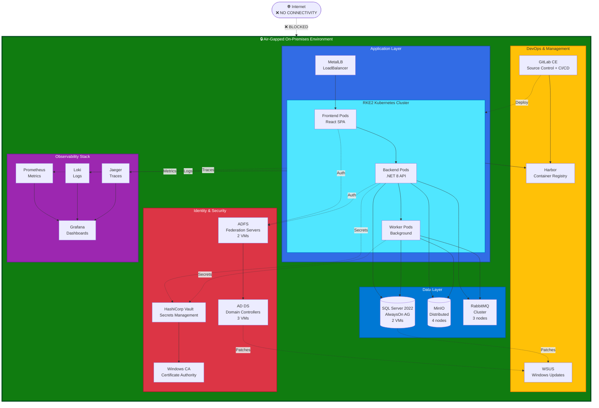

# Phase 3: Disconnected

!!! abstract "Chapter Summary"
    Phase 3 represents the final stage of Contoso Insurance's cloud exit journey — complete disconnection from Azure to achieve full operational sovereignty. All cloud dependencies are replaced with on-premises equivalents, enabling air-gapped operation. This chapter details the dependency elimination process, architecture changes, operational model, and trade-offs of fully disconnected computing.

## Disconnection Planning — Eliminating Cloud Dependencies

Phase 3 was driven by two factors: (1) regulatory requirements for air-gapped operation for sensitive government insurance contracts, and (2) desire to eliminate recurring Azure costs (€8,600/month) and ExpressRoute dependency.

### Dependency Elimination Checklist

Contoso inventoried all cloud dependencies from Phase 2 and defined replacement strategies:

| Cloud Dependency | Purpose | Replacement Strategy | Complexity |
|------------------|---------|---------------------|------------|
| **Azure AD B2C** | Customer authentication | AD DS + ADFS + custom UI | ⚠️ High |
| **Microsoft Entra ID** | Employee authentication | AD DS + Kerberos | ⚠️ Medium |
| **Azure Monitor** | Observability (logs, metrics, traces) | Prometheus + Grafana + Loki | ⚠️ High |
| **Azure Key Vault** | Secrets management | HashiCorp Vault | ⚠️ Medium |
| **Azure Container Registry** | Container image registry | Harbor | ✅ Low |
| **Azure Arc** | Management plane projection | Local management tools | ⚠️ Medium |
| **GitHub Actions** | CI/CD pipeline | GitLab CE (self-hosted) | ⚠️ Medium |
| **ExpressRoute** | Azure connectivity | Remove (no longer needed) | ✅ Low |
| **Application Insights** | APM and distributed tracing | Jaeger + Grafana | ⚠️ High |

!!! danger "Identity Migration is the Critical Path"
    Replacing Azure AD B2C with on-premises identity infrastructure was the most complex component of Phase 3. Required application code changes, custom authentication UI, certificate management, and user account migration. Estimated 60% of Phase 3 effort.

### Project Timeline

Phase 3 executed over 9 months with parallel workstreams:

| Phase | Duration | Key Activities |
|-------|----------|----------------|
| **Design & Procurement** | 8 weeks | Architecture design, tool selection, hardware procurement (AD domain controllers, certificate authority servers) |
| **Infrastructure Setup** | 12 weeks | Deploy AD DS, ADFS, HashiCorp Vault, Harbor, GitLab, Prometheus/Grafana, Jaeger |
| **Application Refactoring** | 16 weeks | Replace Azure AD authentication with ADFS, replace Azure Monitor SDK with OpenTelemetry, update secret retrieval logic |
| **Migration & Testing** | 12 weeks | User account migration, certificate enrollment, end-to-end testing, performance validation |
| **Disconnection Cutover** | 2 weeks | Disable ExpressRoute, validate full disconnection, operational readiness review |
| **Optimization** | 4 weeks | Performance tuning, operational procedure refinement, documentation |

## Architecture Overview — Fully Disconnected

Phase 3 architecture eliminates all cloud dependencies, creating a self-contained computing environment.

### Component Mapping — Disconnected Architecture

| Application Component | Phase 2 (Hybrid) | Phase 3 (Disconnected) |
|-----------------------|------------------|------------------------|
| **Frontend (React SPA)** | AKS on Azure Local | RKE2 on Azure Local (still containerized) |
| **API Backend (.NET 8)** | AKS on Azure Local | RKE2 on Azure Local |
| **Background Workers (.NET 8)** | AKS on Azure Local | RKE2 on Azure Local |
| **Database (SQL Server)** | Arc SQL MI (Azure Local) | SQL Server 2022 on VMs (Azure Local) |
| **File Storage (Objects)** | MinIO on Azure Local | MinIO on Azure Local (no change) |
| **Message Queue** | RabbitMQ on Azure Local | RabbitMQ on Azure Local (no change) |
| **Identity (Customers)** | Azure AD B2C (cloud) | AD DS + ADFS (on-premises) |
| **Identity (Employees)** | Entra ID (cloud) | AD DS + Kerberos (on-premises) |
| **Secrets Management** | Azure Key Vault (cloud) | HashiCorp Vault (on-premises) |
| **Container Registry** | ACR (cloud) + Harbor mirror | Harbor (on-premises, authoritative) |
| **Monitoring** | Azure Monitor (cloud) | Prometheus + Grafana + Loki (on-premises) |
| **APM / Tracing** | Application Insights (cloud) | Jaeger + Tempo (on-premises) |
| **CI/CD Pipeline** | GitHub Actions (cloud) | GitLab CI (on-premises) |
| **Certificate Authority** | Azure-managed certs | Internal PKI (Windows CA) |
| **DNS** | Azure DNS | Windows DNS Server on domain controllers |

### Kubernetes Orchestration — RKE2 Replaces AKS

Contoso replaced AKS on Azure Local (Arc-enabled Kubernetes) with **RKE2** (Rancher Government Kubernetes) to eliminate Arc dependencies:

**Why RKE2?**
: Security-focused Kubernetes distribution with FIPS 140-2 compliance, CIS hardening by default, no telemetry or cloud dependencies, upstream Kubernetes compatibility (can migrate from AKS with minimal changes).

**Cluster Configuration**
: 3 control plane nodes (HA), 15 worker nodes (increased from 12 in Phase 2 to handle monitoring stack overhead). Cilium CNI with network policies. Local path provisioner for PersistentVolumes (using Azure Local storage pool).

**Migration from AKS to RKE2**  
: Helm charts required minimal changes (mostly label/annotation updates). Redeployed all workloads to RKE2 cluster. Validated functionality matches AKS behavior.

### Identity Infrastructure — AD DS + ADFS

The identity migration was the most complex component of Phase 3.

#### Active Directory Domain Services (AD DS)

**Domain Controller Deployment**
: 3 domain controllers (Windows Server 2022) deployed as VMs on Azure Local in different fault domains. Domain: `contosoinsurance.local`. Forest functional level: Windows Server 2016 (for maximum compatibility).

**User Account Migration**
: Customer accounts migrated from Azure AD B2C to AD DS:
- Exported user records from Azure AD B2C (email, name, phone)
- Created corresponding AD user accounts via PowerShell automation
- Reset passwords (forced password change on first login)
- Sent migration notifications to 15,000 customers with new login instructions

**Employee Account Migration**  
: Insurance agents and administrators migrated from Entra ID to on-premises AD DS. Kerberos authentication for Windows workstations (joined to domain). LDAP authentication for web applications.

#### Active Directory Federation Services (ADFS)

**ADFS Deployment**
: 2-node ADFS farm (Windows Server 2022) for customer-facing authentication. ADFS provides WS-Federation and SAML 2.0 endpoints for web application integration.

**Custom Authentication UI**  
: Azure AD B2C's branded sign-in pages replaced with custom ASP.NET Core pages styled to match Contoso branding. Pages hosted alongside ADFS for seamless user experience.

**Application Integration Changes**

API backend updated to validate tokens from ADFS instead of Azure AD B2C:

```csharp
// Before (Azure AD B2C)
services.AddAuthentication(JwtBearerDefaults.AuthenticationScheme)
    .AddJwtBearer(options => {
        options.Authority = "https://contosoinsurance.b2clogin.com/tfp/...";
        options.Audience = "api://contoso-claims-api";
    });

// After (ADFS)
services.AddAuthentication(JwtBearerDefaults.AuthenticationScheme)
    .AddJwtBearer(options => {
        options.Authority = "https://adfs.contosoinsurance.local/adfs";
        options.Audience = "https://api.contosoinsurance.local";
        options.RequireHttpsMetadata = true;
        options.TokenValidationParameters = new TokenValidationParameters {
            ValidateIssuer = true,
            ValidIssuer = "https://adfs.contosoinsurance.local/adfs",
            ValidateAudience = true,
            ValidateLifetime = true,
            ClockSkew = TimeSpan.FromMinutes(5)
        };
    });
```

Frontend React application updated to use ADFS authorization endpoint instead of Azure AD B2C flows.

### Secrets Management — HashiCorp Vault

Azure Key Vault replaced with HashiCorp Vault deployed on Azure Local:

**Vault Deployment**
: 3-node Vault cluster (HA with Raft storage backend). Each node runs as a VM (2 vCPU, 4 GB RAM). TLS encryption for client connections. Auto-unseal using Shamir secret sharing (5 key shares, threshold 3).

**Secret Migration**
: All secrets migrated from Azure Key Vault to HashiCorp Vault via manual export/import (secrets never leave secure environment). Secret paths organized by application component:

```plaintext
secret/
├── database/
│   ├── admin-password
│   └── app-connection-string
├── rabbitmq/
│   ├── admin-password
│   └── app-password
├── minio/
│   ├── access-key
│   └── secret-key
└── smtp/
    ├── username
    └── password
```

**Application Integration**
: External Secrets Operator updated to sync from HashiCorp Vault instead of Azure Key Vault. Kubernetes ServiceAccounts authenticate to Vault using Kubernetes auth method.

### Monitoring Stack — Prometheus + Grafana + Loki

Azure Monitor replaced with open-source observability stack:

**Prometheus** (Metrics Collection)
: Prometheus server deployed on RKE2 with 500 GB storage (30-day retention). Scrapes metrics from:
- Kubernetes nodes (node-exporter)
- Application pods (OpenTelemetry exporters)
- SQL Server (sql-exporter)
- RabbitMQ (rabbitmq-exporter)
- MinIO (minio-exporter)

**Grafana** (Visualization & Dashboards)  
: Grafana deployed with pre-configured dashboards mirroring Azure Monitor dashboards from Phase 2. Data sources: Prometheus (metrics), Loki (logs), Jaeger (traces).

**Loki** (Log Aggregation)
: Loki deployed with 1 TB storage (90-day retention). Collects logs from:
- Kubernetes pods (promtail agent)
- Domain controllers (Windows Event Log forwarded via WinLogBeat)
- SQL Server (SQL Server Agent jobs write to files, promtail ingests)

**Alertmanager** (Alerting)  
: Alertmanager configured with same alert rules as Phase 2 (API latency, queue depth, database DTU, pod restarts). Notifications sent via email (SMTP) and PagerDuty webhook (on-premises PagerDuty agent).

**Application Instrumentation Changes**

Application code updated to use OpenTelemetry instead of Azure Application Insights SDK:

```csharp
// Before (Application Insights)
services.AddApplicationInsightsTelemetry(options => {
    options.ConnectionString = configuration["ApplicationInsights:ConnectionString"];
});

// After (OpenTelemetry)
services.AddOpenTelemetry()
    .WithTracing(builder => builder
        .AddAspNetCoreInstrumentation()
        .AddHttpClientInstrumentation()
        .AddSqlClientInstrumentation()
        .AddOtlpExporter(options => {
            options.Endpoint = new Uri("http://jaeger-collector:4317");
        }))
    .WithMetrics(builder => builder
        .AddAspNetCoreInstrumentation()
        .AddHttpClientInstrumentation()
        .AddPrometheusExporter());
```

### Container Registry — Harbor

Azure Container Registry fully replaced with Harbor:

**Harbor Deployment**
: Harbor deployed on RKE2 with PostgreSQL backend (for metadata) and MinIO storage (for image layers). Image scanning via Trivy integrated into Harbor.

**Image Repository Structure**
```plaintext
harbor.contosoinsurance.local/
├── production/
│   ├── web-frontend:1.3.5
│   ├── api-backend:2.2.1
│   ├── worker-documents:1.5.8
│   ├── worker-premium:1.3.4
│   └── worker-notifications:1.4.9
├── base-images/
│   ├── dotnet:8.0-runtime
│   ├── nginx:1.25-alpine
│   └── postgres:15-alpine
└── third-party/
    ├── rabbitmq:3.12-management
    └── minio:RELEASE.2024-01-16
```

**Image Signing**  
: All production images signed with Cosign (Sigstore). Admission controller enforces signature verification before pod deployment.

### CI/CD Pipeline — GitLab CE

GitHub Actions replaced with self-hosted GitLab Community Edition:

**GitLab Deployment**
: GitLab CE deployed on VMs (8 vCPU, 32 GB RAM, 1 TB storage). Integrated with AD DS for user authentication (LDAP). Git repositories migrated from GitHub via git mirror push.

**Pipeline Structure** (.gitlab-ci.yml)

```yaml
stages:
  - build
  - test
  - publish
  - deploy

build:
  stage: build
  image: mcr.microsoft.com/dotnet/sdk:8.0
  script:
    - dotnet restore
    - dotnet build -c Release

test:
  stage: test
  script:
    - dotnet test --no-build

publish:
  stage: publish
  script:
    - docker build -t harbor.contosoinsurance.local/production/api-backend:$CI_COMMIT_SHA .
    - docker push harbor.contosoinsurance.local/production/api-backend:$CI_COMMIT_SHA
  only:
    - main

deploy-production:
  stage: deploy
  script:
    - helm upgrade api-backend ./charts/api-backend 
        --set image.tag=$CI_COMMIT_SHA 
        --namespace production
  when: manual
  only:
    - main
```

**GitLab Runners**  
: 5 GitLab Runner VMs (4 vCPU, 8 GB RAM each) execute pipeline jobs. Runners access Harbor, RKE2 cluster, and internal networks.

### Database — SQL Server 2022 on VMs

Arc-enabled SQL Managed Instance replaced with traditional SQL Server on VMs:

**Deployment Configuration**
: 2-node Always On Availability Group. Primary replica: VM with 16 vCPU, 64 GB RAM, 1 TB SSD. Secondary replica: Same specs, synchronous replication. Availability Group listener provides transparent failover.

**Why VMs Instead of Containers?**
: SQL Server containers lack enterprise features (Always On Availability Groups, SQL Server Agent). VMs provide full SQL Server Enterprise Edition functionality. License mobility from Azure (License Included → BYOL).

**Backup Strategy**  
: SQL Server native backups to MinIO (S3-compatible). Full backup weekly, differential daily, transaction log every 15 minutes. Meets RPO requirement of 1 hour.

### Backup & Disaster Recovery

Fully disconnected environment requires local backup infrastructure:

**Backup Infrastructure**
: Separate Azure Local cluster (2-node) acts as disaster recovery site located in secondary datacenter 50km away. Replication via scheduled sync jobs over dedicated 10 Gbps fiber link.

**Backup Components**

| Component | Backup Method | Frequency | Retention |
|-----------|---------------|-----------|-----------|
| **Kubernetes Workloads** | Velero snapshots to MinIO | Daily | 30 days |
| **SQL Server Database** | Native backups to MinIO | Transaction log: 15min, Differential: daily, Full: weekly | 35 days |
| **MinIO Data** | MinIO replication to DR site | Continuous | 30 days |
| **HashiCorp Vault** | Raft snapshots | Hourly | 7 days |
| **GitLab Repositories** | GitLab backup utility | Daily | 90 days |
| **Domain Controllers** | Windows Server Backup | Daily | 14 days |
| **Prometheus Metrics** | Thanos long-term storage | Continuous | 1 year |

**Disaster Recovery Procedure**  
: In catastrophic failure of primary datacenter, secondary Azure Local cluster can be promoted to primary. RTO: 4 hours. RPO: 1 hour (transaction log backups).

## Operational Model — Disconnected

Phase 3 introduces significant operational complexity compared to cloud-managed Phase 2.

### Operational Responsibilities (Phase 3 vs. Phase 2)

| Responsibility | Phase 2 (Hybrid) | Phase 3 (Disconnected) |
|---------------|------------------|------------------------|
| **OS Patching** | Azure-managed (AKS) | Manual (Windows Update, RKE2 upgrades) |
| **Kubernetes Upgrades** | Azure-managed | Manual (RKE2 upgrade procedure) |
| **Certificate Management** | Azure-managed | Manual (Windows CA, certificate renewal automation) |
| **Monitoring** | Azure Monitor (cloud) | Self-hosted (Prometheus maintenance, Grafana upgrades) |
| **Identity Provider** | Azure-managed | Self-hosted (AD DS maintenance, ADFS patching) |
| **Secret Rotation** | Azure Key Vault policies | Manual (Vault secret rotation procedures) |
| **Database Backups** | Azure SQL automated | Manual (SQL Server Agent jobs) |
| **Security Updates** | Azure Security Center | Manual (vulnerability scanning, patching) |

### Patch Management — Offline Media

Disconnected environment requires airgap-compatible patch management:

**Windows Updates**  
: WSUS (Windows Server Update Services) server deployed on-premises. Downloads updates from Microsoft Update Catalog on a connected "bridge" server, transfers to USB drive, imports to WSUS in disconnected environment.

**Kubernetes / Container Updates**  
: Container images pre-downloaded on connected workstation, transferred to Harbor via portable hard drive. Base images (dotnet:8.0, nginx, postgres) updated quarterly.

**Application Updates**
: Code changes committed to GitLab, built by GitLab CI runners, deployed via Helm. No external dependencies for application deployments.

### Certificate Management — Internal PKI

**Windows Certificate Authority**  
: 2-tier PKI — Root CA (offline, air-gapped VM, powered on only for subordinate CA certificate issuance), Subordinate CA (online, issues certificates for ADFS, web servers, HTTPS endpoints).

**Certificate Lifecycle**
: Certificates issued with 2-year validity. Automated renewal via ACME protocol (Cert-Manager on Kubernetes). Manual renewal for domain controller certificates (1-year validity).

**Certificate Monitoring**  
: Prometheus x509_certificate_expiration_seconds metric tracks all certificates. Alerts trigger at 60 days, 30 days, and 7 days before expiration.

### Team & Skills Requirements

Phase 3 requires expanded team and broader skillset:

**Team Structure** (Phase 3)
: 3 DevOps engineers, 2 Windows system administrators (AD DS, ADFS, PKI), 1 Database administrator, 2 Kubernetes administrators (RKE2), 1 Security engineer, 1 Network engineer. 24/7 on-call rotation.

**New Skills Required**
: Active Directory administration, ADFS configuration, Windows PKI management, RKE2 operation, Prometheus/Grafana administration, HashiCorp Vault operation, Harbor administration, GitLab administration, airgap patching procedures.

**Training Investment**  
: 40 hours per engineer (AD DS/ADFS, RKE2, observability stack). External consultants engaged for 3 months during Phase 3 implementation for knowledge transfer.

## Cost Profile — Phase 3 vs. Phase 2

Phase 3 eliminates Azure recurring costs but increases on-premises infrastructure and labor costs:

| Cost Category | Phase 2 (Hybrid) | Phase 3 (Disconnected) | Change |
|---------------|------------------|------------------------|--------|
| **Azure Arc** | €200/mo | €0 | -€200 |
| **ExpressRoute** | €1,500/mo | €0 | -€1,500 |
| **Azure Monitor** | €2,800/mo | €0 | -€2,800 |
| **Azure AD B2C / Entra ID** | €200/mo | €0 | -€200 |
| **Azure Key Vault** | €400/mo | €0 | -€400 |
| **Azure Container Registry** | €300/mo | €0 | -€300 |
| **Azure Support** | €2,000/mo | €0 | -€2,000 |
| **Data Egress** | €1,200/mo | €0 | -€1,200 |
| **On-Premises Infrastructure** | €3,000/mo (depreciation) | €4,500/mo (additional servers) | +€1,500 |
| **Software Licenses** | €0 (included in Azure) | €2,000/mo (SQL Server, Windows Server BYOL) | +€2,000 |
| **Personnel Costs** | €35,000/mo (5 FTE) | €52,000/mo (10 FTE) | +€17,000 |
| **Total Monthly** | **€11,600** (Azure) + **€35,000** (personnel) = **€46,600** | **€58,500** |

!!! warning "Phase 3 Cost Increase"
    Phase 3 costs (€58,500/month) are 26% higher than Phase 2 (€46,600/month) due to increased personnel requirements. However, Phase 3 delivers full operational sovereignty and eliminates cloud dependency risk. For organizations requiring air-gapped operation, this is the cost of sovereignty.

**3-Year TCO Comparison**

| Phase | 3-Year TCO |
|-------|------------|
| **Phase 1 (Azure)** | €1,620,000 |
| **Phase 2 (Hybrid)** | €1,678,000 (€418,000 Azure + €1,260,000 personnel) |
| **Phase 3 (Disconnected)** | €2,106,000 |

Phase 3 is more expensive than Phase 2 but still 30% cheaper than remaining on Azure public cloud (Phase 1).

## Application Code Changes — Phase 3

While Phases 1 → 2 required minimal code changes, Phase 3 required moderate refactoring:

### Authentication Changes

Frontend and API updated to use ADFS instead of Azure AD B2C. JWT token validation logic updated. Logout flows changed (ADFS sign-out vs. Azure AD B2C logout).

### Monitoring Instrumentation

Application Insights SDK replaced with OpenTelemetry. Metrics, logs, and traces now sent to Prometheus, Loki, and Jaeger instead of Azure Monitor.

### Secret Retrieval

Azure Key Vault SDK replaced with HashiCorp Vault API client. Secrets retrieved at startup and cached (with periodic refresh).

### Estimated Code Changes

- Frontend: ~500 lines changed (authentication, logout, config)
- API Backend: ~800 lines changed (authentication, monitoring, secrets)
- Workers: ~400 lines changed per worker (monitoring, secrets)

## Testing & Validation — Disconnection Readiness

Before disconnecting from Azure, Contoso performed comprehensive testing:

✅ **Full Disconnection Simulation** — Disabled ExpressRoute for 72 hours, validated all functionality works without Azure connectivity  
✅ **Authentication Testing** — 100% of customers successfully logged in using ADFS  
✅ **Performance Testing** — No performance degradation vs. Phase 2  
✅ **Disaster Recovery Test** — Simulated primary datacenter failure, failed over to DR site in 3.5 hours  
✅ **Certificate Renewal Test** — Manually triggered cert renewal, validated automation works  
✅ **Patch Management Test** — Applied Windows updates via WSUS, applied container image updates via Harbor

## Phase 3 Summary — Sovereign Computing Achieved

Phase 3 successfully delivers full operational sovereignty for Contoso Insurance Platform:

✅ **Zero cloud dependencies** — No Azure connectivity required for operation  
✅ **Data sovereignty** — All data physically on-premises, no cloud egress  
✅ **Air-gap capable** — Can operate indefinitely without internet connectivity  
✅ **Operational control** — Complete ownership of infrastructure, identity, monitoring, security  
✅ **Regulatory compliance** — Meets strictest data residency and air-gap requirements  
❌ **Increased operational complexity** — 10 FTE vs. 5 FTE in Phase 2  
❌ **Higher costs** — €58,500/month vs. €46,600/month in Phase 2  
❌ **Slower innovation** — Manual patching, longer deployment cycles vs. cloud automation

!!! quote "CTO Perspective"
    "Phase 3 represents the ultimate trade-off — we gained complete control and regulatory compliance but sacrificed operational simplicity. For our government contracts requiring air-gap operation, it was necessary. For our commercial business, Phase 2 hybrid model was the sweet spot. Organizations should carefully evaluate whether full disconnection is truly required or if hybrid connected delivers sufficient sovereignty."

```mermaid
graph TB
    subgraph Comparison["Three-Phase Architecture Evolution"]
        direction LR
        
        subgraph Phase1["Phase 1: Azure Public Cloud<br/>💰 €28,400/mo | 👥 3 FTE"]
            direction TB
            P1_Compute[AKS in Azure<br/>Fully Managed]
            P1_DB[Azure SQL DB<br/>PaaS]
            P1_Storage[Azure Blob<br/>PaaS]
            P1_Queue[Service Bus<br/>PaaS]
            P1_Identity[Azure AD B2C<br/>PaaS]
            P1_Monitor[Azure Monitor<br/>PaaS]
            P1_Secrets[Azure Key Vault<br/>PaaS]
            P1_Registry[Azure ACR<br/>PaaS]
            
            P1_Compute --> P1_DB
            P1_Compute --> P1_Storage
            P1_Compute --> P1_Queue
        end
        
        subgraph Phase2["Phase 2: Hybrid Connected<br/>💰 €46,600/mo | 👥 5 FTE"]
            direction TB
            P2_Compute[AKS on Azure Local<br/>Self-Managed]
            P2_DB[Arc-enabled SQL MI<br/>Hybrid]
            P2_Storage[MinIO<br/>Self-Hosted]
            P2_Queue[RabbitMQ<br/>Self-Hosted]
            P2_Identity[Azure AD via ER<br/>Cloud Dependency]
            P2_Monitor[Azure Monitor + Arc<br/>Hybrid]
            P2_Secrets[Azure KV via ER<br/>Cloud Dependency]
            P2_Registry[Harbor + ACR Mirror<br/>Hybrid]
            
            P2_Compute --> P2_DB
            P2_Compute --> P2_Storage
            P2_Compute --> P2_Queue
        end
        
        subgraph Phase3["Phase 3: Disconnected<br/>💰 €58,500/mo | 👥 10 FTE"]
            direction TB
            P3_Compute[RKE2 K8s<br/>Fully Local]
            P3_DB[SQL Server VMs<br/>Fully Local]
            P3_Storage[MinIO Distributed<br/>Fully Local]
            P3_Queue[RabbitMQ Cluster<br/>Fully Local]
            P3_Identity[AD DS + ADFS<br/>Fully Local]
            P3_Monitor[Prometheus+Grafana<br/>Fully Local]
            P3_Secrets[HashiCorp Vault<br/>Fully Local]
            P3_Registry[Harbor<br/>Fully Local]
            
            P3_Compute --> P3_DB
            P3_Compute --> P3_Storage
            P3_Compute --> P3_Queue
        end
        
        Phase1 ==>|Migration 1<br/>6 months| Phase2
        Phase2 ==>|Migration 2<br/>5 months| Phase3
    end
    
    subgraph Metrics["Key Metrics Comparison"]
        direction TB
        Cost["Cost Trend: ↗️ Linear Growth<br/>Cloud < Hybrid < Disconnected"]
        Personnel["Personnel: ↗️ 3x → 5x → 10x<br/>Operational Complexity Increases"]
        Control["Control: ↗️ Low → Medium → Complete<br/>Sovereignty Increases"]
        Complexity["Deployment Time: API Deploy<br/>5 min → 15 min → 30 min"]
    end
    
    style Phase1 fill:#0078d4,stroke:#005a9e,stroke-width:3px,color:#fff
    style Phase2 fill:#50e6ff,stroke:#0078d4,stroke-width:3px
    style Phase3 fill:#107c10,stroke:#004b1c,stroke-width:3px,color:#fff
    style Metrics fill:#ffc107,stroke:#f57c00,stroke-width:2px
```





## References

- [K3s — Lightweight Kubernetes](https://k3s.io/)
- [RKE2 — Security-focused Kubernetes](https://docs.rke2.io/)
- [MinIO Object Storage](https://min.io/)
- [Harbor Container Registry](https://goharbor.io/)
- [HashiCorp Vault](https://www.vaultproject.io/)
- [Active Directory Domain Services](https://learn.microsoft.com/en-us/windows-server/identity/ad-ds/get-started/virtual-dc/active-directory-domain-services-overview)
- [Active Directory Federation Services](https://learn.microsoft.com/en-us/windows-server/identity/ad-fs/ad-fs-overview)
- [Prometheus Monitoring](https://prometheus.io/docs/)
- [Grafana Dashboards](https://grafana.com/docs/)
- [OpenTelemetry](https://opentelemetry.io/docs/)
- [GitLab CE](https://about.gitlab.com/install/)

---

> **Next:** [Architecture Decisions →](05-architecture-decisions.md)
