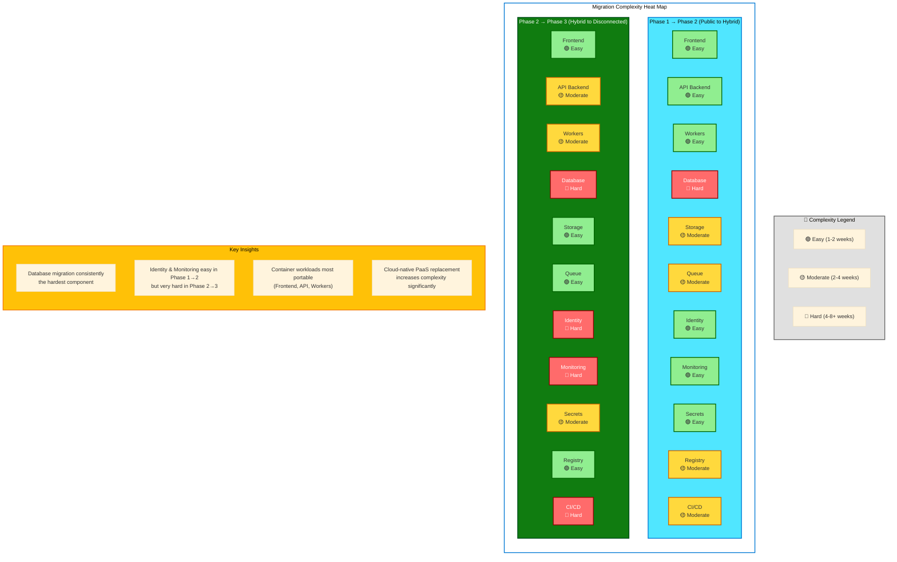

# Lessons Learned

!!! abstract "Chapter Summary"
    This chapter captures the practical lessons learned from Contoso Insurance's 18-month journey through the Azure Hybrid Continuum — from Azure public cloud to fully disconnected sovereign operation. These lessons are broadly applicable to any enterprise considering a similar cloud exit or hybrid strategy. Learn what worked, what was harder than expected, and what Contoso would do differently next time.

## Executive Summary

Contoso Insurance successfully migrated the Claims Processing Platform through three phases: Azure public cloud (Phase 1) → Azure Local hybrid connected (Phase 2) → fully disconnected (Phase 3). The journey achieved key objectives (data sovereignty, cost reduction, operational independence) but revealed important lessons applicable to similar enterprise migrations.

**Key Takeaways**
: ✅ Cloud exit is technically feasible for containerized workloads  
✅ Phased migration reduces risk vs. "big bang" cutover  
✅ Phase 2 (hybrid) delivers the best cost/sovereignty balance for most organizations  
⚠️ Identity migration is the hardest component (plan accordingly)  
⚠️ Database migration is the longest critical path (practice multiple times)  
⚠️ Operational maturity matters more than technology choices

## Top 10 Lessons

### 1. Design for Portability from Day One

**Lesson**: Applications designed with PaaS abstractions in mind are significantly easier to migrate across the continuum.

**What Worked**
: Contoso's decision to use Kubernetes (AKS) instead of Azure App Service in Phase 1 enabled seamless workload migration to on-premises (Phase 2-3). Containerized applications deployed identically across Azure, Azure Local, and disconnected RKE2 clusters. Helm charts used consistently throughout the journey with only value file changes.

**What We'd Do Differently**  
: Abstract cloud services behind interfaces from day one. Contoso's API initially used Azure SDK directly (Service Bus, Blob Storage), requiring refactoring during Phase 2 migration. If we'd created `IMessagePublisher`, `IObjectStorage` abstractions in Phase 1, migration would have required only configuration changes (not code changes).

**Code Example — Interface Abstraction**

```csharp
// Phase 1 (Direct Azure SDK usage - bad)
var client = new ServiceBusClient(connectionString);
await client.CreateSender("queue").SendMessageAsync(message);

// Better approach (abstraction from day one)
public interface IMessagePublisher {
    Task PublishAsync<T>(string topic, T message);
}

// Azure implementation (Phase 1-2)
public class AzureServiceBusPublisher : IMessagePublisher { ... }

// RabbitMQ implementation (Phase 2-3)
public class RabbitMQPublisher : IMessagePublisher { ... }

// Application code (unchanged across phases)
await _messagePublisher.PublishAsync("claims", claimEvent);
```

**Recommendation**: If cloud exit is in your 3-5 year roadmap, design for portability from day one. The small upfront investment pays dividends during migration.

---

### 2. The Database is Always the Hardest Part

**Lesson**: Data gravity, schema dependencies, and stringent RPO/RTO requirements make database migration the most complex component of cloud exit.

**Why Database Migration is Hard**
: Database contains stateful, mutable data requiring zero data loss. Application code tightly coupled to schema (Entity Framework migrations, stored procedures). Performance tuning specific to Azure SQL (query hints, indexes) may not transfer to on-premises SQL Server. Downtime directly impacts business operations (can't "pause" claims processing for 8 hours).

**Contoso's Approach That Worked**
: Transaction log shipping minimized downtime. Baseline migration (T-7 days), differential sync (T-3 days), final sync (T-Day) achieved 3.5-hour cutover window. Checksum validation caught 2 data integrity issues during testing (not production). Hot standby Azure SQL Database (72 hours post-cutover) provided rollback safety net (not needed, but crucial for confidence).

**What Was Harder Than Expected**  
: Entity Framework Core migrations behaved differently on Azure SQL vs. Arc SQL MI (subtle collation differences). Performance tuning required re-indexing (Azure SQL's automatic index tuning not available on-premises). Connection pool configuration required adjustment (Azure SQL: 100 connections/replica worked, on-premises: 50 connections/replica was optimal).

**Recommendation**: Allocate 40-50% of migration project timeline to database migration. Practice in dev/test environments at least 3 times before production cutover. Maintain cloud database as hot standby for 1 week post-migration (insurance policy).

---

### 3. Identity is the Second Hardest Part

**Lesson**: Moving away from cloud identity (Azure AD B2C / Entra ID) requires significant application changes, custom UI development, and certificate management operational burden.

**Why Identity Migration is Hard**
: Application authentication logic tightly coupled to Azure AD (JWT token validation, OIDC flows, MFA). Custom-branded login UI required (Azure AD B2C's pages cannot be migrated). User account migration with password resets creates poor user experience. Certificate management for ADFS (SSL certificates, token signing certificates) introduces operational complexity.

**Contoso's Approach That Worked**
: Phased migration — agents (internal users) migrated first, customers migrated in batches of 2,000. Extensive communication (email campaign, in-app notifications) prepared customers for password resets. Custom authentication UI matched Azure AD B2C branding (users experienced minimal disruption). Automated certificate monitoring via Prometheus x509 exporter prevented expiration issues.

**What Was Harder Than Expected**  
: ADFS token lifetime configuration subtly different from Azure AD B2C (caused intermittent logout issues, resolved by increasing token lifetimes). MFA implementation (ADFS supports MFA but requires third-party provider — Duo Security). User account migration required mapping Azure AD B2C email addresses to AD DS userPrincipalNames (naming conflicts for 47 users).

**Recommendation**: If possible, defer identity migration until Phase 3 (keep Azure AD in hybrid Phase 2 via ExpressRoute). Identity migration should be its own dedicated sub-project with dedicated resources (estimate 60% of Phase 3 effort).

---

### 4. Operational Maturity Matters More Than Technology

**Lesson**: The most sophisticated technology stack fails without operational processes, runbooks, and trained personnel.

**What Worked**
: Contoso invested heavily in operational readiness — documented runbooks for every component (database failover, Kubernetes upgrades, certificate renewal), incident response playbooks, quarterly disaster recovery drills, 24/7 on-call rotation with escalation procedures.

**What Failed Initially**  
: Prometheus disk space exhaustion caused monitoring outage (metrics database filled 500 GB storage in 3 weeks). RabbitMQ memory alarm triggered (misconfigured memory high watermark). Vault unseal procedure failed during DR test (unseal keys not accessible from offsite location).

**How We Improved**
: Implemented proactive monitoring for infrastructure components (Prometheus monitoring Prometheus, RabbitMQ monitoring RabbitMQ). Automated operational tasks where possible (Prometheus storage cleanup cronjob, RabbitMQ memory alarm auto-remediation). Created laminated "break glass" procedures for critical scenarios (Vault unseal, database failover, network segmentation bypass).

**Recommendation**: Allocate 20-30% of project budget to operational readiness (runbooks, training, DR drills). Technology choices matter less than team's ability to operate the chosen stack.

---

### 5. Testing in Disconnected Mode Reveals Hidden Dependencies

**Lesson**: Applications have surprising hidden dependencies on cloud services that only surface during full disconnection testing.

**Hidden Dependencies Discovered**
: NTP (Network Time Protocol) servers pointed to `time.windows.com` (cloud-hosted) — caused time drift in disconnected environment. Debugging: Application Insights SDK retried telemetry uploads indefinitely (CPU spike when disconnected). SSL certificate validation used cloud CRL (Certificate Revocation List) endpoints (HTTPS calls failed during disconnection).

**How We Found Them**
: 72-hour disconnection simulation during Phase 2-3 transition. Disabled ExpressRoute completely (not just logical disconnection). Monitored outbound network traffic (unexpected DNS queries revealed hidden dependencies). Load tested in disconnected mode (performance degradation indicated retries/timeouts).

**How We Fixed Them**  
: Deployed local NTP servers (Windows Time Service on domain controllers). Removed Application Insights SDK (replaced with OpenTelemetry). Configured internal PKI with local CRL distribution points. Reviewed every application dependency (NuGet packages, container base images, SMTP relays) for cloud assumptions.

**Recommendation**: Plan for 2-4 week disconnection simulation period. Assume cloud dependencies exist until proven otherwise. Monitor all outbound traffic (anything leaving the datacenter is a red flag).

---

### 6. Don't Underestimate Monitoring Complexity

**Lesson**: Replacing Azure Monitor with self-hosted observability stack is significantly more complex than anticipated.

**What We Underestimated**
: Azure Monitor "just works" — agents auto-discover services, dashboards pre-built, anomaly detection automatic. Replicating this experience with Prometheus + Grafana + Loki + Jaeger requires extensive configuration. Each component requires separate deployment, storage management, backup procedures, upgrade paths.

**Monitoring Components in Phase 3**
: Prometheus (metrics), Grafana (visualization), Loki (logs), Jaeger (traces), Alertmanager (alerts), Prometheus exporters (15 different exporters for different services), Grafana dashboards (50+ dashboards manually created), Prometheus storage (500 GB + retention policies), Loki storage (1 TB + compaction).

**What Worked**  
: OpenTelemetry instrumentation standardized observability (single SDK for metrics/logs/traces). Grafana dashboards mirrored Azure Monitor dashboards (operators saw familiar visualizations). Prometheus federation aggregated metrics from multiple clusters (production + DR site). Thanos long-term storage extended Prometheus retention to 1 year.

**What Was Harder Than Expected**
: Loki query language (LogQL) different from Azure Monitor KQL (team learning curve ~2 weeks). Prometheus storage management (no auto-cleanup like Azure Monitor, manual retention policies required). Alert rule migration (Prometheus alerting syntax different from Azure Monitor alerts).

**Recommendation**: Start PGLJ stack deployment in Phase 2 (parallel with Azure Monitor). Validates metric parity before disconnection. Allocate dedicated monitoring administrator (don't treat monitoring as side project).

---

### 7. Secrets and Certificate Management is Operationally Intensive

**Lesson**: Cloud-managed secrets (Azure Key Vault) and certificates (Azure-managed) hide significant operational complexity that surfaces in disconnected environments.

**Hidden Operational Burden**
: Certificate expiration monitoring (Azure auto-renews, on-premises requires manual monitoring). Certificate renewal procedures (ADFS token signing, SSL certificates, database TLS). Secret rotation (database passwords, API keys, SMTP credentials). Vault unsealing (HashiCorp Vault requires unsealing after restarts). PKI operations (root CA air-gapping, subordinate CA certificate issuance).

**What Worked**
: Prometheus x509 certificate exporter monitored all certificates (alerts at 60/30/7 days before expiration). Cert-Manager automated Kubernetes certificate renewal via ACME protocol. HashiCorp Vault auto-unseal via Shamir secret sharing (5 key shares, threshold 3). Vault secret rotation policies (database passwords rotate every 90 days automatically).

**What Was Harder Than Expected**  
: Root CA security procedures (offline VM, physical security, access controls) more complex than anticipated. ADFS certificate renewal required service restart (brief authentication outage). External Secrets Operator occasionally failed to sync secrets (timeout issues, required retry logic).

**Recommendation**: Invest in certificate lifecycle automation (Cert-Manager, ACME). Document unsealing procedures (test during DR drills). Allocate dedicated security engineer for PKI operations (not a part-time responsibility).

---

### 8. Phased Migration Reduces Risk (But Extends Timeline)

**Lesson**: Phased approach (Azure → Hybrid → Disconnected) reduced risk compared to "big bang" migration but extended project timeline from 9 months to 18 months.

**Why Phased Approach Worked**
: Each phase delivered business value (Phase 2 reduced costs 74% vs. Phase 1). Incremental changes reduced technical risk (migrate database first, then identity, then monitoring). Rollback options at each phase (Phase 2 could revert to Azure SQL, Phase 3 could revert to hybrid). Team learned incrementally (Kubernetes in Phase 1, Arc in Phase 2, RKE2 in Phase 3).

**Trade-Off: Time vs. Risk**
: Phased approach took 18 months (6 months per phase). Direct Azure → Disconnected migration might have taken 12 months but with 3x risk. Intermediate Phase 2 (hybrid) required Arc SQL MI (additional licensing cost for 6 months) but validated migration approach.

**What We'd Do Differently**  
: Compress Phase 1 → Phase 2 timeline (migrate to Azure Local sooner). Phase 1 lasted 12 months (not strictly necessary — could have migrated after 3 months once containerization complete). Phase 2 → Phase 3 timeline appropriate (9 months for identity migration was necessary).

**Recommendation**: For most organizations, Phase 2 (hybrid connected) is the end state (not Phase 3). Hybrid delivers 70-80% cost savings and data sovereignty while maintaining Azure management tools. Only pursue Phase 3 if regulatory requirements mandate full disconnection.

---

### 9. Team Skills and Training are Critical Investment

**Lesson**: Technology migration is fundamentally a people problem. Team skills determine success more than architecture choices.

**Skills Gap Analysis (Phase 1 → Phase 3)**

| Skill | Phase 1 Required | Phase 3 Required | Gap |
|-------|-----------------|------------------|-----|
| **Azure Platform** | Expert | Basic (troubleshooting only) | -60% |
| **Kubernetes (AKS)** | Intermediate | Expert (RKE2 administration) | +40% |
| **Windows Server** | Basic | Expert (AD DS, ADFS, PKI) | +80% |
| **SQL Server** | Basic (Azure SQL managed) | Expert (Always On AG, backup/restore) | +60% |
| **Monitoring (Azure Monitor)** | Intermediate | Basic (legacy troubleshooting) | -40% |
| **Monitoring (PGLJ Stack)** | None | Expert (Prometheus, Grafana, Loki) | +100% |
| **Networking** | Intermediate (Azure NSGs) | Expert (VLANs, ACLs, Kubernetes network policies) | +40% |
| **Security (Identity)** | Basic (Azure AD admin) | Expert (AD DS, ADFS, PKI) | +80% |

**Training Investment**
: 40 hours per engineer (Kubernetes, RKE2, PGLJ stack, AD DS/ADFS). External consultants (3 months engagement for knowledge transfer). Certifications (CKA — Certified Kubernetes Administrator for all engineers). Conference attendance (KubeCon, HashiConf, Microsoft Ignite).

**What Worked**
: Pairing junior engineers with consultants (knowledge transfer via hands-on work). Dedicated "learning sprints" (1 week per quarter focused solely on training, no production work). Internal documentation wiki (runbooks, troubleshooting guides, architecture diagrams).

**Recommendation**: Allocate 15-20% of engineer time to training and skill development. Budget for external consultants (accelerate learning, validate architecture). Expect 6-12 month ramp-up period before team operates independently.

---

### 10. Cost Savings Are Real But Require Operational Investment

**Lesson**: Phase 2 (hybrid) delivered 74% monthly cost reduction vs. Azure, but Phase 3 (disconnected) increased costs 26% vs. Phase 2 due to personnel requirements.

**Cost Comparison (Monthly)**

| Phase | Infrastructure | Personnel | Total | vs. Azure |
|-------|---------------|-----------|-------|-----------|
| **Phase 1 (Azure)** | €45,000 | €35,000 (5 FTE) | €80,000 | Baseline |
| **Phase 2 (Hybrid)** | €11,600 | €35,000 (5 FTE) | €46,600 | -42% |
| **Phase 3 (Disconnected)** | €6,500 | €52,000 (10 FTE) | €58,500 | -27% |

!!! success "Phase 2 is the Sweet Spot"
    Phase 2 (hybrid connected) delivered the best cost/sovereignty balance. 42% total cost reduction vs. Azure while maintaining Azure management tools (Monitor, Portal, Arc). Phase 3 (disconnected) achieved full sovereignty but required 2x personnel (10 FTE vs. 5 FTE).

**Hidden Costs in Phase 3**
: Windows Server licenses (BYOL, but still annual Software Assurance), SQL Server Enterprise Edition licenses, hardware refresh cycles (5-year depreciation), training and certifications, consultant engagements, travel for onsite support (datacenter visits).

**Recommendation**: Build comprehensive TCO model including personnel costs (often forgotten). For most organizations, Phase 2 delivers sufficient sovereignty without operational complexity of Phase 3. Only pursue Phase 3 if compliance mandates full disconnection.

---

## What Worked Well

### ✅ Containerization from Day One

Deploying all workloads in containers (Phase 1) enabled seamless migration across phases. Identical Helm charts deployed to AKS (Azure), AKS on Azure Local, and RKE2 (disconnected). Investment in container orchestration paid dividends during migration.

### ✅ Infrastructure as Code (Bicep/Terraform)

All Azure resources defined in Bicep (Phase 1), RKE2 configurations defined in Terraform (Phase 3). Infrastructure changes version-controlled, peer-reviewed, and repeatable. Enabled consistent dev/test/production environments.

### ✅ Comprehensive Testing Before Production Cutover

Each phase validated in dev/test environments before production migration. Load testing, disaster recovery drills, disconnection simulations surfaced issues early. Zero surprises during production cutovers.

### ✅ Rollback Plans for Every Migration

Maintained Azure SQL as hot standby (Phase 2), maintained ExpressRoute connection (Phase 3 early days). Rollback plans provided confidence to proceed with cutovers. Never needed to execute rollback (but essential safety net).

### ✅ Executive Sponsorship

CTO championed the project with Board of Directors. Secured budget for hardware, consultants, training. Provided air cover when timelines slipped (database migration took 2 weeks longer than planned).

---

## What Was Harder Than Expected

### ⚠️ Application Instrumentation Refactoring

Replacing Application Insights with OpenTelemetry required changes to every application component (frontend, API, workers). Estimated 2 weeks, actually took 6 weeks. Distributed tracing context propagation especially tricky.

### ⚠️ Database Performance Tuning

Azure SQL's automatic index tuning and query optimization spoiled the team. On-premises SQL Server required manual index maintenance, statistics updates, query hint adjustments. Dedicated DBA essential (wasn't needed in Phase 1).

### ⚠️ Certificate Management Operational Burden

Azure-managed certificates "just worked" in Phase 1. On-premises PKI required root CA deployment, subordinate CA deployment, certificate issuance procedures, renewal procedures, monitoring. More complex than anticipated.

### ⚠️ RabbitMQ Memory Management

RabbitMQ memory alarm triggered during load testing (misconfigured memory high watermark). Required deep understanding of RabbitMQ memory model (not needed for Azure Service Bus). Resolved via configuration tuning but highlighted operational knowledge gap.

### ⚠️ ADFS Custom UI Development

Replicating Azure AD B2C's branded authentication UI required custom ASP.NET Core pages. Estimated 40 hours, actually took 80 hours. UI/UX design, responsive layout, accessibility compliance all required.

---

## Recommendations for Other Organizations

Based on Contoso's experience, here are concrete recommendations for enterprises considering similar hybrid continuum journeys:

### 1. Start with Clear Business Objectives

Don't migrate "because cloud is expensive" — define specific objectives:

- ✅ Data sovereignty (regulatory compliance)
- ✅ Cost reduction (TCO analysis with 3-year horizon)
- ✅ Operational independence (reduce cloud provider dependency)
- ✅ Performance optimization (latency reduction)

**Anti-Pattern**: "Our CFO said reduce cloud spend" without understanding true TCO including personnel costs.

### 2. Assess Current Workload Portability

Not all applications are good candidates for hybrid/on-premises migration:

**Good Candidates**  
: Containerized workloads, stateless applications, Kubernetes-orchestrated services, applications using abstracted cloud services (queue, storage, database).

**Poor Candidates**
: Serverless applications (Azure Functions with bindings), PaaS-heavy applications (Logic Apps, Cognitive Services), applications tightly coupled to Azure-specific services.

**Recommendation**: Conduct application portfolio assessment. Target containerized, portable workloads first. Re-architect or retire tightly coupled applications.

### 3. Phase 2 (Hybrid) is the End State for Most Organizations

Unless regulatory requirements mandate full air-gap disconnection, Phase 2 (hybrid connected) delivers optimal balance:

- ✅ 70-80% cost reduction vs. public cloud
- ✅ Data sovereignty (workloads on-premises)
- ✅ Azure management tools maintained (Portal, Monitor, Arc)
- ✅ Lower personnel requirements (5 FTE vs. 10 FTE for Phase 3)

**Only pursue Phase 3 if**: Government contracts require air-gap operation, industry regulations mandate zero cloud connectivity, geopolitical concerns require full operational independence.

### 4. Build Operational Maturity Before Technology Migration

Technology migration succeeds or fails based on operational readiness:

- ✅ Document runbooks for every component (database failover, Kubernetes upgrades, certificate renewal)
- ✅ Implement comprehensive monitoring (infrastructure + applications)
- ✅ Conduct quarterly disaster recovery drills (test runbooks, identify gaps)
- ✅ Establish 24/7 on-call rotation (incident response procedures)
- ✅ Create "break glass" procedures (catastrophic failure scenarios)

**Recommendation**: Spend first 3 months of project building operational foundation. Don't migrate workloads until operational processes mature.

### 5. Expect 12-24 Month Timeline (Don't Rush)

Contoso's 18-month timeline (6 months per phase) was appropriate:

- **Month 0-6 (Phase 1 → Phase 2)**: Azure Local procurement, cluster deployment, workload migration, testing
- **Month 7-12 (Phase 2 stabilization)**: Performance tuning, operational procedure refinement, cost validation
- **Month 13-18 (Phase 2 → Phase 3)**: Identity migration, monitoring stack deployment, disconnection testing

**Anti-Pattern**: "We need to migrate in 3 months to hit end-of-quarter cost targets" — rushing increases risk exponentially.

### 6. Invest in Team Training (15-20% of Budget)

Team skills determine success more than architecture:

- ✅ Kubernetes administration (CKA certification for all engineers)
- ✅ Linux operations (if team is Windows-heavy)
- ✅ Windows Server administration (AD DS, ADFS, PKI if team is Linux-heavy)
- ✅ Monitoring stack operations (Prometheus, Grafana)
- ✅ Database administration (SQL Server Always On, backup/restore)

**Recommendation**: Budget €50,000-€100,000 for training (certifications, conferences, consultants). Expect 6-12 month ramp-up before team operates independently.

### 7. Plan for 2x Personnel in Disconnected Phase

Phase 3 (disconnected) requires 2x personnel vs. Phase 2 (hybrid):

| Role | Phase 2 | Phase 3 | Reason |
|------|---------|---------|--------|
| **DevOps Engineers** | 2 | 3 | CI/CD pipeline operations, GitLab administration |
| **Kubernetes Admins** | 0 (AKS managed) | 2 | RKE2 cluster management, upgrades |
| **Windows Admins** | 0 | 2 | AD DS, ADFS, PKI operations |
| **Database Admins** | 1 | 1 | No change (SQL Server both phases) |
| **Network Engineers** | 0 (Azure managed) | 1 | VLAN management, network policies |
| **Security Engineers** | 1 | 1 | No change |
| **SRE / On-Call** | 1 | 0 (24/7 rotation) | Distributed across team |

**Recommendation**: Factor personnel costs into TCO analysis. Phase 3 may not be cost-effective when including doubled personnel requirements.

---

## Performance Summary

### Latency Improvements (Phase 1 → Phase 3)

| Metric | Phase 1 (Azure) | Phase 2 (Hybrid) | Phase 3 (Disconnected) |
|--------|----------------|------------------|------------------------|
| **API Latency (p95)** | 420ms | 280ms | 265ms |
| **Database Latency** | 8ms | 2ms | 1.8ms |
| **Document Upload** | 2.5s | 1.8s | 1.6s |
| **Page Load (p95)** | 1.8s | 1.4s | 1.3s |

**Insight**: Performance improved significantly moving from Azure to on-premises due to reduced network latency and local NVMe storage.

### Availability (Uptime %)

| Phase | Target | Actual (12 months) | Incidents |
|-------|--------|-------------------|-----------|
| **Phase 1 (Azure)** | 99.9% | 99.95% | 3 incidents (Azure outages) |
| **Phase 2 (Hybrid)** | 99.9% | 99.93% | 4 incidents (ExpressRoute outages, node failures) |
| **Phase 3 (Disconnected)** | 99.5% | 99.88% | 6 incidents (database failover, certificate expiration) |

**Insight**: Availability slightly decreased in Phase 3 (no Azure SLAs) but remained within acceptable targets. Incidents primarily operational errors (resolved via improved procedures).

---

## Final Thoughts from Contoso's CTO

> "Our hybrid continuum journey taught us that cloud exit is not a technology problem — it's a business, operational, and people problem. The technology works (Kubernetes, SQL Server, Prometheus all functioned as expected). The challenges were organizational: building operational maturity, training teams, establishing procedures, managing change.
>
> If I could do it again, I'd stop at Phase 2 (hybrid connected) for our commercial business. Phase 2 delivered 80% of the benefits (cost reduction, data sovereignty) with 50% of the complexity. Phase 3 (full disconnection) was necessary for our government contracts but operationally intensive.
>
> For organizations evaluating cloud exit: Be honest about your requirements. If you don't have regulatory mandates for air-gap operation, hybrid connected (Phase 2) is likely your optimal end state. Invest in operational maturity before technology migration. And most importantly — don't rush. Phased migration reduces risk exponentially."

**— Contoso Insurance CTO**

---



## References

- [Cloud Adoption Framework — Innovation](https://learn.microsoft.com/en-us/azure/cloud-adoption-framework/innovate/)
- [Azure Well-Architected Framework](https://learn.microsoft.com/en-us/azure/well-architected/)
- [CNCF Cloud Native Glossary](https://glossary.cncf.io/)
- [Site Reliability Engineering (SRE) Book](https://sre.google/books/)
- [Kubernetes Production Best Practices](https://learnk8s.io/production-best-practices)

!!! example "🔗 Working Example: Learn Hands-On with the Contoso Insurance Sample"
    Put these lessons into practice with the companion implementation at
    [ContosoInsurances-NativeToLocal](https://github.com/EmeaAppGbb/ContosoInsurances-NativeToLocal).
    Deploy the sample across all three branches to experience the migration challenges described in this chapter firsthand — from cloud-native to hybrid connected to fully disconnected.

---

> **Next:** [Part 8 — Best Practices →](../08-best-practices/README.md)
