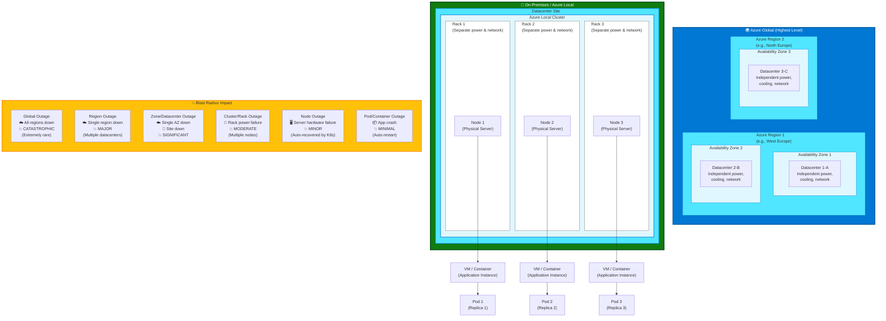

# Resilience

## Introduction

Resilience in hybrid architectures introduces failure modes that don't exist in purely cloud-native or purely on-premises environments. Network partitions between cloud and edge, split-brain scenarios where disconnected components make conflicting decisions, and dependency on intermittent connectivity all require resilience patterns adapted for the hybrid continuum.

The [Azure Well-Architected Framework Reliability pillar](https://learn.microsoft.com/en-us/azure/well-architected/reliability/) emphasizes designing for business requirements, resilience, and recovery. In hybrid scenarios, we extend these principles to account for infrastructure spanning multiple management domains with varying levels of autonomy.

This chapter covers resilience strategies that ensure workloads remain available and recoverable across all positions on the continuum.

## Fault Domains Across the Hybrid Continuum

Understanding fault domains—components that fail together—is critical to resilience design. Hybrid architectures introduce new fault domain boundaries:

### Cloud Fault Domains

**Azure Region Failure**: Complete loss of an Azure region due to natural disaster, power grid failure, or network partition. Probability is low but impact is catastrophic for workloads dependent on a single region.

- **Mitigation**: Multi-region deployments with traffic management (Azure Front Door, Traffic Manager)
- **Hybrid consideration**: On-premises or Azure Local deployments provide geographic diversity independent of Azure region topology

**Availability Zone Failure**: Loss of a single availability zone within a region. Azure designs for this; well-architected applications should tolerate zone failures transparently.

- **Mitigation**: Deploy replicas across multiple availability zones
- **Hybrid consideration**: Azure Local clusters provide similar isolation at the on-premises layer

### Connectivity Fault Domains

**ExpressRoute/VPN Failure**: Loss of connectivity between on-premises and Azure. This is the most common hybrid-specific failure mode.

- **Impact**: Cloud management planes become inaccessible, cloud-dependent features stop working, data synchronization halts
- **Mitigation**: Design for static stability (see below), implement circuit breakers, cache critical data locally
- **Recovery**: Connectivity typically restores within hours; applications must survive the outage

**Internet Connectivity Loss**: Complete loss of internet access for disconnected or edge deployments.

- **Impact**: Similar to ExpressRoute failure but potentially longer duration (days to weeks in remote locations)
- **Mitigation**: Full local autonomy, synchronization during connection windows

### On-Premises Fault Domains

**Azure Local Cluster Failure**: Loss of an entire Azure Local cluster due to facility issues (fire, flood, power), network infrastructure failure, or operational errors.

- **Mitigation**: Deploy workloads across multiple clusters, implement data replication between clusters
- **Hybrid consideration**: Cloud becomes the DR site for on-premises workloads

**Azure Local Node Failure**: Single server failure within a cluster. Azure Local uses Storage Spaces Direct and Kubernetes replication to tolerate node failures automatically.

- **Mitigation**: Minimum 3-node clusters (2-node with witness for smaller deployments), Kubernetes pod anti-affinity rules
- **Expected behavior**: Automatic failover within minutes

**Power and Cooling Failures**: Data center infrastructure failures. These don't occur in cloud but are significant on-premises risks.

- **Mitigation**: UPS, backup generators, cooling redundancy, environmental monitoring
- **Hybrid advantage**: Cloud workloads provide resilience against facility-level failures



!!! warning "Correlated Failures"
    The most dangerous failures are those that impact multiple fault domains simultaneously. For example, an ExpressRoute circuit failure combined with an Azure Local node failure can exceed design redundancy. Use failure mode and effects analysis (FMEA) to identify correlated failure scenarios.

## Resilience Patterns for Hybrid Environments

Traditional resilience patterns must be adapted for hybrid architectures. Here are the key patterns:

### Static Stability

**Pattern**: Systems continue functioning in steady state without access to control planes, management APIs, or configuration services.

**Problem**: Cloud management planes (Azure Resource Manager, Kubernetes control plane in cloud) may become inaccessible during connectivity outages. Applications that require management plane access to maintain operation will fail.

**Solution**: Design applications so that steady-state operation requires no control plane access. Configuration changes should not be required to maintain current functionality.

**Example**: A containerized application on Azure Local should continue processing requests during an Azure connectivity outage. It should not require Azure Key Vault API calls on every request—instead, cache secrets locally with appropriate refresh intervals.

**Implementation**:
- Cache configuration locally with reasonable TTLs
- Use local Kubernetes secrets rather than runtime Azure Key Vault SDK calls
- Pre-configure application behavior; avoid just-in-time configuration fetches
- Test static stability by isolating environments during integration testing

### Bulkhead Isolation

**Pattern**: Isolate cloud-dependent features from locally autonomous features to prevent cascade failures.

**Problem**: If a failure in a cloud-dependent component (e.g., ML model hosted in Azure) causes the entire application to fail, the application cannot operate during connectivity loss.

**Solution**: Architect applications with separate bulkheads for cloud-dependent and local functionality. Failures in cloud-dependent bulkheads do not affect local functionality.

**Example**: A manufacturing application separates real-time machine control (local, latency-sensitive) from predictive maintenance analytics (cloud, latency-tolerant). Connectivity loss affects analytics but not machine control.

**Implementation**:
- Use separate thread pools or process spaces for cloud-dependent operations
- Implement timeout and circuit breaker patterns at bulkhead boundaries
- Design APIs so local features work without cloud dependencies
- Monitor bulkhead resource utilization separately

### Circuit Breaker

**Pattern**: Detect failures in downstream services and fail fast rather than wasting resources on requests likely to fail.

**Problem**: When cloud services become unavailable, applications that continue retrying requests waste resources (threads, connections, CPU) and create poor user experiences with hung requests.

**Solution**: Implement circuit breakers that detect failure patterns and automatically route to fallback behavior. After a timeout, circuit breakers attempt to close (resume normal operation) to detect recovery.

**Example**: An application calling Azure Cognitive Services for text analysis implements a circuit breaker. After 5 consecutive failures, the circuit opens and requests fail fast or route to a local sentiment analysis model (lower quality but available).

**Implementation**:
- Use libraries: Polly (.NET), resilience4j (Java), PyBreaker (Python)
- Configure thresholds appropriate to failure modes (5-10 consecutive failures, or 50% error rate over 30 seconds)
- Implement fallback behavior: degraded functionality, cached results, or explicit error messages
- Expose circuit state as metrics for monitoring

### Retry with Exponential Backoff

**Pattern**: Retry transient failures with increasing delays to avoid overwhelming recovering services.

**Problem**: Network glitches, temporary service overload, or brief connectivity losses cause transient failures. Immediate retries may succeed. But aggressive retries can overload recovering services (retry storms).

**Solution**: Retry failed requests with exponentially increasing delays (1s, 2s, 4s, 8s, etc.) and maximum retry counts. Add jitter to prevent thundering herds.

**Example**: An application synchronizing data to Azure Storage retries with exponential backoff. After 5 retries over 31 seconds, it gives up and queues the operation for later batch processing.

**Implementation**:
- Use built-in retry policies in Azure SDKs (configured appropriately)
- For custom HTTP clients, implement retry middleware
- Set maximum delays (e.g., cap at 60 seconds) to prevent unbounded waits
- Use exponential backoff with jitter: `delay = min(max_delay, base_delay * (2 ^ attempt) + random(0, 1000ms))`

### Queue-Based Load Leveling

**Pattern**: Buffer work in queues during load spikes or connectivity disruptions, processing asynchronously when resources are available.

**Problem**: Synchronous cloud API calls fail immediately when connectivity is lost. Real-time processing requirements can't be met during outages.

**Solution**: Use message queues to buffer work. During outages, work accumulates in local queues. When connectivity returns, workers drain queues and process buffered work.

**Example**: An IoT application buffers telemetry in NATS queues running on Azure Local. During connectivity outages, telemetry accumulates locally. When connectivity returns, a background worker sends buffered telemetry to Azure IoT Hub.

**Implementation**:
- Use message queues with persistent storage (NATS JetStream, RabbitMQ with disk persistence, Kafka)
- Size queues based on expected outage duration and message generation rate
- Implement batch processing to catch up efficiently after outages
- Monitor queue depth and age of oldest message as operational metrics

!!! tip "Combining Patterns"
    These patterns work together. A typical hybrid application uses circuit breakers to detect cloud service failures, queues to buffer work, and retry logic to handle transient errors. Bulkheads isolate cloud-dependent features, and static stability ensures core functionality remains available.

## High Availability Design

High availability (HA) ensures workloads remain operational despite component failures. HA strategies vary by deployment model:

### HA for Azure Local Clusters

**Multi-node clusters**: Azure Local supports 2-16 node clusters. For HA, use minimum 3 nodes (or 2 nodes with a witness). Storage Spaces Direct replicates data across nodes for resiliency.

**Quorum configuration**: Clusters require quorum (majority of nodes) to remain operational. A 3-node cluster tolerates 1 node failure. A 5-node cluster tolerates 2 node failures.

**Storage resiliency**:
- **2-node clusters**: Two-way mirroring (2 copies of data)
- **3-node clusters**: Three-way mirroring or dual parity (higher capacity efficiency)
- **4+ node clusters**: Three-way mirroring or dual parity based on requirements

**Network redundancy**: Use redundant network adapters (teamed or MLAG) for management, storage, and compute traffic. Separate VLANs prevent contention.

### HA for Kubernetes Workloads

**Pod anti-affinity rules**: Distribute replicas across nodes and fault domains:
```yaml
affinity:
  podAntiAffinity:
    requiredDuringSchedulingIgnoredDuringExecution:
    - labelSelector:
        matchLabels:
          app: my-app
      topologyKey: kubernetes.io/hostname
```

**Liveness and readiness probes**: Configure probes so Kubernetes detects and restarts failed containers automatically:
```yaml
livenessProbe:
  httpGet:
    path: /healthz
    port: 8080
  periodSeconds: 10
readinessProbe:
  httpGet:
    path: /ready
    port: 8080
  periodSeconds: 5
```

**Replica counts**: Run at least 2-3 replicas of stateless applications. For stateful applications, use StatefulSets with persistent volumes and appropriate replication (e.g., PostgreSQL with replication, Redis Sentinel).

### HA for Data Tier

**Database replication**:
- **PostgreSQL**: Streaming replication (primary + 2 replicas) with automatic failover via Patroni
- **SQL Server**: Always On Availability Groups (requires Enterprise edition)
- **NoSQL**: MongoDB replica sets, Redis Sentinel, Cassandra multi-node clusters

**Storage redundancy**: Use Storage Spaces Direct mirroring for Azure Local, or Azure Managed Disks with ZRS for cloud.

**Backup and restore**: HA protects against failures but not data corruption or operational errors. Maintain backups independent of HA infrastructure.

## Disaster Recovery Across the Continuum

Disaster recovery (DR) ensures recovery from catastrophic failures. DR strategies vary by deployment model and RTO/RPO requirements.

### RTO and RPO Targets

**Recovery Time Objective (RTO)**: Maximum acceptable downtime after disaster. Shorter RTOs require hot standby or active-active architectures.

**Recovery Point Objective (RPO)**: Maximum acceptable data loss measured in time. Shorter RPOs require synchronous replication or more frequent backups.

| RTO/RPO Target | Architecture | Example Implementation |
|----------------|--------------|------------------------|
| RTO < 1 hour, RPO < 5 min | Active-active | Multi-region deployment with synchronous data replication |
| RTO < 4 hours, RPO < 1 hour | Hot standby | Standby environment with asynchronous replication, DNS failover |
| RTO < 24 hours, RPO < 4 hours | Warm standby | Infrastructure ready, restore from backups or snapshots |
| RTO < 1 week, RPO < 24 hours | Cold standby | Rebuild infrastructure, restore from backups |

### Backup Strategies by Deployment Model

**Public Cloud (Azure)**:
- **Application data**: Azure Backup for VMs, Azure SQL automated backups, blob snapshots
- **Kubernetes**: Velero for cluster backups (including PVs)
- **Frequency**: Daily backups with 30-day retention standard; adjust per compliance requirements

**Connected Azure Local**:
- **Application data**: Azure Backup integration (preview as of 2024)
- **Cluster-level**: Azure Site Recovery for VMs, volume snapshots for Kubernetes PVs
- **Offsite**: Replicate backups to Azure Blob Storage for offsite retention

**Disconnected Azure Local**:
- **Local backups**: Velero to S3-compatible object storage (MinIO on separate infrastructure)
- **Offsite**: Physical tape backup or replication to secondary disconnected site
- **Testing**: Regular DR drills to verify backup integrity and restore procedures

### DR Testing Procedures

Untested DR plans fail when needed. Implement regular DR testing:

1. **Tabletop exercises**: Quarterly walkthroughs of DR procedures without actual failover
2. **Simulated disasters**: Semi-annual tests with isolated test environments
3. **Full DR drills**: Annual tests with actual failover and workload restoration
4. **Chaos engineering**: Continuous testing via controlled fault injection (see below)

Document test results, identify gaps, and update DR plans iteratively.

## Chaos Engineering for Hybrid Environments

Chaos engineering proactively tests resilience by injecting failures in controlled environments. For hybrid architectures:

**Network failures**: Use tools like `tc` (Linux traffic control) or Chaos Mesh to simulate latency, packet loss, and network partitions between on-premises and cloud.

**Infrastructure failures**: Use Litmus Chaos or Chaos Monkey to terminate pods, nodes, or VMs randomly. Verify self-healing and failover work as designed.

**Dependency failures**: Use fault injection to simulate Azure service outages. Verify circuit breakers open and fallback behavior activates.

**Resource exhaustion**: Inject memory leaks, CPU spikes, or disk fill scenarios. Verify resource limits prevent cascade failures.

!!! example "Chaos Experiment Example"
    A chaos experiment for a hybrid retail application might:
    1. Disconnect Azure Local from Azure by blocking ExpressRoute traffic
    2. Verify local POS systems continue processing transactions
    3. Verify transactions queue for later synchronization
    4. Restore connectivity and verify queues drain without data loss
    5. Document recovery time and any operational issues

## Resilience Metrics and Monitoring

Measure resilience continuously:

- **Availability**: Uptime percentage (target: 99.9% or 99.99%)
- **Error rate**: Failed requests as percentage of total (target: < 0.1%)
- **Latency percentiles**: p50, p95, p99 response times (track degradation)
- **Time to recovery**: Mean time to recovery (MTTR) after incidents
- **Connectivity uptime**: Percentage of time connectivity is available between on-premises and cloud

Use these metrics to identify resilience gaps and track improvements over time.

## Conclusion

Resilience in hybrid architectures requires adapting cloud-native patterns for environments where connectivity, infrastructure control, and failure modes differ from public cloud. By understanding fault domains, implementing appropriate resilience patterns, designing for high availability, and maintaining robust disaster recovery capabilities, teams can build workloads that remain available and recoverable across the hybrid continuum.

The key insight: resilience is not just about redundancy—it's about graceful degradation, autonomous operation during disruptions, and rapid recovery when failures occur.

---

> **Next:** [Security →](03-security.md)
