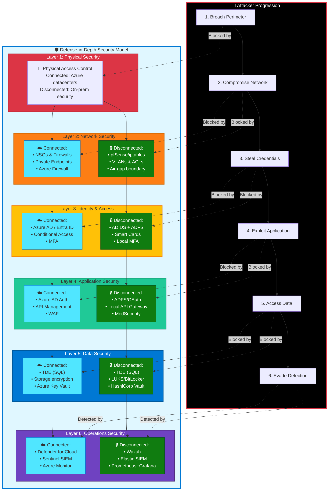

# Security

## Introduction

Security across the hybrid continuum requires adapting cloud security practices for environments with varying levels of connectivity, control, and compliance requirements. The expanded attack surface—spanning multiple networks, identity providers, and physical security boundaries—demands a defense-in-depth strategy grounded in [Zero Trust principles](https://learn.microsoft.com/en-us/security/zero-trust/).

The [Azure Well-Architected Framework Security pillar](https://learn.microsoft.com/en-us/azure/well-architected/security/) emphasizes protecting confidentiality, integrity, and availability. In hybrid scenarios, we must apply these principles consistently even when the implementation tools differ between cloud, connected hybrid, and air-gapped environments.

This chapter covers security best practices that apply across all deployment models, with specific guidance for adapting controls to each position on the continuum.

## Zero Trust Across the Continuum

Zero Trust is a security model based on three principles:

1. **Verify explicitly**: Always authenticate and authorize based on all available data points (identity, location, device, workload)
2. **Use least-privilege access**: Limit access with just-in-time and just-enough-access (JIT/JEA)
3. **Assume breach**: Minimize blast radius and segment access; verify end-to-end encryption

These principles apply universally, but implementation varies by deployment model:

### Identity Verification Across Connectivity Models

**Connected environments (Azure, Connected Azure Local)**:
- Use **Microsoft Entra ID** as the central identity provider
- Implement **Multi-Factor Authentication (MFA)** for all administrative access
- Apply **Conditional Access policies** based on user, device, location, and risk
- Use **Privileged Identity Management (PIM)** for just-in-time admin access
- Federate with on-premises Active Directory using Entra Connect

**Disconnected environments**:
- Deploy **local identity providers** (self-hosted Active Directory, Keycloak, or FreeIPA)
- Implement equivalent controls: local MFA (TOTP via apps, hardware tokens), role-based access control
- Synchronize identities during connection windows if periodic connectivity exists
- Maintain audit logs of authentication events for compliance

!!! warning "Identity Challenges in Disconnected Environments"
    Without Entra ID, you lose cloud-powered risk detection (sign-in risk, user risk, anomaly detection). Compensate with enhanced logging, regular access reviews, and stricter password policies.

### Network Micro-Segmentation

Apply network segmentation at multiple layers:

**Azure (cloud)**:
- Use **Network Security Groups (NSGs)** to control traffic between subnets
- Implement **Azure Firewall** or **NVAs** for hub-spoke topologies
- Use **Private Link** to access PaaS services over private IPs (no internet exposure)
- Enable **DDoS Protection** for internet-facing resources

**Azure Local**:
- Separate **management, storage, and application traffic** on different VLANs
- Use **Kubernetes Network Policies** to enforce pod-to-pod communication rules:
  ```yaml
  apiVersion: networking.k8s.io/v1
  kind: NetworkPolicy
  metadata:
    name: api-allow-frontend-only
  spec:
    podSelector:
      matchLabels:
        app: api
    ingress:
    - from:
      - podSelector:
          matchLabels:
            app: frontend
      ports:
      - protocol: TCP
        port: 8080
  ```
- Implement **service mesh (Istio, Linkerd)** for mTLS between services

**Air-gapped environments**:
- Physical network isolation with **air-gap diodes** (one-way data transfer) where required
- Strict **MAC address filtering** and **802.1X authentication** for network access
- **Intrusion Detection Systems (IDS)** to monitor for anomalies

### Continuous Validation and Monitoring

**Connected environments**:
- **Microsoft Defender for Cloud** provides continuous security posture assessment and threat detection
- **Microsoft Sentinel** aggregates security logs for SIEM (Security Information and Event Management)
- **Azure Policy** enforces compliance (e.g., "All VMs must have disk encryption enabled")

**Disconnected environments**:
- Deploy local SIEM solutions: **Wazuh** (open-source), **Elastic Security**, or commercial alternatives
- Implement **file integrity monitoring (FIM)** to detect unauthorized changes
- Use **vulnerability scanners** (OpenVAS, Nessus) on regular schedules
- Export logs to write-once media for tamper-proof audit trails

## Defense in Depth for Hybrid Architectures

Defense in depth applies multiple layers of security controls. If one layer fails, others provide protection.

### Layer 1: Physical Security

**On-premises and Azure Local**:
- Restricted access to data centers with **badge readers, biometric scanners**
- **Video surveillance** with retention policies
- **Environmental monitoring**: temperature, humidity, smoke detection
- **Secure disposal** of decommissioned hardware (disk wiping, physical destruction)

**Cloud**: Physical security is Microsoft's responsibility. Focus on logical security controls.

### Layer 2: Network Security

**Perimeter security**:
- **Firewalls** at network boundaries (Azure Firewall, Palo Alto, Fortinet)
- **Web Application Firewalls (WAF)** for HTTP/HTTPS applications (Azure Front Door WAF, ModSecurity)
- **DDoS mitigation** for internet-facing services

**Internal segmentation**:
- **VLANs and subnets** to separate workloads by sensitivity
- **Network policies** in Kubernetes to enforce least-privilege communication
- **Service mesh** for mTLS and traffic encryption within clusters

### Layer 3: Identity and Access Security

**Strong authentication**:
- **Multi-Factor Authentication (MFA)** for all users (Entra ID, or local TOTP/hardware tokens)
- **Passwordless authentication** where possible (FIDO2, Windows Hello for Business)
- **Certificate-based authentication** for service-to-service communication

**Authorization**:
- **Role-Based Access Control (RBAC)** in Azure, Kubernetes, and applications
- **Attribute-Based Access Control (ABAC)** for fine-grained policies
- **Just-In-Time (JIT) access** via Privileged Identity Management
- **Service accounts with minimal permissions** (Kubernetes service accounts, Azure Managed Identities)

### Layer 4: Data Security

**Encryption at rest**:
- **Azure Disk Encryption** using BitLocker (Windows) or dm-crypt (Linux)
- **Transparent Data Encryption (TDE)** for SQL Server, PostgreSQL
- **Storage Spaces Direct encryption** for Azure Local
- **Key management**: Azure Key Vault (connected) or HashiCorp Vault (disconnected)

**Encryption in transit**:
- **TLS 1.3** for all external communication
- **mTLS** (mutual TLS) for internal service-to-service communication
- **IPsec/MACsec** for network-level encryption where required

**Encryption in use**:
- **Confidential computing** with AMD SEV-SNP or Intel TDX for workloads processing highly sensitive data
- **Secure enclaves** for cryptographic operations

**Data classification and handling**:
- Classify data by sensitivity (public, internal, confidential, restricted)
- Apply appropriate controls based on classification
- Use **Data Loss Prevention (DLP)** to prevent exfiltration

### Layer 5: Application Security

**Secure development practices**:
- **Threat modeling** during design phase (STRIDE methodology)
- **Secure coding training** for developers (OWASP Top 10)
- **Static Application Security Testing (SAST)**: SonarQube, Checkmarx
- **Dynamic Application Security Testing (DAST)**: OWASP ZAP, Burp Suite
- **Software Composition Analysis (SCA)**: Dependency-Track, Snyk

**Input validation**:
- Validate all user input at application boundaries
- Use **parameterized queries** to prevent SQL injection
- Implement **output encoding** to prevent XSS (cross-site scripting)
- Apply **rate limiting** to prevent abuse

**API security**:
- Use **OAuth 2.0 / OpenID Connect** for authentication
- Implement **API gateways** for centralized policy enforcement (Kong, Apigee, Azure API Management)
- Apply **request throttling and quotas**

### Layer 6: Operations Security

**Logging and monitoring**:
- Enable **audit logging** for all administrative actions
- Collect logs centrally (Azure Monitor, Elasticsearch, Splunk)
- Implement **alerting** for security events (failed logins, privilege escalations)
- Retain logs per compliance requirements (typically 1-7 years)

**Vulnerability management**:
- Regular **vulnerability scanning** (Qualys, Tenable, Microsoft Defender Vulnerability Management)
- **Patch management** processes with testing and rollout plans
- Prioritize patching based on risk (CVSS scores, exploitability, exposure)

**Incident response**:
- Documented **incident response plan** with defined roles (incident commander, scribe, subject matter experts)
- **Runbooks** for common security incidents (compromised account, ransomware, DDoS)
- Regular **tabletop exercises** to practice incident response
- **Post-incident reviews** to identify improvements



## Secret Management Across Environments

Secrets (passwords, API keys, certificates, encryption keys) require special handling. Never hardcode secrets in application code or configuration files.

### Secret Management in Connected Environments

**Azure Key Vault**:
- Store secrets, certificates, and keys in Azure Key Vault
- Use **Azure Managed Identities** to access Key Vault without storing credentials
- Enable **soft delete and purge protection** to prevent accidental secret loss
- Implement **RBAC** to control who can read, write, or manage secrets
- Use **Private Link** to access Key Vault over private network

**Integration with Kubernetes**:
- Use **Azure Key Vault Provider for Secrets Store CSI Driver** to mount secrets as volumes in pods
- Secrets are synchronized from Key Vault to Kubernetes at pod start time

### Secret Management in Disconnected Environments

**HashiCorp Vault**:
- Deploy **Vault** as a self-hosted secret management solution
- Configure **Vault HA** with multi-node clusters backed by Consul or integrated storage
- Use **dynamic secrets** where possible (Vault generates short-lived database credentials)
- Implement **secret rotation** on defined schedules
- Integrate with Kubernetes via **Vault Agent Injector** or CSI driver

**Certificate lifecycle management**:
- Use **cert-manager** in Kubernetes to automate certificate issuance and renewal
- For internal CAs, deploy **HashiCorp Vault PKI** or **EJBCA**
- Monitor certificate expiration and alert before expiry

!!! tip "Secret Rotation"
    Automate secret rotation wherever possible. Manual rotation is error-prone and often skipped. Dynamic secrets (generated on-demand with short TTLs) are more secure than long-lived static secrets.

## Supply Chain Security

Supply chain attacks—compromises introduced through dependencies, build tools, or infrastructure—are a growing threat. This is especially critical in air-gapped environments where external validation is limited.

### Container Image Security

**Image signing and verification**:
- Use **Cosign** (part of Sigstore) to sign container images
- Configure **admission controllers** (Kyverno, OPA Gatekeeper) to require signed images:
  ```yaml
  apiVersion: kyverno.io/v1
  kind: ClusterPolicy
  metadata:
    name: verify-images
  spec:
    validationFailureAction: enforce
    rules:
    - name: verify-signature
      match:
        resources:
          kinds:
          - Pod
      verifyImages:
      - image: "myregistry.azurecr.io/*"
        key: |-
          -----BEGIN PUBLIC KEY-----
          ...
          -----END PUBLIC KEY-----
  ```

**Image scanning**:
- Scan images for vulnerabilities with **Trivy**, **Grype**, or **Clair**
- Integrate scanning into CI/CD pipelines (fail builds on critical vulnerabilities)
- Run periodic scans on images in registries to detect newly disclosed vulnerabilities

**Registry security**:
- Use **Azure Container Registry** (connected) or **Harbor** (disconnected)
- Enable **content trust** (Docker Content Trust / Notary v2)
- Implement **RBAC** on registries (separate read/write permissions)
- Use **immutable tags** to prevent tag overwriting

### Software Bill of Materials (SBOM)

Generate and maintain SBOMs for all applications:
- Use **Syft** or **SBOM-tool** to generate SBOMs in SPDX or CycloneDX format
- Store SBOMs alongside container images
- Use SBOMs during vulnerability response to quickly identify affected components

### Dependency Management

**Dependency scanning**:
- Use **Dependabot** (GitHub), **Renovate**, or **Snyk** to track dependencies
- Monitor for vulnerabilities in dependencies (CVE databases, GitHub Security Advisories)
- Update dependencies regularly; test updates in non-production environments first

**Vendoring for air-gapped**:
- For air-gapped environments, **vendor all dependencies** (container images, language libraries, OS packages)
- Maintain an internal mirror of required packages
- Scan vendored dependencies before importing into air-gapped networks

## Security Monitoring and Incident Response

### Monitoring in Connected Environments

**Microsoft Defender for Cloud**:
- Provides **Cloud Security Posture Management (CSPM)**: identifies misconfigurations
- Offers **Cloud Workload Protection (CWP)**: detects threats (e.g., crypto-mining, lateral movement)
- Generates **secure score** to measure security posture

**Microsoft Sentinel**:
- Aggregates logs from Azure, on-premises, and third-party sources
- Uses **analytics rules** to detect security incidents
- Provides **Security Orchestration, Automation, and Response (SOAR)** playbooks

**Integration with Azure Local**:
- Connect Azure Local clusters to Defender for Cloud via **Azure Arc**
- Forward logs to Sentinel via **Azure Monitor Agent** or syslog

### Monitoring in Disconnected Environments

**Local SIEM solutions**:
- **Wazuh**: Open-source SIEM with agents for log collection, FIM, vulnerability detection
- **Elastic Security**: Elasticsearch-based security analytics
- **Splunk**: Commercial SIEM (can be deployed on-premises)

**Log aggregation**:
- Collect logs from all sources: OS, Kubernetes, applications, network devices
- Use **Fluentd** or **Logstash** to forward logs to SIEM
- Implement **log retention policies** based on compliance requirements

**Alerting**:
- Configure alerts for security events: failed logins, privilege escalations, unusual network traffic
- Integrate with on-premises notification systems (email via local SMTP, SMS gateways, PagerDuty self-hosted)

### Incident Response Process

1. **Detection**: Security monitoring identifies potential incident
2. **Triage**: On-call engineer determines severity and escalates if needed
3. **Containment**: Isolate affected systems to prevent spread (network segmentation, disable accounts)
4. **Eradication**: Remove threat (delete malware, patch vulnerability, revoke compromised credentials)
5. **Recovery**: Restore systems to normal operation (restore from backups if needed)
6. **Post-incident review**: Document lessons learned, update runbooks, improve detection

!!! example "Incident Response in Hybrid Environments"
    A ransomware incident affecting Azure Local requires:
    - **Detection**: Wazuh alerts on file encryption activity
    - **Containment**: Isolate affected nodes via network policies, disable compromised accounts
    - **Eradication**: Rebuild affected nodes from golden images
    - **Recovery**: Restore application data from backups (tested regularly via DR drills)
    - **Review**: Identify initial access vector (phishing email), improve email filtering, enhance user training

## Compliance and Regulatory Requirements

Many hybrid deployments are driven by compliance requirements (GDPR, HIPAA, FedRAMP, CMMC). Security controls must align with applicable regulations.

**Common compliance requirements**:
- **Data residency**: Data must remain in specific geographic locations (addressed by Azure Local in-country)
- **Encryption**: Data must be encrypted at rest and in transit (addressed by TDE, TLS, disk encryption)
- **Access controls**: Least-privilege access with MFA (addressed by RBAC, Entra ID)
- **Audit logging**: All access to sensitive data must be logged (addressed by centralized logging)
- **Vulnerability management**: Regular scanning and patching (addressed by continuous scanning)

**Compliance tooling**:
- **Connected**: Azure Policy with built-in compliance initiatives (PCI-DSS, HIPAA, FedRAMP)
- **Disconnected**: OpenSCAP for configuration compliance scanning, custom scripts for policy enforcement

## Security Operations Best Practices

**Security champions**: Designate security champions within development teams to promote security awareness and best practices.

**Secure by default configurations**: Use **CIS Benchmarks** or **DISA STIGs** to harden OS and Kubernetes configurations.

**Regular security assessments**: Conduct **penetration testing** annually or after significant changes. Engage third-party security firms for unbiased assessments.

**Security training**: Provide regular training for developers (secure coding), operators (security monitoring), and users (phishing awareness).

**Shift-left security**: Integrate security into CI/CD pipelines. Fail builds on critical vulnerabilities or policy violations.

## Conclusion

Security across the hybrid continuum requires adapting cloud security practices for environments with varying connectivity and control. By applying Zero Trust principles consistently, implementing defense-in-depth strategies, managing secrets securely, protecting the supply chain, and maintaining robust monitoring and incident response capabilities, teams can build secure workloads that meet compliance requirements across all deployment models.

The key insight: security is not a product or a checklist—it's a continuous process of risk assessment, control implementation, monitoring, and improvement.

---

> **Next:** [Operations →](04-operations.md)
