# Operations

## Introduction

Operating hybrid environments is fundamentally more complex than operating in a single cloud or a single data center. Operational responsibilities shift dramatically as workloads move across the continuum: from fully managed in public cloud to fully self-operated in air-gapped environments. Teams must maintain consistent operational practices while adapting to the capabilities and constraints of each deployment model.

The [Azure Well-Architected Framework Operational Excellence pillar](https://learn.microsoft.com/en-us/azure/well-architected/operational-excellence/) emphasizes streamlining operations with standards, comprehensive monitoring, and safe deployment practices. In hybrid scenarios, we must apply these principles across environments with varying levels of automation, connectivity, and manageability.

This chapter covers operational practices that help teams effectively manage workloads across the hybrid continuum.

## Operational Model Differences Across the Continuum

Understanding the shared responsibility model for each deployment model is critical:

### Public Cloud (Azure)

**Microsoft's Responsibility**:
- Physical infrastructure (data centers, servers, networking, storage)
- Hypervisor and virtualization layer
- Physical network infrastructure
- Facilities (power, cooling, physical security)

**Your Responsibility**:
- Application code and configuration
- Data and content
- Identity and access management
- Network configuration (NSGs, routing)
- Operating system patching (IaaS VMs)

**Operational Focus**: Application-level operations. Infrastructure is abstracted and managed by Microsoft. Teams focus on deploying applications, monitoring application health, and responding to application-level incidents.

### Connected Hybrid (Azure Local with Arc)

**Microsoft's Responsibility**:
- Cloud management plane (Azure Portal, ARM APIs)
- Azure Arc agents and control plane
- Cloud-based monitoring and management tools

**Your Responsibility**:
- Physical infrastructure (Azure Local hardware, networking, facilities)
- Hypervisor and host OS patching (with Azure Update Manager assistance)
- Kubernetes control plane and worker nodes
- Network connectivity to Azure (ExpressRoute, VPN)
- Application deployment and operations

**Operational Focus**: Shared responsibility. Microsoft provides management tooling, but you manage infrastructure. Teams handle infrastructure operations (hardware, networking, patching) and application operations.

### Disconnected/Sovereign (Air-Gapped Azure Local)

**Your Responsibility**:
- Everything: physical infrastructure, network, platform, applications
- All monitoring, logging, and alerting infrastructure
- All update packages and patching processes
- Security monitoring and incident response

**Operational Focus**: Full-stack operations. Teams manage the entire stack from hardware to applications. Operational maturity and staffing are critical.

```mermaid
%%{init: {'theme':'base', 'themeVariables': { 'fontSize':'13px'}}}%%
graph TB
    subgraph Continuum["Hybrid Continuum Responsibility Model"]
        direction LR
        
        subgraph PublicCloud["☁️ Azure Public Cloud<br/>(PaaS Model)"]
            direction TB
            PC_Data["📊 Data & App Logic<br/>🟢 Customer"]
            PC_App["💻 Application Runtime<br/>🔵 Microsoft"]
            PC_Platform["⚙️ Platform Services<br/>🔵 Microsoft"]
            PC_OS["🖥️ Operating System<br/>🔵 Microsoft"]
            PC_Hypervisor["🔧 Hypervisor<br/>🔵 Microsoft"]
            PC_Network["🌐 Network & Fabric<br/>🔵 Microsoft"]
            PC_Physical["🏢 Physical Infrastructure<br/>🔵 Microsoft"]
            
            PC_Data --> PC_App --> PC_Platform --> PC_OS --> PC_Hypervisor --> PC_Network --> PC_Physical
        end
        
        subgraph Connected["🔗 Azure Local Connected<br/>(Hybrid Model)"]
            direction TB
            HC_Data["📊 Data & App Logic<br/>🟢 Customer"]
            HC_App["💻 Application Runtime<br/>🟢 Customer"]
            HC_Platform["⚙️ Platform Services<br/>🟡 Shared (Arc)"]
            HC_OS["🖥️ Operating System<br/>🟡 Shared (Updates via Arc)"]
            HC_Hypervisor["🔧 Hypervisor<br/>🟢 Customer"]
            HC_Network["🌐 Network & Fabric<br/>🟢 Customer"]
            HC_Physical["🏢 Physical Infrastructure<br/>🟢 Customer"]
            
            HC_Data --> HC_App --> HC_Platform --> HC_OS --> HC_Hypervisor --> HC_Network --> HC_Physical
        end
        
        subgraph Disconnected["🔒 Azure Local Disconnected<br/>(Sovereign Model)"]
            direction TB
            DC_Data["📊 Data & App Logic<br/>🟢 Customer"]
            DC_App["💻 Application Runtime<br/>🟢 Customer"]
            DC_Platform["⚙️ Platform Services<br/>🟢 Customer"]
            DC_OS["🖥️ Operating System<br/>🟢 Customer"]
            DC_Hypervisor["🔧 Hypervisor<br/>🟢 Customer"]
            DC_Network["🌐 Network & Fabric<br/>🟢 Customer"]
            DC_Physical["🏢 Physical Infrastructure<br/>🟢 Customer"]
            
            DC_Data --> DC_App --> DC_Platform --> DC_OS --> DC_Hypervisor --> DC_Network --> DC_Physical
        end
    end
    
    subgraph Legend["Responsibility Legend"]
        direction LR
        Microsoft["🔵 Microsoft Managed"]
        Shared["🟡 Shared Responsibility"]
        Customer["🟢 Customer Managed"]
    end
    
    subgraph Metrics["Operational Requirements"]
        direction TB
        Staff["👥 Staff Requirements:<br/>PaaS: 3-5 FTE<br/>Connected: 5-8 FTE<br/>Disconnected: 10-15 FTE"]
        
        Skills["🎓 Skill Requirements:<br/>PaaS: App focus<br/>Connected: App + Infrastructure<br/>Disconnected: Full-stack expertise"]
        
        Tools["🛠️ Management Tools:<br/>PaaS: Azure Portal only<br/>Connected: Portal + Local tools<br/>Disconnected: All local tools"]
    end
    
    style PublicCloud fill:#0078d4,stroke:#005a9e,stroke-width:3px,color:#fff
    style Connected fill:#50e6ff,stroke:#0078d4,stroke-width:3px
    style Disconnected fill:#107c10,stroke:#004b1c,stroke-width:3px,color:#fff
    style Legend fill:#e0e0e0,stroke:#666,stroke-width:2px
    style Metrics fill:#ffc107,stroke:#f57c00,stroke-width:2px
    
    style PC_Data fill:#90ee90,stroke:#006400,stroke-width:2px
    style PC_App fill:#0078d4,stroke:#005a9e,stroke-width:2px,color:#fff
    style PC_Platform fill:#0078d4,stroke:#005a9e,stroke-width:2px,color:#fff
    style PC_OS fill:#0078d4,stroke:#005a9e,stroke-width:2px,color:#fff
    style PC_Hypervisor fill:#0078d4,stroke:#005a9e,stroke-width:2px,color:#fff
    style PC_Network fill:#0078d4,stroke:#005a9e,stroke-width:2px,color:#fff
    style PC_Physical fill:#0078d4,stroke:#005a9e,stroke-width:2px,color:#fff
    
    style HC_Data fill:#90ee90,stroke:#006400,stroke-width:2px
    style HC_App fill:#90ee90,stroke:#006400,stroke-width:2px
    style HC_Platform fill:#ffd93d,stroke:#cc6600,stroke-width:2px
    style HC_OS fill:#ffd93d,stroke:#cc6600,stroke-width:2px
    style HC_Hypervisor fill:#90ee90,stroke:#006400,stroke-width:2px
    style HC_Network fill:#90ee90,stroke:#006400,stroke-width:2px
    style HC_Physical fill:#90ee90,stroke:#006400,stroke-width:2px
    
    style DC_Data fill:#90ee90,stroke:#006400,stroke-width:2px
    style DC_App fill:#90ee90,stroke:#006400,stroke-width:2px
    style DC_Platform fill:#90ee90,stroke:#006400,stroke-width:2px
    style DC_OS fill:#90ee90,stroke:#006400,stroke-width:2px
    style DC_Hypervisor fill:#90ee90,stroke:#006400,stroke-width:2px
    style DC_Network fill:#90ee90,stroke:#006400,stroke-width:2px
    style DC_Physical fill:#90ee90,stroke:#006400,stroke-width:2px
```



!!! warning "Operational Complexity Increases with Control"
    More control means more responsibility. Air-gapped deployments require significantly more operational staff with broader skill sets than cloud-native deployments. Budget for 3-5x the operational cost of equivalent cloud deployments.

## Monitoring and Observability

Comprehensive observability is essential for operating hybrid environments. Observability encompasses metrics, logs, traces, and continuous profiling.

### Monitoring in Connected Environments

**Azure Monitor**:
- Collects metrics and logs from Azure resources automatically
- **Log Analytics workspaces** provide centralized log storage and querying (KQL)
- **Application Insights** instruments applications for performance monitoring and distributed tracing
- **Alerts** trigger on metric thresholds or log query patterns
- **Dashboards and workbooks** visualize metrics and logs

**Azure Monitor for Kubernetes**:
- **Container Insights** monitors AKS and Arc-enabled Kubernetes clusters
- Collects container logs, node metrics, and cluster events
- Provides Kubernetes-specific dashboards (pod health, node utilization, persistent volume usage)

**Integration with Azure Local via Azure Arc**:
- Connect Azure Local Kubernetes clusters to Azure Arc
- Enable Container Insights to send metrics and logs to Azure Monitor
- Centralize monitoring across cloud and on-premises in a single pane of glass

### Monitoring in Disconnected Environments

**Prometheus + Grafana stack**:
- **Prometheus** collects metrics from Kubernetes, applications (via exporters), and infrastructure
- **Grafana** visualizes metrics with dashboards
- **Alertmanager** routes alerts to on-premises notification systems
- **Thanos or Cortex** provide long-term storage and multi-cluster federation

**Logging with ELK or PLG stack**:
- **Elasticsearch/Loki** for log storage
- **Fluentd/Fluent-bit** for log collection and forwarding
- **Kibana/Grafana** for log querying and visualization

**Distributed tracing**:
- **Jaeger** or **Tempo** for distributed tracing
- Instrument applications with **OpenTelemetry** SDKs for consistent telemetry across environments

### OpenTelemetry as a Consistent Instrumentation Layer

**OpenTelemetry** provides vendor-neutral instrumentation:
- Instrument applications once with OpenTelemetry SDKs
- Configure **OpenTelemetry Collector** to export telemetry to different backends:
  - **Connected environments**: Export to Azure Monitor
  - **Disconnected environments**: Export to Prometheus, Loki, Jaeger
- Change backend without changing application code

**Example configuration**:
```yaml
# OpenTelemetry Collector config for disconnected environment
receivers:
  otlp:
    protocols:
      grpc:
        endpoint: 0.0.0.0:4317

exporters:
  prometheus:
    endpoint: "prometheus:9090"
  loki:
    endpoint: "http://loki:3100/loki/api/v1/push"
  jaeger:
    endpoint: "jaeger:14250"

service:
  pipelines:
    metrics:
      receivers: [otlp]
      exporters: [prometheus]
    logs:
      receivers: [otlp]
      exporters: [loki]
    traces:
      receivers: [otlp]
      exporters: [jaeger]
```

### Centralized vs. Federated Logging

**Centralized logging** (connected environments):
- All logs flow to a central repository (Azure Log Analytics, Elasticsearch cluster in cloud)
- Advantages: Single query interface, unified retention policies, centralized alerting
- Disadvantages: Network bandwidth consumption, data egress costs

**Federated logging** (multi-region or hybrid):
- Each environment maintains local logs
- Query federation layer (Grafana Loki with multiple datasources, Elasticsearch cross-cluster search)
- Advantages: Reduced bandwidth, local logs remain accessible during connectivity outages
- Disadvantages: More complex querying across environments

**Recommendation**: Use centralized logging for connected environments with good connectivity. Use federated logging for large-scale deployments or environments with bandwidth constraints.

## Patch Management

Keeping systems patched is critical for security and stability. Patch management complexity varies by deployment model.

### Patch Management in Connected Environments

**Azure Update Manager**:
- Centrally manage patching for Azure VMs and Arc-enabled servers (including Azure Local nodes)
- **Assessment**: Scan for available updates on schedules
- **Deployment**: Schedule maintenance windows for patch installation
- **Compliance reporting**: Track patch compliance across environments

**Kubernetes patching**:
- **Kubernetes version upgrades**: Follow n-2 support policy (upgrade within 2 minor versions of latest)
- Use **cluster autoscaler** to drain nodes gracefully during upgrades
- Test upgrades in non-production clusters first

**Application patching**:
- Use **CI/CD pipelines** to deploy application updates
- Implement **blue-green deployments** or **canary deployments** to minimize risk
- Automate rollback on failure

### Patch Management in Disconnected Environments

**Offline update packages**:
- Download update packages (Windows Updates, Linux packages, container images) on connected systems
- Transfer to air-gapped environments via removable media or one-way data transfer devices
- Host local package mirrors (WSUS for Windows, Artifactory/Nexus for Linux, Harbor for containers)

**Patching process**:
1. Test patches in isolated test environment within air-gapped network
2. Schedule maintenance windows (communicate to users)
3. Apply patches to non-production environments first
4. Monitor for issues (application failures, performance degradation)
5. Apply patches to production after validation
6. Document patch application and any issues encountered

**Coordination challenges**:
- OS patching may require node reboots (Kubernetes draining handles gracefully)
- Kubernetes version upgrades may require application updates (API deprecations)
- Application updates may require database schema migrations (plan for forward and backward compatibility)

!!! tip "Test, Test, Test"
    In disconnected environments, reverting patches is difficult and time-consuming. Invest heavily in testing patches in non-production environments before production application.

## Capacity Management

Capacity management ensures sufficient resources are available to meet demand. Strategies differ between elastic cloud and fixed on-premises capacity.

### Capacity Management in Cloud

**Elastic scaling**:
- Use **Virtual Machine Scale Sets** to scale VMs automatically based on metrics
- Use **Kubernetes Horizontal Pod Autoscaler (HPA)** to scale pods based on CPU, memory, or custom metrics
- Use **Kubernetes Cluster Autoscaler** to add/remove nodes based on pod scheduling needs

**Consumption-based pricing**:
- Pay for resources consumed (per-second billing for VMs, per-request for Functions)
- Optimize costs by scaling down during low-demand periods
- Use **Azure reservations** or **savings plans** for predictable baseline workloads (up to 72% savings)

### Capacity Management for Azure Local

**Fixed capacity**:
- Hardware capacity is fixed (4, 8, 16 nodes, etc.)
- Adding capacity requires hardware procurement (weeks to months lead time)
- Over-provisioning wastes capital; under-provisioning causes performance issues

**Capacity planning process**:
1. **Baseline measurement**: Measure current resource utilization (CPU, memory, storage, network)
2. **Growth projection**: Project growth based on business plans (new users, new applications, seasonal spikes)
3. **Headroom calculation**: Maintain headroom for failures (n-1 or n-2 redundancy)
4. **Procurement**: Order hardware 6-12 months before capacity exhaustion
5. **Continuous monitoring**: Track utilization trends to refine projections

**Monitoring utilization**:
- Track **CPU utilization** across cluster (target: < 70% sustained)
- Track **memory utilization** (target: < 80% sustained)
- Track **storage capacity** (target: < 80% full, plan for expansion at 70%)
- Track **network throughput** (identify bottlenecks)

**Capacity optimization**:
- **Right-size VMs**: Reduce overprovisioned VMs
- **Increase container density**: Pack more pods per node (use resource requests/limits)
- **Use spot instances** for batch workloads (if using AKS in cloud)
- **Archive cold data**: Move infrequently accessed data to lower-cost storage tiers

!!! example "Capacity Planning Example"
    An Azure Local cluster with 8 nodes, each with 64 GB RAM, provides 512 GB total. With 80% utilization target (409 GB) and n-1 redundancy (must function with 1 node down = 7 nodes = 448 GB), the effective capacity is 360 GB for workloads. Current usage: 280 GB. Growth rate: 10 GB/month. Capacity exhaustion in 8 months—order additional nodes now.

## Incident Management

Incidents are unplanned disruptions. Effective incident management minimizes impact and reduces recovery time.

### Incident Management Process

**1. Detection**: Monitoring systems detect anomalies and trigger alerts
   - Automated alerting from monitoring systems
   - User reports via ticketing system (ServiceNow, Jira Service Desk)

**2. Triage**: On-call engineer assesses severity and impact
   - Severity levels: P0 (critical, all users affected), P1 (major, significant users affected), P2 (minor, limited impact), P3 (low, no user impact)
   - Determine if escalation is needed (page additional engineers, notify management)

**3. Incident response**: Form incident response team
   - **Incident Commander (IC)**: Coordinates response, makes decisions
   - **Scribe**: Documents timeline and actions taken
   - **Subject Matter Experts (SMEs)**: Engineers working on mitigation

**4. Mitigation**: Restore service as quickly as possible
   - Focus on mitigation first, root cause analysis later
   - Common mitigations: restart failed components, fail over to standby, roll back recent changes, add capacity

**5. Communication**: Keep stakeholders informed
   - Update status page for customer-facing incidents
   - Post updates in incident Slack channel
   - Notify management for high-severity incidents

**6. Resolution**: Confirm service is fully restored
   - Verify metrics return to normal
   - Confirm with users that service is working

**7. Post-Incident Review (PIR)**: Learn from incident
   - Blameless postmortem: focus on systems and processes, not individuals
   - Document timeline, impact, root cause, contributing factors
   - Identify action items to prevent recurrence
   - Publish PIR for organizational learning

### On-Call Rotation

**On-call responsibilities**:
- Respond to pages within defined SLAs (5-15 minutes for critical alerts)
- Triage incidents and escalate as needed
- Participate in incident response
- Document actions taken

**On-call best practices**:
- **Rotation schedule**: Weekly rotations with at least 4 engineers in rotation (avoid burnout)
- **Follow-the-sun**: For global operations, hand off on-call to other time zones
- **Escalation paths**: Define escalation chains for when on-call engineer needs help
- **Compensation**: Provide on-call pay or comp time

**Runbooks**:
- Document common incidents and resolution steps
- Store runbooks in accessible location (Wiki, Git repository)
- Keep runbooks up-to-date (review during PIRs)

### Incident Management for Hybrid Environments

**Challenges**:
- Incidents may span cloud and on-premises (e.g., ExpressRoute outage)
- Debugging requires access to multiple monitoring systems
- On-call engineers need broad skill sets (cloud, networking, Kubernetes, applications)

**Solutions**:
- **Unified incident management tool** (PagerDuty, Opsgenie) that integrates with all monitoring systems
- **Cross-training**: Ensure on-call engineers understand all parts of the stack
- **Escalation to specialists**: Have SMEs available for complex issues (database, networking, security)

## Configuration Management

Configuration management ensures infrastructure and applications are configured consistently and repeatably.

### GitOps for Kubernetes Workloads

**GitOps principles**:
- **Git as source of truth**: All configuration stored in Git repositories
- **Declarative configuration**: Kubernetes manifests, Helm charts define desired state
- **Automated synchronization**: Tools continuously reconcile actual state with desired state
- **Immutable infrastructure**: Never make manual changes; all changes via Git

**GitOps tools**:
- **ArgoCD**: Kubernetes-native continuous delivery tool with rich UI
- **Flux**: CNCF project, lightweight and extensible
- **Rancher Fleet**: Designed for managing multiple clusters at scale

**GitOps workflow**:
1. Developer commits changes to Git (application manifest, Helm chart)
2. CI pipeline validates changes (YAML linting, policy checks)
3. GitOps tool (ArgoCD/Flux) detects changes
4. GitOps tool applies changes to Kubernetes cluster
5. Cluster state converges to desired state

**Benefits**:
- **Auditability**: All changes tracked in Git history
- **Rollback**: Easy rollback via Git revert
- **Disaster recovery**: Rebuild cluster from Git repository
- **Multi-environment**: Separate Git branches/repos for dev, staging, prod

### Azure Policy for Connected Resources

**Azure Policy**:
- Enforces compliance policies across Azure resources
- Built-in policies: "VMs must use managed disks", "Storage accounts must use HTTPS"
- Custom policies: Define organizational standards (tagging conventions, allowed regions)

**Policy enforcement**:
- **Audit mode**: Policy evaluates resources and reports compliance
- **Deny mode**: Policy prevents non-compliant resource creation
- **DeployIfNotExists mode**: Policy automatically remediates non-compliant resources

**Azure Arc integration**:
- Extend Azure Policy to Arc-enabled servers and Kubernetes clusters
- Apply policies to on-premises resources from Azure management plane

### Configuration Management for On-Premises Infrastructure

**Infrastructure as Code tools**:
- **Ansible**: Agentless, uses SSH/WinRM, large library of modules
- **Chef**: Agent-based, uses Ruby DSL for configuration (cookbooks)
- **Puppet**: Agent-based, uses Puppet DSL for configuration (manifests)

**Use cases**:
- Configure Azure Local nodes (install roles, configure networking, security hardening)
- Deploy and configure supporting infrastructure (load balancers, DNS servers)
- Enforce configuration compliance (CIS benchmarks)

**Example Ansible playbook for configuring Azure Local nodes**:
```yaml
---
- name: Configure Azure Local nodes
  hosts: azure_local_nodes
  become: yes
  tasks:
    - name: Install required Windows features
      ansible.windows.win_feature:
        name: "{{ item }}"
        state: present
      loop:
        - Hyper-V
        - Failover-Clustering
        - Data-Center-Bridging

    - name: Configure firewall rules
      ansible.windows.win_firewall_rule:
        name: "Kubernetes API Server"
        localport: 6443
        action: allow
        direction: in
        protocol: tcp
        state: present
```

## Change Management

Change management reduces risk of changes causing incidents.

### Change approval process

**Change categories**:
- **Standard changes**: Pre-approved, low-risk (e.g., deploying via CI/CD pipeline)
- **Normal changes**: Require approval from change advisory board (CAB)
- **Emergency changes**: Expedited approval for critical fixes

**Change request contents**:
- Description of change
- Rationale (what problem does it solve?)
- Risk assessment (what could go wrong?)
- Rollback plan (how to revert if issues occur?)
- Testing performed

**Recommendation**: Automate standard changes completely. Reserve formal change approval for infrastructure changes (network, storage) that have broad impact.

### Deployment practices

**Blue-green deployment**:
- Maintain two identical environments (blue = current, green = new)
- Deploy new version to green environment
- Test green environment
- Switch traffic from blue to green (via load balancer or DNS)
- Keep blue environment available for quick rollback

**Canary deployment**:
- Deploy new version to small subset of users (5%, 10%)
- Monitor metrics (error rate, latency)
- Gradually increase traffic to new version (25%, 50%, 100%)
- Rollback if metrics degrade

**Progressive delivery**:
- Combine canary deployment with feature flags
- Enable new features for subset of users
- Gather feedback before full rollout

## Site Reliability Engineering (SRE) Practices for Hybrid

**Service Level Indicators (SLIs)**: Quantitative measures of service quality
- Request latency (p50, p95, p99)
- Error rate (percentage of failed requests)
- Throughput (requests per second)

**Service Level Objectives (SLOs)**: Target values for SLIs
- "99.9% of requests complete in < 500ms"
- "Error rate < 0.1%"
- "Throughput > 1000 rps during peak hours"

**Service Level Agreements (SLAs)**: Contractual obligations with customers
- Derived from SLOs but with buffer (if SLO is 99.9%, SLA might be 99.5%)
- Include penalties for SLA violations

**Error budgets**: Allowed downtime based on SLO
- 99.9% availability = 43 minutes downtime per month
- If error budget exhausted, freeze feature releases and focus on reliability

**Toil reduction**: Automate repetitive manual work
- Track time spent on toil (target: < 50% of time)
- Prioritize automation of highest-toil tasks

**Blameless postmortems**: Focus on systems and processes, not individuals
- Document what happened, why it happened, how to prevent recurrence
- Share learnings across teams

## Observability Stack Selection

Choosing observability tools depends on deployment model and requirements:

| Requirement | Connected | Disconnected |
|-------------|-----------|--------------|
| **Metrics** | Azure Monitor | Prometheus + Thanos |
| **Logs** | Log Analytics | Elasticsearch or Loki |
| **Traces** | Application Insights | Jaeger or Tempo |
| **Dashboards** | Azure Workbooks, Grafana | Grafana |
| **Alerting** | Azure Monitor Alerts | Alertmanager, Prometheus |
| **Instrumentation** | OpenTelemetry (export to Azure Monitor) | OpenTelemetry (export to local stack) |

**Hybrid approach**: Use OpenTelemetry for instrumentation. Configure different exporters for different environments. Maintain consistent dashboards (Grafana can query both Azure Monitor and Prometheus).

## Conclusion

Operating hybrid environments requires adapting operational practices to the shared responsibility model of each deployment model. By implementing consistent monitoring and observability, maintaining rigorous patch management, planning capacity proactively, establishing effective incident management processes, using GitOps for configuration management, and applying SRE principles, teams can operate workloads effectively across the hybrid continuum.

The key insight: operational excellence in hybrid environments comes from automation, standardization, and clear ownership of responsibilities at every layer of the stack.

---

> **Next:** [Cost Optimization →](05-cost-optimization.md)
