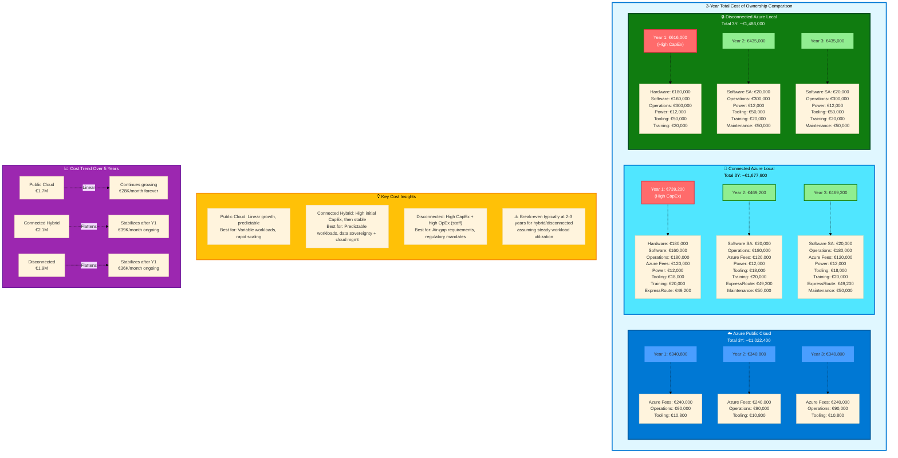

# Cost Optimization

## Introduction

Cost models change dramatically as workloads move along the hybrid continuum. Public cloud offers operational expenditure (OpEx) flexibility with consumption-based pricing, while on-premises introduces capital expenditure (CapEx) for hardware and significant increases in operational costs. Understanding these cost dynamics is essential for making informed decisions about where to deploy workloads.

The [Azure Well-Architected Framework Cost Optimization pillar](https://learn.microsoft.com/en-us/azure/well-architected/cost-optimization/) emphasizes optimizing usage and rate utilization while maintaining a cost-efficient mindset. In hybrid scenarios, we must extend this to compare costs across deployment models and optimize for total cost of ownership (TCO) rather than just infrastructure costs.

This chapter helps teams understand and optimize costs across all positions on the hybrid continuum.

## Cost Model Comparison Across the Continuum

Each deployment model has a distinct cost structure. Understanding these differences is critical for workload placement decisions.

### Public Cloud (Azure) Cost Model

**Operational Expenditure (OpEx)**: Pay-per-use with no upfront capital investment.

**Cost components**:

- **Compute**: Virtual machines billed per second (Windows) or per minute (Linux) while running
  - Example: D4s v5 (4 vCPU, 16 GB RAM) = ~$140/month with 3-year reservation, ~$350/month pay-as-you-go
- **Storage**: Charged per GB stored and per transaction
  - Standard SSD: $0.05/GB/month
  - Premium SSD: $0.12/GB/month
  - Blob storage (hot tier): $0.018/GB/month
- **Networking**: Data transfer charges (ingress free, egress charged)
  - First 100 GB egress per month: free
  - Next 10 TB: $0.05/GB
  - ExpressRoute: $50-$500+/month depending on bandwidth
- **Platform services**: Varies by service
  - Azure SQL Database: $5-$5,000+/month depending on tier
  - Azure Kubernetes Service (AKS): Free control plane, pay for worker node VMs
  - Azure Monitor: $2.76/GB ingested, $0.13/GB retained

**Cost optimization levers**:

- **Azure Reservations**: Commit to 1 or 3 years for 40-72% savings on compute
- **Azure Savings Plans**: Flexible commitment across compute services for up to 65% savings
- **Autoscaling**: Scale down during low-demand periods
- **Azure Hybrid Benefit**: Use existing Windows Server and SQL Server licenses (save up to 80% on SQL, 40% on Windows VMs)
- **Spot VMs**: Use interruptible VMs for batch workloads (up to 90% savings)
- **Right-sizing**: Match VM sizes to actual workload requirements

**When cloud is cost-effective**:
- Variable workloads (autoscale up/down based on demand)
- Short-term projects (no long-term commitment)
- Development and test environments (only pay when running)
- Workloads requiring global distribution
- Small deployments (avoid fixed infrastructure costs)

### Azure Local (Connected) Cost Model

**Hybrid Model**: CapEx for hardware + OpEx for Azure subscriptions and operations.

**Cost components**:

- **Hardware CapEx** (one-time or financed):
  - **Servers**: 4-node cluster with Dell/HPE/Lenovo validated hardware = $100,000-$200,000
  - **Networking**: Switches, cables, management network = $10,000-$30,000
  - **UPS and PDUs**: Power infrastructure = $5,000-$20,000
  - **Installation and configuration**: Professional services = $10,000-$30,000
  - **Total initial investment**: $125,000-$280,000 for a starter cluster

- **Azure subscription fees** (monthly OpEx):
  - **Azure Local subscription**: ~$10-$25 per physical core per month (varies by region and agreement)
  - Example: 4 nodes × 32 cores = 128 cores × $15/core/month = $1,920/month

- **Operational costs** (ongoing OpEx):
  - **Staff**: 1-2 FTEs for operations (platform engineering, monitoring) = $150,000-$300,000/year
  - **Power and cooling**: 2-5 kW per node × $0.10/kWh × 730 hours/month × 4 nodes = $584-$1,460/month
  - **Data center space**: Rack rental or facilities costs = $500-$2,000/month
  - **Connectivity**: ExpressRoute or VPN = $50-$500/month
  - **Support contracts**: Optional vendor support for hardware = $10,000-$30,000/year

- **Software licensing** (if applicable):
  - **Windows Server licenses**: Included in Azure Local subscription
  - **SQL Server**: Bring your own license or pay per core (~$200-$500/core/year for Standard, more for Enterprise)

**Three-year TCO example** (mid-sized cluster):
- Hardware: $180,000 (one-time)
- Azure subscription: $1,920/month × 36 months = $69,120
- Operations: $200,000/year × 3 = $600,000
- Power: $1,000/month × 36 months = $36,000
- Connectivity: $200/month × 36 months = $7,200
- **Total 3-year TCO**: ~$892,000

**Amortized monthly cost**: $892,000 / 36 = ~$24,800/month

**When Azure Local (Connected) is cost-effective**:
- Steady-state workloads with predictable resource requirements
- Data residency requirements (data must stay on-premises)
- Latency-sensitive applications (need sub-10ms latency)
- Large-scale workloads (break-even typically at 30-50% sustained utilization of significant capacity)
- Compliance requirements that restrict cloud deployment

### Azure Local (Disconnected/Sovereign) Cost Model

**Fully On-Premises**: CapEx for hardware + OpEx for licensing and operations (no Azure connectivity).

**Cost components**:

- **Hardware CapEx**: Same as connected model ($125,000-$280,000)

- **Software licensing** (higher without Azure connectivity benefits):
  - **Azure Local disconnected**: Higher per-core fees or perpetual licensing model
  - **Windows Server Datacenter**: ~$6,000 per 16-core license (plus Software Assurance)
  - **SQL Server**: ~$15,000+ per core for Enterprise (or ~$3,800 per core for Standard)
  - **Third-party software**: Kubernetes, monitoring, security tools (if not using open-source)

- **Operational costs** (higher than connected):
  - **Staff**: 2-3 FTEs (more manual operations, no cloud management tools) = $250,000-$450,000/year
  - **Training**: Staff must know more (Kubernetes, Linux, networking, security) = $10,000-$30,000/year
  - **Power, cooling, facilities**: Same as connected model
  - **Update packages**: Manual download and transfer processes

- **Tooling replacement costs**:
  - **Monitoring**: Deploy Prometheus, Grafana (open-source) or purchase commercial solutions = $0-$50,000/year
  - **Security**: Deploy Wazuh (open-source) or purchase SIEM = $0-$100,000/year
  - **CI/CD**: Self-host GitLab/Jenkins = $0-$20,000/year (compute costs)
  - **Backup**: Veeam, Commvault, or open-source = $5,000-$50,000/year

**Three-year TCO example** (air-gapped mid-sized cluster):
- Hardware: $180,000
- Software licensing: $100,000 (one-time) + $20,000/year SA = $160,000
- Operations: $300,000/year × 3 = $900,000
- Power/facilities: $1,000/month × 36 = $36,000
- Tooling: $50,000/year × 3 = $150,000
- Training: $20,000/year × 3 = $60,000
- **Total 3-year TCO**: ~$1,486,000

**Amortized monthly cost**: $1,486,000 / 36 = ~$41,300/month

**When disconnected is required** (cost is secondary):
- Regulatory requirements (air-gapped for national security, financial regulations)
- Sovereignty requirements (no data can leave country, no foreign control)
- Remote locations with no reliable connectivity (ships, offshore platforms, military bases)
- Critical infrastructure (nuclear power, utilities) with strict isolation requirements

!!! warning "Hidden Costs Often Underestimated"
    Organizations transitioning from cloud to on-premises often underestimate operational costs. Staff time, training, tooling replacement, and the opportunity cost of slower innovation can exceed infrastructure costs.

## Total Cost of Ownership (TCO) Framework

A comprehensive TCO analysis includes all costs over a multi-year period (typically 3-5 years).

### TCO Components

**1. Hardware costs**:
- Servers (compute, storage)
- Networking equipment (switches, cables, transceivers)
- Facilities infrastructure (racks, UPS, PDUs, cooling)
- Refresh cycle (hardware becomes obsolete; plan for refresh every 3-5 years)

**2. Software licensing**:
- Operating systems (Windows Server, Red Hat Enterprise Linux)
- Database licenses (SQL Server, Oracle)
- Platform software (Kubernetes distributions, virtualization)
- Application licenses (per-core or per-user)
- Software Assurance or maintenance fees

**3. Operational costs**:
- **Staffing**: Engineers for operations (platform, application, database, networking, security)
  - Rule of thumb: 1 engineer per 50-100 servers for mature operations; 1 per 10-30 servers for complex environments
- **On-call**: Compensation for 24/7 coverage
- **Training and certifications**: Kubernetes, Azure, security training
- **Contractor/consultant fees**: For specialized expertise

**4. Facilities costs**:
- Data center space (per rack unit or per sq ft)
- Power ($0.05-$0.15/kWh, varies by location)
- Cooling (often 1:1 with power consumption for PUE 2.0 data centers)
- Physical security

**5. Network costs**:
- Internet connectivity (bandwidth charges)
- ExpressRoute/VPN for hybrid connectivity
- Cross-connects for colocation facilities
- Bandwidth overages

**6. Risk and intangibles**:
- **Opportunity cost**: Could engineering time be spent on features instead of infrastructure?
- **Innovation velocity**: Does on-premises slow down experimentation and feature delivery?
- **Scalability constraints**: Can you scale quickly enough to meet business needs?
- **Disaster recovery**: Cost of maintaining DR infrastructure and testing

### TCO Calculation Example

**Scenario**: SaaS application serving 10,000 users. Workload requires 200 vCPUs, 800 GB RAM, 20 TB storage.

**Public Cloud (Azure AKS)**:
- Compute: 5× D16s v5 VMs (64 vCPU, 256 GB RAM each) = ~$2,800/month (3-year reservation)
- Storage: 20 TB Premium SSD = $2,400/month
- Networking: 5 TB egress/month = $250/month
- Azure Monitor: 50 GB/day × $2.76/GB = $4,140/month
- **Total**: ~$9,600/month × 36 months = **$345,600 (3-year TCO)**

**Connected Azure Local**:
- Hardware: $200,000 (8-node cluster with headroom)
- Azure Local subscription: $2,500/month × 36 = $90,000
- Operations: 1.5 FTEs = $225,000/year × 3 = $675,000
- Power/facilities: $1,500/month × 36 = $54,000
- Connectivity: $300/month × 36 = $10,800
- **Total**: **$1,029,800 (3-year TCO)**

**Cost comparison**: Cloud is ~$684,000 cheaper over 3 years for this scenario.

**Break-even analysis**: Azure Local becomes cost-competitive at ~80% sustained utilization of a large cluster (because cloud scales linearly, on-premises has high fixed costs). For this workload size, cloud is more cost-effective.

!!! tip "TCO Calculators"
    Use the [Azure TCO Calculator](https://azure.microsoft.com/en-us/pricing/tco/calculator/) for structured TCO comparisons. Adjust assumptions (power costs, staff salaries, utilization) to match your environment.

## Cost Optimization Strategies by Deployment Model

### Public Cloud Cost Optimization

**1. Right-sizing**:
- Use **Azure Advisor** for right-sizing recommendations (identifies underutilized VMs)
- Downsize VMs that are consistently below 50% CPU/memory utilization
- Use burstable VMs (B-series) for workloads with variable load

**2. Reservations and savings plans**:
- Purchase **1-year or 3-year reservations** for steady-state workloads (40-72% savings)
- Use **Azure Savings Plans** for flexible commitment across VM families

**3. Autoscaling**:
- Implement **VM Scale Sets** with autoscaling (scale down during nights/weekends)
- Use **AKS cluster autoscaler** to remove unused nodes
- Use **horizontal pod autoscaler** to reduce pod replicas during low demand

**4. Lifecycle management**:
- Use **storage lifecycle policies** to move infrequently accessed data to cool/archive tiers (80-95% cheaper)
- Delete unused snapshots, orphaned disks, and old backups

**5. Hybrid Benefit**:
- Apply **Azure Hybrid Benefit** if you own Windows Server or SQL Server licenses (40-80% savings)

**6. Tagging and cost allocation**:
- Tag resources by team, project, environment for cost attribution
- Use **Azure Cost Management** to analyze costs by tag and identify optimization opportunities

### Azure Local Cost Optimization

**1. Cluster utilization**:
- Maximize utilization of existing hardware before purchasing additional nodes
- Target 70-80% sustained utilization (leave headroom for failures)
- Use **Kubernetes resource requests and limits** to pack containers efficiently

**2. Container density**:
- Reduce per-pod overhead by increasing container density (more pods per node)
- Use smaller base images (Alpine Linux instead of Ubuntu reduces image size 10x)
- Use **pod anti-affinity** to distribute workloads without over-provisioning

**3. Storage optimization**:
- Use **deduplication and compression** (Storage Spaces Direct supports natively)
- Implement **tiering**: hot data on SSD, cold data on HDD
- Archive or delete old data (logs, backups)

**4. Power optimization**:
- Use **power-efficient CPUs** (check TDP when purchasing hardware)
- Consolidate workloads to fewer nodes and power down unused nodes (if possible)
- Negotiate lower power rates with utility providers for data center loads

**5. Licensing optimization**:
- Use **Azure Hybrid Benefit** to apply existing licenses to Azure Local
- Audit license usage to avoid over-purchasing
- Consider open-source alternatives where acceptable (PostgreSQL vs. SQL Server, MariaDB vs. Oracle)

### Disconnected Environment Cost Optimization

**1. Open-source tooling**:
- Use **open-source platforms** where acceptable (Kubernetes vs. commercial alternatives, PostgreSQL vs. SQL Server, Prometheus vs. commercial monitoring)
- Reduces licensing costs but increases operational complexity

**2. Staffing optimization**:
- Cross-train engineers to handle multiple areas (reduce headcount)
- Use automation to reduce toil (invest in automation to reduce long-term staff costs)
- Consider managed services for non-core components (e.g., managed backup appliances)

**3. Hardware lifecycle management**:
- Extend hardware refresh cycles where possible (4-5 years instead of 3)
- Purchase refurbished or gray-market hardware for non-critical environments (test/dev)

**4. Vendor negotiation**:
- Consolidate vendors to increase purchasing leverage
- Negotiate enterprise agreements for volume discounts
- Consider alternative vendors (Lenovo, Supermicro) vs. premium brands (Dell, HPE)

## FinOps for Hybrid Environments

**FinOps** (Financial Operations) is a cultural practice for managing cloud costs. Principles apply to hybrid:

**1. Teams collaborate**: Engineering, finance, and business work together on cost decisions.

**2. Business value drives decisions**: Evaluate cost in context of business value delivered (revenue, user experience).

**3. Everyone takes ownership**: Engineers are accountable for costs of resources they deploy.

**FinOps practices for hybrid**:

- **Showback**: Report costs by team/project (even for on-premises, allocate based on resource usage)
- **Chargeback**: Directly charge teams for resources consumed (aligns incentives)
- **Budget alerts**: Alert teams when spending exceeds budget (Azure Cost Management supports this)
- **Cost optimization reviews**: Quarterly reviews to identify optimization opportunities
- **Reserved capacity planning**: Centralize purchasing of reservations based on usage patterns

## Build vs. Buy Decisions for Replacement Services

When moving to disconnected environments, you must replace cloud PaaS services with self-hosted alternatives. The build-vs-buy decision depends on cost, complexity, and risk.

### Decision Framework

| Factor | Build (Open-Source) | Buy (Commercial) |
|--------|---------------------|------------------|
| **Upfront cost** | Low (free software) | High (licensing fees) |
| **Operational cost** | High (staff time) | Medium (vendor support available) |
| **Customization** | High (modify source) | Low (vendor roadmap) |
| **Expertise required** | High (deep technical knowledge) | Medium (vendor training and docs) |
| **Support** | Community (best-effort) | Vendor SLAs |
| **Risk** | Higher (you own all issues) | Lower (vendor owns bugs) |

### Common Service Replacements

| Cloud Service | Open-Source Alternative | Commercial Alternative |
|---------------|-------------------------|------------------------|
| **Azure SQL Database** | PostgreSQL, MySQL, MariaDB | Oracle, SQL Server, Percona |
| **Azure Cosmos DB** | MongoDB, Cassandra, CouchDB | MongoDB Enterprise, DataStax |
| **Azure Service Bus** | RabbitMQ, NATS, Kafka | Solace, TIBCO, MuleSoft |
| **Azure Key Vault** | HashiCorp Vault (open-source) | HashiCorp Vault Enterprise, CyberArk |
| **Azure Monitor** | Prometheus, Grafana, Loki | Datadog (self-hosted), Splunk |
| **Azure Blob Storage** | MinIO, Ceph | NetApp StorageGRID, Dell ECS |
| **Azure Container Registry** | Harbor, Quay | JFrog Artifactory, Sonatype Nexus |

**Recommendation**: Use open-source for non-critical services and where you have expertise. Buy commercial software for critical services (databases, security) or where expertise is scarce.

## Staff Training Costs

Training is often overlooked but can be substantial when moving to on-premises or hybrid models.

**Skills required for hybrid operations** (beyond cloud-native):
- **Infrastructure**: Server hardware, networking (VLANs, routing, switching), storage (SAN, NAS)
- **Kubernetes**: Deep knowledge (not just deploying apps, but cluster operations, networking, storage)
- **Linux administration**: Most on-premises Kubernetes runs on Linux
- **Security**: Hardening, vulnerability management, SIEM operation
- **Observability**: Prometheus, Grafana, log aggregation
- **Disaster recovery**: Backup, restore, DR testing

**Training investment**:
- **Certifications**: CKA/CKAD/CKS (Kubernetes) = $300-$400 per exam + study time
- **Courses**: Kubernetes, Linux, networking = $500-$2,000 per course per person
- **Conferences**: KubeCon, industry conferences = $1,500-$3,000 per person
- **Time investment**: 2-4 weeks per engineer for ramp-up

**Training budget rule of thumb**: $5,000-$10,000 per engineer per year for skills development.

## Cost Optimization Case Studies

### Case Study 1: E-commerce Company (Cloud to Hybrid)

**Scenario**: E-commerce company with steady baseline traffic and seasonal spikes during holidays.

**Original architecture**: 100% Azure (AKS, Azure SQL, Azure Cache for Redis). Cost: $50,000/month.

**Optimized architecture**:
- Deploy baseline capacity (60% of peak) on Connected Azure Local: $20,000/month (amortized TCO)
- Use Azure AKS for seasonal spikes (40% of peak during holidays): $10,000/month average
- **Total cost**: $30,000/month (**40% savings**)

**Rationale**: Baseline workload has predictable cost on Azure Local. Cloud handles variable load.

### Case Study 2: Healthcare Provider (Sovereignty)

**Scenario**: Healthcare provider required to keep patient data in-country with no foreign access (sovereignty requirement).

**Architecture decision**: Disconnected Azure Local (no choice—regulatory compliance mandates on-premises).

**Cost**: $40,000/month (amortized TCO).

**Comparison to cloud**: Would be ~$25,000/month in Azure, but compliance requirements make cloud non-viable.

**Conclusion**: Sometimes cost is not the primary driver—compliance requirements dictate architecture.

### Case Study 3: SaaS Startup (Cloud-Native)

**Scenario**: SaaS startup with rapid growth (doubling users every 6 months).

**Architecture decision**: 100% Azure (AKS, Azure SQL, Cosmos DB).

**Cost**: $30,000/month currently, growing to $60,000/month in 12 months.

**Consideration**: Could Azure Local be cheaper? TCO analysis shows break-even at $150,000/month sustained workload. Startup is growing too fast and unpredictably—cloud's elasticity is more valuable than potential cost savings.

**Conclusion**: For unpredictable growth, cloud's flexibility outweighs cost. Lock-in can be addressed later via abstraction layers.

## Conclusion

Cost optimization across the hybrid continuum requires understanding the full total cost of ownership—not just infrastructure costs, but operational costs, opportunity costs, and risk costs. Public cloud offers flexibility and low initial investment but can become expensive at scale. On-premises offers cost predictability and lower long-term costs for steady-state workloads but requires significant upfront investment and operational expertise.

The right deployment model depends on:
- **Workload characteristics**: Steady-state favors on-premises; variable workloads favor cloud
- **Scale**: Small workloads favor cloud (avoid fixed costs); large workloads can justify on-premises investment
- **Compliance requirements**: Sovereignty and data residency may mandate on-premises
- **Organizational capabilities**: On-premises requires operational maturity and staffing
- **Business priorities**: Optimize for cost, speed, compliance, or control based on business priorities

Use structured TCO analysis with realistic assumptions about utilization, staffing, and operational costs. Continuously monitor and optimize costs in production. Apply FinOps practices to align cost decisions with business value.

The key insight: the cheapest deployment model is the one that delivers business value most effectively—not always the one with the lowest infrastructure bill.

---

> **Next:** [Part 9 — Appendix →](../09-appendix/README.md)
