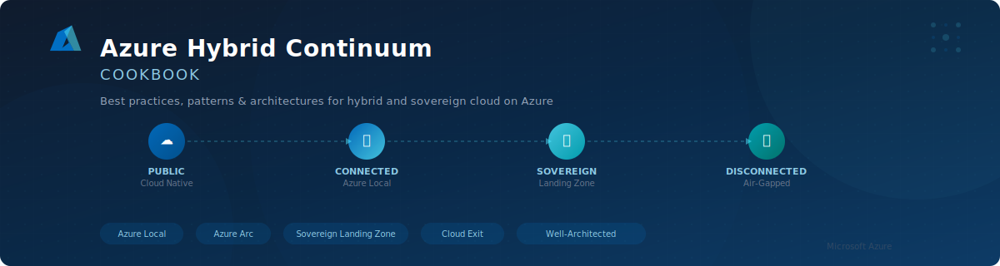

  

  
  
  

# Azure Hybrid Continuum CookBook

> Best practices, patterns, and architectures for building solid hybrid and sovereign cloud solutions with Microsoft Azure.

## What Is This?

This CookBook is a comprehensive guide to designing, building, and operating hybrid and sovereign cloud architectures on Azure. It covers the full **Azure Hybrid Continuum** — from cloud-native workloads in Azure public cloud, through hybrid deployments on Azure Local, to fully disconnected and air-gapped sovereign environments.

<!-- DIAGRAM: High-level visual of the Azure Hybrid Continuum showing the spectrum from Public Cloud to Disconnected, with the CookBook's coverage mapped across it -->

## Who Is This For?

- **Cloud Architects** designing hybrid and sovereign solutions
- **Platform Engineers** building and operating Azure Local environments
- **Solution Designers** planning cloud exit or sovereignty strategies
- **Decision Makers** evaluating hybrid cloud options

## Table of Contents

### Part 1: Foundation

| # | Section | Description |
|---|---------|-------------|
| 1 | [**Introduction**](01-introduction/README.md) | The Azure Hybrid Continuum concept, guide overview |
| 2 | [**Azure Hybrid Infrastructure**](02-azure-hybrid-infrastructure/README.md) | Deep dive into Azure Local, Azure Arc, Azure Stack HCI, connectivity models |
| 3 | [**Sovereignty & Compliance**](03-sovereignty-and-compliance/README.md) | Sovereign cloud, data residency, compliance frameworks |

### Part 2: Architecture & Design

| # | Section | Description |
|---|---------|-------------|
| 4 | [**Architecture Patterns**](04-architecture-patterns/README.md) | Cloud-native, hybrid connected, disconnected, cloud exit patterns |
| 5 | [**Sovereign Landing Zone Guide**](05-sovereign-landing-zone-guide/README.md) | Step-by-step SLZ implementation: identity, network, security, automation |

### Part 3: Practical Scenarios

| # | Section | Description |
|---|---------|-------------|
| 6 | [**Cloud Exit Scenarios**](06-cloud-exit-scenarios/README.md) | Assessment, migration from public cloud → connected → disconnected |
| 7 | [**Reference Scenario**](07-reference-scenario/README.md) | Enterprise insurance app through the entire continuum |

### Part 4: Cross-Cutting Concerns

| # | Section | Description |
|---|---------|-------------|
| 8 | [**Best Practices**](08-best-practices/README.md) | Design principles, resilience, security, operations, cost |
| 9 | [**Appendix**](09-appendix/README.md) | Glossary, Azure service mapping, additional resources |

## Quick Navigation by Role

| If you are a... | Start here |
|-----------------|------------|
| **Cloud Architect** | [Architecture Patterns](04-architecture-patterns/README.md) → [SLZ Guide](05-sovereign-landing-zone-guide/README.md) → [Reference Scenario](07-reference-scenario/README.md) |
| **Platform Engineer** | [Azure Hybrid Infrastructure](02-azure-hybrid-infrastructure/README.md) → [SLZ Guide](05-sovereign-landing-zone-guide/README.md) → [Best Practices](08-best-practices/README.md) |
| **Decision Maker** | [Introduction](01-introduction/README.md) → [Architecture Patterns](04-architecture-patterns/README.md) → [Cloud Exit](06-cloud-exit-scenarios/README.md) |
| **Developer** | [Reference Scenario](07-reference-scenario/README.md) → [Service Mapping](09-appendix/02-azure-service-mapping.md) → [Best Practices](08-best-practices/README.md) |

## Grounding

All content in this CookBook is grounded in official Microsoft documentation:

- [Microsoft Learn](https://learn.microsoft.com/)
- [Azure Architecture Center](https://learn.microsoft.com/en-us/azure/architecture/)
- [Azure Local Documentation](https://learn.microsoft.com/en-us/azure/azure-local/)
- [Sovereign Landing Zone](https://learn.microsoft.com/en-gb/azure/azure-sovereign-clouds/public/overview-sovereign-landing-zone)
- [Cloud Adoption Framework](https://learn.microsoft.com/en-us/azure/cloud-adoption-framework/)
- [Azure Well-Architected Framework](https://learn.microsoft.com/en-us/azure/well-architected/)

## Contributing

We welcome contributions! See [CONTRIBUTING.md](https://github.com/EmeaAppGbb/AzureHybridContinuumCookBook/blob/main/CONTRIBUTING.md) for guidelines and [BACKLOG.md](BACKLOG.md) for current work items and priorities.

---

*Built with ❤️ by the Azure Hybrid Continuum team.*
